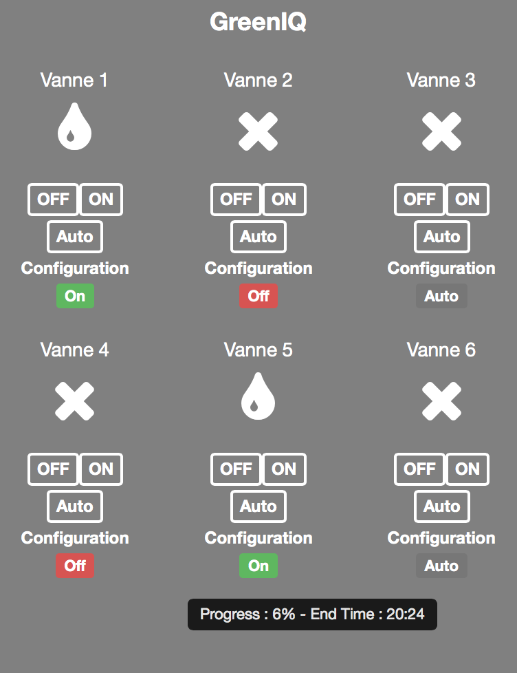

# GreenIQ Plugin 

Plugin zur Steuerung der automatischen Bewässerung über die GreenIQ-Box. Es ist möglich, die Betriebsart für die 6 Magnetausgänge zu definieren : 

- Auto : Die Bewässerung der Zone wird gemäß der GreenIQ-Programmierung ausgelöst 
- Aus : Bewässerung ist deaktiviert 
- Ein : Bewässerung wird ausgelöst (Dauer 3h)

# Konfiguration 

Um Ihren GreenIQ mit Jeedom verwenden zu können, müssen Sie eine Kunden-ID und einen geheimen Kunden anfordern. Die Anfrage wird per E-Mail an gestellt <developers@greeniq.Die Antwort erfolgt sehr schnell, normalerweise innerhalb von 24 Stunden.

Sie müssen auch das Login / Passwort auf der kleinen Karte haben, die mit dem GreenIQ geliefert wird.

Sobald die Codes erhalten wurden, müssen Sie sie wie folgt in das Plugin eingeben : 

# Verwendung 

Das Widget enthält viele Informationen : 1. Status von Ventil 2. Konfigurationsstatus 3. % Fortschritt 4. Bewässerungsendzeit

Die Konfiguration jedes Ventils ist ebenfalls möglich und es stehen 3 Aktionen zur Verfügung :

1. Auto : Die Bewässerung der Zone wird gemäß der GreenIQ-Programmierung ausgelöst
2. Aus : Bewässerung ist deaktiviert
3. Wir : Bewässerung wird ausgelöst (Dauer 3h)

# Faq 

Das System ruft alle 5 Minuten Informationen ab.
