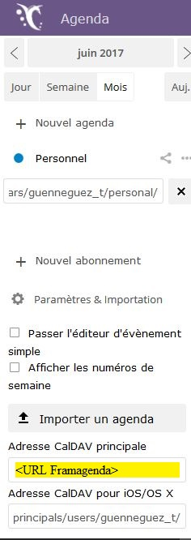

# Caldav Plugin

# Description

Das Plugin **Caldav Agenda** Mit dieser Option können Sie Ereignisse aus einem Caldav-Kalender abrufen. Es verwaltet mehrere Ereignisse, indem es sie durch ein Komma trennt (``,``). Sie müssen lediglich das Vorhandensein des Ereignisses in einem Szenario testen, um eine Aktion auszulösen (da ist der Bediener ``~`` oder ``matches`` um herauszufinden, ob eine Zeichenfolge eine andere enthält).

# Configuration

Um es sehr einfach zu konfigurieren, müssen Sie nur ein Gerät per Tagebuch erstellen und es dann mit Ereignisisolationsmustern verknüpfen.

Sie müssen eine URL, ein Konto und ein Passwort eingeben, um auf die Agenda zugreifen zu können. Nach dem Speichern können Sie den Kalender auswählen, den Sie verwenden möchten.

Im Musterfeld kann ein Muster zum Filtern / Extrahieren eines Ereignisses eingefügt werden.

Beispielmuster : ``!^Arrière-cuisine (.*)$!``

Wenn das Ereignis "Spülküche 15" ist, ist der zurückgegebene Wert 15. Dies ermöglicht es, Temperaturen für die Programmierung zu verwalten.

http://perldoc.perl.org/perlre.html

>**Wichtig**
>
>Der Name des Kalenders kann erst ausgewählt werden, nachdem das Gerät mit den richtigen Informationen gespeichert wurde. Es kann eine Weile dauern, bis es angezeigt wird.

## Konfiguration mit Webdav on Synology

Sie müssen zuerst das Webdav-Paket konfigurieren. Sie müssen wissen, ob Sie http oder https verwenden möchten (ich empfehle https). Beachten Sie nach der Aktivierung den für https aktivierten Port (standardmäßig 5006)).

Sie müssen wissen, wo die Kalender gespeichert werden :

Es wird daher notwendig sein, in jeedom wie folgt anzugeben :

## Konfiguration mit Webdav auf Framagenda

Sie müssen zuerst ein Konto bei Framagenda erstellen. Il faut ensuite aller sur https://framagenda.org/index.php/apps/calendar/.

Sie müssen die Framagenda-URL abrufen, die für die Konfiguration des Plugins verwendet wird.

# FAQ

>**Keine Veranstaltung stammt zurück**
>Haben Sie eine Agenda ausgewählt und gespeichert? ?

>**Können wir zukünftige Ereignisse haben?**
>Nein, es ist nicht möglich, dass das Plugin nur die aktuellen Ereignisse anzeigt.

>**Wie oft werden die Informationen aktualisiert? ?**
>Standardmäßig ist es jede Minute.
