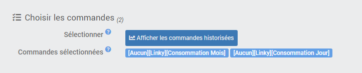

# Datenexport-Plugin

Plugin zum Generieren und Verwalten der Archivierung historischer Exporte der Bestellungen Ihrer Wahl in eine `* .csv`-Datei.

Das Plugin bietet die Möglichkeit, die Rohwerte jeder Bestellung über den ausgewählten Zeitraum oder deren Statistiken zu exportieren : **meine, min., max., Summe, Standardabweichung, Anzahl der Werte, letzter Wert**.

Es gibt verschiedene Möglichkeiten, die Exportdatei wiederherzustellen :
- Direkter Download auf Anfrage,
- Durch Senden auf dem Kanal Ihrer Wahl per Programmierung,
- Durch Senden auf dem Kanal Ihrer Wahl über ein Szenario.

Ein Import-Tool ist ebenfalls enthalten, um Werte in die Historie eines Jeedom-Auftrags integrieren zu können.

# Configuration

## Plugin Konfiguration

Das Plugin **Datenexport** erfordert keine spezielle Konfiguration und sollte erst nach der Installation aktiviert werden.

## Gerätekonfiguration

Um Ihre verschiedenen Exportstapel zu verwalten, gehen Sie zum Menü **Plugins → Organisation → Datenexport** und klicken Sie auf das Gerät, das Sie konfigurieren möchten.

>**INFORMATION**
>
>Die Schaltfläche **+ Hinzufügen** Mit dieser Option können Sie einen neuen Exportstapel erstellen.

Sie können dem Exportstapel einen Namen geben und ihm ein übergeordnetes Objekt zuweisen *(nützlich, um den Befehl export send in einem Szenario zu identifizieren)* und aktivieren oder deaktivieren Sie es.    
Aktivieren Sie das Kontrollkästchen **Statistiken** Mit dieser Option können Sie sich für den Export von Statistiken entscheiden *(meine, min., max., Summe, Standardabweichung, Varianz, Anzahl der Werte, letzter Wert)* anstelle von Rohwerten.

### Wählen Sie die Periodizität des Exports

Wählen Sie unter den angebotenen Möglichkeiten den Zeitraum aus, für den die Historie abgerufen werden soll :
- **Tage** : Die Auswahl erfolgt am **"X" letzten Tage** *(minimum:1/maximum:999)*.
- **Zeit** : Wählen Sie a **vordefinierter Zeitraum** *(Aktuelle Woche, vorherige Woche, aktueller Monat, vorheriger Monat, aktuelles Jahr, vorheriges Jahr usw...)*.
- **Termine** : Füllen Sie das manuell aus **Start- und Enddaten** der Auswahl.  
>**TIPP**
>
>Wenn das Enddatum nicht eingegeben wird, ist dies standardmäßig der aktuelle Tag.

### Wählen Sie die zu exportierenden Aufträge aus

Wählen Sie dann die Aufträge aus, für die Sie die Historien erhalten möchten, indem Sie auf die blaue Schaltfläche klicken **Historische Aufträge anzeigen**.    

Ein Fenster öffnet sich und zeigt die Liste der protokollierten Bestellungen mit einem Auswahlfeld an, das am Anfang der Zeile aktiviert werden soll. Jede Spalte kann gefiltert oder sortiert werden, die Schaltfläche **Umkehren** ermöglicht die Umkehrung der aktuellen Auswahl und der grünen Taste **Bestätigen** speichert die aktuelle Auswahl.

Unterhalb der Befehlswahltaste befindet sich **die Liste der aktuell ausgewählten Befehle**.

>**TIPP**
>
>Durch Klicken auf den Namen einer Bestellung wird die Konfigurationsseite der betreffenden Bestellung geöffnet.

# Exportdateien archivieren

Um auf die archivierten Exporte zuzugreifen, wechseln Sie zur Registerkarte **Archivierung** Ausrüstung.

Feld **Aufbewahrung** Mit dieser Option können Sie die Anzahl der Exportdateien angeben, die in Archiven aufbewahrt werden sollen *(minimum:1/maximum:99)*.

Unter dem Teil **Navigation** Zeigt die Liste der aktuell archivierten Exportdateien an. Wählen Sie eine der anzuzeigenden Dateien aus **Dateivorschau** *(begrenzt auf die ersten 1000 Zeilen)* und **Aktivieren Sie die Schaltflächen zum Herunterladen und Löschen von Dateien**.

# Export von Daten

## Bei Bedarf herunterladen

Sobald der Zeitraum und die Bestellungen ausgewählt wurden, speichern Sie die Ausrüstung und klicken Sie auf die blaue Schaltfläche **CSV-Export** um einen neuen Export zu generieren, der den angeforderten Kriterien entspricht.

Am Ende des Vorgangs wird die neue Datei automatisch zur Liste der Exporte auf der Registerkarte hinzugefügt **Archivierung**. Klicken Sie auf den Dateinamen, um ihn auszuwählen, und klicken Sie dann auf die grüne Schaltfläche **Herunterladen** um es sofort über Ihren Browser herunterzuladen.

## Senden über Programmierung

Es ist möglich, die Exportdatei auf dem Kanal Ihrer Wahl zu senden *(Mail, Telegramm, Zwietracht usw...)* über die direkt auf der Geräteseite konfigurierte Programmierung.

Aktivieren Sie das Kontrollkästchen, um den Zeitplan zu aktivieren **Aktivieren Sie** des Abschnitts **Geplantes Senden**.

Dann erscheinen 3 neue Felder :
- **Programmierung** : Zeigen Sie die Programmierung mit einem Cron an.
> **TIPP**
>
>Klicken Sie auf das Fragezeichen am Ende der Zeile, um auf den Cron-Assistenten zuzugreifen und den Zeitplan einfach zu konfigurieren.

- **Bestellung senden** : Wählen Sie den Befehl Aktion / Nachricht, um das Senden auf dem ausgewählten Kanal zu ermöglichen *(facultatif)*.
> **INFORMATION**
>
>Wenn kein Sendebefehl ausgewählt ist, wird die Exportdatei weiterhin generiert und archiviert.

- **Versandtitel** : Geben Sie den Titel ein, der an dieser Sendung angebracht werden soll *(facultatif)*.
> **TIPP**
>
>Es ist möglich zu verwenden [**Szenario-Tags**](https://doc.jeedom.com/de_DE/core/4.1/scenario#Les%20tags){:target = "\_ blank"} im Titel der Sendung.  

## Senden über Szenario

Sie können die Exportdatei auch an den Kanal Ihrer Wahl senden *(Mail, Telegramm, Zwietracht usw...)* über ein Szenario.

Sie müssen dann den Befehl auswählen **CSV-Export senden** entsprechend der gewünschten Exportcharge in einem Block *Aktion* eines Szenarios.
Füllen Sie die aus **Titel** *(facultatif)* sowie die **Aktion / Nachricht Befehl zum Senden des Exports** auf dem gewünschten Kanal *(facultatif)*.

> **TIPP**
>
>Das Senden per Programmierung ist möglich [**Szenario-Tags**](https://doc.jeedom.com/de_DE/core/4.1/scenario#Les%20tags){:target = "\_ blank"} im Sendetitel und die Datei wird vom Plugin automatisch archiviert, wenn kein Sendebefehl eingegeben wird.

# Daten importieren

Wenn Sie Daten in den Verlauf eines Jeedom-Auftrags integrieren möchten, können Sie dieses Tool verwenden. Dazu müssen Sie eine Tabellenkalkulationsdatei mit der Erweiterung "csv" senden **mit Semikolon-Trennzeichen** Enthält eine Spalte mit zu integrierenden Werten und eine Spalte mit entsprechenden Zeitstempeln.

Achten Sie auf Zeitstempel, die je nach verwendeter Tabellenkalkulationsanwendung interpretiert und geändert werden können. Beispielsweise, **Excel** neigt dazu, Sekunden automatisch zu entfernen und das Datum standardmäßig im französischen Format zu formatieren. In diesem Fall müssen Sie ein benutzerdefiniertes Format angeben, z. B. TT / MM / JJJJ HH:mm:ss` oder `yyyy-mm-dd hh:mm:ss` für Zellen, die einen Zeitstempel enthalten.

>**WICHTIG**
>
>Das Importieren von Daten in Jeedom ist nicht trivial und muss wissentlich erfolgen. Es ist immer ratsam, vor jedem Eingriff dieser Art eine vorläufige Sicherung von Jeedom durchzuführen.

Um auf das Wertimport-Tool zuzugreifen, rufen Sie die allgemeine Seite des Plugins auf und klicken Sie auf die Schaltfläche **Importieren**.

Das Importfenster wird verwendet, um Werte aus einer Datei in den Verlauf einer Reihenfolge vom Typ "Info" zu integrieren*.csv` vorausgesetzt, dass :
- Die Datei enthält **eine Spalte mit dem Namen "Datum"**,
- Die Datei enthält **eine Spalte mit dem Namen "Wert"**,
- Der Spaltentrenner ist **ein Semikolon**,
- Das **Datumsformat** ist korrekt eingegeben (Französisch \| international).

## Daten senden

Klicken Sie auf die Schaltfläche, um eine CSV-Datei auszuwählen. Nach dem Laden wird die Datei überprüft und wichtige Informationen werden auf dem Bildschirm angezeigt :
- **Name und Größe** der Datei,
- **Anzahl der Zeilen** behandeln,
- **Zeit** von der Einfuhr betroffen,
- **Daten und Werte** importieren.

## Empfange Daten

Klicken Sie dann auf die Schaltfläche, um den Befehl auszuwählen, der die Werte empfangen soll. Informationen wie Subtyp und Einheit werden dann auf dem Bildschirm angezeigt.

Wenn in der Bestellung für den vom Import betroffenen Zeitraum bereits ein Verlauf vorhanden ist, wird dessen Inhalt ebenfalls angezeigt.

## Vorhandene Daten verarbeiten

Wenn während der Phase des Imports ein Verlauf in der Bestellung vorhanden ist, werden Sie vom Tool gefragt, wie Sie diese Daten verwalten möchten.

3 Auswahlmöglichkeiten sind möglich :
- **Behalten Sie alle Daten** bereits in der Geschichte vorhanden,
- **Ersetzen Sie nur doppelte Werte** zwischen der CSV-Datei und dem Verlauf,
- **Überschreiben Sie alle Daten** in der Geschichte im Laufe der Zeit.

## Import starten

Nachdem die Datei mit den zu importierenden Daten von Jeedom integriert und überprüft wurde, der Datenempfangsbefehl eingegeben wurde und Sie Ihre Wahl bezüglich der Verarbeitung des Verlaufs getroffen haben, können Sie auf die Schaltfläche klicken **Datei importieren** um das Verfahren einzuleiten.
