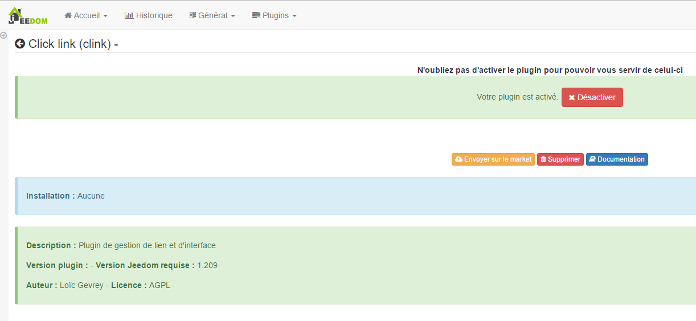

# Klicken Sie auf Link Plugin

Dieses Plugin ermöglicht die Verwaltung von Links und Ereignissen direkt auf der Jeedom-Oberfläche. Sie können beispielsweise einen Befehl erstellen, der ein Modal (Dialogfenster) mit einer Ansicht öffnet, die Ihre Kameras enthält. Dies ermöglicht es, wenn jemand an Ihrer Tür klingelt, die Eingangskamera auf Ihrem Jeedom anzuzeigen.

# Plugin Konfiguration

Nachdem Sie das Plugin heruntergeladen haben, aktivieren Sie es einfach. Auf dieser Ebene gibt es keine Konfiguration.

# Gerätekonfiguration

Die Konfiguration der Clink-Geräte ist über das Menü zugänglich **Plugins** :

So sieht die Plugin-Seite aus **Klirren** (schon mit 1 ausrüstung) :

Sobald Sie auf eine davon klicken, erhalten Sie :

Hier finden Sie die gesamte Konfiguration Ihrer Geräte :

-   **Name der Klirrausrüstung** : Name Ihrer Clink-Ausrüstung.
-   **Übergeordnetes Objekt** : Gibt das übergeordnete Objekt an, zu dem das Gerät gehört.
-   **Aktivieren** : macht Ihre Ausrüstung aktiv.
-   **Sichtbar** : macht Ihre Ausrüstung auf dem Armaturenbrett sichtbar.

Nachfolgend finden Sie die Liste der Bestellungen :

-   **Name** : Der im Dashboard angezeigte Name,
-   **Modus** : den Anzeigemodus des Elements (in einem Modal, in einem neuen Fenster oder im aktuellen Fenster)

   > **Notiz**
   >
   > Im Handy machen "neues Fenster" und "aktuelles Fenster" dasselbe : Link im aktuellen Fenster öffnen.

-   **Typ** : Art des zu öffnenden Elements (Ansicht, Design, Bedienfeld oder URL).
-   **Name** : Option abhängig von dem zum Öffnen ausgewählten Element.
-   **Benutzerfilter** : Ermöglicht das Filtern, um das Element nur zu öffnen, wenn dieser Benutzer verbunden ist.

-   **Seitenfilter** : Mit dieser Option können Sie filtern, um das Element nur zu öffnen, wenn Sie sich auf der genannten Seite befinden.

    > **Notiz**
    >
    > In der mobilen Version bewirkt diese Option nichts

-   **Schnittstellenfilter** : Ermöglicht das Filtern, um das Element nur in der mobilen / Desktop-Version oder auf beiden zu öffnen.
-   **Anzeige** : ermöglicht die Anzeige der Daten im Dashboard.
-   **Test** : Wird zum Testen des Befehls verwendet.
-   **Löschen** (Schild -) : ermöglicht das Löschen des Befehls.

> **Wichtig**
>
> Es ist wichtig, nicht die gleiche Sicht auf sich selbst zu öffnen, ebenso nicht für die Entwürfe !

> **Wichtig**
>
> In Mobilgeräten kann das Öffnen einer URL nicht wie bei den Designs modal erfolgen.

> **Wichtig**
>
> Nicht alle URLs können modal geöffnet werden, dies hängt von der Site ab *(ex : google.fr kann nicht modal geöffnet werden)*. Achtung, auch wenn Sie sich in https befinden, ist es unbedingt erforderlich, dass sich die Site, die modal geöffnet werden soll, in https befindet.
