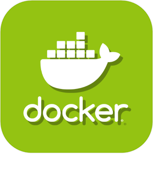
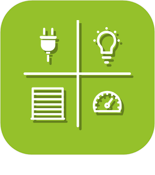

>****
>. . .
>  

| | | | |
|--- | --- | --- | ---|
||Atlas| |  |
|||. . .| -    - |
||DataService| ...)|  |
|||.| -    - |
||Dyndns|| -    - |
|||| -    - |
|||).| -    - |
||JeeDashboard-Agbox|| -    - |
||Jeeasy|| -    - |
||LNS|| -    - |
|||| -    - |
|||| -    - |
||Script|. | -    - |
|||| -    - |
||sunPulseEasy|| -    - |
||Virtuel|.| -    - |
||Widget||  |
