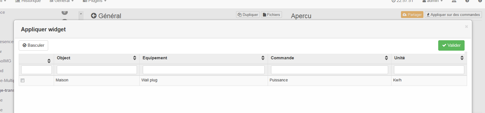
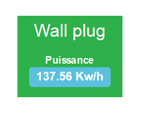
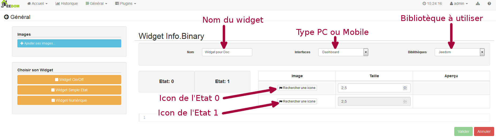
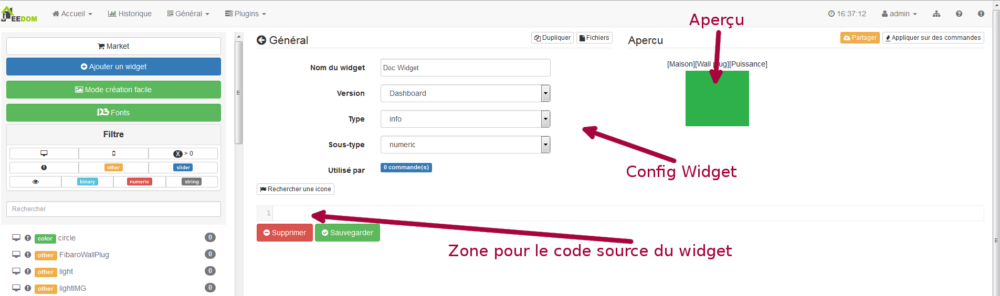

# Widget-Plugin

Das Widget-Plugin ist etwas Besonderes, da Sie damit keine Geräte erstellen, sondern das Rendering (die Anzeige) einer Bestellung ändern können. Das Ziel dieses Plugins ist es daher, die Art und Weise der Anzeige eines Werts, einer Information oder einer Aktion einfach an seinen Geschmack und seine Wünsche anzupassen.

Seit Version 1.112 von Jeedom ist es möglich, Widgets mit bestimmten Optionen anzupassen (vom Widget-Entwickler erstellt). So können wir ein Widget haben, das von Auftrag zu Auftrag unterschiedlich angezeigt wird.

So können wir dasselbe Widget bei einer Bestellung in Blau und bei einer anderen in Grün schreiben lassen.

> **Notiz**
>
> Widget und Kachel, nicht zu verwechseln.
>
> Das Widget ist der Teil, der sich um die Formatierung und Anzeige von Informationen oder Bestellungen kümmert. Ein Widget sollte nur einen Befehl oder eine Information verarbeiten.
>
> La Tuile ist eine Gruppierung von Widgets für ein Modul. In diesem Bereich werden die verschiedenen Widgets angezeigt, die auf die Befehle und Informationen des Moduls angewendet werden.

# Installieren des Widget-Plugins 

Wie bei jedem Plugin wird das Widget-Plugin über die Jeedom-Oberfläche im Menü "Allgemein" ⇒ "Plugins" installiert"


Klicken Sie auf das grüne Symbol, um direkt zum Markt zu gelangen. Klicken Sie in diesem Fenster auf "Offiziell" und geben Sie im Suchfeld "Widget" ein".


Klicken Sie auf das Plugin-Symbol. Dies öffnet die Plugin-Datei, in der mehrere Informationen gefunden werden.


Klicken Sie auf die Schaltfläche "Stabil installieren"". Nach der Installation werden Sie von Jeedom gefragt, ob Sie zur Plugin-Konfigurationsseite wechseln möchten. Antworte mit Ja. Auf der Konfigurationsseite des Widget-Plugins haben wir nur eine Option für dieses Plugin : aktivieren oder deaktivieren.

Standardmäßig ist das Plugin deaktiviert. Ich lade Sie ein, auf die grüne Schaltfläche "Aktivieren" zu klicken".

Ab sofort ist das Plugin aktiv und betriebsbereit.

# Präsentation und Grundfunktion des Widget Plugins 

Um zum Widget-Plugin zu gelangen, gehen Sie zum Menü "Plugins" ⇒ "Programmierung" ⇒ "Widget"".


Wir sind also auf der Haupt-Plugin-Seite. Standardmäßig verfügt letzteres über eine Reihe von Widgets, sobald es installiert ist. Sie können andere über den Markt herunterladen oder Ihre eigenen Widgets erstellen (siehe unten).


Wenn Sie auf eines der Widgets in der Liste im rechten oder linken Menü klicken, wird die Widget-Konfigurationsseite geöffnet, auf der Sie Änderungen vornehmen können. Es wird eine Vorschau des Widgets (falls Jeedom einen kompatiblen Befehl findet) und eines Ganzen angezeigt Viele Konfigurationsinformationen wie Widget-Quellcode


> **Warnung**
>
> Wenn Sie ein Widget ändern, das nicht zu Ihren Kreationen gehört, ist es vorzuziehen, es zu duplizieren, um zu vermeiden, dass Ihre Änderungen verloren gehen, wenn das ursprüngliche Widget aktualisiert wird.

Weitere Informationen zur Konfiguration und Widget-Erstellung finden Sie unten.

## Wenden Sie das Widget auf eine Bestellung an 

Um ein Widget auf einen einzelnen Befehl anzuwenden oder den angewendeten zu ändern, müssen Sie zur Modulkonfigurationsseite gehen. Der Pfad für den Zugriff auf das Modul unterscheidet sich je nach Typ des Moduls. Hier sind einige Beispiele :

Wählen Sie für Z-Wave-Module "Plugins" ⇒ "Home Automation Protocol" ⇒ "Z-Wave" aus und wählen Sie dann das Modul des Befehls aus, den Sie ändern möchten.


Gehen Sie auf der Modulkonfigurationsseite zum Befehl und klicken Sie auf die Zahnräder. Wechseln Sie im neuen Fenster zur Registerkarte "Erweiterte Ansicht""


Hier können Sie das für Computer und Handys angewendete Widget mit den entsprechenden Dropdown-Listen ändern.


> **Notiz**
>
> Die Dropdown-Listen filtern sich selbst. Sie bieten nur Widgets, die mit dem Befehlstyp kompatibel sind.

## Wenden Sie das Widget auf mehrere Befehle an

En cliquant sur le bouton “Appliquer sur des commandes” vous ouvrez une fenêtre qui liste toutes les commandes compatibles avec le type du widget. Sie können das Widget also einfach auf viele Bestellungen gleichzeitig anwenden oder entfernen.



Überprüfen Sie einfach die Befehle, auf die Sie das Widget anwenden möchten

### Verschiedene Beispiele für die gleiche Reihenfolge 





## Anpassungsoptionen für Widgets 

Seit Version 1.112 von Jeedom ist es möglich, Widgets mit bestimmten Optionen (vom Widget-Entwickler erstellt) anzupassen, die allen Widgets gemeinsam sind. So können wir ein Widget haben, das von Auftrag zu Auftrag unterschiedlich angezeigt wird.

Es gibt zwei Möglichkeiten, auf diese Optionen zuzugreifen. Oder über den Baum für die Hausautomation im Menü "Allgemein" ⇒ "Zusammenfassung der Hausautomation""


Auf dieser Seite finden Sie alle Elemente, Objekte, Module und Befehle der Hausautomation. Klicken Sie auf das kleine gekerbte Rad, um zur Konfigurationsseite zu gelangen.


Entweder von der Modulkonfigurationsseite.


### Fügen Sie eine benutzerdefinierte Option hinzu 

Auf der Registerkarte "Erweiterte Anzeige" gibt es zwei Dropdown-Listen, mit denen Sie das Widget ändern können, das auf einem Computer für die Bestellung und das andere für mobile Geräte verwendet wird. Es gibt auch andere Optionen, um die Namen und Statistiken anzuzeigen oder nicht. Erzwingen Sie den Zeilenumbruch vor / nach dem Widget, wenn ein Modul mehrere Befehle enthält (Zeilenumbrüche in der Kachel). Schließlich wird die Liste der optionalen Widget-Parameter angewendet


> **Notiz**
>
> Um eine Option hinzuzufügen, klicken Sie einfach auf die Schaltfläche "Hinzufügen", geben Sie den Namen der Option mit den richtigen Klein- und Großbuchstaben sowie den Wert ein, der der Option zugewiesen werden soll.

## Erweiterte Konfiguration

Siehe das Dokument in der Zusammenfassung der Hausautomation ⇒ [Hier](https://jeedom.github.io/core/de_DE/display)

## Erstellung / Änderung von Widgets
Das Plugin bietet zwei Möglichkeiten zum Erstellen von Widgets, den einfachen Modus, mit dem einfache Widgets mit einem Erstellungsassistenten einfach erstellt werden können, und den erweiterten Modus, mit dem auch alle Widgets danach geändert werden können.

> **Notiz**
>
> Der erweiterte Modus bietet grenzenlose Flexibilität. Sie benötigen jedoch einige Kenntnisse der grundlegenden Programmiersprache wie HTML und CSS für die Basis und JavaScript, um etwas komplexere Aufgaben ausführen zu können.

### Einfacher Erstellungsmodus

Um ein Widget mit dem Assistenten zu erstellen, müssen Sie nur zum Plugin gehen : Menü "Plugins" ⇒ "Programmierung" ⇒ "Widget". Klicken Sie auf dieser Seite oben links auf die Schaltfläche "Einfacher Erstellungsmodus".


Auf der neuen Seite können Sie im rechten Teil die grundlegenden Jeedom-Symbole, die von Ihnen importierten Bilder und die importierten Pakete anzeigen. Auf der linken Seite zuerst eine Schaltfläche zum Importieren von Paketen oder Bildern, dann 3 Schaltflächen zum Erstellen eines Widgets.


-   Ein / Aus-Widget ⇒ Für Schaltflächenbefehle zum Ein / Aus
-   Einfaches Status-Widget ⇒ Für Befehle mit Status-Feedback
-   Numerisches Widget ⇒ Bestimmt für Befehle, die einen numerischen Wert senden (Beispiel) : Temperatur, Helligkeit ... etc)

#### Beispiel mit der Erstellung eines Status-Widgets 

> **Notiz**
>
> Dieses Beispiel gilt weiterhin für die beiden anderen Erstellungstypen

Klicken Sie auf die Schaltfläche "Simple State Widget"". Wir gelangen auf die Seite zur unterstützten Konfiguration. Sie müssen dem Widget einen Namen geben (eindeutiger Name), die Art der Benutzeroberfläche. Wenn das Widget für den PC (Dashboard) oder das Mobiltelefon bestimmt ist, dann die zu verwendende Bibliothek (Jeedom, Personal Image oder Packs).



Dann müssen Sie das Symbol für Status 0 und 1 sowie die Größe des Symbols auswählen (Wert in "EM" =% der Originalgröße der Browser-Schriftart, 1 = 100%). Anschließend wird der Quellcode unterhalb des Konfigurationsbereichs angezeigt.

> **Warnung**
>
> Ändern Sie diese Informationen nicht, wenn Sie nicht wissen, was Sie tun.

Es bleibt nur zu validieren, um die Erstellung des Widgets abzuschließen. Sie werden automatisch zur Seite für die erweiterte Konfiguration weitergeleitet, auf der Sie das Widget auf mehrere Befehle anwenden können

### Erstellung / Änderung im erweiterten Modus 

Im erweiterten Modus müssen Sie Kenntnisse in den Programmiersprachen "HTML", "CSS" und "JavaScript" haben, um ein Widget korrekt ändern zu können.

> **Notiz**
>
> Es gibt mehrere Websites in FR im Web, auf denen Sie diese Sprachen lernen können. Ich empfehle OpenClassRoom, das alles von Anfang an erklärt.

Um auf den erweiterten Modus zuzugreifen, gehen Sie einfach zum Widget-Plugin, wählen Sie das zu ändernde Widget aus oder klicken Sie auf die Schaltfläche "Widget hinzufügen""

#### Widget erstellen 

Klicken Sie auf der Haupt-Plugin-Seite auf "Widget hinzufügen"". Jeedom fragt Sie nach Informationen zum zukünftigen Widget.


-   Name muss ein eindeutiger Name sein. Überprüfen Sie daher, ob dieser Name noch nicht vorhanden ist.
-   Version, entspricht dem Gerätetyp, für den es bestimmt ist (PC oder Mobile).
-   Typ, entspricht dem Befehlstyp, der das Widget verwendet: keine, Info oder Aktion.
-   Untertyp, gibt dem zuvor ausgewählten Typ Genauigkeit.

Sie können den Namen, den Typ und den Subtyp später ändern. Dies kann jedoch Auswirkungen haben, wenn das Widget bereits auf einen oder mehrere Befehle angewendet wird. Es ist daher besser, dies zu vermeiden.

##### Geben Sie Info ein 

Der Typ "info" wird für Befehle verwendet, die einen Wert zurückgeben, z. B. einen Modulstatus, einen numerischen Wert (Temperatur, Helligkeit, Luftfeuchtigkeit usw.), einen Text oder andere Informationen.

-   Digital : für Zahlen
-   Binär : für Ein / Aus-Zustände (0/1)
-   Andere : für alle anderen Arten von Informationen wie Texte

##### Der Aktionstyp 

Der Typ "Aktion" wird für Befehle verwendet, die eine Aktion in Jeedom oder auf externen Geräten ausführen.

-   Standard : wird zum Erstellen von Aktionsschaltflächen verwendet
-   Cursor : wird verwendet, um Cursor zum Ändern numerischer Werte zu erstellen
-   Nachricht : Wird verwendet, um einen Texteingabebereich mit der Schaltfläche "Senden" zu erstellen
-   Farbe : wird verwendet, um eine Farbauswahlschaltfläche zu erstellen

Klicken Sie nach der Konfiguration auf "Hinzufügen"". Jeedom leitet Sie zur Hauptseite der Widget-Konfiguration / -Änderung weiter. Von dort aus wird das Widget in Jeedom erstellt, enthält jedoch derzeit keinen Code zum Anzeigen des Befehls.



#### Widget bearbeiten 

Sobald Sie sich auf der Hauptkonfigurationsseite eines Widgets befinden, gelten die Änderungen im Erscheinungsbild im Teil "Quellcode".

> **Warnung**
>
> Um diese Informationen zu ändern, benötigen Sie einige Grundlagen in der HTML-, CSS- und JavaScript-Programmierung. Die Änderungen können erhebliche Auswirkungen auf die Anzeige des Widgets und die Anzeige anderer Widgets haben oder sogar die Anzeige aller Widgets blockieren.

Die Basis (Skelett) eines Widgets ist in HTML. Auf diese Weise können Sie die Anzeige strukturieren und Informationen einfacher finden.

In Jeedom for Widgets ist der erste Code, der erstellt wird, ein "div", das als Hauptcontainer für den gesamten Code in unserem Widget fungiert.

In diesem "div" finden Sie bis zu 3 verschiedene Unterteile :

-   Der HTML-Teil, in dem die Informationen angezeigt werden
-   Der CSS-Teil, der durch Formatieren des HTML-Teils attraktiver wird (optionaler Teil)
-   Der JavaScript-Teil, mit dem Sie an verschiedenen Aktionen, Berechnungen und Animationen arbeiten können

##### HTML Code 

Anstelle von langen Reden finden Sie hier ein Beispiel für Basiscode für ein Widget

**Grundlegende HTML-Struktur.**

````
<div>
    <center>
        <span></span>
    </center>

    <style>

    </style>

    <script>

    </script>
</div>
````

Die Grundstruktur, die die verschiedenen Positionen in unserem Widget schematisch darstellt, wird jetzt erstellt. Wir haben jedoch nichts angezeigt, es ist normal.

- ``div`` : relativ vielseitiger Mehrzweckbehälter mit danachem Zeilenvorschub
- ``center`` : Tag, das seinen Inhalt zentriert
- ``span`` : relativ vielseitiger Mehrzweckbehälter ohne Zeilenvorschub
- ``style`` : Container für den CSS-Code, der im Allgemeinen angewendet wird (achten Sie darauf, dass sein Inhalt alle Elemente der Seite beeinflussen kann)
- ``script`` : Tag, das JavaScript enthält

So wie es ist, ist es schwierig, mit diesem Code etwas zu tun. Aus diesem Grund werden wir unseren Tags einige Optionen (in der HTML-Sprache Attribut genannt) hinzufügen.

**Hinzufügen grundlegender Attribute.**

````
<div class="Doc-#id# cmd tooltips cmd-widget #history#" title="" data-type="info" data-subtype="numeric" data-cmd_id="#id#" >

    <center>
        <span></span>
    </center>

    <style>

    </style>

    <script>

    </script>
</div>
````

In unserem ``div`` Hauptsächlich haben wir mehrere Attribute hinzugefügt :

``id`` : Das Attribut "id" wird in Jeedom nicht empfohlen

> **Wichtig**
>
> Um einen Konflikt auf der Ebene der IDs zu vermeiden (der die gesamte Webseite zum Absturz bringen kann), verwenden wir unter Jeedom Klassen-IDs und "Daten" -Attribute-". So können Sie sicher sein, dass im Falle einer Kollision nicht die gesamte Webseite abstürzt.

Klasse : Klassen im Gegensatz zu IDs sind nicht eindeutig. Sie werden verwendet, um einen im Stilteil (dem Tag) definierten Stil anzuwenden. Auf diese Weise können wir einfach dieselbe Formatierung reproduzieren, die wir einmal erstellt und nach Schlüsselwort (Klasse) wiederverwendet haben. Hier fügen wir einige grundlegende definierte und verfügbare Klassen in Jeedom hinzu (siehe Jeedom-Klasse unten).

Jeedom verwendet anstelle des id-Attributs eine Klasse wie id. Dies ermöglicht es, ein Element auf der Seite eindeutig zu machen, um es leichter zu finden und zu zielen. Es ist unbedingt erforderlich, dass der Wert auf der Seite eindeutig ist. Dazu rate ich Ihnen, ein Wort zu verwenden, das unser Element darstellt. In unserem Beispiel repräsentiert das div das gesamte Widget, sodass wir den Namen unseres Widgets oder eine Abkürzung verwenden können (hier habe ich Doc- gewählt). Um sicherzustellen, dass die Klassen-ID eindeutig ist, setzen wir ein Tag "#id#" (Weitere Informationen zu Jeedom-Tags finden Sie unten), in dem "Doc-#id#".

- ``data-type`` : Mit diesem Attribut kann der Typ des Befehls gespeichert werden, auf den das Widget angewendet wird. Sein Wert muss daher dem Typparameter über dem Codebereich entsprechen.
- ``data-subtype`` : Mit diesem Attribut kann der Subtyp des Befehls gespeichert werden, auf den das Widget angewendet wird. Sein Wert muss daher dem Subtyp-Parameter über dem Codebereich entsprechen.
- ``data-cmd\._id`` : Dieses Attribut nimmt als Wert das Tag \ an#id\.#. Es wird von Jeedom zum Aktualisieren des Dashboards verwendet.

Von dort haben wir eine Basis, die dem Jeedom-Standard entspricht. Es ist
Der minimalistische Code, der benötigt wird, um ein Widget zu haben, das das respektiert
Jeedom Charter / Regel

> **Wichtig**
>
> Vergessen Sie nicht, das Attribut Datentyp und Datensubtyp zu ändern, wenn Sie diese Werte in der Widget-Konfiguration ändern.

##### CSS-Code 

Dieser Teil, der zwischen den beiden "Stil" -Tags hinzugefügt wird, ermöglicht das Deklarieren von Formatierungsregeln. Dieser Teil ist optional, da Sie die Formatierung direkt im style-Attribut eines Tags oder mithilfe von JavaScript hinzufügen können. Die Verwendung dieses Teils ist daher eine Frage der Präferenz, um HTML und CSS richtig zu trennen

> **Warnung**
>
> Jeder in Stil-Tags deklarierte Code gilt für die gesamte Seite. Seien Sie also vorsichtig mit dem CSS-Selektor, den Sie verwenden, um die anderen Widgets nicht zu ändern.

Um andere Widgets nicht unbeabsichtigt durch den CSS-Code zu beeinflussen, den Sie dort einfügen, empfehle ich Ihnen, den ID-Selektor zu verwenden, der auf Ihr Widget abzielt.

Wenn ich beispielsweise den Text im "Span" -Tag rot einfügen möchte, schreiben wir normalerweise :

**Code im Style-Tag.**

````
span{
    color: red;
}
````

Dies würde jedoch die Textfarbe des gesamten Bereichs auf der Seite ändern. Um dies zu vermeiden, fügen Sie einen ID-Selektor hinzu, der auf Ihr Widget abzielt, um dessen Aktion einzuschränken :

**Code in das Style-Tag eingefügt und abgegrenzt.**

````
.Doc-#id# span{
    color: red;
}
````

Durch Hinzufügen von .Doc- \#id\.# Vor dem Span Selector begrenzen wir die Änderung in unserem Widget.

##### JavaScript-Code 

JavaScript wird zwischen die Tags "Script" gesetzt". Wir verwenden JavaScript, um Berechnungen durchzuführen, Daten zu konvertieren, das Widget zu animieren, das Widget zu formatieren und Aktionen für das Widget basierend auf Ereignissen auszuführen. Zusätzlich zu grundlegendem JavaScript enthält Jeedom standardmäßig mehrere Frameworks, die den JavaScript-Code vereinfachen. So können wir verwenden, ohne sie zu initialisieren :

-   Jquery
-   Jquery UI
-   Bootstrap

> **Warnung**
>
> Im Falle eines Fehlers im JS-Code kann dies alle folgenden JS-Codes blockieren, sei es im Widget oder in anderen Widgets. Seien Sie also vorsichtig, wenn Sie Änderungen vornehmen.

> **Spitze**
>
> Wenn nach dem Speichern einer Änderung eines Widgets das Zahnrad unbegrenzt gedreht werden kann, ist möglicherweise ein JS-Fehler aufgetreten, der dazu führt, dass die Fortsetzung der JS-Ausführung auf der Seite abstürzt. Um dies zu korrigieren, müssen Sie nur die div id = jqueryLoadingDiv in display none über die Browserkonsole übergeben, den Code korrigieren und speichern. Sie müssen auch F5 ausführen, um die Seite zu aktualisieren.

### Jeedom-Tags 

In Jeedom werden Sie häufig auf Tags stoßen, deren Namen von "\" umgeben sind#". Das Funktionsprinzip dieser Tags ist einfach : Jeedom ersetzt sie durch den Wert, der dem Tag entspricht. Tags sind Arten von Variablen (Feldern), in denen Werte gespeichert sind, die zum Zeitpunkt des Schreibens des Codes unbekannt waren. Es ist ein bisschen so, als würde man einen Text mit Leerzeichen erstellen, um später Wörter einzufügen, die dem Text eine variable Bedeutung verleihen würden.

Nicht alle Tags sind für alle Arten von Bestellungen verfügbar. Hier finden Sie die Liste und ihre Details :

- \.#id\.# : Bestellnummer, die von Jeedom erstellt wurde, als die Bestellung erstellt wurde (eindeutiger numerischer Wert). Verwendung als Text, in JS oder in HTML-Attributen
- \.#logicalId\.# : Logische Bestellnummer (möglicherweise leer). Verwendung als Text oder in JS
- \.#name\.# : Name der Bestellung.  Verwendung als Text oder in JS
- \.#name\._display\.# : Name der Bestellung. Zur Anzeige des Befehlsnamens auf Widget-Ebene. Verwendung als Text oder in JS
- \.#hideCmdName\.# : Leer, wenn der Name des Befehls angezeigt werden muss. Und "Anzeige:none; "wenn der Name des Befehls nicht angezeigt werden soll. Verwendung in CSS-Attributen (HTML Style)
- \.#maxValue\.# : Maximaler Wert, der die Bestellung annehmen kann. Verwendung als Text, in JS oder in HTML-Attributen
- \.#valueName\.# : Name des verknüpften Infobefehls, wenn der Aktionsbefehl mit einem Infobefehl verknüpft ist, andernfalls Name des Aktionsbefehls. Verwendung als Text oder in JS
- \.#lastValue\.# : Letzter Wert der Bestellung (kann leer sein). Verwendung als Text oder in JS
- \.#unite\.# : Befehlseinheit Zur Verwendung als Text oder in JS
- \.#collectDate\.# : Gibt das Datum und die Uhrzeit der letzten Widget-Aktualisierung im Format zurück ``yyyy-mm-dd hh:mn:ss`` Verwendung als Text, in JS oder im title-Attribut
- \.#state\.# : Befehlswert Wird als Text oder in JS verwendet
- \.#displayHistory\.# : Ermöglicht die Berücksichtigung der Option "Statistiken zu Widgets anzeigen" im Menü "Allgemein" ⇒ "Administration" ⇒ Registerkarte "Konfiguration" "Konfiguration von Befehlen". Wenn die Option auf Ja gesetzt ist, gibt das Tag andernfalls ein Leerzeichen zurück ``display : none;`` Wird im Attribut "style" eines HTML-Tags verwendet, um anzuzeigen, ob die Protokollierung in der Jeedom-Konfiguration aktiviert ist
- \.#averageHistoryValue\.# : Durchschnittswert über die letzten x Stunden des Befehls Zur Verwendung als Text oder in JS
- \.#minHistoryValue\.# : Minimum in den letzten x Stunden der Bestellung Zur Verwendung als Text oder in JS
- \.#maxHistoryValue\.# : Maximal in den letzten x Stunden der Bestellung Zur Verwendung als Text oder in JS
- \.#tendance\.# : Ermöglicht, wenn der Werteverlauf aktiviert ist, die Klasse zurückzugeben : ``fa fa-minus``, ``fa fa-arrow-up`` oder ``fa fa-arrow-down`` (Liniensymbol, Abwärtspfeil, Aufwärtspfeil), verknüpft mit dem Trend des Werts, der im Attribut verwendet werden soll ``class`` ein Tag ``i``
- \.#history\.# : Ermöglicht, wenn der Werteverlauf aktiviert ist, die Klasse zurückzugeben : 'Verlaufscursor '(Siehe Jeedom CSS-Klasse), andernfalls wird er durch einen leeren ersetzt. Das Tag ermöglicht es daher, das Verlaufsdiagramm im Dashboard anzuzeigen oder nicht. Wird im Attribut "class" des Hauptdiv. Verwendet


### Jeedom CSS Klassen 

- ``cmd`` : Muss dem Attribut "class" des Hauptdivs hinzugefügt werden. Mit dieser Klasse kann das Widget aktualisiert werden. Ohne diese Klasse wird das Widget nur durch Aktualisieren der Seite aktualisiert.
- ``cmd-widget`` : Diese Klasse wird empfohlen, da Sie dem Widget einige Standard-CSS-Parameter hinzufügen können, um ein gutes Verhalten zu gewährleisten.
- ``cursor`` : Ermöglicht das Ändern des Zeigers in der Hand.
- ``history`` : Mit dieser Klasse können Sie den Zeiger in der Hand ändern und beim Klicken den Verlauf des Widget-Werts anzeigen.
- ``tooltips`` : Es ist für den Titel eines Elements, anstatt gelb zu sein, es wird mit dem weißen Text durchscheinend schwarz

# Faq 

>**Wie man lernt, ein Widget zu erstellen ?**
>
>Das Widget-System basiert auf den Sprachen HTML und Javascript. Es ist daher ratsam, die (sehr zahlreichen) Kurse zu diesen Sprachen anzusehen. Darüber hinaus ist es interessant, auch Kurse über Jquery (und Jquery Mobile für die mobile Version von Widgets) zu lesen. Eine andere Möglichkeit besteht darin, ein Widget in "einfacher Erstellung" zu erstellen, damit das Plugin automatisch den Code Ihrer Widgets generiert.
