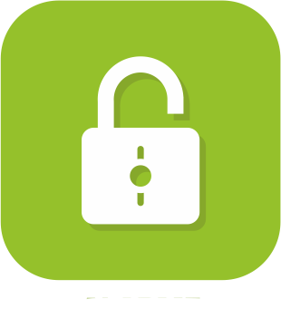
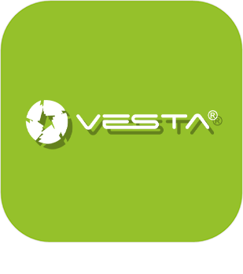

>**Wichtig**
>Nur offizielle Plugins haben hier ihre Dokumentation. Sie können die Dokumentation der anderen Plugins direkt im Jeedom Market einsehen. Klicken Sie im betreffenden Plugin auf Dokumentation.
>Sie können sehen [hier](https://market.jeedom.com/index.php?v=d&p=market&type=plugin&categorie=security) Alle offiziellen Plugins in dieser Kategorie

| | | | |
|--- | --- | --- | ---|
||jeelocker|ACHTUNG Plugin nur in der Beta verfügbar Jeelocker ist ein Plugin für die Schließfachzugriffsverwaltung|[Beta-Dokumentation](Jeelocker/beta/index.md) [Markt](https://market.jeedom.com/index.php?v=d&p=market_display&id=4237) [Changelog-Beta](Jeelocker/beta/changelog.md)|
||Ajax-Systeme|Plugin zum Verbinden mit einem Ajax-Alarm|[Dokumentation Stall](ajaxSystem/index.md) - [Beta-Dokumentation](ajaxSystem/beta/index.md) [Markt](https://market.jeedom.com/index.php?v=d&p=market_display&id=4150) [Änderungsprotokoll stabil](ajaxSystem/changelog.md) - [Changelog-Beta](ajaxSystem/beta/changelog.md)|
||Alarme|Sicherheitsmanagement-Plugin. Erstellen Sie Ihren Alarm einfach (ohne Programmierung), vollständig und anpassbar.|[Dokumentation Stall](alarm/index.md) - [Beta-Dokumentation](alarm/beta/index.md) [Markt](https://market.jeedom.com/index.php?v=d&p=market_display&id=26) [Änderungsprotokoll stabil](alarm/changelog.md) - [Changelog-Beta](alarm/beta/changelog.md)|
||Kamera|Plugin zur Anzeige von IP-Kameras. Die Videoanzeige der Kamera erfolgt jede Sekunde durch aufeinanderfolgende Schnappschüsse (Aufnahmen). Das Plugin ist mit RTSP-Kameras kompatibel.|[Dokumentation Stall](camera/index.md) - [Beta-Dokumentation](camera/beta/index.md) [Markt](https://market.jeedom.com/index.php?v=d&p=market_display&id=70) [Änderungsprotokoll stabil](camera/changelog.md) - [Changelog-Beta](camera/beta/changelog.md)|
||Zugriffsverwaltung|Plugin, mit dem Sie die Zugriffskontrolle eines Gebäudes über die Erstellung von Benutzern, Gruppen, Zeitfenstern und Lesern / Aktoren verwalten können. Achtung : PREMIUM-Plugins sind in keinem Service Pack enthalten. Sie sind nur auf Anfrage bei Jeedom erhältlich (Kontakt über unsere Website).|[Dokumentation Stall](gestAccess/index.md) - [Beta-Dokumentation](gestAccess/beta/index.md) [Markt](https://market.jeedom.com/index.php?v=d&p=market_display&id=3686) [Änderungsprotokoll stabil](gestAccess/changelog.md) - [Changelog-Beta](gestAccess/beta/changelog.md)|
||jeelocker|ACHTUNG Plugin nur in der Beta verfügbar Jeelocker ist ein Plugin für die Schließfachzugriffsverwaltung|[Beta-Dokumentation](jeelocker/beta/index.md) [Markt](https://market.jeedom.com/index.php?v=d&p=market_display&id=4238) [Changelog-Beta](jeelocker/beta/changelog.md)|
||Netatmo Sicherheit|Plugin für Netatmo Security. Achtung, um den Videostream anzuzeigen, benötigen Sie das Kamera-Plugin|[Dokumentation Stall](netatmoWelcome/index.md) - [Beta-Dokumentation](netatmoWelcome/beta/index.md) [Markt](https://market.jeedom.com/index.php?v=d&p=market_display&id=1967) [Änderungsprotokoll stabil](netatmoWelcome/changelog.md) - [Changelog-Beta](netatmoWelcome/beta/changelog.md)|
||Nuki|Mit diesem Plugin können Sie Nuki-verbundene Schlösser über die Brücke steuern. Außerdem kann die Bridge im Push-Modus konfiguriert werden|[Dokumentation Stall](nuki/index.md) - [Beta-Dokumentation](nuki/beta/index.md) [Markt](https://market.jeedom.com/index.php?v=d&p=market_display&id=2819) [Änderungsprotokoll stabil](nuki/changelog.md) - [Changelog-Beta](nuki/beta/changelog.md)|
||Simons Voss|Plugin für Simons Voss Smart Intego-Sperren|[Dokumentation Stall](simonsvoss/index.md) - [Beta-Dokumentation](simonsvoss/beta/index.md) [Markt](https://market.jeedom.com/index.php?v=d&p=market_display&id=3906)|
||Ubiquiti Unifi-Schutz|ACHTUNG Plugin nur in der Beta verfügbar Plugin zum Verbinden von Jeedom mit Unifi Protect|[Beta-Dokumentation](unifiprotect/beta/index.md) [Markt](https://market.jeedom.com/index.php?v=d&p=market_display&id=4188) [Changelog-Beta](unifiprotect/beta/changelog.md)|
||Vesta|Plugin zur Steuerung von Vesta-Alarmzentralen|[Dokumentation Stall](vesta/index.md) - [Beta-Dokumentation](vesta/beta/index.md) [Markt](https://market.jeedom.com/index.php?v=d&p=market_display&id=4330) [Änderungsprotokoll stabil](vesta/changelog.md) - [Changelog-Beta](vesta/beta/changelog.md)|
