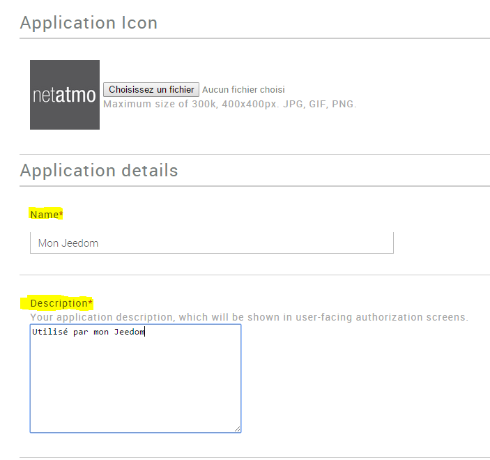

# Neatmo Sicherheits-Plugin

Plugin zum Abrufen von Informationen von Netatmo Security-Geräten

# Plugin Konfiguration

Sobald das Plugin installiert ist, müssen Sie Ihre Netatmo-Verbindungsinformationen eingeben :

-   **Kunden-ID** : Ihre Client-ID (siehe Abschnitt Konfiguration)
-   **Geheimer Kunde** : Ihr geheimer Client (siehe Abschnitt Konfiguration)
-   **Benutzername** : Benutzername Ihres Netatmo-Kontos
-   **Passwort** : Passwort für Ihr Netatmo-Konto
-   **Synchronize** : Mit dieser Option können Sie Jeedom mit Ihrem Netamo-Konto synchronisieren, um Ihre Netamo-Geräte automatisch zu erkennen. A
    tun, nachdem Sie die vorherigen Einstellungen gespeichert haben.

# Verbindungsinformationen abrufen

Pour intégrer votre Welcome, vous devez posséder un client\_id et unclient\_secret généré sur le site <http://dev.netatmo.com>.

Pour créer un compte > https://auth.netatmo.com/fr-fr/access/signup?next_url=https%3A%2F%2Fdev.netatmo.com%2Fbusiness-showcase

Klicken Sie einmal auf Start :

Dann auf "App erstellen"

Identifizieren Sie sich mit Ihrer E-Mail-Adresse und Ihrem Passwort

Füllen Sie die Felder "Name" und "Beschreibung" aus (was auch immer Sie eingeben, spielt keine Rolle) :

Aktivieren Sie dann ganz unten auf der Seite das Kontrollkästchen "Ich akzeptiere die Nutzungsbedingungen" und klicken Sie auf "Erstellen""

Rufen Sie die Informationen "CLient ID" und "Secret Client" ab und kopieren Sie sie in den Konfigurationsteil des Plugins in Jeedom (siehe vorheriges Kapitel))

# Gerätekonfiguration

Auf die Konfiguration von Netatmo-Geräten kann über das Plugin-Menü -> Sicherheit -> Netatmo-Sicherheit zugegriffen werden

Sobald Sie auf ein Gerät klicken, finden Sie hier die gesamte Konfiguration Ihrer Geräte :

-   **Name des Netatmo-Geräts** : Name Ihrer Netatmo-Ausrüstung
-   **Übergeordnetes Objekt** : Gibt das übergeordnete Objekt an, zu dem das Gerät gehört
-   **Aktivieren** : macht Ihre Ausrüstung aktiv
-   **Sichtbar** : macht es auf dem Dashboard sichtbar

Nachfolgend finden Sie die Liste der Bestellungen :

-   der Name des Befehls
-   Chronik : ermöglicht das Historisieren der Daten
-   Erweiterte Konfiguration (kleine gekerbte Räder) : Anzeigen
    erweiterte Konfiguration des Befehls (Protokollierungsmethode, Widget usw.))
-   Test : Wird zum Testen des Befehls verwendet

# FAQ

>**Ich habe die Ereignisse nicht in Echtzeit, sondern nach 15 Minuten**
>
>Um eine Echtzeit-Rückmeldung von Ereignissen zu erhalten (Auslösen eines Feueralarms, Person, die vor der Kamera vorbeikommt ..), MÜSSEN Sie absolut sicher sein, dass Ihre Freiheit eine externe URL in https mit einem gültigen Zertifikat auf Port 443 hat (und nur dieser Port die). Es ist eine Verpflichtung von Netatmo

>**Ich kann die Überwachung nicht deaktivieren / aktivieren**
>
>Achtung, wenn Sie einen Code eingeben, ist diese Funktion vom jeedom-Plugin nicht möglich

>**Ich habe einen Fehler vom Typ "Falscher Zeichenfolgenwert: '\ xF0 \ x9F \ x98 \ x98 "beim Synchronisieren**
>
>Stellen Sie sicher, dass der Name einer Kamera oder einer Person kein nicht standardmäßiges Zeichen (Smiley-Typ) enthält
