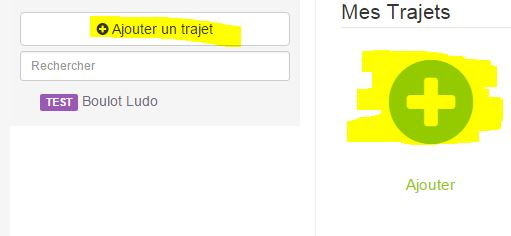

# Waze in Time Plugin 

Mit diesem Plugin können Sie die Reiseinformationen (Verkehr berücksichtigt) über Waze abrufen. Dieses Plugin funktioniert möglicherweise nicht mehr, wenn Waze nicht mehr akzeptiert, dass wir seine Site abfragen

# Konfiguration 

## Plugin Konfiguration: 

Um das Plugin verwenden zu können, müssen Sie es wie jedes Jeedom-Plugin herunterladen, installieren und aktivieren.

Danach müssen Sie Ihre Reise (n) erstellen :

Gehen Sie zum Plugins / Organisationsmenü, dort finden Sie das Waze Duration Plugin :

Dann gelangen Sie auf die Seite, auf der Ihre Ausrüstung aufgelistet ist (Sie können mehrere Routen haben) und auf der Sie einige erstellen können

Klicken Sie auf die Schaltfläche Reise hinzufügen oder auf die Schaltfläche + :

Sie gelangen dann auf die Konfigurationsseite Ihrer Reise:

Auf dieser Seite finden Sie drei Abschnitte :

### Allgemein

In diesem Abschnitt finden Sie alle Jeedom-Konfigurationen. Nämlich den Namen Ihres Geräts, das Objekt, dem Sie es zuordnen möchten, die Kategorie, ob das Gerät aktiv sein soll oder nicht, und schließlich, ob es im Dashboard sichtbar sein soll.

### Configuration

Dieser Abschnitt ist einer der wichtigsten und ermöglicht es Ihnen, den Start- und Endpunkt festzulegen :

-   Diese Informationen müssen die Breiten- und Längengrade der Positionen sein
-   Sie können über die Website gefunden werden, indem Sie auf den Seitenlink klicken (geben Sie einfach eine Adresse ein und klicken Sie auf GPS-Koordinaten abrufen)

### Bedienfeld

-   Dauer 1 : Reisedauer 1
-   Dauer 2 : Reisezeit mit der Alternativroute
-   Route 1 : Route 1
-   Route 2 : Alternative Route
-   Dauer zurück 1 : Rückgabezeit mit Fahrt 1
-   Dauer zurück 2 : Rückgabezeit mit der alternativen Route
-   Route zurück 1 : Route zurück 1
-   Route zurück 2 : Alternative Rückreise
-   Aktualisieren : Informationen aktualisieren

Alle diese Befehle sind über Szenarien und über das Dashboard verfügbar

## Das Widget

-   Die Schaltfläche oben rechts aktualisiert die Informationen.
-   Alle Informationen sind sichtbar (bei Reisen kann die Reise, wenn sie lang ist, abgeschnitten werden, aber die Vollversion wird angezeigt, indem Sie die Maus darauf lassen)

## Wie werden die Nachrichten aktualisiert?

Die Informationen werden alle 30 Minuten aktualisiert. Sie können sie bei Bedarf über ein Szenario mit dem Befehl refresh oder über den Bindestrich mit Doppelpfeilen aktualisieren
