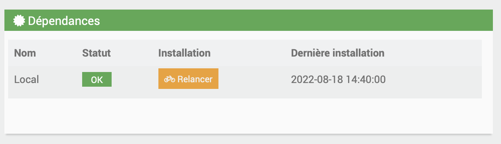
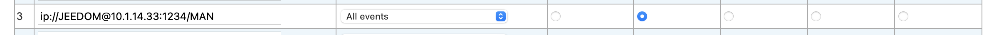

# Vesta-Plugin

#Description

Plugin zur Verwaltung Ihrer Vesta-Zentrale

# Plugin-Setup

Nachdem Sie das Plugin heruntergeladen haben, müssen Sie es wie jedes Jeedom-Plugin zuerst aktivieren :

Dann müssen Sie die Installation der Abhängigkeiten starten (auch wenn sie OK erscheinen) :

Starten Sie abschließend den Daemon :

Sie können den Port des Listening-Sockets für Ereignisse ändern, die von der Zentrale kommen

# Nutzung des Plugins

WICHTIG :

Um Ereignisse von Ihrer Zentrale zu erhalten, müssen Sie das Panel der letzteren konfigurieren. 
Auf letzterem, erreichbar über die lokale IP der Zentrale in Ihrem Browser, müssen Sie zu Systeme Setting gehen, dann Report

Und ändern Sie die folgende URL :

Ersetzen Sie die IP durch die lokale IP Ihres Jeedom und den Port durch den, den Sie im Plugin konfiguriert haben

Wählen Sie eine andere Gruppe als die anderen Berichts-URLs aus

Denken Sie daran, Essential und No Retry einzustellen

Sauvegardez

In Ihrem Plugin müssen Sie nach Abschluss der Konfiguration einfach auf Synchronisieren klicken, um automatisch die Geräte zu erstellen, die den im WebInterface Ihrer Steuereinheit erstellten Partitionen und Zonen entsprechen

Die in der Webschnittstelle konfigurierten und den Zonen zugewiesenen Geräte (Sensor, IR-Detektor usw.) verfügen über automatisch in den entsprechenden Zonen erstellte Befehle.