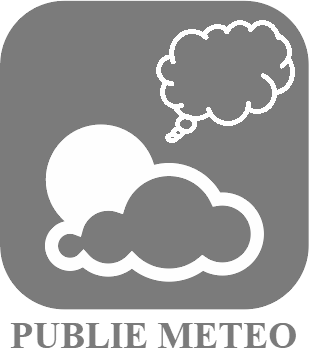

>**Wichtig**
>Nur offizielle Plugins haben hier ihre Dokumentation. Sie können die Dokumentation der anderen Plugins direkt im Jeedom Market einsehen. Klicken Sie im betreffenden Plugin auf Dokumentation.
>Sie können sehen [hier](https://market.jeedom.com/index.php?v=d&p=market&type=plugin&categorie=weather) Alle offiziellen Plugins in dieser Kategorie

| | | | |
|--- | --- | --- | ---|
||Netatmo Station|Ermöglicht das Abrufen von Informationen von Netatmo-Wetterstationen.|[Dokumentation Stall](netatmoWeather/index.md) - [Beta-Dokumentation](netatmoWeather/beta/index.md) [Markt](https://market.jeedom.com/index.php?v=d&p=market_display&id=133) [Änderungsprotokoll stabil](netatmoWeather/changelog.md) - [Änderungsprotokoll Beta](netatmoWeather/beta/changelog.md)|
||Wetter veröffentlichen||[Dokumentation Stall](publiemeteo/index.md) - [Beta-Dokumentation](publiemeteo/beta/index.md) [Markt](https://market.jeedom.com/index.php?v=d&p=market_display&id=2318) [Änderungsprotokoll stabil](publiemeteo/changelog.md) - [Änderungsprotokoll Beta](publiemeteo/beta/changelog.md)|
||Weather|Mit diesem Plugin können Sie die Wetterinformationen der Stadt Ihrer Wahl abrufen, z. B. die Wetterbedingungen und die aktuellen Temperaturen und die kommenden Tage, die Luftfeuchtigkeitsrate, die Kraft des Windes und seine Richtung, die Zeiten von Sonnenaufgang und Sonnenuntergang. Sonne und mehr. Sie wollten eine Wetterstation kaufen, dieses Plugin wird Sie sicherlich dazu bringen, Ihre Meinung zu ändern.|[Dokumentation Stall](weather/index.md) - [Beta-Dokumentation](weather/beta/index.md) [Markt](https://market.jeedom.com/index.php?v=d&p=market_display&id=7) [Änderungsprotokoll stabil](weather/changelog.md) - [Änderungsprotokoll Beta](weather/beta/changelog.md)|
