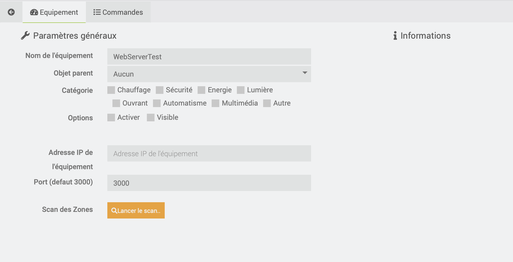

# Airzone-Plugin

# Description

Plugin zur Verwaltung und Steuerung Ihrer Airzone-Systeme

# Voraussetzungen

 - Jeedom v4.4.2
 - Kennen Sie die IP-Adressen Ihrer Gateways

# Installation

Nachdem Sie das Plugin heruntergeladen haben, müssen Sie es zuerst aktivieren, wie jedes Jeedom-Plugin.

# Configuration

Gehen Sie zum Menü Plugins / Plugin-Verwaltung

Wählen Sie den gewünschten Cron für die Aktualisierung der Werte :  5, 10, 15, 30, stündlich oder täglich.

Wählen Sie die Wartezeit zwischen Anfragen für jede Zone; standardmäßig 10 Sekunden, wenn das Feld leer ist.

Sauvegardez

# Ausrüstung hinzufügen

Gehen Sie zum Menü Plugins / Komfort / AirzoneJeedom

Klicken Sie auf Gateway hinzufügen.

Dort können Sie eine IP-Adresse konfigurieren.

Nach dem Speichern können Sie auf Scan starten klicken

WICHTIG : Wenn Sie einen Bereich haben, der Sonderzeichen enthält, kann dies einen SystemOut of Range-Fehler verursachen.

# Seiten-Plugin :

Auf der Plugin-Seite finden Sie die Gateways auf der linken Seite sowie deren gescannte und zugehörige Bereiche auf der rechten Seite

Beachten Sie, dass die Masters-Zonen zur deutlichen Unterscheidung mit einem gelben Symbol versehen sind

# Dashboard

Nachdem Sie Ihre Ausrüstung erstellt haben, finden Sie sie auf dem Dashboard.

Die Modussymbole ändern sich je nach ausgewähltem Modus: Kalt, heiß, Belüftung, Trocken und Stopp.

Um von den farbigen Symbolen zu profitieren, denken Sie daran, zu den Einstellungen Ihres Jeedoms (Einstellungen / System / Konfiguration / Schnittstelle) zu gehen und "Farbige Widget-Symbole" zu aktivieren"

Nur die Master-Zonen verfügen über das Dropdown-Menü zum Ändern des Modus in den zugehörigen Zonen, die in Ihrem System konfiguriert sind

Die Infosymbole Sollwert und Temperatur ändern sich entsprechend den Wertfenstern : -20 ° C, zwischen 20 und 25 ° C, mehr als 25 ° C (und das Äquivalent, wenn die Zone in Fahrenheit eingestellt ist)

Die in den Modi verfügbaren Auswahlmöglichkeiten oder die Lüftergeschwindigkeiten werden entsprechend den Möglichkeiten Ihres Systems erkannt.

Typische Ausstattung :

Ausstattung einer Masterzone; Wir sehen einen zusätzlichen Befehl, um den gleichen Modus in allen zugeordneten Zonen des Systems zu aktivieren

