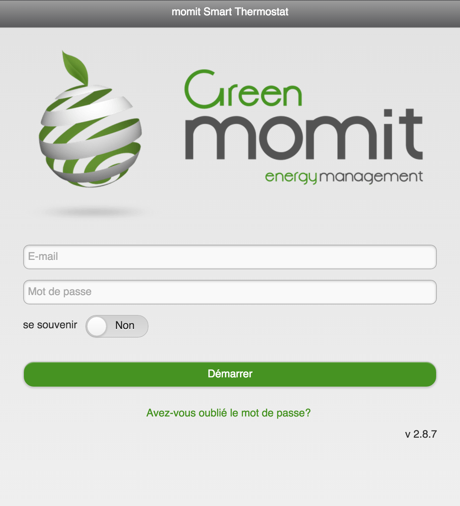
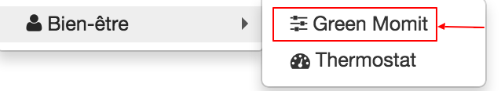

# Greenmomit Plugin

Plugin zur Kommunikation und Steuerung Ihres Green Momit-Thermostats

# Beschreibung 

## Marketingbeschreibung

Mit dem intelligenten Thermostat Momit ST können Sie den Komfort Ihres Zuhauses von jedem Ort aus, von einem Smartphone, Tablet oder Computer aus, verwalten und gleichzeitig Ihre Energiekosten senken 20%.

Der vom Stromnetz gespeiste Thermostat wird über einen potentialfreien Wechselkontakt mit dem Kessel verbunden. Sie sind mit Ihrem WLAN-Heimnetzwerk verbunden und können von jedem Computer, Smartphone oder Tablet aus auf Ihr Heizsystem zugreifen. Der Momit ST Smart Thermostat hebt sich von seinen Mitbewerbern durch verschiedene innovative Funktionen ab :

-   Moniteur
    -   Speichern Sie alle Ihre Energieverbrauchsdaten.
-   Calendrier
    -   Ermöglicht die einfache Einstellung Ihres Thermostats.
-   Präsenz
    -   Verfügt über einen Sensor, der den übermäßigen Energieverbrauch reduziert, wenn Sie nicht da sind. Die Heizung kann sogar automatisch ausgeschaltet werden.
-   Kontrolle
    -   Ermöglicht es Ihnen, den Komfort Ihrer Unterkunft von überall und jederzeit von Ihrem Smartphone, Tablet oder PC aus zu verwalten.
-   Temps
    -   Schätzen Sie die durchschnittliche Zeit, die jede Unterkunft benötigt, um die angegebene Temperatur zu erreichen, indem Sie die Vorwegnahmezeit optimieren, die erforderlich ist, um die richtige Temperatur zu erreichen.
-   Economies
    -   Visuelle Anzeige wird angezeigt, wenn Einsparungen erzielt werden.
-   Vacances
    -   Während der Ferienzeit unterbricht der Momit Smart Thermostat das Lernen.
    -   Im Gegensatz zu herkömmlichen Thermostaten verfügt der Momit ST Smart Thermostat über ein elegantes und innovatives Design, mit dem Sie ihn harmonisch in Ihr Dekor integrieren können. Mit Glasoberfläche und Touchscreen.
    -   Mit einer kostenlosen Anwendung (iOS und Android), Ihrem Smartphone und einer einfachen Internetverbindung können Sie von überall aus in Echtzeit auf alle Funktionen des Momit ST Smart Thermostats zugreifen.

**Funktionen**

-   WiFi IP Thermostat
-   Programmierbar und fernsteuerbar
-   Kompatibel mit herkömmlichen oder kombinierten Kesselsystemen
-   Ersetzt alle Standard-Trockenkontaktthermostate (Relais)
-   Kapazitiver Touchscreen
-   Verschiedene integrierte Sensoren (Temperatur, Luftfeuchtigkeit, Helligkeit, Nähe)
-   Programmierung planen
-   Urlaubsfunktion
-   Elegantes und innovatives Design
-   Glasoberfläche
-   Verschiedene Display-Designs erhältlich
-   Kostenlose iPhone App
-   Kostenlose Android App
-   API auf Anfrage beim Green Momit Support erhältlich

**Technische Daten**

-   Versorgung : 230 V AC 50..60 Hz
-   Beenden : Ohne Potenzial
-   Maximale Leistung :
    -   5 A für ohmsche Last
    -   2 A für eine induktive Last (cosÎ † = 0,4)
-   WiFi : IEEE 802.11 b / g
-   Sensoren :
    -   Kapazitiver Touchscreen
    -   NTC-Temperatursensor 100k bei 25 ° C
    -   Feuchtigkeitssensor 0-99%
    -   Helligkeitssensor
    -   Näherungssensor bis 5 m
-   IP-Schutz : IP20
-   Abmessungen : 94 x 94 x 32 mm
-   Gewicht : 225g
-   Standards :
    -   ETSI EN 300 328 V1.7.1 (2006-10)
    -   ETSI-EN 301 489-1 V1.9.2 (2011-09)
    -   ETSI EN 301 489-17 V2.2.1 (2012-09)
    -   EN 62479:2010
    -   EN 60730-2-9; EN 60730-1

# Konfiguration 

## Installieren Sie das Plugin 

Fahren Sie mit der Installation des Plugins fort

Klicken Sie auf "Allgemein" und dann auf Plugins

Klicken Sie auf das Symbol "Markt", um auf den Inhalt der auf dem Jeedom Market verfügbaren Plugins zuzugreifen.

Durchsuchen Sie den Markt bis zur Kategorie "Komfort" oder verwenden Sie das Suchfeld mit dem Schlüsselwort "Green Momit"". Klicken Sie auf das Plugin.

Sie können das Plugin in seiner Version installieren  stabil oder  Beta. Die stabile Version wird für die Mehrheit der Benutzer empfohlen.

## Plugin Konfiguration 

Konfigurieren Sie das Plugin. Vous aurez besoin de vos identifiants qui vous permettent d'accéder au portail Green Momit (<https://st.greenmomit.com/>) Le site du constructeur (<http://greenmomit.com/>) 

Avant de configurer le plugin, vous devez valider que votre compte est fonctionnel sur le portail Green Momit. (<https://st.greenmomit.com/>)

Und fragen Sie die Unterstützung von Green Momit

-   Eindeutige API Kennung 
-   API Geheimcode

durch Senden einer E-Mail an ( <support@greenmomit.es>) oder
(( <support@momit.zendesk.com> ).

 Nom d'utilisateur : spécifier l'adresse email utilisée pour accéder au site <https://st.greenmomit.com/>  

Passwort : Ihr zugehöriges Passwort 

 

Eindeutige API Kennung : per E-Mail auf Anfrage des Green Momit-Supports erhalten

 

API Geheimcode : idem Klicken Sie dann auf "Speichern" und "Synchronisieren Sie Ihre Geräte"

## Plugin Konfiguration

Konfigurieren Sie das Plugin

Klicken Sie auf "Plugins" ⇒ "Wohlbefinden" ⇒ "Green Momit"

Ihr Thermostat ist konfiguriert, Sie müssen nur noch :

-   Geben Sie das übergeordnete Objekt an,
-   l'activer,
-   und sichtbar machen.

Die Option : "Die Thermostatsteuerung wird nicht von Jeedom durchgeführt. "Lassen Sie die Green Momit-Anwendung Vorrang vor Jeedom.

##  Widget-Konfiguration

Le widget du thermostat est déjà en place et disponible dans l'objet parent définit dans la configuration précédente.

Température actuelle (sonde du thermostat). 

Hydrométrie actuelle (sonde du thermostat).

Eteint le thermostat si le thermostat détecte que c'est la nuit.

Le thermostat apprend tout seul vos habitudes.

Le thermostat s'arrête automatiquement s'il ne détecte pas de présence.  

Mettre le thermostat en mode Manuel ou Automatique.  

Etat du thermostat.  

Consigne du thermostat. Modification de la consigne avec la roue.  

Rafraîchir l'état. En survolant, affichage de la dernière synchronisation. 

