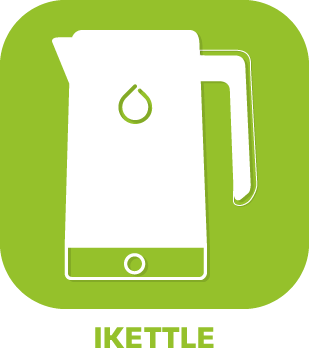

>**WICHTIG**
>Nur offizielle Plugins haben hier ihre Dokumentation. Sie können die Dokumentation der anderen Plugins direkt im Jeedom Market einsehen. Klicken Sie im betreffenden Plugin auf Dokumentation.
>Sie können sehen [hier](https://market.jeedom.com/index.php?v=d&p=market&type=plugin&categorie=wellness) Alle offiziellen Plugins in dieser Kategorie

| | | | |
|--- | --- | --- | ---|
||Airzone-Web|Plugin zur Integration in das Jeedom- oder Airzone-System. Kann nur mit einem Airzone-Gerät kommunizieren. Die neue Beta-Version des Plugins unterstützt mehrere Geräte, erfordert jedoch das Löschen vorheriger Geräte.|[Dokumentation Stall](airzone/index.md) - [Beta-Dokumentation](airzone/beta/index.md) [Markt](https://market.jeedom.com/index.php?v=d&p=market_display&id=4216) [Änderungsprotokoll stabil](airzone/changelog.md) - [Änderungsprotokoll Beta](airzone/beta/changelog.md)|
||Alfawise Nebelmaschine|Plugin zur Steuerung von Alfawise-Nebelgeräten|[Dokumentation Stall](alfawiseumist/index.md) - [Beta-Dokumentation](alfawiseumist/beta/index.md) [Markt](https://market.jeedom.com/index.php?v=d&p=market_display&id=3296) [Änderungsprotokoll stabil](alfawiseumist/changelog.md) - [Änderungsprotokoll Beta](alfawiseumist/beta/changelog.md)|
||CoolAutomation|Plugin, das die automatische Erkennung, Konfiguration und API-Kommunikation mit Produkten der Marke CoolAutomation ermöglicht: CoolLink Hub, CoolMaster und CoolMaster Pro.|[Dokumentation Stall](coolAutomation/index.md) - [Beta-Dokumentation](coolAutomation/beta/index.md) [Markt](https://market.jeedom.com/index.php?v=d&p=market_display&id=4504) [Änderungsprotokoll stabil](coolAutomation/changelog.md) - [Änderungsprotokoll Beta](coolAutomation/beta/changelog.md)|
||Grüner Momit|Plugin für Greenmomit Thermostate|[Dokumentation Stall](greenmomit/index.md) [Markt](https://market.jeedom.com/index.php?v=d&p=market_display&id=1081) [Änderungsprotokoll stabil](greenmomit/changelog.md)|
||Ikettle|Plugin zur Verwaltung von Ikettle und Ikettle 2 intelligenteren Kesseln|[Dokumentation Stall](ikettle/index.md) [Markt](https://market.jeedom.com/index.php?v=d&p=market_display&id=3297) [Änderungsprotokoll stabil](ikettle/changelog.md)|
||Intesis|Plugin permettant de piloter les passerelles « Intesis Wifi (ASCII) AC Interfaces » (anciennement dénommées Intesisbox). Basées sur le protocole WMP, les passerelles « Intesis Wifi (ASCII) AC Interfaces » sont des box qui permettent de domotiser des systèmes de climatisation gainables (interface Intesis à connecter en filaire sur le bus du climatisateur) ou à split avec télécommande infrarouge (interface Intesis IR). Dieses Plugin unterstützt alle Modelle von Intesis Wifi (ASCII) AC-Schnittstellen-Gateways (sowohl verkabelt als auch IR), ist jedoch nicht mit IntesisHome-Gateways (und insbesondere nicht mit Intesis-Gateways aus der IntesisHome-Reihe) kompatibel).|[Dokumentation Stall](intesis/index.md) - [Beta-Dokumentation](intesis/beta/index.md) [Markt](https://market.jeedom.com/index.php?v=d&p=market_display&id=3921) [Änderungsprotokoll stabil](intesis/changelog.md) - [Änderungsprotokoll Beta](intesis/beta/changelog.md)|
||Neato|Plugin zur Steuerung Ihres Botvac Connected Staubsaugers von Neato. Sie können damit einen Turbo- oder Öko-Reinigungszyklus starten, eine Pause einlegen, fortfahren, zur Basis zurückkehren, den Status, die Anwesenheit auf dem Dock, den Ladezustand und vieles mehr kennen.....  Sie träumen von einem Staubsauger, der in Ihre Hausautomation integriert ist. Dank dieses Plugins ist dies möglich !|[Dokumentation Stall](neato/index.md) - [Beta-Dokumentation](neato/beta/index.md) [Markt](https://market.jeedom.com/index.php?v=d&p=market_display&id=2260) [Änderungsprotokoll stabil](neato/changelog.md) - [Änderungsprotokoll Beta](neato/beta/changelog.md)|
||Netatmo Thermostat|Plugin zur Steuerung Ihres Netatmo-Thermostats.  Das Plugin erlaubt es : -Wählen Sie die Betriebsart des Thermostats (Programm, max, abwesend, frostfrei, aus, manueller Sollwert) -Wählen Sie Ihren Kalender (Feiertage, Telefonzentrale usw.)...) - Kennen Sie die Batterie und die Signalpegel des Thermostats - Kennen Sie den aktuellen Zeitplan sowie den nächsten (und die Endzeit des aktuellen Zeitplans) - Definieren Sie den Tag und die Uhrzeit, zu der die Modi enden (nicht vorhanden, frostfrei, maximal und manuell)) - Alle Funktionen sind über Szenarien verfügbar - Die beiden Widgets (Dashboard und Mobile) bieten Zugriff auf alle diese Funktionen|[Dokumentation Stall](netatmoThermostat/index.md) - [Beta-Dokumentation](netatmoThermostat/beta/index.md) [Markt](https://market.jeedom.com/index.php?v=d&p=market_display&id=1969) [Änderungsprotokoll stabil](netatmoThermostat/changelog.md) - [Änderungsprotokoll Beta](netatmoThermostat/beta/changelog.md)|
||Robonect|ACHTUNG Plugin nur in der Beta verfügbar |[Beta-Dokumentation](robonect/beta/index.md) [Markt](https://market.jeedom.com/index.php?v=d&p=market_display&id=3405) [Änderungsprotokoll Beta](robonect/beta/changelog.md)|
||Intelligenter Kaffee|Plugin zur Verwaltung der intelligenteren Kaffeemaschine. Achtung : Nur kompatibel mit Version 1 der Kaffeemaschine, Version 2, die Ifttt verwaltet, ist nicht kompatibel|[Dokumentation Stall](smartercoffee/index.md) - [Beta-Dokumentation](smartercoffee/beta/index.md) [Markt](https://market.jeedom.com/index.php?v=d&p=market_display&id=2285) [Änderungsprotokoll stabil](smartercoffee/changelog.md) - [Änderungsprotokoll Beta](smartercoffee/beta/changelog.md)|
||Swimo|Ermöglicht die Steuerung eines Swimo-Pool-Controllers.|[Dokumentation Stall](swimo/index.md) [Markt](https://market.jeedom.com/index.php?v=d&p=market_display&id=3747) [Änderungsprotokoll stabil](swimo/changelog.md)|
||Thermostat|Mit diesem sehr leistungsstarken und sehr vollständigen Plugin können Sie die Temperatur Ihrer Unterkunft genau steuern, unabhängig davon, ob Sie sie heizen oder kühlen möchten. Das Plugin lernt im Laufe der Zeit, wie Sie am besten Energie sparen und gleichzeitig den optimalen Komfort in Ihrem Zuhause gewährleisten können.|[Dokumentation Stall](thermostat/index.md) - [Beta-Dokumentation](thermostat/beta/index.md) [Markt](https://market.jeedom.com/index.php?v=d&p=market_display&id=77) [Änderungsprotokoll stabil](thermostat/changelog.md) - [Änderungsprotokoll Beta](thermostat/beta/changelog.md)|
||Reiniger denken|Plugin zum Bestellen von Roombas über das Thinking Cleaner-Modul|[Dokumentation Stall](thinkingCleaner/index.md) [Markt](https://market.jeedom.com/index.php?v=d&p=market_display&id=1712) [Änderungsprotokoll stabil](thinkingCleaner/changelog.md)|
