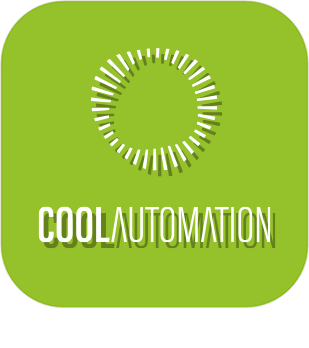

>****
>. . .
>  

| | | | |
|--- | --- | --- | ---|
||AirzoneControl| : | -    - |
|||| -    - |
||AristonECS|. .|  |
||CoolAutomation|: .| -    - |
||||  |
||Ikettle||  |
||Intesis|Plugin permettant de piloter les passerelles «  Wifi (ASCII) AC Interfaces » (anciennement dénommées Intesisbox). Basées sur le protocole WMP, les passerelles «  Wifi (ASCII) AC Interfaces » sont des box qui permettent de domotiser des systèmes de climatisation gainables (interface  à connecter en filaire sur le bus du climatisateur) ou à split avec télécommande infrarouge (interface  IR). ).| -    - |
||Neato|. .....   !| -    - |
|||.   : -) -...) -  - ) - ) -  - | -    - |
||Robonect| |  |
|||.  : | -    - |
||Swimo|.|  |
||Thermostat|. .| -    - |
||||  |
