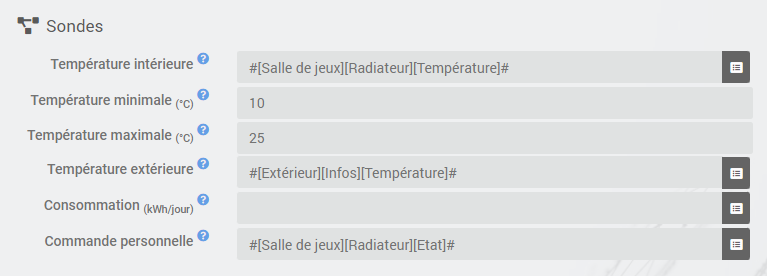
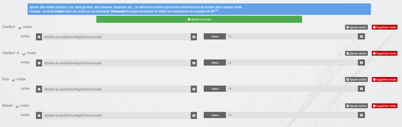
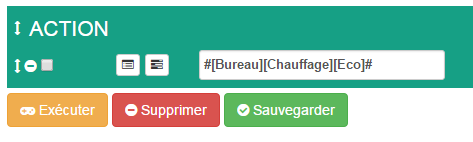
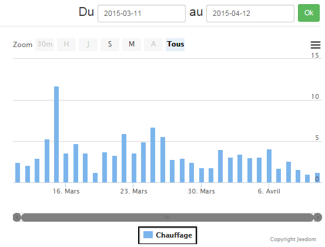

# Thermostat-Plugin

# Description

Mit diesem Plugin können Sie Thermostate erstellen und verwalten, um die Heizung Ihres Hauses zu steuern. Es arbeitet in 2 Modi Ihrer Wahl :

-   der Modus **Hysterese** entspricht dem Ein- und Ausschalten der Heizung in Abhängigkeit von der Innentemperatur in Bezug auf eine dem Sollwert entsprechende Schwelle. Durch die Hysterese kann ein zu häufiges Umschalten vermieden werden, wenn die Temperatur um den Sollwert liegt.
-   der Modus **zeitlich** berechnet einen prozentualen Anteil der Erwärmung über einen vordefinierten Zeitzyklus unter Berücksichtigung der Unterschiede zwischen dem Sollwert und den Innen- und Außentemperaturen (Isolierung)). Dieser Modus ist präziser, verfügt über eine Lernfunktion, die eine automatische Anpassung der Koeffizienten ermöglicht, erfordert jedoch möglicherweise einige manuelle Anpassungen, um sie an Ihre Installation anzupassen. Damit der Zeitmodus funktioniert, benötigen Sie unbedingt einen Innen- UND Außentemperatursensor.

# Configuration

Dieses Plugin dient zum Erstellen von Thermostaten in Jeedom. Es kann Heizung, Klimaanlage oder beides steuern.

Der Vorteil gegenüber einem herkömmlichen Thermostat besteht darin, dass er vollständig in Ihre Hausautomationsinstallation integriert werden kann. Zusätzlich zur Temperaturregelung kann der Thermostat mit allen Geräten im Haus interagieren, da dies zuerst gefragt wird.

Zu seinen Merkmalen gehören :

-   unter Berücksichtigung der Außentemperatur, also des Dämmkoeffizienten des Hauses,
-   ein Regulierungssystem, das lernt, die Regulierung zu optimieren,
-   die Möglichkeit, die Türen zu verwalten, um den Thermostat auszuschalten,
-   Fehlermanagement von Geräten, Temperatursensoren und Heizungen,
-   vollständige Programmierung mit dem Tagebuch-Plugin, insbesondere mit der Möglichkeit, die Änderung des Sollwerts so zu antizipieren, dass die Temperatur zum programmierten Zeitpunkt erreicht wird (Smartstart)

Zuerst zeigen wir Ihnen die Implementierung, dann detaillieren wir die verschiedenen Einstellungen der Thermostatkonfiguration und schließlich anhand einiger Anwendungsfälle, wie wir sie in Kombination mit anderen Plugins oder erweitern können Szenarien verwenden.

## Konfiguration mit wenigen Klicks

Der Jeedom-Thermostat ist sehr leistungsstark, aber für den traditionellen Gebrauch ist seine Implementierung sehr einfach und schnell, sobald wir die wesentlichen Schritte verstanden haben :

-   Definition des Thermostatmotors (Hysterese oder Zeit). Es ist die Wahl des Regelungsalgorithmus.
-   Konfiguration und Betriebsbereich : Nur Heizung, Klimaanlage oder beides, minimale und maximale Nutzungstemperaturen.
-   Festlegen der Maßnahmen, die der Thermostat zum Heizen, Kühlen oder Abschalten ergreifen soll.

Dann gibt es verschiedene Registerkarten :

-   Die Moduskonfiguration definiert vorgegebene eingestellte Temperaturen. Zum Beispiel Komfortmodus bei 20 ° C, Öko bei 18 ° C. Es kann auch Tag, Nacht, Urlaub, Abwesenheit usw. geben. Hier sehen Sie die Möglichkeiten der Anpassung des Plugins.
-   Um die Betriebsart des Thermostats zu verfeinern, können Sie auch Öffnungen konfigurieren, die die Regelung vorübergehend unterbrechen (z. B. kann ein offenes Fenster die Heizung stoppen). Die Definition dieser Unterbrechung erfolgt hier einfach.
-   Die Verwaltung von Fehlermodi für Temperatursensoren oder zum Heizen ermöglicht es, Aktionen zu definieren, die für einen verschlechterten Modus ausgeführt werden sollen.
-   Auf der Registerkarte Erweiterte Konfiguration können Sie die Heizungsregelungsparameter anpassen.
-   Wenn Sie zusätzlich das Agenda-Plugin haben, können Sie den Programmiermodus direkt über die Registerkarte Programmierung ändern.

Ihr Thermostat ist jetzt betriebsbereit. Durch die Verwendung von Szenarien oder die Kombination mit anderen Plugins (Agenda, virtuell, Präsenz, ...) fügt er sich nahtlos in Ihre Hausautomationsinstallation ein. Dies wird standardmäßig im Dashboard angezeigt :

Mit der Sperre des Widgets können Sie den Thermostat nach einem unvorhergesehenen Ereignis in einem bestimmten Sollwert blockieren : Ferien, Gäste, ...

## Die Erstellung eines Thermostats im Detail

Um einen neuen Thermostat zu erstellen, rufen Sie die Konfigurationsseite auf, indem Sie das Menü öffnen **Plugins → Komfort** und auswählen **Thermostat**. Klicken Sie auf die Schaltfläche **Hinzufügen** befinden Sie sich oben links und geben Sie den gewünschten Namen für Ihren Thermostat ein.

Zunächst werden wir die allgemeinen Parameter des Thermostats informieren. Sie befinden sich oben links im allgemeinen Abschnitt. Hier müssen das übergeordnete Objekt, die Aktivierung und die Sichtbarkeit des Thermostats angegeben werden. Dies sind die üblichen Informationen für jeden Benutzer von jeedom.

## Die Wahl des Thermostat-Algorithmus

In diesem Bild ist der Thermostatbetriebsmotor hervorgehoben. Es gibt 2 mögliche Algorithmen zur Temperaturregelung.

Wenn Sie den Modus auswählen **Hysterese**, Ihre Heizung startet, sobald die Temperatur unter dem Sollwert abzüglich der Hysterese liegt, und schaltet sich aus, sobald die Temperatur den Sollwert plus die Hysterese überschreitet.

Wenn beispielsweise die Hysterese auf 1 ° C und der Sollwert auf 19 ° C eingestellt ist, wird die Heizung aktiviert, wenn die Temperatur unter 18 ° C fällt, und stoppt, sobald sie 20 erreicht ° C.

Die zu liefernden Parameter sind der Hysteresewert in °C und der Befehl, der die Wiederherstellung der Temperaturmessung ermöglicht. Die Hysterese wird entsprechend der Genauigkeit des Sensors eingestellt, beispielsweise für eine präzise Sonde bei 0.5 ° C, eine Hysterese von 0.2 ° C ist ein guter Kompromiss.

Durch Aktivieren des Kontrollkästchens kann nur die positive Hysterese berücksichtigt werden **Positive Hysterese**. Im Modus „Heizen“ schaltet sich der Thermostat dann ein, sobald die Innentemperatur niedriger als der Sollwert ist oder im Modus „Klima“ sobald die Innentemperatur über dem Sollwert liegt.

> **INFORMATION**
>
> Die Parameter bezüglich der Hysterese finden Sie in der Registerkarte **Voraus**.

Im Falle des Modus **Zeitlich**, Der Heizungs- oder Klimaanlagenbefehl wird in einem vordefinierten Zyklus definiert und die Befehlsausführungszeit hängt von der Differenz zwischen dem Sollwert und der vom Sensor gemessenen Temperatur ab. Der Algorithmus berechnet auch die Heiz- (oder Kühl-) Zeit über einen Zyklus entsprechend der Trägheit und der Isolierung des Raums.

Schließlich ist die Regelung umso langsamer, je länger die Zykluszeit ist. Umgekehrt führt eine zu kurze Zeit zu einem häufigen Umschalten Ihres Heizungssystems, das möglicherweise keine Zeit hat, das Raumvolumen effektiv zu erwärmen. Es wird empfohlen, diese Zykluszeit nicht zu stark zu verkürzen (akzeptable Werte liegen zwischen 30 und 60 Minuten).

Diese Art der Regelung ist optimierter, verbessert den Komfort und ermöglicht erhebliche Energieeinsparungen.

## Die allgemeine Konfiguration

Zusätzlich zur Betriebsart des Thermostats können Sie entscheiden, ob der Thermostat zum Heizen, Kühlen oder für beide Modi verwendet wird. Dann geben Sie den Einsatzbereich an : Die minimalen und maximalen Sollwerte definieren die möglichen Sollwerte, auf die im Widget zugegriffen werden kann.

Anschließend müssen Sie die Befehle angeben, mit denen Sie die Temperaturen messen können. Beachten Sie, dass der zeitliche Modus unbedingt die Außentemperatur kennen muss. Wenn Sie keinen Außensensor haben, kann dies über das Plugin "Wettervorhersage" bereitgestellt werden".

> **TIPP**
>
> Die Felder "Minimale Temperatur" und "Maximale Temperatur" definieren den Betriebsbereich des Thermostats, außerhalb dessen ein Sensorfehler ausgelöst wird *(Siehe den folgenden Abschnitt zu Standardaktionen*).

Es ist auch möglich, den Verbrauch pro Tag in kWh Ihrer Heizung anzugeben *(facultatif)* Hiermit wird die Leistung Ihrer Heizung durch Berechnung angezeigt **Verbrauch / DJU** *(Tag des einheitlichen Grades)*. Sie können auch einen beliebigen Befehl Ihrer Wahl auf dem Thermostat anzeigen, indem Sie ihn in das Feld eingeben **Persönliche Bestellung**.

## Aktionen

Alles, was mit der Steuerung des Kühlers oder der Klimaanlage zu tun hat, wird auf der Registerkarte beschrieben **Lager**. Dort können mehrere Aktionen definiert werden, die unserem Thermostat die Möglichkeit geben, verschiedene Geräte zu steuern (z. B. Betrieb nach Zone oder Steuerung eines anderen Thermostats))

Aktionen sind solche, die das Heizen, Kühlen (Klimatisieren) und Stoppen des Befehls ermöglichen. Bei jeder Sollwertänderung kann eine zusätzliche Aktion ins Auge gefasst werden, sei es im manuellen oder im automatischen Modus.

## Mode : der Ausgangspunkt für die Automatisierung

Die Modi (auf der Registerkarte definiert **Modus**) sind vorgegebene Thermostatrichtlinien, die zu Ihrem Lebensstil passen. Zum Beispiel der Modus *Nacht* oder *Eco* Geben Sie die gewünschte Temperatur an, wenn alle schlafen. Der Modus *Tag* oder *Komfort* bestimmt das Verhalten des Thermostats, um eine angenehme Temperatur zu haben, wenn Sie zu Hause anwesend sind. Hier ist nichts eingefroren. Sie können über Szenarien so viele Modi definieren, wie Sie möchten (wir werden später darauf zurückkommen).

Im Bild unten der Modus *Komfort* hat einen Sollwert von 19 ° C und für den Modus *Eco*, Der Thermostat ist auf 17 ° C eingestellt. Der Modus *Urlaub* programmiert den Thermostat bei längerer Abwesenheit auf 15 ° C. Es ist im Dashboard nicht sichtbar, da es sich um ein Szenario handelt, in dem alle Geräte programmiert sind *Urlaub* und positionieren Sie so den Thermostat in diesem Modus.

Gehen Sie wie folgt vor, um einen Modus zu definieren :

-   Klicken Sie auf die Schaltfläche *Modus hinzufügen*,
-   Geben Sie diesem Modus einen Namen, zum Beispiel "Eco",
-   Fügen Sie eine Aktion hinzu und wählen Sie den Befehl *Thermostat* Ihrer Thermostatausrüstung,
-   Stellen Sie die gewünschte Temperatur für diesen Modus ein,
-   Aktivieren Sie das Kontrollkästchen **Sichtbar** um diesen Modus im Thermostat-Widget im Dashboard anzuzeigen.

>**Wichtig**
>
>Achtung beim Umbenennen eines Modus ist es unbedingt erforderlich, die Szenarien / Geräte zu überprüfen, die den alten Namen verwenden, um sie an den neuen weiterzugeben

## Die Öffnungen : den Thermostat vorübergehend zu unterbrechen

Stellen Sie sich vor, Sie möchten Ihre Heizung oder Klimaanlage vorübergehend abstellen, um beispielsweise den Raum zu belüften, für den der Thermostat aktiv ist. Um die Öffnung des Fensters zu erkennen, verwenden Sie einen Sensor, der sich an der Öffnung Ihres Fensters befindet. Auf diese Weise können Sie diese Unterbrechung ausführen, indem Sie ihn auf der Registerkarte zur Konfiguration der Öffnungen hinzufügen. Hier können zwei zusätzliche Parameter eingestellt werden: Die Öffnungs- und Schließzeiten des Fensters bewirken, dass der Thermostat stoppt und den Betrieb wieder aufnimmt.

Sie können das Senden einer Warnung definieren, wenn eine der auf dieser Seite eingegebenen Türen länger als "XX" Minuten geöffnet bleibt.

So konfigurieren Sie den Vorgang beim Öffnen des Fensters :

-   Wählen Sie die Informationen zum Öffnungssensor im Feld "Öffnung" aus
-   Stellen Sie die Zeit ein, bevor sich der Thermostat nach dem Öffnen ausschaltet. `Ausschalten, wenn mehr als (min.) :``
-   Stellen Sie die Zeit nach dem Schließen des Fensters so ein, dass der Thermostat im `Einschalten neu gestartet werden kann, wenn er seit (min.) :``
-   Klicken Sie auf die Schaltfläche *Speichern* die Aufnahme von Öffnungen aufzuzeichnen

> **TIPP**
>
> Es können mehrere Öffnungen definiert werden. Dies ist erforderlich, wenn der Thermostat einen Bereich steuert, der aus mehreren Räumen besteht.

## Vorhersage eines verschlechterten Modus dank Fehlermanagement

Fehler können entweder von den Temperatursensoren oder der Heizungssteuerung stammen. Der Thermostat kann bei längerer Abweichung der Temperatur vom Sollwert einen Fehler erkennen.

### Ausfall der Temperatursonde

Wenn die vom Thermostat verwendeten Sensoren keine Temperaturänderung zurückgeben, z. B. bei Batterieverschleiß, löst der Thermostat Fehleraktionen aus. Wenn der Fehler auftritt, ist es möglich, das Gerät in einen vorbestimmten Betriebsmodus zu versetzen, beispielsweise um die Bestellung eines Pilotdrahtstrahlers zu erzwingen. Einfacher gesagt, das Senden einer Nachricht per SMS oder einer Benachrichtigung ermöglicht es, gewarnt zu werden und manuell einzugreifen.

> **Wichtig**
>
> Der Parameter, mit dem der Thermostat über einen Sondenfehler entscheiden kann, befindet sich auf der Registerkarte *Voraus*. Dies ist die "maximale Zeit zwischen 2 Temperaturänderungen".

So definieren Sie eine Fehleraktion :

-   Klicken Sie auf die Registerkarte *Sondenfehler*,
-   Klicken Sie auf die Schaltfläche *Fügen Sie eine Fehleraktion hinzu*
-   Wählen Sie eine Aktion aus und füllen Sie die zugehörigen Felder aus

Sie können mehrere Aktionen eingeben, die nacheinander ausgeführt werden, und bei komplexeren Aktionen ein Szenario aufrufen *(Geben Sie "Szenario" ohne Akzent in das Aktionsfeld ein und klicken Sie auf eine andere Stelle, um den Namen des Szenarios einzugeben)*.

### Ausfall der Heizung / Klimaanlage

Die ordnungsgemäße Funktion der Heizung oder Klimaanlage wird durch eine gute Befolgung der Anweisungen bedingt. Wenn also die Temperatur vom Betriebsbereich des Thermostats abweicht, werden Heizungs- / Klimaanlagenausfallaktionen eingeleitet. Diese Analyse wird über mehrere Zyklen durchgeführt.

> **Wichtig**
>
> Der Parameter, mit dem der Thermostat über einen Sondenfehler entscheiden kann, befindet sich auf der Registerkarte *Voraus*. Dies sind die "Hot Failure Margin" für die Heizung und die "Cold Failure Margin" für die Klimatisierung.

So definieren Sie eine Fehleraktion :

-   Klicken Sie auf die Registerkarte *Ausfall der Heizung / Klimaanlage*,
-   Klicken Sie auf die Schaltfläche *Fügen Sie eine Fehleraktion hinzu*
-   Wählen Sie eine Aktion aus und füllen Sie die zugehörigen Felder aus

Sie können mehrere Aktionen eingeben, die nacheinander ausgeführt werden, und bei komplexeren Aktionen ein Szenario aufrufen *(Geben Sie "Szenario" ohne Akzent in das Aktionsfeld ein und klicken Sie auf eine andere Stelle, um den Namen des Szenarios einzugeben)*.

## Verwalten Sie Sonderfälle mit der erweiterten Thermostatkonfiguration

Diese Registerkarte enthält alle Parameter zum Einstellen des Thermostats im Zeitmodus. In den meisten Fällen ist es nicht erforderlich, diese Werte zu ändern, da das Selbstlernen die Koeffizienten automatisch berechnet. Selbst wenn sich der Thermostat an die meisten Fälle anpassen kann, können Sie die Koeffizienten für eine für Ihre Installation optimierte Konfiguration anpassen.

Die Koeffizienten sind wie folgt :

-   **Heizkoeffizient / Kühlkoeffizient** : Dies ist der Gewinn des Regulierungssystems. Dieser Wert wird mit der Differenz zwischen dem Sollwert und der gemessenen Innentemperatur multipliziert, um die Heiz- / Abkühlzeit abzuleiten.
-   **Heißes Lernen / Kaltes Lernen** : Dieser Parameter gibt den Lernfortschritt an. Ein Wert von 1 gibt den Beginn des Lernens an, der Algorithmus führt eine grobe Anpassung der Koeffizienten durch. Wenn dieser Parameter zunimmt, wird die Einstellung verfeinert. Ein Wert von 50 gibt das Ende des Lernens an.
-   **Heizungsisolierung / Klimadämmung** : Dieser Koeffizient wird mit der Differenz zwischen dem Sollwert und der gemessenen Außentemperatur multipliziert, um die Heiz- / Klimatisierungszeit abzuleiten. Es stellt den Beitrag der Außentemperatur zur Heiz- / Kühlzeit dar und sein Wert ist normalerweise niedriger als der Heiz- / Kühlkoeffizient bei einem gut isolierten Raum.
-   **Heiße Isolierung lernen / Kaltisolierung lernen** : gleiche Funktion wie oben, jedoch für die Isolationskoeffizienten.
-   **Heizungsversatz (%) / Klimaanlagenversatz (%))** : Der Heizungsoffset ermöglicht es zu berücksichtigen *interne Beiträge*, Normalerweise sollte es nicht festgelegt werden, aber wir nehmen an, dass das Lernen den dynamischen Teil in die anderen 2 Koeffizienten integriert. Die *interne Beiträge*, Es ist zum Beispiel ein Computer, der beim Einschalten einen Temperaturanstieg verursacht, aber es können auch Einzelpersonen (durchschnittlich 1 Person = 80 W) sein, der Kühlschrank in der Küche. In einem Raum im Süden ist es eine sonnige Fassade, die zusätzliche Energie liefern kann. Theoretisch ist dieser Koeffizient negativ.
- **Der Offset muss angewendet werden, wenn der Kühler als heiß eingestuft wird (%)** : Wird verwendet, wenn Ihr Heizungssteuerungssystem eine erhebliche Trägheit aufweist, sei es aufgrund der Heizkörper, der Konfiguration des Raums (Abstand zwischen Heizkörper und Temperaturfühler) oder des Temperaturfühlers selbst ( Je nach Modell ist ihre Reaktivität mehr oder weniger). Die sichtbare Folge dieser Trägheit ist ein vorübergehendes Überschwingen des Sollwerts bei erheblichen Temperaturerhöhungen (Sollwert beispielsweise von 15 ° C auf 19 ° C)). Dieser Parameter entspricht der Differenz, die zwischen der Heizperiode (= Heizung ist eingeschaltet) und der Periode, in der die von der Sonde gemessene Temperatur ansteigt, geteilt durch die Länge des konfigurierten Zyklus, beobachtet wird. Wenn beispielsweise zwischen dem Beginn des Erhitzens und dem Beginn des Temperaturanstiegs ein Unterschied von 30 Minuten besteht und die Dauer der Heizzyklen auf 60 Minuten eingestellt ist, können wir diesen Parameter auf 50% einstellen. Wenn also auf einen 100% igen Heizzyklus eine weitere Erwärmung folgt, kann mit diesem Parameter die vom Kühler im ersten Zyklus erzeugte, aber noch nicht von der Sonde gemessene Wärme für die Berechnung des zweiten Zyklus berücksichtigt werden, indem d reduziert wird '' seine Heizleistung. Die Leistung des zweiten Zyklus wird dann gegenüber der Berechnung anhand der von der Sonde gemessenen Temperatur um 50% reduziert.
-   **Selbstlernen** : Kontrollkästchen zum Aktivieren / Deaktivieren des Lernens der Koeffizienten.
-   **Smart start** : Mit dieser Option können Sie dem Thermostat Informationen geben, indem Sie die Änderung des Sollwerts vorwegnehmen, sodass die Temperatur zur programmierten Zeit erreicht wird. Diese Option erfordert das Agenda-Plugin. Bitte beachten Sie, dass es für einen intelligenten Start wichtig ist, dass das Lernen mehr als 25 beträgt. Ein weiterer Punkt, für den nur das nächste Ereignis erforderlich ist
-   **Zyklus (min)** : Dies ist der Berechnungszyklus des Thermostats. Am Ende des Zyklus und entsprechend der Differenz zwischen den Temperaturen und dem Sollwert berechnet der Thermostat die Heizzeit für den nächsten Zyklus.
-   **Minimale Aufheizzeit (% des Zyklus)** : Wenn die Berechnung zu einer Heizzeit führt, die unter diesem Wert liegt, ist der Thermostat der Ansicht, dass kein Heizen / Kühlen erforderlich ist, und der Befehl wird auf den nächsten Zyklus übertragen. Dies vermeidet die Beschädigung bestimmter Geräte wie Öfen, erreicht aber auch eine echte Energieeffizienz.
-   **Hot Failure Margin / Cold Failure Margin** : Dieser Wert wird verwendet, um eine Fehlfunktion der Heizung / Klimaanlage zu erkennen. Wenn die Temperatur diesen Bereich im Vergleich zum Sollwert für mehr als 3 aufeinanderfolgende Zyklen überschreitet, schaltet der Thermostat in den Heizungsausfallmodus.
- **Begrenzt unaufhörliche Ein- / Ausschaltzyklen (Pellet, Gas, Heizöl) und PID** : Mit dieser Option können Sie mit verschiedenen Heizstufen regeln. Die Rückkehr der Energie aus dem nächsten Zyklus sollte dem Heizgerät den neuen Heizpegelsollwert geben. Die Zyklen enden bei 100%, haben also eine kurze Zykluszeit.
- **Delta-Sollwert - Außentemperatur für heiße / kalte Richtung** : Der Thermostat wählt die Richtung (Heizung oder Klimaanlage) entsprechend dem Sollwert und der Außentemperatur (aus Einsparungsgründen wird davon ausgegangen, dass die Innentemperatur zur Außentemperatur tendiert). Mit diesen Parametern können Sie den Schwellenwert ändern. Ex : Wenn Sie 25 möchten und es standardmäßig 22 draußen ist, wechselt der Thermostat in den Heizmodus (nur für die Berechnung in diesen Modus versetzt, bedeutet dies nicht, dass er heizt), indem Sie das heiße Delta auf 4 setzen es erwärmt sich nicht mehr, weil 25-22 = 3 und 3 <4, es geht daher in den Kühlmodus (wenn die Innentemperatur über dem Sollwert liegt)

> **Wissen**
>
> Selbstlernen ist immer noch aktiv. Die Initialisierungsphase kann jedoch relativ lang sein *(zählen ca. 3 Tage)*. Während dieser Phase müssen ausreichend lange Zeiträume vorhanden sein, in denen sich der Sollwert nicht ändert.

## Thermostatsteuerungen

Auf alle Befehle kann in der Programmierung nicht zugegriffen werden, einige sind Statusinformationen, die vom Plugin zurückgegeben werden. In den Szenarien finden wir :

-   **Mode** : Es ist möglich, den Modus zu ändern, indem die Befehle direkt ausgeführt werden (hier Komfort, Komfortmorgen, Öko, Feiertage)
-   **Aus** : Dieser Befehl schaltet den Thermostat ab, die Regelung ist nicht mehr aktiv, die Heizung / Klimaanlage ist gestoppt
-   **Thermostat** : Dies ist der Thermostat-Sollwert
-   **Schloss** : Sperrbefehl, es ist nicht möglich, den Thermostatstatus (Modusänderung, Sollwert) zu ändern)
-   **entsperren** : Entsperrt den Thermostat, um seinen Zustand zu ändern
-   **Nur Heizung** : Regulierung greift nur in die Wärme ein
-   **Nur Klimaanlage** : Die Regelung ist nur zum Kühlen aktiv
-   **Heizungsoffset** : ändert den Versatzkoeffizienten der Heizung entsprechend den internen Beiträgen : Ein Szenario kann diesen Parameter beispielsweise anhand eines Anwesenheitsdetektors ändern
-   **Kaltversatz** : wie oben, aber für die Klimaanlage
-   **Jeder autorisierte** : Ändert das Verhalten des Thermostats, um sowohl beim Heizen als auch beim Klimatisieren zu wirken
-   **Macht** : Dieser Befehl ist nur im Zeitmodus verfügbar und gibt den Prozentsatz der Heiz- / Kühlzeit über die Zykluszeit an.
-   **Leistung** : Nur verfügbar, wenn Sie über eine Außentemperaturregelung und eine Verbrauchsregelung verfügen (in kWh, täglich um 00:00 Uhr auf 0 zurückgesetzt)). Dies zeigt Ihnen die Leistung Ihres Heizungssystems im Vergleich zum Tag mit einheitlichem Grad.
-   **Delta-Sollwert** : Mit diesem Befehl, der nur im Zeitmodus verfügbar ist, können Sie ein Berechnungsdelta für den Sollwert eingeben. Wenn> 0, sucht der Thermostat, ob er heizen soll (Sollwert - Delta / 2). Wenn ja, versucht er, sich auf (Sollwert + Delta / 2) zu erwärmen). Der Vorteil ist, länger, aber seltener zu heizen.

> **Spitze**
>
> Um den Thermostat im Modus "Nur Heizen" zu verwenden, müssen die Steuerungen definiert sein *Zum Heizen muss ich ?* und *Um alles zu stoppen, was ich muss ?* Im Modus "Nur Klimaanlage" sind Steuerungen erforderlich *Um mich abzukühlen, muss ich ?* und *Um alles zu stoppen, was ich muss ?*. Und im Modus "Alle autorisiert" müssen die 3 Befehle eingegeben worden sein.

## Ein konkretes Beispiel für die Verwendung des Thermostats

Wenn Ihr Thermostat konfiguriert ist, müssen Sie die Programmierung durchführen. Die beste Methode, um dies zu erklären, ist ein Anwendungsfall. Deshalb möchten wir unseren Thermostat entsprechend der Anwesenheitszeit der Bewohner des Hauses programmieren.

Zuerst werden wir 2 Szenarien verwenden, um die Heizung in den Modus zu versetzen **Komfort** (Sollwert 20 ° C) jeden Morgen der Woche zwischen 5 Uhr morgens und 7:30 Uhr morgens, dann abends zwischen 17 Uhr morgens und 21 Uhr morgens. Der Modus **Komfort** wird auch am Mittwochnachmittag von 12 bis 21 Uhr und am Wochenende von 8 bis 22 Uhr aktiviert. Den Rest der Zeit schaltet die Heizung auf **Eco**, mit einem Sollwert von 18 ° C.

Also erstellen wir das Szenario ***Komfortheizung***, im programmierten Modus :

und der Code :

Nach dem gleichen Prinzip das Szenario "Öko-Heizung"" :

und sein Code :

Beachten Sie, dass in den Szenarien die Thermostatsteuerung abgeschlossen ist, da wir auf den Betriebsmodus (nur Heizung oder Klimaanlage), die Modi, den eingestellten Wert und die Sperre (Sperren, Entsperren) einwirken können).

Wenn die Erstellung von Szenarien für die Programmierung eines Thermostats manchmal kompliziert ist, können Sie dies durch die Kombination von Thermostataktionen mit dem Kalender des Agenda-Plugins einfach tun.

Mit dem Agenda-Plugin können Sie weiter programmieren und vor allem das Risiko von Fehlern verringern. In der Tat wird der Kalender im Vergleich zur vorherigen Programmierung klar auf dem Bildschirm angezeigt und wir können Feiertage, Urlaube usw. berücksichtigen. Kurz gesagt, steuern Sie den Thermostat entsprechend seinem Lebensstil.

## Programmieren mit dem Agenda Plugin

Das Agenda-Plugin wird hier nicht vorgestellt. Ziel ist es, es mit der Programmierung des Thermostats zu koppeln. Beachten Sie, dass, wenn Sie das Agenda-Plugin haben, eine Registerkarte *Programmierung* wird in der Thermostatkonfiguration angezeigt und ermöglicht den direkten Zugriff auf den zugehörigen Kalender.

Also werden wir eine neue Agenda mit dem Namen erstellen **Heizungsprogrammierung**, Dazu kommen die Änderungsereignisse des Thermostatmodus.
Sobald der Kalender erstellt wurde, fügen wir die Ereignisse Morgen (Montag bis Freitag von 17.00 bis 19.30 Uhr), Abend (Montag, Dienstag, Donnerstag und Freitag von 17.00 bis 21.00 Uhr) und Mittwoch (Mittwoch von 12.00 bis 21.00 Uhr) hinzu. Wochenende (8 bis 22 Uhr), Feiertage. Alle diese Ereignisse haben als Startaktion die Auswahl des Modus **Komfort** des Thermostats und als Endaktion den Modus **Eco** :

Für die Programmierung der Abendveranstaltung :

Wiederholen Sie dies einfach für jede Veranstaltung, um diese farbenfrohe monatliche Agenda zu erhalten :

Zurück zur Thermostatkonfiguration können Sie direkt über die Registerkarte Programmierung auf Kalenderereignisse zugreifen :

## Visualisierung des Thermostatbetriebs

Sobald der Thermostat konfiguriert ist, ist es wichtig, seine Effizienz zu überprüfen.

Im Menü "Home" befindet sich das Untermenü "Thermostat". Das Fenster, das bei Auswahl dieses Menüs angezeigt wird, ist in drei Bereiche unterteilt :

-   Die *Widget* Thermostat, um den momentanen Status des Thermostats anzuzeigen,
-   Ein Diagramm, das die kumulierte Heizzeit pro Tag (in Stunden) darstellt),
-   Ein weiteres Diagramm zeigt die Sollwertkurven, die Innentemperatur und den Heizstatus an.

*Diagramm der kumulativen Heizzeit*

*Thermostatkurvendiagramm*

# FAQ

>**Können wir den Thermostat mit einer Fußbodenheizung verwenden, die eine hohe Trägheit hat? ?**
>
>Der Thermostat passt sich praktisch allen Fällen an, dies erfordert jedoch eine eingehende Analyse Ihrer Installation, um die Koeffizienten anzupassen, wenn Sie sich in einer bestimmten Situation befinden. Siehe den Abschnitt über *Erweiterte Konfiguration* zur Einstellung der Koeffizienten, insbesondere bei Fußbodenheizung. Mehrere Themen im Forum befassen sich mit der Verwendung des Thermostats für verschiedene Heizarten (Herd, Fußbodenheizungskessel usw.))

>**Meine Koeffizienten bleiben in Bewegung**
>
>   Es ist normal, dass das System dank des selbstlernenden Systems seine Koeffizienten ständig korrigiert

>**Wie lange dauert das Lernen im Zeitmodus? ?**
>
>Es dauert durchschnittlich 7 Tage, bis das System optimal gelernt und reguliert hat

>**Ich kann meinen Thermostat nicht programmieren**
>
>Die Programmierung des Thermostats kann entweder in einem Szenario oder unter Verwendung des Agenda-Plugins erfolgen.

>**Mein Thermostat scheint nie in den Heizungs- oder Klimamodus zu wechseln**
>
>Wenn der Thermostat keine Steuerung für Heizung und / oder Klimaanlage hat, kann er nicht in diese Modi wechseln.

>**Egal wie ich die Temperatur oder den Modus ändere, der Thermostat kehrt immer zum vorherigen Zustand zurück**
>
>Stellen Sie sicher, dass Ihr Thermostat nicht verriegelt ist

>**Im Hysteresemodus ändert mein Thermostat nie den Zustand**
>
>Da die Temperatursonden ihren Wert nicht automatisch erhöhen, ist es ratsam, ein "Cron of Control" einzurichten"

>**Die Kurven des Thermostats (insbesondere der Sollwert) scheinen nicht korrekt zu sein**
>
>Schauen Sie sich die Glättungsseite des betreffenden Bestellverlaufs an. Um die Effizienz zu steigern, mittelt Jeedom die Werte über 5 Minuten und dann über die Stunde.

>**Die Registerkarte Modus / Aktion ist leer und wenn ich auf die Schaltfläche Hinzufügen klicke, geschieht nichts**
>
>Versuchen Sie, Adblock (oder einen anderen Werbeblocker) zu deaktivieren. Aus unbekannten Gründen blockieren diese das JavaScript der Seite ohne Grund.
