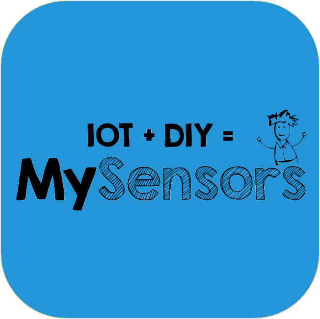

# Hausautomationsprotokoll

>**IMPORTANT**

>Hier haben nur Contributor-Plugins ihre Dokumentation. Sie können die Dokumentation der offiziellen Plugins direkt vom Jeedom Market abrufen. Klicken Sie im betreffenden Plugin auf Dokumentation.
>Sie können sehen [hier](https://market.jeedom.com/index.php?v=d&p=market&type=plugin&categorie=automation+protocol) Alle offiziellen Plugins in dieser Kategorie

| | | | |
|--- | --- | --- | ---|
||Abeille|Plugin Abeille pour la passerelle Zigate (https://zigate.fr).|[Dokumentation](http://kiwihc16.free.fr/) - [Markt](https://market.jeedom.com/index.php?v=d&p=market_display&id=3219)|
||JeeMySensors|Plugin für das mySensors-Protokoll|[Dokumentation](https://totoff974.github.io/jeedom-JeeMySensors/de_DE/) - [Markt](https://market.jeedom.com/index.php?v=d&p=market_display&id=3822)|
||JeePlcBus|Plugin zur Verwaltung des PlcBus-Protokolls|[Dokumentation](https://totoff974.github.io/JeePlcBus/de_DE/) - [Markt](https://market.jeedom.com/index.php?v=d&p=market_display&id=2487)|
||Store|Plugin zum Verwalten von Jalousien|[Dokumentation]() - [Markt](https://market.jeedom.com/index.php?v=d&p=market_display&id=296)|
||AirSend|Plugin zum Senden von Funkbefehlen (433-434Mhz) über das AirSend-Gerät|[Dokumentation](https://devmel.github.io/jeedom_airsend/de_DE/) - [Markt](https://market.jeedom.com/index.php?v=d&p=market_display&id=3611)|
||Boxio|Plugin zur Verwendung des Legrand USB-CPL-Moduls|[Dokumentation](https://apages2.github.io/pluginjeedom-boxio/de_DE/) - [Markt](https://market.jeedom.com/index.php?v=d&p=market_display&id=1335)|
||EIB - KNX|Verbinden Sie Jeedom mit Ihrem KNX-Hausautomationssystem, und Jeedom wird Teil Ihrer Installation|[Dokumentation](http://mika-nt28.github.io/Documentations/eibd/de_DE/) - [Markt](https://market.jeedom.com/index.php?v=d&p=market_display&id=203)|
||Fibaro|Plugin zum Abrufen von Daten aus Fibaro-Boxen und zur Interaktion|[Dokumentation](https://rems02.github.io/fibaro/de_DE/) - [Markt](https://market.jeedom.com/index.php?v=d&p=market_display&id=3588)|
||Globaler Cache|Mit diesem Plugin können Sie alle Global Cache-Geräte mit Jeedom verbinden|[Dokumentation](https://mika-nt28.github.io/Documentations/globalcache/de_DE/) - [Markt](https://market.jeedom.com/index.php?v=d&p=market_display&id=2932)|
||jMQTT|Dieses Plugin verbindet Jeedom mit einem MQTT-Broker wie Mosquitto, um abonnierte Nachrichten abzurufen und eigene Nachrichten zu veröffentlichen. Es unterstützt die automatische Erkennung von Geräten, aber auch deren manuelle Erstellung.|[Dokumentation](https://domotruc.github.io/jMQTT/de_DE/) - [Markt](https://market.jeedom.com/index.php?v=d&p=market_display&id=3166)|
||JeeDore|Tydom Gateway Plugin|[Dokumentation](https://github.com/rezolv-fr/jeedoredaemon-dotnet/blob/master/docs/index.md) - [Markt](https://market.jeedom.com/index.php?v=d&p=market_display&id=3757)|
||Jeedouino|Jeedouino-Plugin zur Verwaltung von Arduino-Karten (über Ethernet oder USB), R.PI-GPIOs, PiFace-Karten (piRack), RPI IO Plus 32e / s-Karten, MCP23017 (auf RPI) oder ESP8266 / NodeMCU / Wemos.|[Dokumentation](https://revlysj.github.io/jeedouino/de_DE/index) - [Markt](https://market.jeedom.com/index.php?v=d&p=market_display&id=2064)|
||Mochad - X10|Plugin zur Verwaltung von X10-Geräten über den Mochad-Daemon und eine CM15-Computerschnittstelle|[Dokumentation](https://mika-nt28.github.io/Documentations/mochad/de_DE/) - [Markt](https://market.jeedom.com/index.php?v=d&p=market_display&id=359)|
||Myhome|Plugin zur Verwendung des Legrand / Bticino Zigbee-Moduls|[Dokumentation](https://apages2.github.io/pluginjeedom-myhome/de_DE/) - [Markt](https://market.jeedom.com/index.php?v=d&p=market_display&id=2445)|
||MyModbus|Plugin zur Verwaltung von Materialien mit dem ModBus-Protokoll|[Dokumentation](https://bebel27a.github.io/jeedom-mymobdus.github.io/de_DE/) - [Markt](https://market.jeedom.com/index.php?v=d&p=market_display&id=3858)|
||Osram Lightify|Plugin zur Steuerung von Osram Lightify-Lampen|[Dokumentation]() - [Markt](https://market.jeedom.com/index.php?v=d&p=market_display&id=2811)|
||RPICT7V1|Plugin zur Verwendung der Karten der RPICT-Serie in HAT für Raspberry Pi auf Jeedom.|[Dokumentation](https://tlierdotfr.github.io/jeedom-plugin-rpict/de_DE/) - [Markt](https://market.jeedom.com/index.php?v=d&p=market_display&id=3637)|
||Tahoma|Plugin zur Verwendung von Tahoma und Connexoon|[Dokumentation](https://github.com/redbug26/jeedom-tahoma/tree/master/doc/de_DE/index.asciidoc) - [Markt](https://market.jeedom.com/index.php?v=d&p=market_display&id=1719)|
||Teleinfo|Plugin zur Verwendung von USB / Serial Telephony Information Modems|[Dokumentation](https://NextDom.github.io/plugin-teleinfo/de_DE/) - [Markt](https://market.jeedom.com/index.php?v=d&p=market_display&id=260)|
||ZiGate|Zigate-Plugin zur Verwendung des Zigate|[Dokumentation](https://jeedom-zigate.github.io/jeedom-plugin-zigate) - [Markt](https://market.jeedom.com/index.php?v=d&p=market_display&id=3186)|
||ZmWebRelay|Plugin zur Verwaltung des ZmWebRelay|[Dokumentation](https://jeedomsteph37.github.io/zmwebrelay/de_DE/) - [Markt](https://market.jeedom.com/index.php?v=d&p=market_display&id=3417)|
