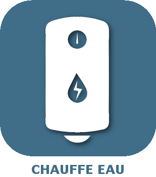

# Automatisme

>**Wichtig**
>Hier haben nur Contributor-Plugins ihre Dokumentation. Sie können die Dokumentation der offiziellen Plugins direkt vom Jeedom Market abrufen. Klicken Sie im betreffenden Plugin auf Dokumentation.
>Sie können sehen [hier](https://market.jeedom.com/index.php?v=d&p=market&type=plugin&categorie=automatisation) Alle offiziellen Plugins in dieser Kategorie

| | | | |
|--- | --- | --- | ---|
||Warmwasserbereiter-Management|Dieses Plugin verwaltet das Ein- und Ausschalten unseres Warmwasserbereiters in Abhängigkeit von der Wassertemperatur und / oder der Warmwasserverfügbarkeitszeit|[Dokumentation Stall](https://mika-nt28.github.io/Documentations/ChauffeEau/de_DE/) [Markt](https://market.jeedom.com/index.php?v=d&p=market_display&id=2671) [Änderungsprotokoll stabil](https://mika-nt28.github.io/Documentations/ChauffeEau/de_DE/changelog)|
||Lichtgruppe|Mit der Lichtgruppe können Sie alle Ihre Lichter verwalten. Das Plugin bietet Ihnen die Möglichkeit, Ihre Lichter zu gruppieren, die verschiedenen Werte zu homogenisieren und bietet vorgefertigte Automatisierungen.|[Dokumentation Stall](https://hbedek.github.io/Jeedom_docs/docs/LightGroup/de_DE/) - [Beta-Dokumentation](https://hbedek.github.io/Jeedom_docs/docs/LightGroup/de_DE/) [Markt](https://market.jeedom.com/index.php?v=d&p=market_display&id=4193) [Änderungsprotokoll stabil](https://hbedek.github.io/Jeedom_docs/docs/LightGroup/de_DE/changelog) - [Changelog Beta](https://hbedek.github.io/Jeedom_docs/docs/LightGroup/de_DE/changelog)|
||Verschlussmanagement|Dieses Plugin verwaltet das Öffnen und Schließen unserer Fensterläden|[Dokumentation Stall](https://mika-nt28.github.io/Documentations/Volets/de_DE/) [Markt](https://market.jeedom.com/index.php?v=d&p=market_display&id=2612) [Änderungsprotokoll stabil](https://mika-nt28.github.io/Documentations/Volets/de_DE/changelog)|
||Automatische Bewässerung||[Dokumentation Stall](https://mika-nt28.github.io/Documentations/arrosageAuto/de_DE/) [Markt](https://market.jeedom.com/index.php?v=d&p=market_display&id=2903) [Änderungsprotokoll stabil](https://mika-nt28.github.io/Documentations/arrosageAuto/de_DE/changelog)|
||jeezviz|Plugin zur Steuerung von EZVIZ-Kameras und Bildtelefonen|[Dokumentation Stall](https://famille-ozaer.github.io/jeezviz/de_DE/index.md) [Markt](https://market.jeedom.com/index.php?v=d&p=market_display&id=4063) [Änderungsprotokoll stabil](https://famille-ozaer.github.io/jeezviz/de_DE/changelog.html)|
||Reihenfolge der Aktionen|Plugin zum Verwalten von sequenzierten Aktionen und komplexen Triggern|[Dokumentation Stall](https://agp42.github.io/sequencing/de_DE/) [Markt](https://market.jeedom.com/index.php?v=d&p=market_display&id=3982) [Änderungsprotokoll stabil](https://agp42.github.io/sequencing/de_DE/changelog)|
||Schaltassistent|Plugin zur Unterstützung der Bedienung von Schaltern|[Dokumentation Stall](https://ktn001.github.io/de_DE/swassist/index.html) [Markt](https://market.jeedom.com/index.php?v=d&p=market_display&id=4170) [Änderungsprotokoll stabil](https://ktn001.github.io/de_DE/swassist/changelog.html)|
||Proportionalkomponente|Dieses Plugin verwaltet das Öffnen und proportionale Schließen unserer Fensterläden|[Dokumentation Stall](https://mika-nt28.github.io/Documentations/voletProp/de_DE/) [Markt](https://market.jeedom.com/index.php?v=d&p=market_display&id=3229) [Änderungsprotokoll stabil](https://mika-nt28.github.io/Documentations/voletProp/de_DE/changelog)|
