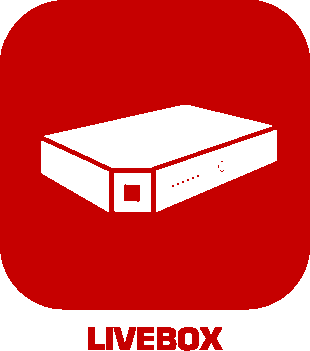

# Communication

>**Wichtig**
>Hier haben nur Contributor-Plugins ihre Dokumentation. Sie können die Dokumentation der offiziellen Plugins direkt vom Jeedom Market abrufen. Klicken Sie im betreffenden Plugin auf Dokumentation.
>Sie können sehen [hier](https://market.jeedom.com/index.php?v=d&p=market&type=plugin&categorie=communication) Alle offiziellen Plugins in dieser Kategorie

| | | | |
|--- | --- | --- | ---|
||TaskerAutoRemote|Plugin zum Senden von Nachrichten und Benachrichtigungen an jedes Android-Gerät über AutoRemote|[Dokumentation Stall](https://agp42.github.io/Jeedom-TaskerAutoremote/fr_FR) [Markt](https://market.jeedom.com/index.php?v=d&p=market_display&id=3795) [Änderungsprotokoll stabil](https://agp42.github.io/Jeedom-TaskerAutoremote/de_DE/changelog)|
||SIP-Client|Verbinden Sie Jeedom mit Ihrem SIP-Netzwerk|[Dokumentation Stall](https://mika-nt28.github.io/Documentations/clientSIP/de_DE/) [Markt](https://market.jeedom.com/index.php?v=d&p=market_display&id=3038) [Änderungsprotokoll stabil](https://mika-nt28.github.io/Documentations/clientSIP/de_DE/changelog)|
||Discord-Link|Mit dem Discord Link-Plugin können Sie Nachrichten an Ihren Discord-Server senden : - Klassische Nachrichten – Erweiterte Nachrichten – TTS-Nachrichten – Kanalverwaltung (Wohnzimmer) – ASK-Funktionsfunktion – Senden von Dateien – Kompatibel mit Jeedom-Interaktionen – Jeedom-Daemon-Statusfunktion – Jeedom-Plugin-Abhängigkeitsstatusfunktion – Zusammenfassungsstatusfunktion insgesamt.|[Dokumentation Stall](https://domotechdiscord.github.io/Docs/discordlink/de_DE/) [Markt](https://market.jeedom.com/index.php?v=d&p=market_display&id=3938) [Änderungsprotokoll stabil](https://domotechdiscord.github.io/Docs/discordlink/de_DE/changelog)|
||Elevenlabs TTS|Ermöglicht die Nutzung des twentylabs TTS|[Dokumentation Stall](https://github.com/kenin/jeedom-tts-elevenlabs/blob/main/docs/de_DE/index.md) - [Beta-Dokumentation](https://github.com/kenin/jeedom-tts-elevenlabs/blob/beta/docs/de_DE/index.md) [Markt](https://market.jeedom.com/index.php?v=d&p=market_display&id=4442) [Änderungsprotokoll stabil](https://github.com/kenin/jeedom-tts-elevenlabs/blob/main/docs/de_DE/changelog.md) - [Änderungsprotokoll Beta](https://github.com/kenin/jeedom-tts-elevenlabs/blob/beta/docs/de_DE/changelog.md)|
||Gotify|Plugin, das die Verbindung zu einem Gotify-Server ermöglicht. Gotify ist eine selbst gehostete, kostenlose Open Source-Lösung zum Senden und Empfangen von Nachrichten. Plus d'info sur https://gotify.net/|[Dokumentation Stall](https://mips2648.github.io/jeedom-plugins-docs/gotify/de_DE/) [Markt](https://market.jeedom.com/index.php?v=d&p=market_display&id=3774) [Änderungsprotokoll stabil](https://mips2648.github.io/jeedom-plugins-docs/gotify/de_DE/changelog)|
||Homebridge|Plugin für Homebridge. Apple HomeKit-Gateway für Jeedom. Steuerung bestimmter Jeedom-Geräte durch Siri und über die Anwendung Maison et Eve.|[Dokumentation Stall](https://nebzhb.github.io/jeedom_docs/plugins/homebridge/de_DE/) - [Beta-Dokumentation](https://nebzhb.github.io/jeedom_docs/plugins/homebridge/de_DE/index-beta) [Markt](https://market.jeedom.com/index.php?v=d&p=market_display&id=2983) [Änderungsprotokoll stabil](https://nebzhb.github.io/jeedom_docs/plugins/homebridge/de_DE/changelog) - [Änderungsprotokoll Beta](https://nebzhb.github.io/jeedom_docs/plugins/homebridge/de_DE/changelog)|
||Info & Lage|Verwaltung der Anwesenheit, Geolokalisierung und anderer Informationen eines Telefons|[Dokumentation Stall](https://Jeremie-C.github.io/plugin-infoloc/de_DE/index) [Markt](https://market.jeedom.com/index.php?v=d&p=market_display&id=4020) [Änderungsprotokoll stabil](https://Jeremie-C.github.io/plugin-infoloc/de_DE/changelog)|
||Informe|Mit diesem Plugin können Sie Ihre Szenarien vereinfachen. Pour informer un utilisateur, il suffira de demander « Informiert Sigalou que la porte du frigo est ouverte » Tatsächlich weiß das Plugin dauerhaft, wo Sigalou ist (In seinem Auto, zu Hause, draußen, …), er weiß, in welchem Zeitfenster wir uns befinden (Tag, Nacht, …) und es können mehrere Prioritätsstufen definiert werden (z : Informieren, benachrichtigen, warnen, …) Diese Informationen werden nicht alle von Informe verwaltet, aber Informe ruft sie von anderen Plugins ab (Standort, Blea, Jeemate, Präsenz, Alarm usw.))|[Dokumentation Stall](http://jeedom.sigalou-domotique.fr/plugin-informe-documentation/) [Markt](https://market.jeedom.com/index.php?v=d&p=market_display&id=4210) [Änderungsprotokoll stabil](http://jeedom.sigalou-domotique.fr/plugin-informe-changelog-todo-list)|
||Ios Icloud|Plugin zum Abrufen von Informationen aus einem iCloud-Konto, sodass Sie den Standort abrufen und einen Ton abspielen können...|[Dokumentation Stall](https://zyg0m4t1k.github.io/ioscloud/de_DE/) [Markt](https://market.jeedom.com/index.php?v=d&p=market_display&id=3131) [Änderungsprotokoll stabil](https://zyg0m4t1k.github.io/ioscloud/de_DE/changelog)|
||JeeMate|JeeMate ist eine mobile Anwendung, die für Android- und wearOS-Geräte (Play Store), iOS (Apple Store) und Windows (Microsoft Store) verfügbar ist). Contrôlez facilement votre maison intelligente grâce à son interface intuitive et customisable. JeeMate est compatible avec de nombreux plugins Jeedom automatiquement. Ce plugin vous permet de lier l'application mobile à votre Jeedom. JeeMate utilise les types génériques de Jeedom. Notifications, géolocalisation, TTS, planificateur de scénario, etc... JeeMate vous apporte tout dans une seule application.   Le plugin inclut la synchronisation avec Google Fit: Erstellen Sie Ihre Ausrüstung und rufen Sie Ihre Gesundheitsdaten ab.|[Dokumentation Stall](https://docs.jeemate.fr/fr/home) - [Beta-Dokumentation](https://docs.jeemate.fr/fr/home) [Markt](https://market.jeedom.com/index.php?v=d&p=market_display&id=4113) [Änderungsprotokoll stabil](https://docs.jeemate.fr/fr/changelog/plugin) - [Änderungsprotokoll Beta](https://docs.jeemate.fr/fr/changelog/plugin)|
||jeeRhasspy|Plugin zur Unterstützung des Rhasspy-Sprachassistenten in Jeedom.|[Dokumentation Stall](https://kiboost.github.io/jeedom_docs/plugins/jeerhasspy/de_DE/) [Markt](https://market.jeedom.com/index.php?v=d&p=market_display&id=3869) [Änderungsprotokoll stabil](https://kiboost.github.io/jeedom_docs/plugins/jeerhasspy/de_DE/changelog.html)|
||Linksys|Informationen und Steuerung Ihrer Linksys-Router.|[Dokumentation Stall](https://mips2648.github.io/jeedom-plugins-docs/linksys/de_DE/) - [Beta-Dokumentation](https://mips2648.github.io/jeedom-plugins-docs/linksys/de_DE/) [Markt](https://market.jeedom.com/index.php?v=d&p=market_display&id=4090) [Änderungsprotokoll stabil](https://mips2648.github.io/jeedom-plugins-docs/linksys/de_DE/changelog) - [Änderungsprotokoll Beta](https://mips2648.github.io/jeedom-plugins-docs/linksys/de_DE/changelog)|
||Livebox|Plugin für Livebox 2, Play, 4, Fiber, 6, 7|[Dokumentation Stall](https://jmvedrine.github.io/plugin-livebox/de_DE/) - [Beta-Dokumentation](https://github.com/jmvedrine/plugin-livebox/blob/beta/docs/de_DE/index.md) [Markt](https://market.jeedom.com/index.php?v=d&p=market_display&id=1076) [Änderungsprotokoll stabil](https://jmvedrine.github.io/plugin-livebox/de_DE/changelog) - [Änderungsprotokoll Beta](https://raw.githubusercontent.com/jmvedrine/plugin-livebox/beta/docs/de_DE/changelog.md)|
||Warteschlangenbenachrichtigung|Plugin, mit dem Benachrichtigungsbefehle (Befehl vom Typ Aktion/Nachricht) erstellt werden können, die sich wie eine Warteschlange verhalten und nur Benachrichtigungen liefern (die in ihrer jeweiligen Warteschlange gesendet werden), wenn eine Bedingung erfüllt ist. Dadurch ist es auch möglich, Duplikate und (Nicht-)Wiederholungen von Nachrichten zu verwalten.|[Dokumentation Stall](https://mips2648.github.io/jeedom-plugins-docs/notificationqueue/de_DE/) - [Beta-Dokumentation](https://mips2648.github.io/jeedom-plugins-docs/notificationqueue/de_DE/) [Markt](https://market.jeedom.com/index.php?v=d&p=market_display&id=3823) [Änderungsprotokoll stabil](https://mips2648.github.io/jeedom-plugins-docs/notificationqueue/de_DE/changelog) - [Änderungsprotokoll Beta](https://mips2648.github.io/jeedom-plugins-docs/notificationqueue/de_DE/changelog)|
||Rocket.chat|Plugin, das die Verbindung zu einem Rocket.chat-Server ermöglicht. Rakete.chat ist eine kollaborative Messaging-Plattform (slack type, HipChat...)|[Dokumentation Stall](https://mips2648.github.io/jeedom-plugins-docs/rocketchat/de_DE/) - [Beta-Dokumentation](https://mips2648.github.io/jeedom-plugins-docs/rocketchat/de_DE/) [Markt](https://market.jeedom.com/index.php?v=d&p=market_display&id=3902) [Änderungsprotokoll stabil](https://mips2648.github.io/jeedom-plugins-docs/rocketchat/de_DE/changelog) - [Änderungsprotokoll Beta](https://mips2648.github.io/jeedom-plugins-docs/rocketchat/de_DE/changelog)|
