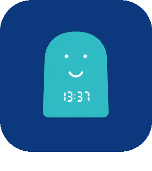
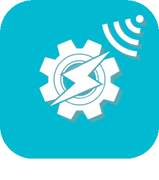
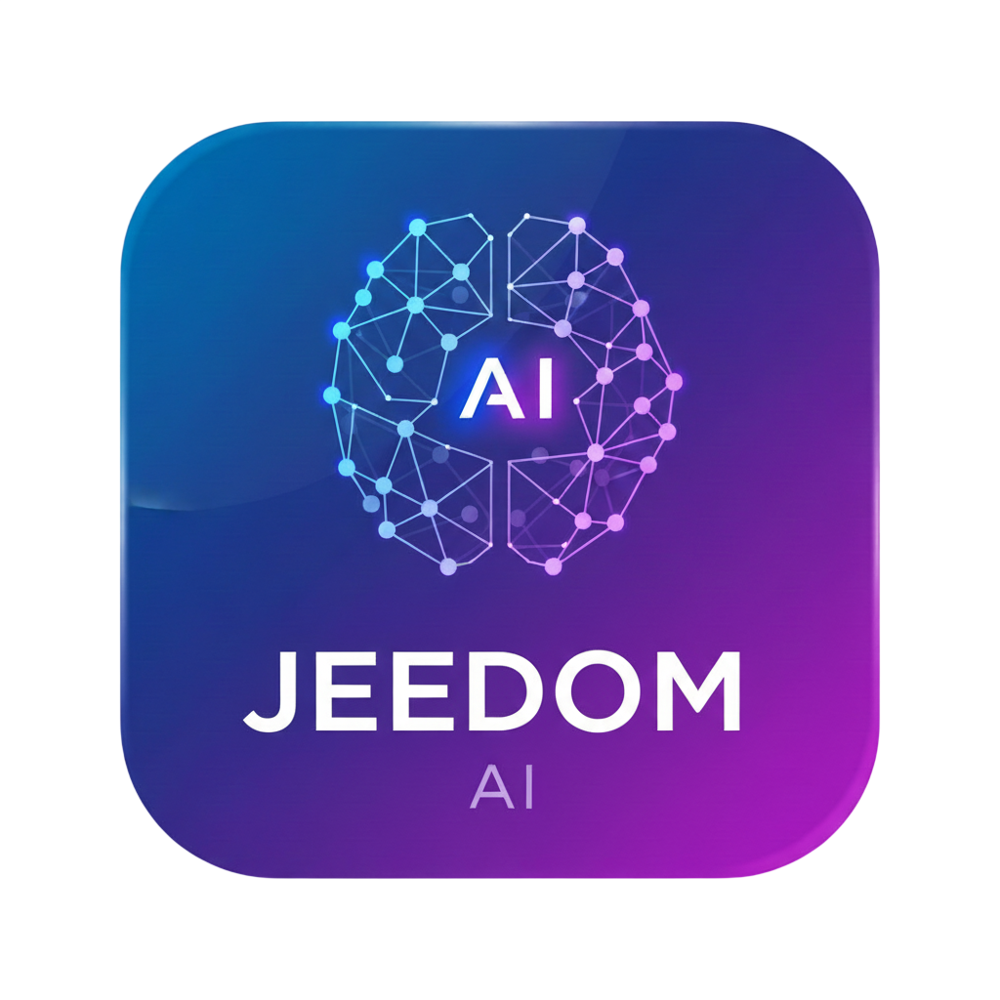
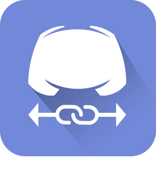
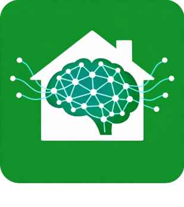
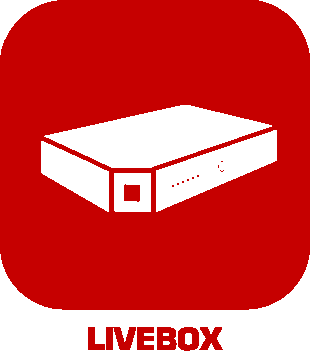
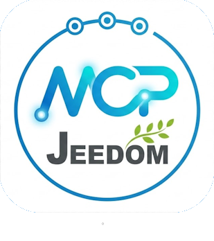

# Communication

>****
>. . .
>  

| | | | |
|--- | --- | --- | ---|
||JeeRemi|. : . .|]()  |
||TaskerAutoRemote||](https://agp42.github.io/Jeedom-TaskerAutoremote/fr_FR)  |
||| : - **** : . - **** : . - **)** : ).|](https://limad.github.io/plugins-docs/plugin-ai_assistant/fr_FR) -    - |
||Jeedom-AI|.|](https://yoann81.github.io/ai_connector_docs/index)  |
|||[|](http://jeedom.sigalou-domotique.fr/alexa-api-documentation)  |
||||](https://limad.github.io/plugins-docs/plugin-alexaapiv2/de_DE/) -    - |
||||](https://mika-nt28.github.io/Documentations/clientSIP/de_DE/)  |
||| : - .|](https://domotechdiscord.github.io/Docs/discordlink/de_DE/)  |
||||](https://github.com/kenin/jeedom-tts-elevenlabs/blob/main/docs/de_DE/index.md) -    - |
||||](https://dpi-automation.github.io/gestionmsgDocs/de_DE/) -    - |
||Gotify|. . Plus d'info sur https://gotify.net/|](https://mips2648.github.io/jeedom-plugins-docs/gotify/de_DE/)  |
||Homebridge|. . .|](https://nebzhb.github.io/jeedom_docs/plugins/homebridge/de_DE/) -    - |
||||](https://Jeremie-C.github.io/plugin-infoloc/de_DE/index)  |
||Informe|. Pour informer un utilisateur, il suffira de demander «  Sigalou que la porte du frigo est ouverte »  : ) )|](http://jeedom.sigalou-domotique.fr/plugin-informe-documentation/)  |
|||...|](https://zyg0m4t1k.github.io/plugins/ioscloud/)  |
||JeedomMCP|.|](https://github.com/clement-cunin/JeedomMCP/blob/main/docs/)  |
||JeeMate|). Contrôlez facilement votre maison intelligente grâce à son interface intuitive, customisable et l'IA.  est compatible avec de nombreux plugins Jeedom automatiquement. Ce plugin vous permet de lier l'application mobile à votre Jeedom.  utilise les types génériques de Jeedom. Notifications, géolocalisation, TTS, Intelligence artificielle, planificateur de scénario, etc...  vous apporte tout dans une seule application.   Le plugin inclut la synchronisation avec Google Fit: .|](https://docs.jeemate.fr/fr/home) -    - |
||jeeRhasspy|.|](https://kiboost.github.io/jeedom_docs/plugins/jeerhasspy/de_DE/)  |
||Linksys|.|](https://mips2648.github.io/jeedom-plugins-docs/linksys/de_DE/) -    - |
||Livebox||](https://jmvedrine.github.io/plugin-livebox/de_DE/) -    - |
|||). . Vous pouvez également utiliser le plugin « AI Assistant » pour contrôler le MCP directement depuis Jeedom, avec l'IA de votre choix.|](https://limad.github.io/plugins-docs/plugin-mcp_jeedom/fr_FR) -    - |
|||. .|](https://mips2648.github.io/jeedom-plugins-docs/notificationqueue/de_DE/) -    - |
|||....)|](https://mips2648.github.io/jeedom-plugins-docs/rocketchat/de_DE/) -    - |
