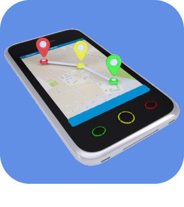

# Verbundene Objekte

>**Wichtig**
>Hier haben nur Contributor-Plugins ihre Dokumentation. Sie können die Dokumentation der offiziellen Plugins direkt vom Jeedom Market abrufen. Klicken Sie im betreffenden Plugin auf Dokumentation.
>Sie können sehen [hier](https://market.jeedom.com/index.php?v=d&p=market&type=plugin&categorie=devicecommunication) Alle offiziellen Plugins in dieser Kategorie

| | | | |
|--- | --- | --- | ---|
||Bosch Indego|Plugin für Bosch Indego Roboter-Rasenmäher|[Dokumentation Stall](https://jpty.github.io/jeedom/plugins/BoschIndego/de_DE/index.html) [Markt](https://market.jeedom.com/index.php?v=d&p=market_display&id=3937) [Änderungsprotokoll stabil](https://jpty.github.io/jeedom/plugins/BoschIndego/de_DE/changelog.html)|
||Mercedes Me|Plugin arrété car Mercedes arrête l'API BYOC: https://developer.mercedes-benz.com/news/bringyourowncar-sundown Plugin zum Abrufen von Informationen von Ihrem Mercedes.  Basierend auf der offiziellen API.|[Dokumentation Stall](https://mguyard.github.io/Jeedom-Documentations/de_DE/Mercedes_me/documentation) - [Beta-Dokumentation](https://mguyard.github.io/Jeedom-Documentations/de_DE/Mercedes_me/documentation) [Markt](https://market.jeedom.com/index.php?v=d&p=market_display&id=4046) [Änderungsprotokoll stabil](https://mguyard.github.io/Jeedom-Documentations/de_DE/Mercedes_me/changelog) - [Änderungsprotokoll Beta](https://mguyard.github.io/Jeedom-Documentations/de_DE/Mercedes_me/changelog)|
||MyTado|Mit diesem Plugin können Sie mit Tado verbundene Objekte verwalten. Es bietet auch Zugriff auf das Tado-Wetter.|[Dokumentation Stall](https://doc.jeedom.com/de_DE/plugins/programming/MyTado) - [Beta-Dokumentation](https://doc.jeedom.com/de_DE/plugins/programming/MyTado/beta) [Markt](https://market.jeedom.com/index.php?v=d&p=market_display&id=4502) [Änderungsprotokoll stabil](https://doc.jeedom.com/de_DE/plugins/programming/MyTado/changelog) - [Änderungsprotokoll Beta](https://doc.jeedom.com/de_DE/plugins/programming/MyTado/beta/changelog)|
||AirthingsX|Integration mit der Airthings-API: zeichnet Messungen von Airthings-Geräten für die Luftqualität auf. Attention: erfordert PHP 7.3 und einen selbst zu erstellenden Airthings-API-Schlüssel (der Vorgang ist kostenlos).|[Dokumentation Stall](https://www.xypii.be/projects/jeedom-airthingsx/de_DE/) [Markt](https://market.jeedom.com/index.php?v=d&p=market_display&id=4268) [Änderungsprotokoll stabil]()|
||Alexa-SmartHome|Das Plugin wurde komplett überarbeitet und neu gestaltet, um die von der Alexa-Anwendung erkannten Geräte zu akzeptieren. Die durch die Plugins hergestellte Verbindung zwischen Jeedom und dem Amazon-Server ermöglicht es, den Zustand der Geräte zu verfolgen und ihnen Befehle zu senden. Die Verbindung zwischen dem Amazon-Server (Alexa) und den Geräten wird durch die Fähigkeiten der einzelnen Hersteller (Xiaomi, SmartLife, Tuya, Netatmo, Wemo, Somfy, eWelink usw.) sichergestellt, was die Möglichkeiten völlig endlos macht.|[Dokumentation Stall](http://jeedom.sigalou-domotique.fr/alexa-amazon-smarthome-documentation) [Markt](https://market.jeedom.com/index.php?v=d&p=market_display&id=3914) [Änderungsprotokoll stabil](http://jeedom.sigalou-domotique.fr/alexa-amazon-smarthome-changelog)|
||Arenti|Plugin, mit dem Sie Informationen abrufen und Geräte steuern können, die mit der Arenti-API synchronisiert sind|[Dokumentation Stall](https://flobul-domotique.fr/presentation-et-documentation-du-plugin-arenti-pour-jeedom/) [Markt](https://market.jeedom.com/index.php?v=d&p=market_display&id=4420) [Änderungsprotokoll stabil](https://flobul-domotique.fr/liste-des-versions-du-plugin-arenti-pour-jeedom/)|
||FordCar|Plugin, das diese Verbindung zu Ford Pass ermöglicht und alle Informationen Ihres Fahrzeugs wiederherstellt. Damit können Sie Ihr Fahrzeug verriegeln/entriegeln und, je nach Region der Welt, Ihr Fahrzeug starten.|[Dokumentation Stall](https://cddu33.github.io/fordcar/de_DE/) - [Beta-Dokumentation](https://cddu33.github.io/fordcar/de_DE/) [Markt](https://market.jeedom.com/index.php?v=d&p=market_display&id=4319) [Änderungsprotokoll stabil](https://cddu33.github.io/fordcar/de_DE/changelog) - [Änderungsprotokoll Beta](https://cddu33.github.io/fordcar/de_DE/changelog_beta)|
||Govee|Plugin zur Steuerung von Govee-Geräten (kostenlos seit 07.04.2024))|[Dokumentation Stall](https://youdom.net/plugin-govee-with-youdom/) - [Beta-Dokumentation](https://youdom.net/plugin-govee-with-youdom/) [Markt](https://market.jeedom.com/index.php?v=d&p=market_display&id=4371) [Änderungsprotokoll stabil](https://youdom.net/plugin-govee-changelog/) - [Änderungsprotokoll Beta](https://youdom.net/plugin-govee-changelog/)|
||Home Connect|Plugin zum Abrufen von Informationen von kompatiblen Haushaltsgeräten|[Dokumentation Stall](https://jmvedrine.github.io/homeconnect/de_DE/) [Markt](https://market.jeedom.com/index.php?v=d&p=market_display&id=3894) [Änderungsprotokoll stabil](https://jmvedrine.github.io/homeconnect/de_DE/changelog)|
||Info & Lage|Verwaltung der Anwesenheit, Geolokalisierung und anderer Informationen eines Telefons|[Dokumentation Stall](https://jeremie-c.github.io/plugin-InfoLoc/de_DE/index) [Markt](https://market.jeedom.com/index.php?v=d&p=market_display&id=4020) [Änderungsprotokoll stabil](https://jeremie-c.github.io/plugin-InfoLoc/de_DE/changelog)|
||iopool - EcO|Plugin Jeedom pour collecter les informations de la sonde <a href='https://iopool.com'>iopool Eco aus der iopool Cloud (API). Für weitere Einzelheiten zögern Sie nicht, die sehr vollständige Dokumentation zu konsultieren.|[Dokumentation Stall](https://mguyard.github.io/Jeedom-Documentations/de_DE/iopool_EcO/documentation) - [Beta-Dokumentation](https://mguyard.github.io/Jeedom-Documentations/de_DE/iopool_EcO/documentation) [Markt](https://market.jeedom.com/index.php?v=d&p=market_display&id=4189) [Änderungsprotokoll stabil](https://mguyard.github.io/Jeedom-Documentations/de_DE/iopool_EcO/changelog) - [Änderungsprotokoll Beta](https://mguyard.github.io/Jeedom-Documentations/de_DE/iopool_EcO/changelog)|
||Kia-UVO|KIA-UVO-kompatibles Fahrzeugverwaltungs-Plugin|[Dokumentation Stall](https://neopix.github.io/jeedom-kiauvo-documentation/fr_FR) [Markt](https://market.jeedom.com/index.php?v=d&p=market_display&id=4076) [Änderungsprotokoll stabil](https://neopix.github.io/jeedom-kiauvo-documentation/de_DE/changelog)|
||iRobot|Plugin zur Steuerung von Saugrobotern (Roomba) und Scheuersaugmaschinen (Braava) der Marke iRobot.|[Dokumentation Stall](https://mips2648.github.io/jeedom-plugins-docs/kroomba/de_DE/) - [Beta-Dokumentation](https://mips2648.github.io/jeedom-plugins-docs/kroomba/de_DE/) [Markt](https://market.jeedom.com/index.php?v=d&p=market_display&id=2776) [Änderungsprotokoll stabil](https://mips2648.github.io/jeedom-plugins-docs/kroomba/de_DE/changelog) - [Änderungsprotokoll Beta](https://mips2648.github.io/jeedom-plugins-docs/kroomba/de_DE/changelog)|
||LG Smart Thinq|Plugin für Connected Objects der Marke LG, kompatibel mit „Smart Thinq APIv1“'|[Dokumentation Stall](https://pifou25.github.io/jeedom-lgthinq-plugin/de_DE/) - [Beta-Dokumentation](https://pifou25.github.io/jeedom-lgthinq-plugin/de_DE/index_beta) [Markt](https://market.jeedom.com/index.php?v=d&p=market_display&id=4080) [Änderungsprotokoll stabil](https://pifou25.github.io/jeedom-lgthinq-plugin/de_DE/changelog) - [Änderungsprotokoll Beta](https://pifou25.github.io/jeedom-lgthinq-plugin/de_DE/changelog_beta)|
||LG ThinQ|Plugin zum Abrufen von Informationen und zur Steuerung von Geräten, die mit der LG ThinQ API synchronisiert sind|[Dokumentation Stall](https://flobul-domotique.fr/presentation-et-documentation-du-plugin-lgthinq2-pour-jeedom/) - [Beta-Dokumentation](https://flobul-domotique.fr/presentation-et-documentation-du-plugin-lgthinq2-pour-jeedom/) [Markt](https://market.jeedom.com/index.php?v=d&p=market_display&id=4485) [Änderungsprotokoll stabil](https://flobul-domotique.fr/liste-des-versions-du-plugin-lgthinq2-pour-jeedom/) - [Änderungsprotokoll Beta](https://flobul-domotique.fr/liste-des-versions-du-plugin-lgthinq2-pour-jeedom/)|
||Miele|Plugin zur Einbindung aller Geräte der Miele@Home-Reihe. Es ist möglich, auf Gerätedaten zuzugreifen, sie zu überwachen und bestimmte Aktionen auszuführen (abhängig vom Gerät)|[Dokumentation Stall](https://mips2648.github.io/jeedom-plugins-docs/miele/de_DE/) - [Beta-Dokumentation](https://mips2648.github.io/jeedom-plugins-docs/miele/de_DE/) [Markt](https://market.jeedom.com/index.php?v=d&p=market_display&id=3950) [Änderungsprotokoll stabil](https://mips2648.github.io/jeedom-plugins-docs/miele/de_DE/changelog) - [Änderungsprotokoll Beta](https://mips2648.github.io/jeedom-plugins-docs/miele/de_DE/changelog)|
||Netatmo Pro|Integration des Netatmo-Universums|[Dokumentation Stall](https://thanaus.github.io/jeedom_docs/plugins/netatmopro/de_DE/) - [Beta-Dokumentation](https://thanaus.github.io/jeedom_docs/plugins/netatmopro/de_DE/) [Markt](https://market.jeedom.com/index.php?v=d&p=market_display&id=2950) [Änderungsprotokoll stabil](https://thanaus.github.io/jeedom_docs/plugins/netatmopro/de_DE/changelog) - [Änderungsprotokoll Beta](https://thanaus.github.io/jeedom_docs/plugins/netatmopro/de_DE/changelog)|
||Netro-Bewässerung|Plugin basierend auf dem automatischen Bewässerungssystem Netro Smart Garden|[Dokumentation Stall](https://kcofoni.github.io/jeedom-docs/plugin-netroarrosage/docs/de_DE/) - [Beta-Dokumentation](https://kcofoni.github.io/jeedom-docs/plugin-netroarrosage/docs/de_DE/beta/) [Markt](https://market.jeedom.com/index.php?v=d&p=market_display&id=4354) [Änderungsprotokoll stabil](https://kcofoni.github.io/jeedom-docs/plugin-netroarrosage/docs/de_DE/changelog) - [Änderungsprotokoll Beta](https://kcofoni.github.io/jeedom-docs/plugin-netroarrosage/docs/de_DE/beta/changelog)|
||SmartThings|Mit diesem Plugin können Sie Geräte für jedes in Ihrem SmartThings-Konto identifizierte Gerät erstellen. Die Kommunikation erfolgt nur über die SmartThings-API, es wird keine direkte Verbindung zwischen Jeedom und dem Gerät hergestellt. Die während der Synchronisierung generierten Befehle hängen vom Gerät ab (jedes Gerät stellt seine Befehlsliste bereit), sie hängen auch von den über die API gemeldeten Informationen ab (wenn der Wert 'null' ist, wird der Befehl nicht erstellt, weil er nicht über die API aktualisiert wurde oder nicht verwaltet). Ich habe immer noch eine Option gelassen, um alle Befehle nur für den Fall zu erstellen. Les commandes disponibles varient et peuvent être très nombreuses : Anzeigen des Status des Geräts, seines Programms, Ein-/Ausschalten, Kanalwechsel, Starten eines Programms...  Ich habe ein Widget für die gängigsten Geräte implementiert, für andere können Sie Ihr eigenes erstellen und es teilen.|[Dokumentation Stall](https://flobul-domotique.fr/documentation-du-plugin-smartthings-pour-jeedom) [Markt](https://market.jeedom.com/index.php?v=d&p=market_display&id=4099) [Änderungsprotokoll stabil](https://flobul-domotique.fr/liste-des-versions-du-plugin-smartthings-pour-jeedom/)|
||Sicher PetCare|Plug-In für Sure Petcare verbundene Objekte für Tiere (Sureflap)|[Dokumentation Stall](https://jmvedrine.github.io/jeedom-surepetcare/de_DE/) - [Beta-Dokumentation](https://jmvedrine.github.io/jeedom-surepetcare/de_DE/) [Markt](https://market.jeedom.com/index.php?v=d&p=market_display&id=3718) [Änderungsprotokoll stabil](https://jmvedrine.github.io/jeedom-surepetcare/de_DE/changelog) - [Änderungsprotokoll Beta](https://raw.githubusercontent.com/jmvedrine/jeedom-surepetcare/beta/docs/de_DE/changelog.md)|
||Switchbotcloud|Mit diesem Plugin können Sie Switchbot-Geräte über Jeedom steuern.|[Dokumentation Stall](https://jeremyarnoux.github.io/jeedom/plugins/switchbotcloud/index.html) [Markt](https://market.jeedom.com/index.php?v=d&p=market_display&id=4369) [Änderungsprotokoll stabil](https://jeremyarnoux.github.io/jeedom/plugins/switchbotcloud/changelog.html)|
||Tesla|Hier ist das Plugin zur Überwachung Ihrer Tesla(s) ! Greifen Sie von Jeedom aus auf Ihren Tesla zu und steuern Sie Heizung, Ladevorgänge, Fenster usw. über Szenarien.  Dieses Plugin enthält auch ein Tracking-Tool, mit dem Sie den Verlauf Ihrer Fahrten, Gebühren und Parkzeiten verfolgen können.  Finden Sie die Statistiken der durchgeführten Fahrten. Legen Sie auf der Karte Favoriten mit einer Reichweite fest und lösen Sie Szenarien aus, wenn Ihr Tesla diesen Favoriten betritt oder verlässt, ...   Machen Sie Ihren Tesla zu einem vernetzten Objekt !  Keine Cloud, Ihre Daten werden zu Hause gespeichert. Kein Abo, keine Zusatzkosten|[Dokumentation Stall](http://tesla.jeedom.free.fr/documentation) - [Beta-Dokumentation](http://tesla.jeedom.free.fr/documentation) [Markt](https://market.jeedom.com/index.php?v=d&p=market_display&id=3486) [Änderungsprotokoll stabil](http://tesla.jeedom.free.fr/changelog) - [Änderungsprotokoll Beta](http://tesla.jeedom.free.fr/changelog)|
||Velux|Plugin zur Koordinierung der Bewegungen eines Fensters und eines Velux-Rollladens.   Bitte beachten Sie, dass dieses Plugin das hkControl-Plugin erfordert!|[Dokumentation Stall](https://ktn001.github.io/de_DE/velux/) - [Beta-Dokumentation](https://ktn001.github.io/de_DE/velux/beta.html) [Markt](https://market.jeedom.com/index.php?v=d&p=market_display&id=4453) [Änderungsprotokoll stabil](https://ktn001.github.io/de_DE/velux/changelog) - [Änderungsprotokoll Beta](https://ktn001.github.io/de_DE/velux/changelog)|
||VeSync|Plugin zum Abrufen von Informationen und Steuern synchronisierter Geräte über die VeSync-API|[Dokumentation Stall](https://flobul-domotique.fr/presentation-et-documentation-du-plugin-vesync-pour-jeedom/) - [Beta-Dokumentation](https://flobul-domotique.fr/presentation-et-documentation-du-plugin-vesync-pour-jeedom/) [Markt](https://market.jeedom.com/index.php?v=d&p=market_display&id=4362) [Änderungsprotokoll stabil](https://flobul-domotique.fr/liste-des-versions-du-plugin-vesync-pour-jeedom/) - [Änderungsprotokoll Beta](https://flobul-domotique.fr/liste-des-versions-du-plugin-vesync-pour-jeedom/)|
||Wall|Plugin für die Tablet-Verwaltung|[Dokumentation Stall](https://barre35.github.io/jeedom-plugin-doc/de_DE/wall_documentation) [Markt](https://market.jeedom.com/index.php?v=d&p=market_display&id=3634) [Änderungsprotokoll stabil](https://barre35.github.io/jeedom-plugin-doc/de_DE/wall_changelog)|
||wifilightV2|Pilote de nombreux périphériques wifi en local avec internet coupé : lampes, leds, prises, interrupteurs, thermostat, de marques diverses. Tapo, Kasa, Govee, Philips Wiz, Meross, Mystrom, MagicHome, Gateway Tuya/Zigbee einschließlich SilverCrest Lidl, Smartlife, Tuya, Ewelink, Sonoff, Sonoff DIY, Mi.Light (Milight), Yeelight, Xiaomi Philips, TP-Link, Nanoleaf, H801, iHomma, Arilux, Revogi usw. Consulter la documentation pour connaitre la liste exacte des matériels compatibles.|[Dokumentation Stall](https://bcaro.github.io/wifilightV2-doc/de_DE/) - [Beta-Dokumentation](https://bcaro.github.io/wifilightV2-doc/de_DE/) [Markt](https://market.jeedom.com/index.php?v=d&p=market_display&id=2793) [Änderungsprotokoll stabil](https://bcaro.github.io/wifilightV2-doc/de_DE/changelog) - [Änderungsprotokoll Beta](https://bcaro.github.io/wifilightV2-doc/de_DE/changelog)|
||worxLandroidS|Jeedom Plugin für Worx Landroid Robotermäher Modelle S / M / L Cloud Version|[Dokumentation Stall](https://mips2648.github.io/jeedom-plugins-docs/worxLandroidS/de_DE/) - [Beta-Dokumentation](https://mips2648.github.io/jeedom-plugins-docs/worxLandroidS/de_DE/) [Markt](https://market.jeedom.com/index.php?v=d&p=market_display&id=3396) [Änderungsprotokoll stabil](https://mips2648.github.io/jeedom-plugins-docs/worxLandroidS/de_DE/changelog) - [Änderungsprotokoll Beta](https://mips2648.github.io/jeedom-plugins-docs/worxLandroidS/de_DE/changelog)|
