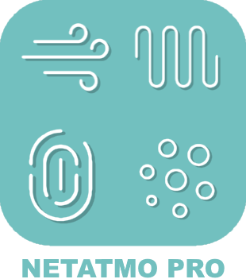
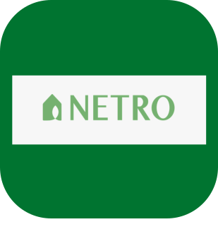
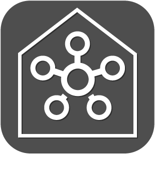

# 

>****
>. . .
>  

| | | | |
|--- | --- | --- | ---|
||||  |
|||. .| -    - |
|| BLE|Ce plugin permet de piloter la charge et la clim de vos véhicules tesla en utilisant un ProxyBLE (installé sur un Raspberry Pi Zero W par exemple) proche du véhicule => https://github.com/wimaha/TeslaBleHttpProxy| -    - |
||Mercedes Me|Plugin arrété car Mercedes arrête l'API BYOC: https://developer.mercedes-benz.com/news/bringyourowncar-sundown .  .| -    - |
||MyTado|X. .| -    - |
|| BLE|Ce plugin permet de piloter la charge et la clim de vos véhicules tesla en utilisant un ProxyBLE (installé sur un Raspberry Pi Zero W par exemple) proche du véhicule => https://github.com/wimaha/TeslaBleHttpProxy| -    - |
||AirthingsX|: . Attention: .).|  |
|||. . .|  |
||Arenti||  |
||| : . . . .|  |
||FordCar|. .| -    - |
||Govee|)| -    - |
||Heatzy| ...). . | -    - |
||||  |
||||  |
||iopool - EcO|Plugin Jeedom pour collecter les informations de la sonde <a href='https://iopool.). .| -    - |
||Kia-UVO||  |
||iRobot|.| -    - |
|||'| -    - |
||||  |
||Miele|. )| -    - |
||myToyota|: | -    - |
||MyOkoTouch|.| -    - |
|||) : )|  |
|||| -    - |
|||| -    - |
||openHASP||   - |
||SmartThings|. . ). . Les commandes disponibles varient et peuvent être très nombreuses : .| -    - |
|||)| -    - |
||Switchbot||  |
||Switchbotcloud|.|  |
||Tesla| ! .  .  . , ...    !  . | -    - |
||Velux|.   !| -    - |
||VeSync|| -    - |
||Wall||  |
||wifilightV2| : . . .| -    - |
||WLED|Plugin Jeedom servant à contrôler le pilote de led adressables WLED (voir https://github.com/Aircoookie/WLED et https://github.com/Aircoookie/WLED/wiki)| -    - |
||worxLandroidS|| -    - |
