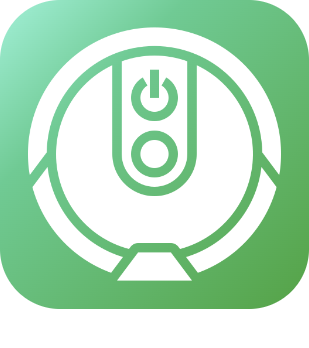

# Verbundene Objekte

>**Wichtig**
>Hier haben nur Contributor-Plugins ihre Dokumentation. Sie können die Dokumentation der offiziellen Plugins direkt vom Jeedom Market abrufen. Klicken Sie im betreffenden Plugin auf Dokumentation.
>Sie können sehen [hier](https://market.jeedom.com/index.php?v=d&p=market&type=plugin&categorie=devicecommunication) Alle offiziellen Plugins in dieser Kategorie

| | | | |
|--- | --- | --- | ---|
||Bosch Indego|Plugin für Bosch Indego Roboter-Rasenmäher| [Markt](https://market.jeedom.com/index.php?v=d&p=market_display&id=3937)|
||Home Connect|Plugin zum Abrufen von Informationen von kompatiblen Haushaltsgeräten| [Markt](https://market.jeedom.com/index.php?v=d&p=market_display&id=3894)|
||Info & Lage|Verwaltung der Anwesenheit, Geolokalisierung und anderer Informationen eines Telefons| [Markt](https://market.jeedom.com/index.php?v=d&p=market_display&id=4020)|
||K Roomba|Plugin zur Steuerung von Roomba-Staubsaugern| [Markt](https://market.jeedom.com/index.php?v=d&p=market_display&id=2776)|
||Sicher PetCare|Plug-In für Sure Petcare verbundene Objekte für Tiere (Sureflap)| [Markt](https://market.jeedom.com/index.php?v=d&p=market_display&id=3718)|
||wifilightV2|Pilote de nombreux périphériques wifi en local avec internet coupé : lampes, leds, prises, interrupteurs, thermostat, de marques diverses. Tapo, Kasa, Govee, Philips Wiz, Meross, Mystrom, MagicHome, Gateway Tuya/Zigbee dont SilverCrest Lidl, Smartlife, Tuya, Ewelink, Sonoff, Sonoff DIY, Mi.Light (Milight), Yeelight, Xiaomi Philips, TP-Link, Nanoleaf, H801, iHomma, arilux, Revogi, etc. Consulter la documentation pour connaitre la liste exacte des matériels compatibles.| [Markt](https://market.jeedom.com/index.php?v=d&p=market_display&id=2793)|
||worxLandroidS|Jeedom Plugin für Worx Landroid Robotermäher Modelle S / M / L Cloud Version| [Markt](https://market.jeedom.com/index.php?v=d&p=market_display&id=3396)|
