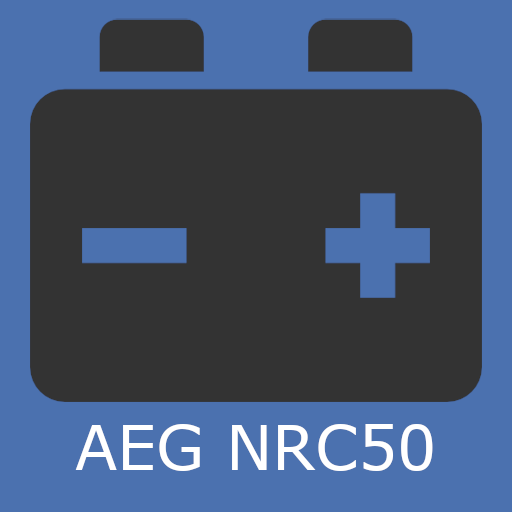
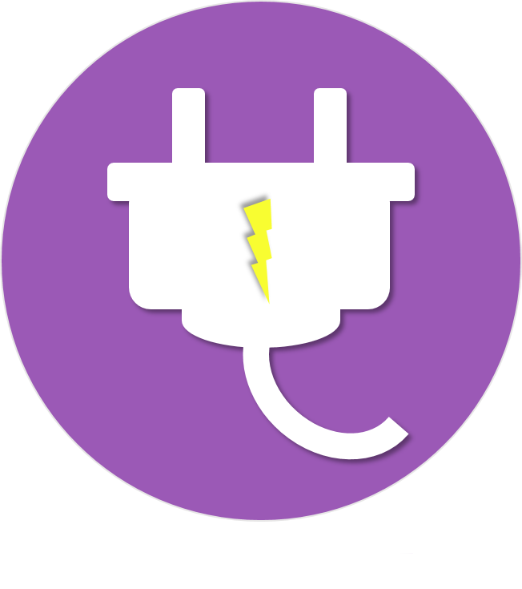

# Energie

>**IMPORTANT**
>Hier haben nur Contributor-Plugins ihre Dokumentation. Sie können die Dokumentation der offiziellen Plugins direkt vom Jeedom Market abrufen. Klicken Sie im betreffenden Plugin auf Dokumentation.
>Sie können sehen [hier](https://market.jeedom.com/index.php?v=d&p=market&type=plugin&categorie=energy) Alle offiziellen Plugins in dieser Kategorie

| | | | |
|--- | --- | --- | ---|
||AEG acmi1000 snmp|Plugin zum Abrufen von Informationen und SNMP-Alarmen von AEG-Netzteilen dank des ACMI1000-Moduls|[Dokumentation](https://linuxnico.github.io/pluginAEGacmi1000/de_DE/) - [Markt](https://market.jeedom.com/index.php?v=d&p=market_display&id=3697)|
||AEG nrc50 snmp|Plugin zum Abrufen von Informationen und SNMP-Alarmen von AEG-Netzteilen dank des nrc50-Moduls|[Dokumentation](https://linuxnico.github.io/pluginAEGnrc50/de_DE/) - [Markt](https://market.jeedom.com/index.php?v=d&p=market_display&id=3719)|
||SunnyPortal|Plugin zur Integration von SunnyPortal-Schnittstellen|[Dokumentation](http://www.domoticadavinci.com/fr/developpement-de-plugins/sunny-web-portal-plugin-pour-jeedom/) - [Markt](https://market.jeedom.com/index.php?v=d&p=market_display&id=3976)|
||Verbrauchsverfolgung|Consumer Monitoring Plugin|[Dokumentation](https://mickeys27.github.io/Docs/conso/de_DE/) - [Markt](https://market.jeedom.com/index.php?v=d&p=market_display&id=1805)|
||Conso Widget Tracking||[Dokumentation](https://trmaud.github.io/SuiviConsoWidget/) - [Markt](https://market.jeedom.com/index.php?v=d&p=market_display&id=3916)|
||Eco-2-Watt|Plugin, das Ecowatt- und EJP-Informationen meldet|[Dokumentation](https://github.com/jeedom/plugin-ecowatt/blob/stable/doc/de_DE/index.asciidoc) - [Markt](https://market.jeedom.com/index.php?v=d&p=market_display&id=1864)|
||eeSmart|Plugin zum Abrufen der Daten, die das ERL D2L-Modul von eeemart an den Monitoring.consopy-Server sendet.|[Dokumentation](https://caelion.github.io/jeedom-plugins-documentation/eeSmart/de_DE/) - [Markt](https://market.jeedom.com/index.php?v=d&p=market_display&id=3933)|
||Enphase|Stellen Sie eine Verbindung zu einem Enphase-Gateway her|[Dokumentation](https://kahowane.github.io/jeedom_enphase) - [Markt](https://market.jeedom.com/index.php?v=d&p=market_display&id=3638)|
||Evohome|EVOHOME Plugin|[Dokumentation](https://ctwins.github.io/evohome4jeedom/fr_FR) - [Markt](https://market.jeedom.com/index.php?v=d&p=market_display&id=3538)|
||ODROID UPS3||[Dokumentation]() - [Markt](https://market.jeedom.com/index.php?v=d&p=market_display&id=3161)|
||Energieerzeugung|Eigenverbrauch ist das Ziel bei der Energieerzeugung. Dieses Plugin hilft Ihnen bei der Steuerung von Aktivierungen|[Dokumentation](http://mika-nt28.github.io/Documentations/prosommateur/fr_FR) - [Markt](https://market.jeedom.com/index.php?v=d&p=market_display&id=3829)|
||REEspaña|Tarifa de la luz por horas von Red Electrica Española|[Dokumentation](https://jeedom.github.io/plugin-template/de_DE/) - [Markt](https://market.jeedom.com/index.php?v=d&p=market_display&id=3651)|
||CO2-Überwachung|Plugin zur Überwachung der CO2-Emissionen in Verbindung mit Strom, Gas, Heizöl oder anderem Verbrauch|[Dokumentation](https://agp42.github.io/suiviCO2/fr_FR) - [Markt](https://market.jeedom.com/index.php?v=d&p=market_display&id=3929)|
||Wifi Smartplug|Plugin zur Steuerung von TpLink-WLAN-Smartplug-Geräten|[Dokumentation]() - [Markt](https://market.jeedom.com/index.php?v=d&p=market_display&id=2898)|
