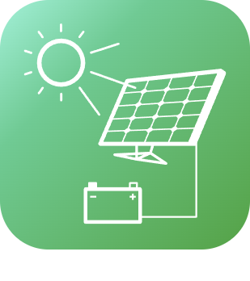
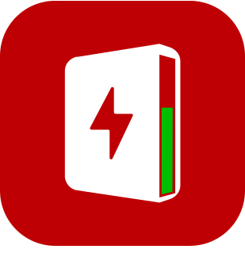

# Energie

>**Wichtig**
>Hier haben nur Contributor-Plugins ihre Dokumentation. Sie können die Dokumentation der offiziellen Plugins direkt vom Jeedom Market abrufen. Klicken Sie im betreffenden Plugin auf Dokumentation.
>Sie können sehen [hier](https://market.jeedom.com/index.php?v=d&p=market&type=plugin&categorie=energy) Alle offiziellen Plugins in dieser Kategorie

| | | | |
|--- | --- | --- | ---|
||EcogazSync|Plugin zur Verbindung mit der Ecogaz-API.|[Dokumentation Stall](https://github.com/impulsio/EcogazSync/blob/main/docs/de_DE/index.md) - [Beta-Dokumentation](https://github.com/impulsio/EcogazSync/blob/beta/docs/de_DE/index.md) [Markt](https://market.jeedom.com/index.php?v=d&p=market_display&id=4347) [Änderungsprotokoll stabil](https://github.com/impulsio/EcogazSync/blob/main/docs/de_DE/changelog.md) - [Änderungsprotokoll Beta](https://github.com/impulsio/EcogazSync/blob/beta/docs/de_DE/changelog.md)|
||Electricity Cost|Présentation du plugin: https://www.youtube.com/watch?v=ZW8eTLZ5hsw Plugin zur Berechnung der Kosten entsprechend ihrem elektrischen Zustand, ihrer Leistung oder ihrem Verbrauch. Für den Kostenvergleich besteht die Möglichkeit, Geräte den Zählergeräten zuzuordnen. Mit „Stromkosten“ können Sie tägliche, wöchentliche, monatliche und jährliche Kosten abrufen.|[Dokumentation Stall](https://hbedek.github.io/Jeedom_docs/docs/ElectricityCost/de_DE/) [Markt](https://market.jeedom.com/index.php?v=d&p=market_display&id=4179) [Änderungsprotokoll stabil](https://hbedek.github.io/Jeedom_docs/docs/ElectricityCost/de_DE/changelog)|
||RteSync|Plugin zur Verbindung mit der RTE-API. Im Moment ist nur die Ecowatt-API verfügbar. Bitte folgen Sie der Dokumentation zur Konfiguration. [Dokumentation](https://github.com/impulsio/RteSync/blob/beta/docs/de_DE/index.md)|[Dokumentation Stall](https://github.com/impulsio/RteSync/blob/main/docs/de_DE/index.md) - [Beta-Dokumentation](https://github.com/impulsio/RteSync/blob/beta/docs/de_DE/index.md) [Markt](https://market.jeedom.com/index.php?v=d&p=market_display&id=4338) [Änderungsprotokoll stabil](https://github.com/impulsio/RteSync/blob/main/docs/de_DE/changelog.md) - [Änderungsprotokoll Beta](https://github.com/impulsio/RteSync/blob/beta/docs/de_DE/changelog.md)|
||SmartMeter P1|Plugin zum Anschluss an ein SmartMeter mit P1-Port|[Dokumentation Stall](https://mips2648.github.io/jeedom-plugins-docs/SmartMeterP1/de_DE/) - [Beta-Dokumentation](https://mips2648.github.io/jeedom-plugins-docs/SmartMeterP1/de_DE/) [Markt](https://market.jeedom.com/index.php?v=d&p=market_display&id=4190) [Änderungsprotokoll stabil](https://mips2648.github.io/jeedom-plugins-docs/SmartMeterP1/de_DE/changelog) - [Änderungsprotokoll Beta](https://mips2648.github.io/jeedom-plugins-docs/SmartMeterP1/de_DE/changelog)|
||APSystems-Steuergerät|Plugin zur Wiederherstellung von Daten von einem APSystems-Steuergerät in Jeedom. Es ruft Informationen über ECU, Mikro-Wechselrichter, erzeugte Leistung pro Modul, Spannungen und Temperaturen ab...|[Dokumentation Stall](https://nchoiset.github.io/jeedom-plugins-doc/aps_ecu/de_DE/index) - [Beta-Dokumentation](https://nchoiset.github.io/jeedom-plugins-doc/aps_ecu/de_DE/beta/index) [Markt](https://market.jeedom.com/index.php?v=d&p=market_display&id=4318) [Änderungsprotokoll stabil](https://nchoiset.github.io/jeedom-plugins-doc/aps_ecu/de_DE/changelog) - [Änderungsprotokoll Beta](https://nchoiset.github.io/jeedom-plugins-doc/aps_ecu/de_DE/beta/changelog)|
||APSEZ1M|Plugin zum Steuern und Abrufen von Informationen von APSystem EZ1-M-Mikrowechselrichtern. Energierückgewinnung nach Panel, insgesamt usw|[Dokumentation Stall](https://taggou91.github.io/jeedom_docs/plugins/aps-ez1m/de_DE/) [Markt](https://market.jeedom.com/index.php?v=d&p=market_display&id=4477) [Änderungsprotokoll stabil](https://taggou91.github.io/jeedom_docs/plugins/aps-ez1m/changelog.html)|
||Autoconsommation|Plugin zum Ein- und Ausschalten anderer Jeedom-Geräte, um den elektrischen Eigenverbrauch zu optimieren (im Falle einer Photovoltaikanlage)|[Dokumentation Stall](https://bwibwi13.github.io/plugin-autoconso/fr_FR) [Markt](https://market.jeedom.com/index.php?v=d&p=market_display&id=4322) [Änderungsprotokoll stabil](https://bwibwi13.github.io/plugin-autoconso/de_DE/changelog)|
||Beem|Plugin zum Abrufen von Beembox-Informationen von Beem Energy|[Dokumentation Stall](https://flobul-domotique.fr/presentation-et-documentation-du-plugin-beem-pour-jeedom/) - [Beta-Dokumentation](https://flobul-domotique.fr/presentation-et-documentation-du-plugin-beem-pour-jeedom/) [Markt](https://market.jeedom.com/index.php?v=d&p=market_display&id=4337) [Änderungsprotokoll stabil](https://flobul-domotique.fr/liste-des-versions-du-plugin-beem-pour-jeedom/) - [Änderungsprotokoll Beta](https://flobul-domotique.fr/liste-des-versions-du-plugin-beem-pour-jeedom/)|
||Gefolgt Conso|Plugin zur Verwaltung seines Energieverbrauchs (Gas, Strom und Wasser) sowie seiner Produktion |[Dokumentation Stall](https://mickeys27.github.io/Docs/conso/de_DE/) [Markt](https://market.jeedom.com/index.php?v=d&p=market_display&id=1805) [Änderungsprotokoll stabil](https://mickeys27.github.io/Docs/conso/de_DE/changelog)|
||EDF-Zeit|Plugin zum Abrufen von EDF-Tempo-Informationen und zur Anzeige der verbleibenden Tage für jede Farbe sowie der Stundentarife außerhalb der Haupt- und Hauptverkehrszeiten.|[Dokumentation Stall](https://github.com/idoexp/jeedom_edf_tempo#edf-tempo-pour-jeedom) [Markt](https://market.jeedom.com/index.php?v=d&p=market_display&id=4432) [Änderungsprotokoll stabil](https://github.com/idoexp/jeedom_edf_tempo#changelog)|
||eeSmart|Plugin zum Abrufen der Daten, die das ERL D2L-Modul von eeemart an den Monitoring.consopy-Server sendet.|[Dokumentation Stall](https://caelion.github.io/jeedom-plugins-documentation/eeSmart/de_DE/) [Markt](https://market.jeedom.com/index.php?v=d&p=market_display&id=3933) [Änderungsprotokoll stabil](https://caelion.github.io/jeedom-plugins-documentation/eeSmart/de_DE/changelog)|
||Emporia Energy|Überwachung des Energieverbrauchs in Echtzeit (Vue Energy Monitor))|[Dokumentation Stall](https://thanaus.github.io/jeedom_docs/plugins/emporiapro/de_DE/) - [Beta-Dokumentation](https://thanaus.github.io/jeedom_docs/plugins/emporiapro/de_DE/) [Markt](https://market.jeedom.com/index.php?v=d&p=market_display&id=4409) [Änderungsprotokoll stabil](https://thanaus.github.io/jeedom_docs/plugins/emporiapro/de_DE/changelog) - [Änderungsprotokoll Beta](https://thanaus.github.io/jeedom_docs/plugins/emporiapro/de_DE/changelog)|
||Enphase Secure|Plugin zur Verbindung mit Enphase-Gateways ab Version V7. Das Plugin ruft den Token automatisch ab und dann lokal auf dem Gateway. Es bleibt lokal, bis das Token abläuft|[Dokumentation Stall](https://cddu33.github.io/enphase_secure/de_DE/index) - [Beta-Dokumentation](https://cddu33.github.io/enphase_secure/de_DE/beta_doc) [Markt](https://market.jeedom.com/index.php?v=d&p=market_display&id=4334) [Änderungsprotokoll stabil](https://cddu33.github.io/enphase_secure/de_DE/changelog) - [Änderungsprotokoll Beta](https://cddu33.github.io/enphase_secure/de_DE/changelog_beta)|
||Fullup|Plugin zum Lesen von Daten von mit Fullup verbundenen Messgeräten. Das Plugin aktualisiert die Daten stündlich über einen Cron.|[Dokumentation Stall](https://mips2648.github.io/jeedom-plugins-docs/fullup/de_DE/) [Markt](https://market.jeedom.com/index.php?v=d&p=market_display&id=3445) [Änderungsprotokoll stabil](https://mips2648.github.io/jeedom-plugins-docs/fullup/de_DE/changelog)|
||GRDF-Verbindung|Rufen Sie Gaszählerinformationen von Ihrem GRDF-Kundenkonto ab .|[Dokumentation Stall](https://limad.github.io/plugins-docs/plugin-grdfConnect/fr_FR) - [Beta-Dokumentation](https://limad.github.io/plugins-docs/plugin-grdfConnect/fr_FR) [Markt](https://market.jeedom.com/index.php?v=d&p=market_display&id=4381) [Änderungsprotokoll stabil](https://limad.github.io/plugins-docs/plugin-grdfConnect/de_DE/changelog) - [Änderungsprotokoll Beta](https://limad.github.io/plugins-docs/plugin-grdfConnect/de_DE/changelog)|
||Hydro Quebec|Plugin zum Abrufen von Stromverbrauchsinformationen von Hydro-Québec (www.hydroquebec.com) und Crons basierend auf Ereignissen erstellen|[Dokumentation Stall](http://fobsoft.github.io/jeedom-plugins-documentation/hydroQuebec/fr_FR) - [Beta-Dokumentation](http://fobsoft.github.io/jeedom-plugins-documentation/hydroQuebec/fr_FR) [Markt](https://market.jeedom.com/index.php?v=d&p=market_display&id=4243) [Änderungsprotokoll stabil](http://fobsoft.github.io/jeedom-plugins-documentation/hydroQuebec/de_DE/changelog) - [Änderungsprotokoll Beta](http://fobsoft.github.io/jeedom-plugins-documentation/hydroQuebec/de_DE/changelog)|
||IoTaWatt|Plugin zum Abrufen von Informationen aus Ihrer IoTaWatt-Box. IoTaWatt ist ein Open-Source-, Open-Hardware-Projekt zur Erstellung eines genauen, kostengünstigen und benutzerfreundlichen Energiemonitors. Es kann mehrere Dutzend gängige Stromwandler verwenden und überträgt die Daten lokal über einen integrierten Webserver oder lädt sie auf eine der Energie-Websites/Datenbanken von Drittanbietern hoch.|[Dokumentation Stall](https://flobul-domotique.fr/presentation-et-documentation-du-plugin-iotawatt-pour-jeedom/) - [Beta-Dokumentation](https://flobul-domotique.fr/presentation-et-documentation-du-plugin-iotawatt-pour-jeedom/) [Markt](https://market.jeedom.com/index.php?v=d&p=market_display&id=4399) [Änderungsprotokoll stabil](https://flobul-domotique.fr/liste-des-versions-du-plugin-iotawatt-pour-jeedom/) - [Änderungsprotokoll Beta](https://flobul-domotique.fr/liste-des-versions-du-plugin-iotawatt-pour-jeedom/)|
||myWallBox|Plugin zur Datenwiederherstellung von einer WallBox-Ladestation.|[Dokumentation Stall](https://github.com/CStan77/jeedom_doc/blob/main/myWallBox/readme.md) [Markt](https://market.jeedom.com/index.php?v=d&p=market_display&id=4428) [Änderungsprotokoll stabil](https://github.com/CStan77/jeedom_doc/blob/main/myWallBox/changelog.md)|
||Solaredge|Plugin zum Auslesen von Daten aus einem Solaredge-Photovoltaik-Wechselrichter.|[Dokumentation Stall](https://mips2648.github.io/jeedom-plugins-docs/onduleursolaredge/de_DE/) [Markt](https://market.jeedom.com/index.php?v=d&p=market_display&id=3440) [Änderungsprotokoll stabil](https://mips2648.github.io/jeedom-plugins-docs/onduleursolaredge/de_DE/changelog)|
||Tesla Power-Wand|Plugin zur Überwachung einer Tesla Powerwall. Bietet ein Bild-Widget, das einen synthetischen Überblick über den Austausch von Elektronenflüssen zwischen den verschiedenen Elementen des Systems gibt.|[Dokumentation Stall](https://vercorsio.github.io/jeedom-powerwall-plugin/de_DE/) - [Beta-Dokumentation](https://vercorsio.github.io/jeedom-powerwall-plugin/de_DE/) [Markt](https://market.jeedom.com/index.php?v=d&p=market_display&id=4377) [Änderungsprotokoll stabil](https://vercorsio.github.io/jeedom-powerwall-plugin/de_DE/changelog) - [Änderungsprotokoll Beta](https://vercorsio.github.io/jeedom-powerwall-plugin/de_DE/changelog)|
||Energie Produktion|Eigenverbrauch ist das Ziel bei der Energieerzeugung. Dieses Plugin soll Ihnen bei der Steuerung der Aktivierungen helfen|[Dokumentation Stall](http://mika-nt28.github.io/Documentations/prosommateur/fr_FR) [Markt](https://market.jeedom.com/index.php?v=d&p=market_display&id=3829) [Änderungsprotokoll stabil](https://mika-nt28.github.io/Documentations/prosommateur/de_DE/changelog)|
||CO2-Überwachung|Plugin zur Überwachung der CO2-Emissionen in Verbindung mit Strom, Gas, Heizöl oder anderem Verbrauch|[Dokumentation Stall](https://agp42.github.io/suiviCO2/fr_FR) [Markt](https://market.jeedom.com/index.php?v=d&p=market_display&id=3929) [Änderungsprotokoll stabil](https://agp42.github.io/suiviCO2/de_DE/changelog)|
||Veolia Pro|Informationen zum Wasserverbrauch (Smart Meter) aus dem „Veolia & moi – Eau". Zur Information wird in Kürze die Seite „Mon eau & Moi“ in das Plugin integriert.|[Dokumentation Stall](https://thanaus.github.io/jeedom_docs/plugins/veoliapro/de_DE/) - [Beta-Dokumentation](https://thanaus.github.io/jeedom_docs/plugins/veoliapro/de_DE/) [Markt](https://market.jeedom.com/index.php?v=d&p=market_display&id=4331) [Änderungsprotokoll stabil](https://thanaus.github.io/jeedom_docs/plugins/veoliapro/de_DE/changelog) - [Änderungsprotokoll Beta](https://thanaus.github.io/jeedom_docs/plugins/veoliapro/de_DE/changelog)|
