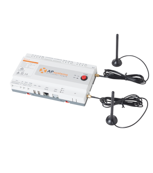
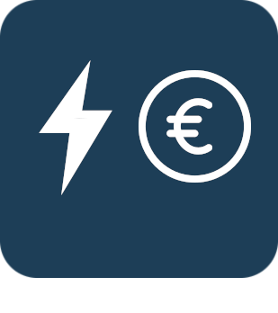
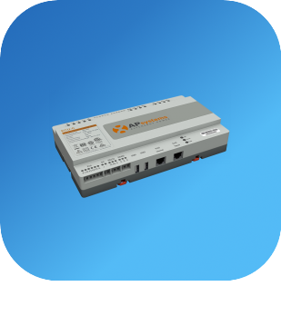
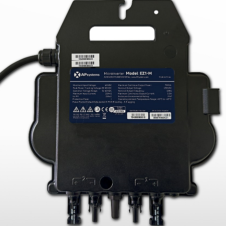
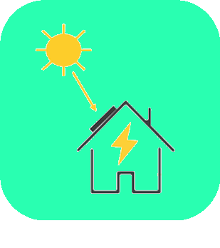
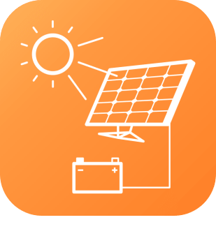
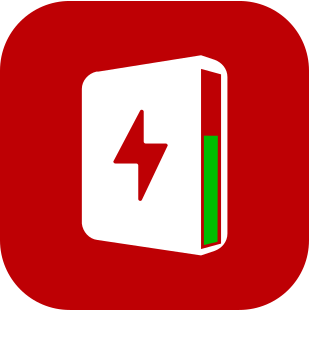
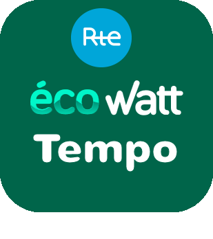
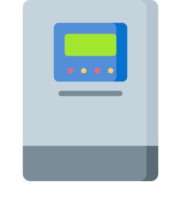

# Energie

>****
>. . .
>  

| | | | |
|--- | --- | --- | ---|
|||.| -    - |
||EcogazSync|.| -    - |
||Electricity Cost|Présentation du plugin: https://www.youtube.com/watch?. . .|  |
||RteSync|. . . | -    - |
|||| -    - |
|||. ...| -    - |
|||. |  |
||Autoconsommation|)|  |
||Beem|| -    - |
||| |  |
|||. ). . .|  |
||eeSmart|.|  |
|||)| -    - |
|||. . | -    - |
||Fullup|. .| -    - |
|||. L'utilisation du plugins est simplifié par l'usage des géneriques type et permet une gestion intelligente. Il integer plusieurs gestions. * >* >* >* | -    - |
||| .| -    - |
||helloWatt|'.  | -    - |
|||.| -    - |
||IoTaWatt|. . .| -    - |
||myWallBox|.|  |
||Solaredge|.| -    - |
|||. .| -    - |
|||. |  |
|||. . . .| -    - |
||Solarman|Plugin permettant d'interroger directement les onduleurs monitorés par Solarman, https://home.solarmanpv.: | -    - |
||||  |
||||  |
|||". .| -    - |
||)|.  : .| -    - |
