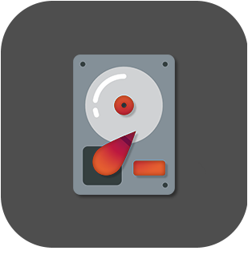

# Monitoring

>**Wichtig**
>Hier haben nur Contributor-Plugins ihre Dokumentation. Sie können die Dokumentation der offiziellen Plugins direkt vom Jeedom Market abrufen. Klicken Sie im betreffenden Plugin auf Dokumentation.
>Sie können sehen [hier](https://market.jeedom.com/index.php?v=d&p=market&type=plugin&categorie=monitoring) Alle offiziellen Plugins in dieser Kategorie

| | | | |
|--- | --- | --- | ---|
||AdGuard-Startseite|Plugin zum Aktivieren oder Deaktivieren Ihres AdGuard Home Servers. Kunden verwalten und vieles mehr !!|[Dokumentation Stall](https://nebzhb.github.io/jeedom_docs/plugins/AdGuard/de_DE/) - [Beta-Dokumentation](https://nebzhb.github.io/jeedom_docs/plugins/AdGuard/de_DE/) [Markt](https://market.jeedom.com/index.php?v=d&p=market_display&id=4196) [Änderungsprotokoll stabil](https://nebzhb.github.io/jeedom_docs/plugins/AdGuard/de_DE/changelog) - [Änderungsprotokoll Beta](https://nebzhb.github.io/jeedom_docs/plugins/AdGuard/de_DE/changelog)|
||Freebox|. ).|[Dokumentation Stall](https://jealg.github.io/documentation/plugin-freebox_os/de_DE/) - [Beta-Dokumentation](https://jealg.github.io/documentation/plugin-freebox_os/de_DE/doc_beta) [Markt](https://market.jeedom.com/index.php?v=d&p=market_display&id=1666) [Änderungsprotokoll stabil](https://jealg.github.io/documentation/plugin-freebox_os/de_DE/changelog) - [Änderungsprotokoll Beta](https://jealg.github.io/documentation/plugin-freebox_os/de_DE/beta_changelog)|
||Jailbreak|Dieses Plugin ist für alle iPads und iPhones, die sich in verstaubten, vergessenen oder verlassenen Schränken und Schubladen befinden. Il permet d'intéragir avec Jeedom pour remonter des informations, lancer Application, exécuter des actions... Plus d'informations sur la présentation du plugin : https://flobul-domotique.fr/presentation-du-plugin-jailbreak-pour-jeedom/|[Dokumentation Stall](https://flobul-domotique.fr/documentation-du-plugin-jailbreak-pour-jeedom/) [Markt](https://market.jeedom.com/index.php?v=d&p=market_display&id=3928) [Änderungsprotokoll stabil](https://flobul-domotique.fr/liste-des-versions-du-plugin-jailbreak-pour-jeedom/)|
||APSEZ1M|Plugin zum Steuern und Abrufen von Informationen von APSystem EZ1-M-Mikrowechselrichtern. Energierückgewinnung nach Panel, insgesamt usw|[Dokumentation Stall](https://taggou91.github.io/jeedom_docs/plugins/aps-ez1m/de_DE/) [Markt](https://market.jeedom.com/index.php?v=d&p=market_display&id=4477) [Änderungsprotokoll stabil](https://taggou91.github.io/jeedom_docs/plugins/aps-ez1m/changelog.html)|
||Standardwerte|Zustands-/Messkonsistenzüberwachung|[Dokumentation Stall](https://ktn001.github.io/de_DE/defauts/index.html) [Markt](https://market.jeedom.com/index.php?v=d&p=market_display&id=4147) [Änderungsprotokoll stabil](https://ktn001.github.io/de_DE/defauts/changelog.html)|
||fail2ban|Plugin zur Überwachung von fail2ban. Es ermöglicht Ihnen, alle sofortigen Informationen von einer lokalen oder entfernten fail2ban-Instanz (über SSH) zu melden, aber es führt auch tägliche Zähler blockierter IPs sowie einen Zähler für das Herkunftsland (Land, das durch Geolokalisierung der Adress-IP abgerufen wird)). Außerdem können Sie eine IP-Adresse sperren und die Sperrung aufheben.|[Dokumentation Stall](https://mips2648.github.io/jeedom-plugins-docs/fail2ban/de_DE/) - [Beta-Dokumentation](https://mips2648.github.io/jeedom-plugins-docs/fail2ban/de_DE/) [Markt](https://market.jeedom.com/index.php?v=d&p=market_display&id=4439) [Änderungsprotokoll stabil](https://mips2648.github.io/jeedom-plugins-docs/fail2ban/de_DE/changelog) - [Änderungsprotokoll Beta](https://mips2648.github.io/jeedom-plugins-docs/fail2ban/de_DE/changelog)|
||fullyKiosK|FullyKiosK-Plugin für die Tablet-Verwaltung mit der Fullkiosk-App|[Dokumentation Stall](https://sebsst.github.io/fullyKiosK/de_DE/) [Markt](https://market.jeedom.com/index.php?v=d&p=market_display&id=3406) [Änderungsprotokoll stabil](https://sebsst.github.io/fullyKiosK/de_DE/changelog)|
||Voll KiosK|FullyKiosK-Plugin für die Tablet-Verwaltung mit der Fullkiosk-App|[Dokumentation Stall](https://vegeta0911.github.io/fully_kiosk/) [Markt](https://market.jeedom.com/index.php?v=d&p=market_display&id=4528) [Änderungsprotokoll stabil](https://vegeta0911.github.io/fully_kiosk/changelog.html)|
||Markt gewinnen|Stellt Ihr Guthaben auf dem Jeedom-Markt (als Entwickler) wieder her und kann Sie benachrichtigen, wenn es sich ändert oder wenn die Jeedom-Zahlung erkannt wird|[Dokumentation Stall](https://frixo3190.github.io/jeedom_plugins/gain_market/docs/de_DE/) [Markt](https://market.jeedom.com/index.php?v=d&p=market_display&id=4228) [Änderungsprotokoll stabil](https://frixo3190.github.io/jeedom_plugins/gain_market/docs/de_DE/#changelog)|
||Ha-Bridge|Dieses Plugin ermöglicht die Nutzung eines Ha-Bridge-Servers. Dadurch können Sie alle Ihre ALEXA-Geräte nutzen, um Ihre Hausautomation mit einem einfachen Sprachbefehl zu steuern.|[Dokumentation Stall](https://www.domlabs.fr/jeedom_docs/haBridge/fr-FR/) [Markt](https://market.jeedom.com/index.php?v=d&p=market_display&id=4045) [Änderungsprotokoll stabil](https://www.domlabs.fr/jeedom_docs/haBridge/fr-FR/)|
||Festplatten-Wächter|Mit diesem Plugin können Sie mit dem Linux Hard Disk Sentinel-Tool Gesundheitsinformationen von Ihren Festplatten abrufen.|[Dokumentation Stall](https://flobul-domotique.fr/presentation-et-documentation-du-plugin-hdsentinel-pour-jeedom/) [Markt](https://market.jeedom.com/index.php?v=d&p=market_display&id=4247) [Änderungsprotokoll stabil](https://flobul-domotique.fr/liste-des-versions-du-plugin-hdsentinel-pour-jeedom/)|
||InfluxDB|Plugin, das die Verbindung zu einer DB InfluxDB v1 oder v2 ermöglicht. Es macht es einfach, die gewünschten Informationen zu senden, indem man einfach die entsprechenden Befehle aus einer Liste auswählt, was es ermöglicht, die Historie zu externalisieren, die dann beispielsweise über Grafana eingesehen werden kann.|[Dokumentation Stall](https://mips2648.github.io/jeedom-plugins-docs/influxdb/de_DE/) - [Beta-Dokumentation](https://mips2648.github.io/jeedom-plugins-docs/influxdb/de_DE/) [Markt](https://market.jeedom.com/index.php?v=d&p=market_display&id=3935) [Änderungsprotokoll stabil](https://mips2648.github.io/jeedom-plugins-docs/influxdb/de_DE/changelog) - [Änderungsprotokoll Beta](https://mips2648.github.io/jeedom-plugins-docs/influxdb/de_DE/changelog)|
||JeeLog|Aktivitätsprotokollierungs-Plugin für Geräte, Szenarien und Protokolldateien|[Dokumentation Stall](https://kiboost.github.io/jeedom_docs/plugins/jeelog/de_DE/) [Markt](https://market.jeedom.com/index.php?v=d&p=market_display&id=3362) [Änderungsprotokoll stabil](https://kiboost.github.io/jeedom_docs/plugins/jeelog/de_DE/changelog.html)|
||Sensoren überwachen|Mit diesem Plugin können Sie alle Ihre Sensoren (Z-Wave, EnOcean, ZigBee) im Auge behalten, um ihren Zustand, ihre Reichweite, ihre letzte empfangene Nachricht usw. zu überprüfen . alles in einer Tabelle zusammengefasst, Alarmierung im Fehlerfall ! Auch sehr spezifisches Monitoring des Z-Wave Netzwerks (Queue, Status). Daemon-Statusüberwachung für alle Plugins.|[Dokumentation Stall](https://frixo3190.github.io/jeedom_plugins/monitor_sensors/docs/de_DE/) [Markt](https://market.jeedom.com/index.php?v=d&p=market_display&id=4207) [Änderungsprotokoll stabil](https://frixo3190.github.io/jeedom_plugins/monitor_sensors/docs/de_DE/#changelog)|
||No-IP erneuern|Mit diesem Plugin können Sie Ihre kostenlosen No-IP-Domainnamen automatisch erneuern.com (der Vorgang muss ansonsten alle 30 Tage manuell durchgeführt werden).|[Dokumentation Stall](https://tomitomas.github.io/jeedom_doc/NoIp/de_DE/) - [Beta-Dokumentation](https://tomitomas.github.io/jeedom_doc/NoIp/de_DE/) [Markt](https://market.jeedom.com/index.php?v=d&p=market_display&id=4112) [Änderungsprotokoll stabil](https://tomitomas.github.io/jeedom_doc/NoIp/de_DE/changelog) - [Änderungsprotokoll Beta](https://tomitomas.github.io/jeedom_doc/NoIp/de_DE/changelog_beta)|
||piHole|Plugin zum Aktivieren oder Deaktivieren Ihres Pi-Hole-Servers. Ein Schalter zum Deaktivieren und einige Zahlen. Lassen Sie mich wissen, wenn Sie mehr benötigen (abhängig davon, was die API zulässt))|[Dokumentation Stall](https://nebzhb.github.io/plugin-piHole/de_DE/) - [Beta-Dokumentation](https://nebzhb.github.io/plugin-piHole/de_DE/) [Markt](https://market.jeedom.com/index.php?v=d&p=market_display&id=3420) [Änderungsprotokoll stabil](https://nebzhb.github.io/plugin-piHole/de_DE/changelog) - [Änderungsprotokoll Beta](https://nebzhb.github.io/plugin-piHole/de_DE/changelog)|
||Portainer|Plugin, das die Verbindung zu Portainer ermöglicht.io, ein Docker-Verwaltungstool, und damit zur Verwaltung Ihrer Docker und Container auf Jeedom.|[Dokumentation Stall](https://mips2648.github.io/jeedom-plugins-docs/portainer/de_DE/) - [Beta-Dokumentation](https://mips2648.github.io/jeedom-plugins-docs/portainer/de_DE/) [Markt](https://market.jeedom.com/index.php?v=d&p=market_display&id=3931) [Änderungsprotokoll stabil](https://mips2648.github.io/jeedom-plugins-docs/portainer/de_DE/changelog) - [Änderungsprotokoll Beta](https://mips2648.github.io/jeedom-plugins-docs/portainer/de_DE/changelog)|
||Proxmox|Plugin zur Verwaltung eines Proxmox-Servers. Es ist möglich, alle Ressourcen (Knoten, virtuelle Maschine, Speicher ...) und alle ihre Eigenschaften (Status, Speicher, CPU, Festplatte, IP-Adresse, Aktivitätszeit, Liste der Snapshots) wiederherzustellen...). Mit dem Plugin können Sie auch VMs und Container starten und stoppen sowie Snapshots und Backups erstellen. Es hat auch eine spezielle Gesundheitsseite, die alle Informationen über Ihre Ausrüstung zusammenfasst.|[Dokumentation Stall](https://mips2648.github.io/jeedom-plugins-docs/proxmox/de_DE/) - [Beta-Dokumentation](https://mips2648.github.io/jeedom-plugins-docs/proxmox/de_DE/) [Markt](https://market.jeedom.com/index.php?v=d&p=market_display&id=3835) [Änderungsprotokoll stabil](https://mips2648.github.io/jeedom-plugins-docs/proxmox/de_DE/changelog) - [Änderungsprotokoll Beta](https://mips2648.github.io/jeedom-plugins-docs/proxmox/de_DE/changelog)|
||sfrBox|Plugin zur Steuerung der sfr/neuf-Box|[Dokumentation Stall](https://limad.github.io/plugins-docs/plugin-sfrBox/) [Markt](https://market.jeedom.com/index.php?v=d&p=market_display&id=3752) [Änderungsprotokoll stabil](https://limad.github.io/plugins-docs/plugin-sfrBox/de_DE/changelog.html)|
||Solax-Wolke|Plugin zum Abrufen von Informationen von Solax-Wechselrichtern über Solax Cloud|[Dokumentation Stall](https://phroc.github.io/Jeedom_Solaxcloud/de_DE/) [Markt](https://market.jeedom.com/index.php?v=d&p=market_display&id=4049) [Änderungsprotokoll stabil](https://phroc.github.io/Jeedom_Solaxcloud/de_DE/changelog)|
||Speedtest by Ookla|Ce plugin permet de tester la bande passante internet à l'aide de https://www.speedtest.net|[Dokumentation Stall](https://spine34.github.io/jeedom-documentations/de_DE/speedtestByOokla/index) - [Beta-Dokumentation](https://spine34.github.io/jeedom-documentations/de_DE/speedtestByOokla/index) [Markt](https://market.jeedom.com/index.php?v=d&p=market_display&id=4345) [Änderungsprotokoll stabil](https://spine34.github.io/jeedom-documentations/de_DE/speedtestByOokla/stable/changelog) - [Änderungsprotokoll Beta](https://spine34.github.io/jeedom-documentations/de_DE/speedtestByOokla/beta/changelog)|
||Unifi-Netzwerk|Unifi-Netzwerk – Verbinden mit einem Unifi-Netzwerk-Controller. Ermöglicht bestimmte Aktionen (Lokalisieren, Site-LED verwalten, Firmware-Update, PowerCycle/Aktivierung/Deaktivierung POE auf Switches, Aktivierung/Deaktivierung/Neustart von Access Points, Aktivierung/Deaktivierung von WLANs, Sperren/Entsperren/Verwalten der Präsenz von Client-WLAN usw)  Nicht als Ersatz für die Controller-Schnittstelle gedacht  Nicht unterstützt : UniFi Protect & UniFi Access & UniFi Talk & UniFi Connect|[Dokumentation Stall](https://nebzhb.github.io/jeedom_docs/plugins/unifi/de_DE/) - [Beta-Dokumentation](https://nebzhb.github.io/jeedom_docs/plugins/unifi/de_DE/) [Markt](https://market.jeedom.com/index.php?v=d&p=market_display&id=3433) [Änderungsprotokoll stabil](https://nebzhb.github.io/jeedom_docs/plugins/unifi/de_DE/changelog) - [Änderungsprotokoll Beta](https://nebzhb.github.io/jeedom_docs/plugins/unifi/de_DE/changelog)|
