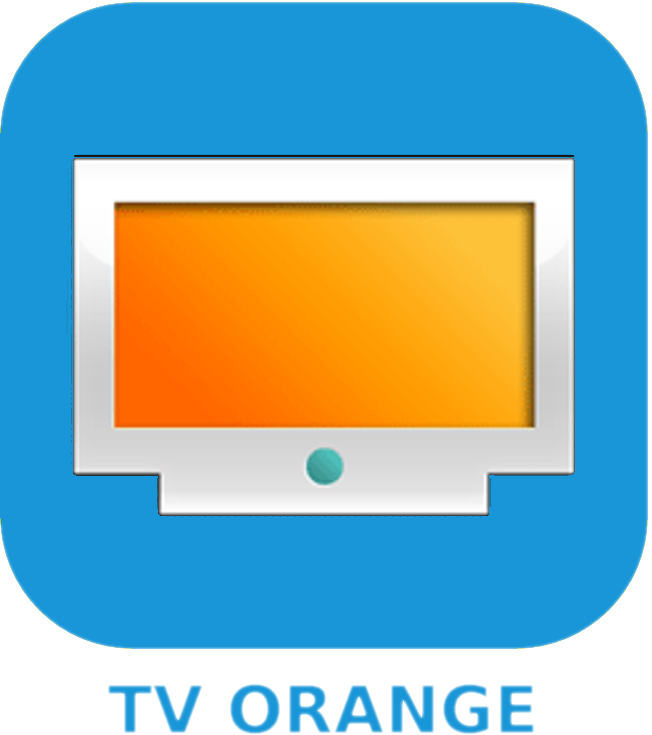
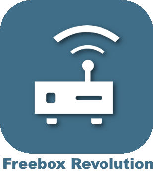

# Multimédia

>**IMPORTANT**

>Seuls les plugins de contributeur ont leur documentation ici. Vous pouvez consulter les documentations des plugins officiel directement depuis le market jeedom puis une fois sur le plugin en question en cliquant sur documentation

Vous pouvez voir [ici](https://market.jeedom.com/index.php?v=d&p=market&type=plugin&categorie=multimedia) tous les plugins (officiel ou non) de cette categorie

| | | | |
|--- | --- | --- | ---|
||Acer Video Projecteur|Plugin pour piloter les videoprojecteurs Acer|[Documentation](https://github.com/Cricri67/Jeedom-AcerVP/blob/master/docs/#language#/index.md) - [Market](https://market.jeedom.com/index.php?v=d&p=market_display&id=3501)|
||AndroidRemoteControl|Plugin pour piloter les Android TV et autres équipements Android|[Documentation](https://NextDom.github.io/plugin-AndroidRemoteControl/) - [Market](https://market.jeedom.com/index.php?v=d&p=market_display&id=3360)|
||Bose SoundTouch|Plugin pour piloter les enceintes Bose SoundTouch.|[Documentation](https://sabinus52.github.io/jeedom-bose-soundtouch/#language#/) - [Market](https://market.jeedom.com/index.php?v=d&p=market_display&id=3565)|
||Télécommande Freebox mini4K|Télécommande pour votre Freebox mini4K|[Documentation](http://mika-nt28.github.io/Documentations/FreeboxMini4k/#language#) - [Market](https://market.jeedom.com/index.php?v=d&p=market_display&id=3756)|
||JeeOrangeTv|Plugin pour piloter le décodeur TV Orange par IP|[Documentation](https://totoff974.github.io/JeeOrangeTv/#language#/) - [Market](https://market.jeedom.com/index.php?v=d&p=market_display&id=2706)|
||NB LaBox||[Documentation]() - [Market](https://market.jeedom.com/index.php?v=d&p=market_display&id=2428)|
||Alexa - Amazon Music|Interface Amazon Music|[Documentation](http://sigalou-domotique.fr/plugin-jeedom-alexa-api/90-alexa-amazon-music-documentation) - [Market](https://market.jeedom.com/index.php?v=d&p=market_display&id=3910)|
||Alexa - Deezer|Interface Deezer|[Documentation](http://sigalou-domotique.fr/plugin-jeedom-alexa-api/98-alexa-deezer-documentation) - [Market](https://market.jeedom.com/index.php?v=d&p=market_display&id=3911)|
||Alexa - Spotify|Interface Spotify|[Documentation](http://sigalou-domotique.fr/plugin-jeedom-alexa-api/97-alexa-sportify-documentation) - [Market](https://market.jeedom.com/index.php?v=d&p=market_display&id=3913)|
||Diaporama|Diaporama|[Documentation](http://sigalou-domotique.fr/diaporama/82-plugin-diaporama-documentation) - [Market](https://market.jeedom.com/index.php?v=d&p=market_display&id=3870)|
||Freebox Crystal|Récupère les informations de votre Freebox Crystal|[Documentation](https://mika-nt28.github.io/Documentations/freeCrystal/#language#/) - [Market](https://market.jeedom.com/index.php?v=d&p=market_display&id=1139)|
||Google Cast|Plugin de gestion des équipements compatibles Google Cast|[Documentation](https://github.com/guirem/plugin-googlecast/blob/develop/docs/fr_FR/index.md) - [Market](https://market.jeedom.com/index.php?v=d&p=market_display&id=3350)|
||HomepTalk|TTS vers un Apple HomePod|[Documentation](https://nebzhb.github.io/jeedom_docs/plugins/homepTalk/fr_FR/) - [Market](https://market.jeedom.com/index.php?v=d&p=market_display&id=3825)|
||Marantz Denon|Plugin permettant de piloter les amplificateurs Denon / Marantz|[Documentation](https://github.com/guirem/plugin-marantzdenon/blob/master/docs/fr_FR/index.md) - [Market](https://market.jeedom.com/index.php?v=d&p=market_display&id=3342)|
||MusicCast controller|Plugin de controle de Yamaha MusicCast|[Documentation](https://granddam.github.io/plugin-musiccast/#language#/index) - [Market](https://market.jeedom.com/index.php?v=d&p=market_display&id=3099)|
||onkyo|Plugin pour piloter les amplificateurs de la marque Onkyo|[Documentation](http://dough29.github.io/Jeedom-Onkyo/fr_FR/) - [Market](https://market.jeedom.com/index.php?v=d&p=market_display&id=1107)|
||philips|Plugin pour le pilotage des TV philips|[Documentation](https://barre35.github.io/jeedom-plugin-philips/#language#/index) - [Market](https://market.jeedom.com/index.php?v=d&p=market_display&id=3875)|
||Plex||[Documentation](https://mika-nt28.github.io/Documentations/plex/#language#/) - [Market](https://market.jeedom.com/index.php?v=d&p=market_display&id=1380)|
||Freebox Révolution|Plugin pour piloter le Freebox Player de la Freebox Revolution|[Documentation](https://mika-nt28.github.io/Documentations/telecfree/#language#/) - [Market](https://market.jeedom.com/index.php?v=d&p=market_display&id=2032)|
