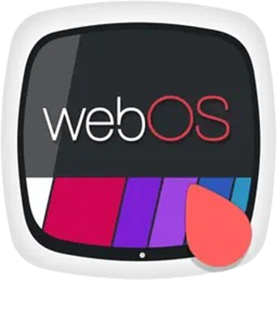
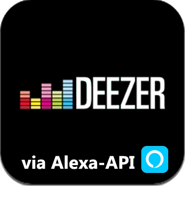

# 

>****
>. . .
>  

| | | | |
|--- | --- | --- | ---|
|||.| -    - |
||MPD|| -    - |
|||). |  |
||||  |
||||  |
||||  |
||||  |
|||.| -    - |
||HomepTalk|   !| -    - |
||Spotify||  |
|||| -    - |
