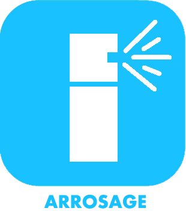

# Nature

>**IMPORTANT**

>Hier haben nur Contributor-Plugins ihre Dokumentation. Sie können die Dokumentation der offiziellen Plugins direkt vom Jeedom Market abrufen. Klicken Sie im betreffenden Plugin auf Dokumentation.
>Sie können sehen [hier](https://market.jeedom.com/index.php?v=d&p=market&type=plugin&categorie=nature) Alle offiziellen Plugins in dieser Kategorie

| | | | |
|--- | --- | --- | ---|
||MiFlora|Mit diesem Plugin können Sie Xiaomi-Pflanzen oder Mi Flora sowie Papageien verwalten. Il nécéssite une connection bluetooth vers les objets.|[Dokumentation](https://NextDom.github.io/plugin-MiFlora/#language#) - [Markt](https://market.jeedom.com/index.php?v=d&p=market_display&id=2686)|
||Arrosage|Plugin für das Mehrzonen-Bewässerungsmanagement|[Dokumentation](https://jeedom.github.io/) - [Markt](https://market.jeedom.com/index.php?v=d&p=market_display&id=2353)|
