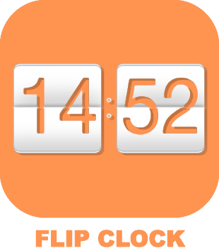
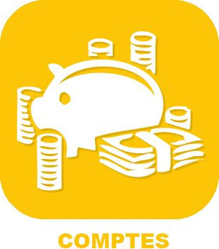
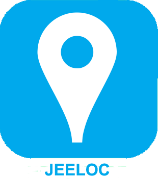

# Organisation

>**IMPORTANT**

>Hier haben nur Contributor-Plugins ihre Dokumentation. Sie können die Dokumentation der offiziellen Plugins direkt vom Jeedom Market abrufen. Klicken Sie im betreffenden Plugin auf Dokumentation.
>Sie können sehen [hier](https://market.jeedom.com/index.php?v=d&p=market&type=plugin&categorie=organization) Alle offiziellen Plugins in dieser Kategorie

| | | | |
|--- | --- | --- | ---|
||Cave à Vin||[Dokumentation](https://mika-nt28.github.io/Documentations/CaveVin/#language#/) - [Markt](https://market.jeedom.com/index.php?v=d&p=market_display&id=1980)|
||FlipClock|Plugin zum Erstellen einer Flip-Uhr|[Dokumentation](https://github.com/cyrilphoenix71/jeedom_FlipClock/blob/stable/doc/de_DE/index.asciidoc) - [Markt](https://market.jeedom.com/index.php?v=d&p=market_display&id=3091)|
||Suivre un colis|Plugin pour suivre un colis|[Dokumentation](https://floman321.github.io/Suivreuncolis/#language#/) - [Markt](https://market.jeedom.com/index.php?v=d&p=market_display&id=2404)|
||Comptes||[Dokumentation](https://koleos6.github.io/comptes/#language#/) - [Markt](https://market.jeedom.com/index.php?v=d&p=market_display&id=1399)|
||Von Google freigegebene Standorte|Plugin, das mit Google freigegebene Geolokalisierungen wiederherstellt. L'affichage est parametrable au sein du plugin. Les coordonnées peuvent être envoyées à d'atures plugins Geoloc, Geotrav, Jeeloc, etc...|[Dokumentation](https://yoan-m.github.io/jeedom_gsl/#language#/) - [Markt](https://market.jeedom.com/index.php?v=d&p=market_display&id=3422)|
||Ics Kalender|Plugin zur Wiederherstellung von Ical-Kalendern (Apple, Google, Nextcloud, Caldav). Possibilité d'interagir et de lancer des actions selon l'évènement|[Dokumentation](https://zyg0m4t1k.github.io/ics/#language#/) - [Markt](https://market.jeedom.com/index.php?v=d&p=market_display&id=3108)|
||Jeeloc|Plugin qui permet d'utiliser les données de localisation existantes et crée un widget spécifique ( Localisation multiple possible)|[Dokumentation](https://zyg0m4t1k.github.io/jeeloc/#language#/) - [Markt](https://market.jeedom.com/index.php?v=d&p=market_display&id=3404)|
||Prix Carburants|Récupère les informations des prix des carburants via https://www.prix-carburants.gouv.fr|[Dokumentation](https://jeedom.github.io/prixcarburants/#language#/) - [Markt](https://market.jeedom.com/index.php?v=d&p=market_display&id=3984)|
||Programmateur|Plugin pour ajouter un programmateur à une commande|[Dokumentation](https://caelion.github.io/jeedom-plugins-documentation/Programmateur/#language#/) - [Markt](https://market.jeedom.com/index.php?v=d&p=market_display&id=3942)|
||Réveil|Utiliser votre domotique pour vous réveiller|[Dokumentation](https://mika-nt28.github.io/Documentations/reveil/#language#/) - [Markt](https://market.jeedom.com/index.php?v=d&p=market_display&id=2775)|
||Telecommande|Plugin permettant de créer des télécommandes|[Dokumentation](https://zyg0m4t1k.github.io/telco/#language#/) - [Markt](https://market.jeedom.com/index.php?v=d&p=market_display&id=2861)|
||Todo List|Plugin qui permet la création de todolist|[Dokumentation](https://zyg0m4t1k.github.io/todo/#language#/) - [Markt](https://market.jeedom.com/index.php?v=d&p=market_display&id=1976)|
||Traccar|Dieses Plugin ermöglicht die Verbindung eines Traccar-Servers mit dem Geoloc-Plugin von Jeedom|[Dokumentation](http://dough29.github.io/Jeedom-Traccar/de_DE/) - [Markt](https://market.jeedom.com/index.php?v=d&p=market_display&id=2518)|
