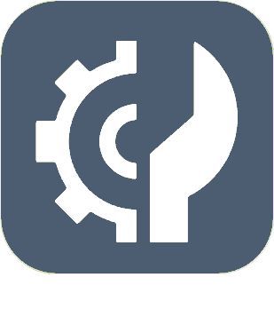

# Programmation

>****
>. . .
>  

| | | | |
|--- | --- | --- | ---|
||EventTranslator| : ). .  : .  : .| -    - |
|||. .| -    - |
|||.| -    - |
|||. Ce plugin a l'avantage de tout centraliser et permettre une gestion hiérarchique des ‹ objets ›| -    - |
||JeeXplorer||  |
||LogManager|. . .| -    - |
||Lumina||  |
||| !  .  .  Le plugin inclus également un outil permettant de créer et de gérer les widgets tiers.  : .  .|  |
|||| -    - |
