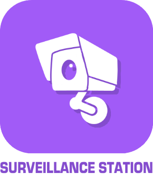

# Sicherheit

>**IMPORTANT**
>Hier haben nur Contributor-Plugins ihre Dokumentation. Sie können die Dokumentation der offiziellen Plugins direkt vom Jeedom Market abrufen. Klicken Sie im betreffenden Plugin auf Dokumentation.
>Sie können sehen [hier](https://market.jeedom.com/index.php?v=d&p=market&type=plugin&categorie=security) Alle offiziellen Plugins in dieser Kategorie

| | | | |
|--- | --- | --- | ---|
||Diagrale eOne|Plugin zur Verwaltung von Diagral eOne-Alarmen|[Dokumentation](https://mguyard.github.io/Jeedom-Diagral_eOne/de_DE/) - [Markt](https://market.jeedom.com/index.php?v=d&p=market_display&id=3820)|
||Zugriff per QR-Code|Verwalten Sie den Zugang zu Ihrem Haus per QR-Code.|[Dokumentation](http://mika-nt28.github.io/Documentations/QRacces/fr_FR) - [Markt](https://market.jeedom.com/index.php?v=d&p=market_display&id=3758)|
||RTSP|Plugin Autor : Slobberbone. BITTE BEACHTEN SIE, dass dies kein offizielles Jeedom-Plugin ist, sondern ein Plugin, das von einer dritten Person entwickelt wurde und dessen Entwicklung aufgegeben wurde. Das technische Team von Jeedom wird dieses Plugin ohne Ergebnisverpflichtung unterstützen. RTSP-Kompatibilitäts-Plugin mit Kamera-Plugin.|[Dokumentation](https://jeedom.github.io/plugin-RTSP/de_DE/) - [Markt](https://market.jeedom.com/index.php?v=d&p=market_display&id=2177)|
||IMA-Alarm|Alarmverwaltung für IMA-Fernunterstützung|[Dokumentation](https://lplancke.github.io/jeedom_alarme_IMA/de_DE/) - [Markt](https://market.jeedom.com/index.php?v=d&p=market_display&id=3184)|
||Blinkkamera|Plugin für Blinkkamera|[Dokumentation](https://d9-197.github.io/blink_camera/fr_FR) - [Markt](https://market.jeedom.com/index.php?v=d&p=market_display&id=3776)|
||Digicode Plugin||[Dokumentation](https://jmz84.github.io/plugin-digicode/de_DE/) - [Markt](https://market.jeedom.com/index.php?v=d&p=market_display&id=3436)|
||Domonial|Plugin zum Empfangen von Benachrichtigungen über einen Domonial-Alarm|[Dokumentation](https://apages2.github.io/pluginjeedom-domonial/de_DE/) - [Markt](https://market.jeedom.com/index.php?v=d&p=market_display&id=2857)|
||Gesichtserkennung|Mit diesem Plugin können Sie OpenCv verwenden, um Ihr Visier zu erkennen und Sie zu erkennen.Achtung, egal was Sie mit diesem Plugin autorisiert haben, denn es ist ganz einfach, das System zu täuschen (Zwillinge, Fotos)|[Dokumentation](http://mika-nt28.github.io/Documentations/facerecognition/de_DE/) - [Markt](https://market.jeedom.com/index.php?v=d&p=market_display&id=3863)|
||Ftpd|Plugin Autor : Thomas Guenneguez BITTE BEACHTEN SIE, dass dies kein offizielles Jeedom-Plugin ist, sondern ein Plugin, das von einer dritten Person entwickelt wurde und dessen Entwicklung aufgegeben wurde. Das technische Team von Jeedom wird dieses Plugin ohne Ergebnisverpflichtung unterstützen. Plugin zum Erstellen eines FTP-Servers, der jeedom benachrichtigt, wenn eine Datei hochgeladen wird. Sehr nützlich für IP-Kameras, die bei Bewegungserkennung eine Datei per FTP senden können.|[Dokumentation](https://jeedom.github.io/documentation/third_plugin/ftpd/de_DE/index.html) - [Markt](https://market.jeedom.com/index.php?v=d&p=market_display&id=2843)|
||GDS 3710|Plugin zur Integration des GrandStream GDS3710 Gatekeepers|[Dokumentation](https://ripleyxlr8.github.io/jeedom-plugin-gds3710/de_DE/) - [Markt](https://market.jeedom.com/index.php?v=d&p=market_display&id=3487)|
||GeoRide|{{Plugin zur Verwendung der offenen API von GeoRide}}|[Dokumentation](https://github.com/ImoucheG/GeoRide-Jeedom-Source) - [Markt](https://market.jeedom.com/index.php?v=d&p=market_display&id=3714)|
||Motion|Plugin zur Konfiguration und Verwendung der Motion-Software. Dies ermöglicht es uns, unsere Webcams zu streamen und Bewegungserkennung auf unseren Kameras durchzuführen|[Dokumentation](https://mika-nt28.github.io/Documentations/motion/de_DE/) - [Markt](https://market.jeedom.com/index.php?v=d&p=market_display&id=1542)|
||Multi Anfragen|Plugin zur Verwaltung virtueller Geräte|[Dokumentation](https://github.com/KiwiHC16/multi-requests/tree/beta/docs) - [Markt](https://market.jeedom.com/index.php?v=d&p=market_display&id=3441)|
||OpenALPR|Permanentes Plugin zur Kennzeichenerkennung mit unseren Kameras|[Dokumentation](https://mika-nt28.github.io/Documentations/openalpr/fr_FR) - [Markt](https://market.jeedom.com/index.php?v=d&p=market_display&id=1613)|
||Telefonerkennung (Bluetooth)|Pingen Sie ein Telefon in regelmäßigen Abständen an, um festzustellen, ob es vorhanden ist|[Dokumentation](https://github.com/sebmafate/phone_detection) - [Markt](https://market.jeedom.com/index.php?v=d&p=market_display&id=3852)|
||Somfy Alarm||[Dokumentation](https://fdp1nm.github.io/plugin-protexiom/de_DE/) - [Markt](https://market.jeedom.com/index.php?v=d&p=market_display&id=510)|
||Überwachungsstation|Plugin für die Synology Surveillance Station|[Dokumentation](https://surveillancestation.github.io/surveillancestation/surveillancestation/de_DE/) - [Markt](https://market.jeedom.com/index.php?v=d&p=market_display&id=1303)|
