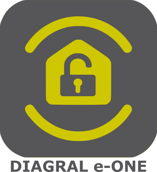
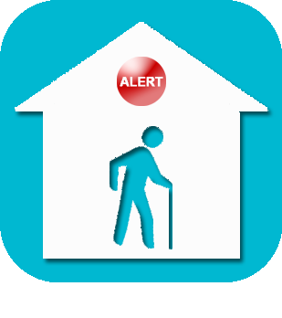

# Sicherheit

>**Wichtig**
>Hier haben nur Contributor-Plugins ihre Dokumentation. Sie können die Dokumentation der offiziellen Plugins direkt vom Jeedom Market abrufen. Klicken Sie im betreffenden Plugin auf Dokumentation.
>Sie können sehen [hier](https://market.jeedom.com/index.php?v=d&p=market&type=plugin&categorie=security) Alle offiziellen Plugins in dieser Kategorie

| | | | |
|--- | --- | --- | ---|
||AlarmeMyfox|Ich nehme das aufgegebene Plugin zurück. Das Plugin V2 zur Verwendung der Myfox-, Evology- und Easybox-Steuereinheit ermöglicht das Abrufen von Informationen über Temperatursensor, Helligkeit, Gefrierschrank, Rauch, Heizung, Ereignisse, Alarmstatus sowie das Aktivieren/Deaktivieren des Alarms und der Ausrüstung sowie das Abspielen von Szenarien|[Dokumentation Stall](https://vegeta0911.github.io/AlarmeMyfox/de_DE/) [Markt](https://market.jeedom.com/index.php?v=d&p=market_display&id=4471) [Änderungsprotokoll stabil](https://vegeta0911.github.io/AlarmeMyfox/de_DE/changelog)|
||Diagrale eOne|Plugin zur Verwaltung von Diagral eOne-Alarmen|[Dokumentation Stall](https://mguyard.github.io/Jeedom-Diagral_eOne/de_DE/) [Markt](https://market.jeedom.com/index.php?v=d&p=market_display&id=3820) [Änderungsprotokoll stabil](https://mguyard.github.io/Jeedom-Diagral_eOne/de_DE/changelog)|
||Zugriff per QR-Code|Verwalten Sie den Zugang zu Ihrem Haus per QR-Code.|[Dokumentation Stall](http://mika-nt28.github.io/Documentations/QRacces/fr_FR) [Markt](https://market.jeedom.com/index.php?v=d&p=market_display&id=3758) [Änderungsprotokoll stabil](https://mika-nt28.github.io/Documentations/QRacces/de_DE/changelog)|
||Arlo|Plug-in zur Steuerung von Geräten der Arlo-Reihe wie Kameras, Basisstation und integrierter Sirene. Es ist möglich, den Modus, die Aktivierung und Deaktivierung der Kameras zu steuern, den Live-Stream der Kameras anzuzeigen, Aufnahmen und Videoaufzeichnungen auszulösen, die Sirene auszulösen ... Alle aktuellen Modelle, die von der Arlo-Anwendung (Web oder Mobil) unterstützt werden vom Plugin unterstützt: Arlo, Arlo Pro, Pro2, Pro3, Pro4, Ultra, Arlo Floodlight, Arlo Essential, Arlo Q, Arlo Go, Arlo Baby, Arlo Doorbell und Video Doorbell...|[Dokumentation Stall](https://mips2648.github.io/jeedom-plugins-docs/arlo/de_DE/) - [Beta-Dokumentation](https://mips2648.github.io/jeedom-plugins-docs/arlo/de_DE/) [Markt](https://market.jeedom.com/index.php?v=d&p=market_display&id=3708) [Änderungsprotokoll stabil](https://mips2648.github.io/jeedom-plugins-docs/arlo/de_DE/changelog) - [Änderungsprotokoll Beta](https://mips2648.github.io/jeedom-plugins-docs/arlo/de_DE/changelog)|
||Gesichtserkennung|Mit diesem Plugin können Sie OpenCv verwenden, um Ihr Visier zu erkennen und Sie zu erkennen.Achtung, egal was Sie mit diesem Plugin autorisiert haben, denn es ist ganz einfach, das System zu täuschen (Zwillinge, Fotos)|[Dokumentation Stall](http://mika-nt28.github.io/Documentations/facerecognition/de_DE/) [Markt](https://market.jeedom.com/index.php?v=d&p=market_display&id=3863) [Änderungsprotokoll stabil](https://mika-nt28.github.io/Documentations/facerecognition/de_DE/changelog)|
||jeezviz|Plugin zur Steuerung von EZVIZ-Kameras und Bildtelefonen|[Dokumentation Stall](https://famille-ozaer.github.io/jeezviz/de_DE/index.md) [Markt](https://market.jeedom.com/index.php?v=d&p=market_display&id=4063) [Änderungsprotokoll stabil](https://famille-ozaer.github.io/jeezviz/de_DE/changelog.html)|
||Netatmo-Sicherheit|Plugin zur Verwaltung von Netatmo Sécurité-Geräten und insbesondere Kameras. Ohne unerwünschte E-Mails ermöglicht das Plugin die Live-Aufnahme (Schnappschuss oder Video) entweder direkt oder über das Kamera-Plugin, ohne die Sicherheitseinstellungen Ihrer Box zu ändern.   Anbindung über API und/oder lokal (sofern möglich))|[Dokumentation Stall](https://limad.github.io/plugins-docs/plugin-netatmoSecurity/de_DE/) - [Beta-Dokumentation](https://limad.github.io/plugins-docs/plugin-netatmoSecurity/de_DE/) [Markt](https://market.jeedom.com/index.php?v=d&p=market_display&id=4472) [Änderungsprotokoll stabil](https://limad.github.io/plugins-docs/plugin-netatmoSecurity/de_DE/changelog) - [Änderungsprotokoll Beta](https://limad.github.io/plugins-docs/plugin-netatmoSecurity/de_DE/changelog)|
||OpenALPR|Permanentes Plugin zur Erkennung von Nummernschildern mit unseren Kameras|[Dokumentation Stall](https://mika-nt28.github.io/Documentations/openalpr/fr_FR) [Markt](https://market.jeedom.com/index.php?v=d&p=market_display&id=1613) [Änderungsprotokoll stabil](https://mika-nt28.github.io/Documentations/openalpr/de_DE/changelog)|
||Seniorenbetreuung - Alarmschaltfläche|Plugin zur Unterstützung älterer Menschen - Verwaltung von Alarmtasten|[Dokumentation Stall](https://agp42.github.io/seniorcarealertbt/de_DE/) [Markt](https://market.jeedom.com/index.php?v=d&p=market_display&id=3948) [Änderungsprotokoll stabil](https://agp42.github.io/seniorcarealertbt/de_DE/changelog)|
||Seniorenbetreuung - Komfort und Sicherheit|Plugin zur Unterstützung älterer Menschen - Verwaltung des Komforts und der Sicherheit von Wohnraum|[Dokumentation Stall](https://agp42.github.io/seniorcarecomfortsecurity/de_DE/) [Markt](https://market.jeedom.com/index.php?v=d&p=market_display&id=3972) [Änderungsprotokoll stabil](https://agp42.github.io/seniorcarecomfortsecurity/de_DE/changelog)|
||Senior Care - Inaktivitätserkennung|Plugin zur Unterstützung älterer Menschen - Inaktivitätserkennungsfunktion|[Dokumentation Stall](https://agp42.github.io/seniorcareinactivity/de_DE/) [Markt](https://market.jeedom.com/index.php?v=d&p=market_display&id=3947) [Änderungsprotokoll stabil](https://agp42.github.io/seniorcareinactivity/de_DE/changelog)|
||Freizeitalarm|Verisure Plugin für Jeedom|[Dokumentation Stall](https://xav-74.github.io/verisure/de_DE/) [Markt](https://market.jeedom.com/index.php?v=d&p=market_display&id=3997) [Änderungsprotokoll stabil](https://xav-74.github.io/verisure/de_DE/changelog)|
