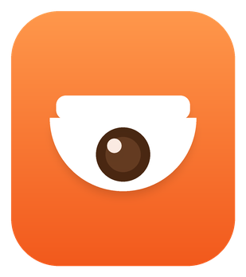
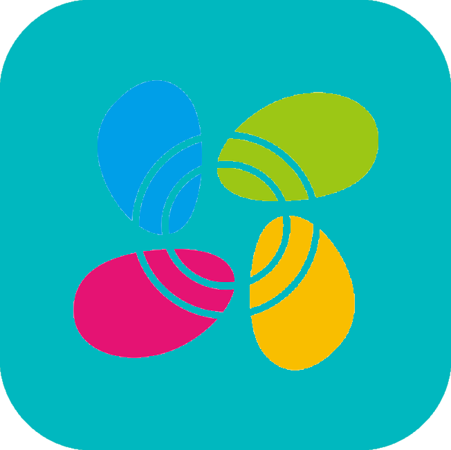

# 

>****
>. . .
>  

| | | | |
|--- | --- | --- | ---|
||AlarmeMyfox|. |  |
||ArmManager| : ). . . .| -    - |
||||  |
|||.|  |
||Arlo|. ... : ...| -    - |
||||  |
|||.)|  |
||Frigate|. . .| -    - |
||Imou|| -    - |
||jeezviz||  |
|||. .   )| -    - |
||OpenALPR||  |
||||  |
||||  |
||||  |
||||  |
|||). ). . .| -    - |
