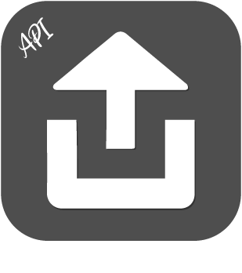
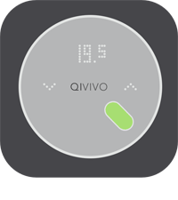
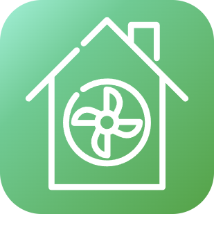

# Confort

>**Wichtig**
>Hier haben nur Contributor-Plugins ihre Dokumentation. Sie können die Dokumentation der offiziellen Plugins direkt vom Jeedom Market abrufen. Klicken Sie im betreffenden Plugin auf Dokumentation.
>Sie können sehen [hier](https://market.jeedom.com/index.php?v=d&p=market&type=plugin&categorie=wellness) Alle offiziellen Plugins in dieser Kategorie

| | | | |
|--- | --- | --- | ---|
||MyVaillant| Plugin zur Integration von Vaillant/Saunier-Duval-Geräten (senso/MiSet, MiPro Sense, multiMATIC-Reihe usw.), die mit einem sensoNET VR92x-, VR7xx- oder MiLink V3-Gateway verbunden sind.   Dieses Plugin betrifft nur Geräte, die mit der MyVaillant- oder MigoLink-App funktionieren.   Mit dem Plugin können Sie Informationen über Ihre Installation abrufen und die meisten verfügbaren Aktionen (Einstellungen, Zeitpläne, Modi) ausführen...).   Das Update erfolgt über API. Das Plugin funktioniert in PHP/JS ohne externe Abhängigkeiten oder Daemons.|[Dokumentation Stall](https://limad.github.io/plugins-docs/plugin-MyVaillant/de_DE/) - [Beta-Dokumentation](https://limad.github.io/plugins-docs/plugin-MyVaillant/de_DE/) [Markt](https://market.jeedom.com/index.php?v=d&p=market_display&id=4404) [Änderungsprotokoll stabil](https://limad.github.io/plugins-docs/plugin-MyVaillant/de_DE/changelog) - [Änderungsprotokoll Beta](https://limad.github.io/plugins-docs/plugin-MyVaillant/de_DE/changelog)|
||Tapfere Kontrolle| Plugin zur Integration von Vaillant/Saunier-Duval-Thermostaten (senso/MiSet, MiPro Sense-Reihe) in Verbindung mit einem VR92x- oder MiLink V3-Gateway.  Dies sind in der Regel Geräte, die mit der sensoApp oder MiControl App arbeiten.  Das Plugin ermöglicht die Erfassung von Informationen aus Ihrer Installation und die Ausführung der meisten verfügbaren Aktionen (Anweisungen, Zeitpläne...). Das Update erfolgt über API .|[Dokumentation Stall](https://limad.github.io/plugins-docs/plugin-VaillantControl/de_DE/) - [Beta-Dokumentation](https://limad.github.io/plugins-docs/plugin-VaillantControl/de_DE/) [Markt](https://market.jeedom.com/index.php?v=d&p=market_display&id=4299) [Änderungsprotokoll stabil](https://limad.github.io/plugins-docs/plugin-VaillantControl/de_DE/changelog) - [Änderungsprotokoll Beta](https://limad.github.io/plugins-docs/plugin-VaillantControl/de_DE/changelog)|
||Balboa SPA|Mit diesem Plugin können Sie eine Verbindung herstellen und Informationen von Ihrem Balboa SPA abrufen. Es bietet auch die Möglichkeit, Betriebsmodi zu erstellen, um mit der ganzen Kraft von Jeedom voranzukommen|[Dokumentation Stall](https://mika-nt28.github.io/Documentations/balboa/de_DE/) [Markt](https://market.jeedom.com/index.php?v=d&p=market_display&id=3712) [Änderungsprotokoll stabil](https://mika-nt28.github.io/Documentations/balboa/de_DE/changelog)|
||Clage|Das Plugin ermöglicht es Ihnen, alle Informationen von seinem HSX-Server von Clage abzurufen. Der HSX-Server ruft Informationen von seinen angeschlossenen Warmwasserbereitern wie MCX 3-7, CEX/CFX, DEX, DSX, DSX Touch, DSX Twin ab. Die Informationen, die auf die Smart Control-Anwendung (iOS, Android) zurückgehen, gehen auch auf das Plugin zurück. Es ist keine Internetverbindung erforderlich, um diese Informationen abzurufen, alles ist lokal.|[Dokumentation Stall](https://flobul-domotique.fr/presentation-et-documentation-du-plugin-clage-pour-jeedom/) [Markt](https://market.jeedom.com/index.php?v=d&p=market_display&id=4303) [Änderungsprotokoll stabil](https://flobul-domotique.fr/liste-des-versions-du-plugin-clage-pour-jeedom/)|
||CVC|Mit diesem Plugin können Sie Thermostate erstellen und verwalten, um ein Zentralheizungssystem in Ihrem Zuhause zu steuern. Es ist in der Lage, jeden Bereich Ihres Hauses entsprechend seinen Anforderungen zu verwalten und die Anforderung entsprechend der Außentemperatur an das richtige Gerät zu richten.|[Dokumentation Stall](http://fobsoft.github.io/jeedom-plugins-documentation/cvc/fr_FR) - [Beta-Dokumentation](http://fobsoft.github.io/jeedom-plugins-documentation/cvc/fr_FR) [Markt](https://market.jeedom.com/index.php?v=d&p=market_display&id=4273) [Änderungsprotokoll stabil](http://fobsoft.github.io/jeedom-plugins-documentation/cvc/de_DE/changelog) - [Änderungsprotokoll Beta](http://fobsoft.github.io/jeedom-plugins-documentation/cvc/de_DE/changelog)|
||ELM Touch|Plugin für die Regelung des Gaskessels von Elm Leblanc mit angeschlossenem Thermostat ELM Touch|[Dokumentation Stall](https://jmvedrine.github.io/jeedom-elmtouch/de_DE/) - [Beta-Dokumentation](https://jmvedrine.github.io/jeedom-elmtouch/de_DE/) [Markt](https://market.jeedom.com/index.php?v=d&p=market_display&id=3281) [Änderungsprotokoll stabil](https://jmvedrine.github.io/jeedom-elmtouch/de_DE/changelog) - [Änderungsprotokoll Beta](https://raw.githubusercontent.com/jmvedrine/jeedom-elmtouch/beta/docs/de_DE/changelog.md)|
||Heta|Steuerungs-Plugin für Heta, AustroFlamm-Pelletöfen, die mit der WiRCU-Box ausgestattet sind|[Dokumentation Stall](https://edeweerdt.github.io/jeedom_heta/de_DE/) [Markt](https://market.jeedom.com/index.php?v=d&p=market_display&id=3646) [Änderungsprotokoll stabil](https://edeweerdt.github.io/jeedom_heta/de_DE/changelog)|
||Hitachi AirCloud|Plugin, das die Verwaltung und den Abruf von Informationen von Wärmepumpen ermöglicht, die von der HITACHI AirCloud Go-Anwendung verwaltet werden.|[Dokumentation Stall](https://taggou91.github.io/jeedom_docs/plugins/hitachiaircloud/de_DE/) [Markt](https://market.jeedom.com/index.php?v=d&p=market_display&id=4497) [Änderungsprotokoll stabil](https://taggou91.github.io/jeedom_docs/plugins/hitachiaircloud/changelog.html)|
||Horoscope|Plugin, um jeden Tag einen Satz (zu verschiedenen Themen) entsprechend den verschiedenen astrologischen Zeichen zu generieren. Sehr schön, das Horoskop morgens einer Person per TTS (zum Beispiel mit der Netatmo-Kamera, die Gesichter erkennt) oder per SMS zu übermitteln.|[Dokumentation Stall](https://jealg.github.io/documentation/plugin-horoscope/de_DE/) - [Beta-Dokumentation](https://jealg.github.io/documentation/plugin-horoscope/de_DE/) [Markt](https://market.jeedom.com/index.php?v=d&p=market_display&id=2727) [Änderungsprotokoll stabil](https://jealg.github.io/documentation/plugin-horoscope/de_DE/changelog) - [Änderungsprotokoll Beta](https://jealg.github.io/documentation/plugin-horoscope/de_DE/changelog_beta)|
||Feuchtigkeitsmanagement|Plugin für das Feuchtigkeitsmanagement dank Luftbefeuchter oder Luftentfeuchter|[Dokumentation Stall](https://agp42.github.io/humidity/de_DE/) [Markt](https://market.jeedom.com/index.php?v=d&p=market_display&id=3978) [Änderungsprotokoll stabil](https://agp42.github.io/humidity/de_DE/changelog)|
||Klereo|Communication avec le module Klereo connect pour gérer votre piscine|[Dokumentation Stall](https://mrwaloo.github.io/jeedom-plugins-doc/de_DE/klereo_doc) - [Beta-Dokumentation](https://mrwaloo.github.io/jeedom-plugins-doc/de_DE/klereo_doc) [Markt](https://market.jeedom.com/index.php?v=d&p=market_display&id=4435) [Änderungsprotokoll stabil](https://mrwaloo.github.io/jeedom-plugins-doc/de_DE/klereo_changelog) - [Änderungsprotokoll Beta](https://mrwaloo.github.io/jeedom-plugins-doc/de_DE/klereo_changelog)|
||Lichttherapie|Mit diesem Plugin können Sie Ihre Licht-/Farbatmosphären verwalten und erstellen.|[Dokumentation Stall](https://mika-nt28.github.io/Documentations/luminotherapie/de_DE/) [Markt](https://market.jeedom.com/index.php?v=d&p=market_display&id=3095) [Änderungsprotokoll stabil](https://mika-nt28.github.io/Documentations/luminotherapie/de_DE/changelog)|
||Migo-Thermostat| Plugin zur Integration von MiGo (Saunier-Duval) und eRelax/Vsmart (Vaillant) Geräten in Jeedom.   Das Plugin ermöglicht die Erfassung von Informationen aus Ihrer Installation und die Ausführung der meisten verfügbaren Aktionen (Anweisungen, Zeitpläne...).   Das Update erfolgt über API.   Kompatibel mit dem mobilen Plugin|[Dokumentation Stall](https://limad.github.io/plugins-docs/plugin-migoThermostat/de_DE/) - [Beta-Dokumentation](https://limad.github.io/plugins-docs/plugin-migoThermostat/de_DE/) [Markt](https://market.jeedom.com/index.php?v=d&p=market_display&id=3447) [Änderungsprotokoll stabil](https://limad.github.io/plugins-docs/plugin-migoThermostat/de_DE/changelog) - [Änderungsprotokoll Beta](https://limad.github.io/plugins-docs/plugin-migoThermostat/de_DE/changelog)|
||MyUplink API|Ce plugin permet de récupérer les informations des pompes à chaleur NiBe depuis le site https://myUplink.com. Ce plugin ne fonctionne pas avec l'ancienne API http://www.nibeuplink.com.|[Dokumentation Stall](https://flobul-domotique.fr/documentation-du-plugin-myuplink-pour-jeedom) [Markt](https://market.jeedom.com/index.php?v=d&p=market_display&id=4236) [Änderungsprotokoll stabil](https://flobul-domotique.fr/liste-des-versions-du-plugin-myuplink-pour-jeedom/)|
||MyUplink Internal API|Ce plugin permet de récupérer les informations des pompes à chaleur NiBe depuis l'API internal du site https://myUplink.com. Ce plugin ne fonctionne pas avec l'ancienne API http://www.nibeuplink.com. En plus des commandes de base, le plugin permet de générer des commandes depuis l'interface console (consommations, durées...)|[Dokumentation Stall](https://flobul-domotique.fr/documentation-du-plugin-myuplink-internal-pour-jeedom) [Markt](https://market.jeedom.com/index.php?v=d&p=market_display&id=4239) [Änderungsprotokoll stabil](https://flobul-domotique.fr/liste-des-versions-du-plugin-myuplink-internal-pour-jeedom/)|
||Netatmo Energie| Plugin zur Integration von Netatmo Energy-Geräten (Thermostat, Ventile, OpenTherm-Thermostat) und Netatmo Weather in Jeedom. Das Plugin ermöglicht die Erfassung von Informationen aus Ihrer Installation und die Ausführung der meisten verfügbaren Aktionen (Anweisungen, Zeitpläne...). Die Aktualisierung erfolgt über API und Webhook-Rückgaben. Kompatibel mit dem mobilen Plugin|[Dokumentation Stall](https://limad.github.io/plugins-docs/plugin-naEnergie/de_DE/) - [Beta-Dokumentation](https://limad.github.io/plugins-docs/plugin-naEnergie/de_DE/) [Markt](https://market.jeedom.com/index.php?v=d&p=market_display&id=3958) [Änderungsprotokoll stabil](https://limad.github.io/plugins-docs/plugin-naEnergie/de_DE/changelog) - [Änderungsprotokoll Beta](https://limad.github.io/plugins-docs/plugin-naEnergie/de_DE/changelog)|
||Qivivo|Integration des Qivivo Thermostats|[Dokumentation Stall](https://kiboost.github.io/jeedom_docs/plugins/qivivo/de_DE/) [Markt](https://market.jeedom.com/index.php?v=d&p=market_display&id=3551) [Änderungsprotokoll stabil](https://kiboost.github.io/jeedom_docs/plugins/qivivo/de_DE/changelog.html)|
||Sensibo Sky|Plugin zur Steuerung des Sensibo Sky-Moduls|[Dokumentation Stall](https://rombautsdidier.github.io/sensibosky/de_DE/) [Markt](https://market.jeedom.com/index.php?v=d&p=market_display&id=4015) [Änderungsprotokoll stabil](https://rombautsdidier.github.io/sensibosky/de_DE/changelog)|
||myVaillant|Plugin, mit dem Sie über sein Internet-Gateway eine Verbindung zu einem myVaillant-System herstellen können, das insbesondere sensoApp und multiMATIC ersetzt (kompatibel mit den Marken Bulex, Saunier Duval, Vaillant). In Jeedom ist es möglich, den Status aller angeschlossenen Geräte zu verfolgen und zu steuern: Definieren Sie den Modus (Ein, Aus, Auto...), Definieren Sie die Solltemperaturen, Aktivieren Sie einen Schnellmodus, Aktivieren Sie einen Zwangsbetrieb... Die an das System angeschlossenen Ventile und Thermostate der ambiSENSE-Reihe werden ebenfalls verwaltet.|[Dokumentation Stall](https://mips2648.github.io/jeedom-plugins-docs/vaillantmultimatic/de_DE/) - [Beta-Dokumentation](https://mips2648.github.io/jeedom-plugins-docs/vaillantmultimatic/de_DE/) [Markt](https://market.jeedom.com/index.php?v=d&p=market_display&id=4164) [Änderungsprotokoll stabil](https://mips2648.github.io/jeedom-plugins-docs/vaillantmultimatic/de_DE/changelog) - [Änderungsprotokoll Beta](https://mips2648.github.io/jeedom-plugins-docs/vaillantmultimatic/de_DE/changelog)|
||CMV (Zehnder/Storkair)|Plugin zur Anbindung eines VMC der Marke Zehnder, auch bekannt unter den Namen Storkair, ComfoAir, Wernig. Modelle: ComfoAir/ComfoD 250/350/450/550, WHR 920/930/950/960|[Dokumentation Stall](https://mips2648.github.io/jeedom-plugins-docs/vmczehnder/de_DE/) - [Beta-Dokumentation](https://mips2648.github.io/jeedom-plugins-docs/vmczehnder/de_DE/) [Markt](https://market.jeedom.com/index.php?v=d&p=market_display&id=3605) [Änderungsprotokoll stabil](https://mips2648.github.io/jeedom-plugins-docs/vmczehnder/de_DE/changelog) - [Änderungsprotokoll Beta](https://mips2648.github.io/jeedom-plugins-docs/vmczehnder/de_DE/changelog)|
