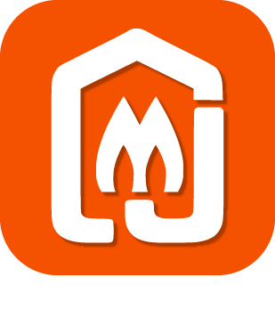

# Confort

>**IMPORTANT**

>Hier haben nur Contributor-Plugins ihre Dokumentation. Sie können die Dokumentation der offiziellen Plugins direkt vom Jeedom Market abrufen. Klicken Sie im betreffenden Plugin auf Dokumentation.
>Sie können sehen [hier](https://market.jeedom.com/index.php?v=d&p=market&type=plugin&categorie=wellness) Alle offiziellen Plugins in dieser Kategorie

| | | | |
|--- | --- | --- | ---|
||Airzone|Plugin zur Integration von AirzoneWeb-Schnittstellen|[Dokumentation](http://www.domoticadavinci.com/desarrollo-de-plugins/airzone-web-plugin-para-jeedom/) - [Markt](https://market.jeedom.com/index.php?v=d&p=market_display&id=3926)|
||IntesisBox|Plugin zur Integration von IntesisBox-Schnittstellen|[Dokumentation](https://nooblenabot.github.io/jeedom-plugin-IntesisBoxWMP/de_DE/) - [Markt](https://market.jeedom.com/index.php?v=d&p=market_display&id=3853)|
||Balboa SPA|Mit diesem Plugin können Sie eine Verbindung herstellen und Informationen von Ihrem Balboa SPA abrufen|[Dokumentation](https://mika-nt28.github.io/Documentations/balboa/de_DE/) - [Markt](https://market.jeedom.com/index.php?v=d&p=market_display&id=3712)|
||ELM Touch|Plugin für die Regelung des Gaskessels von Elm Leblanc mit angeschlossenem Thermostat ELM Touch|[Dokumentation](https://jmvedrine.github.io/jeedom-elmtouch/de_DE/) - [Markt](https://market.jeedom.com/index.php?v=d&p=market_display&id=3281)|
||Heta|Plugin zur Steuerung des Heta-Pelletofens mit WiRCU-Box|[Dokumentation](https://edeweerdt.github.io/jeedom_heta/de_DE/) - [Markt](https://market.jeedom.com/index.php?v=d&p=market_display&id=3646)|
||horoscope||[Dokumentation]() - [Markt](https://market.jeedom.com/index.php?v=d&p=market_display&id=2727)|
||Hottoh||[Dokumentation](https://peofofo.github.io/jeedom_hottoh/de_DE/) - [Markt](https://market.jeedom.com/index.php?v=d&p=market_display&id=3670)|
||Feuchtigkeitsmanagement|Plugin für das Feuchtigkeitsmanagement dank Luftbefeuchter oder Luftentfeuchter|[Dokumentation](https://agp42.github.io/humidity/de_DE/) - [Markt](https://market.jeedom.com/index.php?v=d&p=market_display&id=3978)|
||Jolly Dude|Plugin zur Steuerung Ihres Jolly Mec Ofens|[Dokumentation](https://d-kalck.github.io/plugin-jollymec/de_DE/) - [Markt](https://market.jeedom.com/index.php?v=d&p=market_display&id=3773)|
||Lichttherapie||[Dokumentation](https://mika-nt28.github.io/Documentations/luminotherapie/de_DE/) - [Markt](https://market.jeedom.com/index.php?v=d&p=market_display&id=3095)|
||MelCloud|Ermöglicht die Fernsteuerung Ihrer Heizung und Klimaanlage. |[Dokumentation]() - [Markt](https://market.jeedom.com/index.php?v=d&p=market_display&id=2315)|
||PAC O'Foehn|Plugin zur Steuerung einer O'Foehn-Wärmepumpe|[Dokumentation](https://sattaz.github.io/Jeedom_OFoehn/de_DE/) - [Markt](https://market.jeedom.com/index.php?v=d&p=market_display&id=3769)|
||Piscine||[Dokumentation](https://scadinot.github.io/pool/de_DE/) - [Markt](https://market.jeedom.com/index.php?v=d&p=market_display&id=1801)|
||Qivivo|Integration des Qivivo Thermostats|[Dokumentation](https://kiboost.github.io/jeedom_docs/plugins/qivivo/de_DE/) - [Markt](https://market.jeedom.com/index.php?v=d&p=market_display&id=3551)|
||Thermostat|SSA-Thermostat|[Dokumentation](https://stephdocs.github.io/jeedomThermostat/) - [Markt](https://market.jeedom.com/index.php?v=d&p=market_display&id=2636)|
||Tado|Plugin zur Schnittstelle mit einem Tado-Thermostat|[Dokumentation](https://rosnoun.github.io/jeedom-plugins-docs/tado/de_DE/) - [Markt](https://market.jeedom.com/index.php?v=d&p=market_display&id=3939)|
