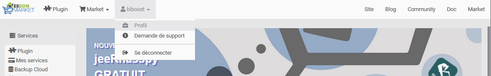

# Erster Schritt

Willkommen zu dieser Dokumentation des ersten Schritts, die Ihnen hilft, Ihr Jeedom in Betrieb zu nehmen.

## Registrierung am Markt

Das erste, was Sie tun müssen, ist, ein Konto auf dem Markt zu erstellen, um Ihr Jeedom darauf registrieren zu können. Klicken Sie auf [hier](https://market.jeedom.com/).

Klicken Sie oben links auf die Schaltfläche "Registrieren" :

Füllen Sie die verschiedenen Felder aus und validieren Sie. Sie sollten sich dann in Ihrem Marktkonto befinden:

## Hinzufügen Ihres Service Pack-Codes

Wenn Sie eine Jeedom-Box gekauft haben, sollten Sie eine E-Mail mit einem Code für Ihr Service Pack erhalten haben.

> **Wichtig**
>
> Es ist wichtig, es auszufüllen, da Sie mit diesem Code kostenlos auf bestimmte Plugins sowie auf exklusive Dienste zugreifen können.

> **Wichtig**
>
> Wenn Sie ein Service Pack auf dem Jeedom Market kaufen, haben Sie nichts zu tun, es wird Ihnen automatisch zugewiesen.

Sobald der Code aus der E-Mail abgerufen wurde, müssen Sie nur noch zu gehen [Jeedom Markt](https://market.jeedom.com/) und identifiziere dich.

Dann gehen Sie zu Ihrer Profilseite:

Klicken Sie dann auf die Registerkarte „Meine Dienste“, geben Sie Ihre Service Pack-Nummer ein und bestätigen Sie.

> **Spitze**
>
> Wenn Sie eine offizielle Jeedom-Box gekauft haben, sollte die Service Pack-Nummer per E-Mail an Sie gesendet worden sein. Wenn Sie nichts erhalten haben, wenden Sie sich bitte an das Geschäft, in dem Sie Ihre Box gekauft haben.

## Finden Sie Ihr Jeedom im Netzwerk

Sobald Jeedom elektrisch verbunden und mit Ihrem lokalen Netzwerk verbunden ist, erfahren Sie hier, wie Sie eine Verbindung herstellen.

### Finde Jeedom

#### Durch den Markt

Die einfachste Lösung (funktioniert jedoch je nach Konfiguration Ihres Internetzugangs nicht in 100 % der Fälle): Sie müssen die Box starten und etwa 10 Minuten warten (seien Sie vorsichtig, wenn Sie ein Image vom Typ „Netzinstallation“ verwenden, es wird eher so aussehen 30 Minuten) und los [hier](https://www.jeedom.com/market/index.php?v=d&p=find)

> **Spitze**
>
> Bitte beachten Sie, dass Sie sich im selben Netzwerk wie die Jeedom-Box befinden müssen, damit diese Methode funktioniert.

> **Wichtig**
>
> Abhängig von Ihrer ADSL-Box funktioniert diese Funktion möglicherweise nicht. Wenn ja, nichts Ernstes, müssen Sie nur eine Verbindung zu Ihrer ADSL-Box herstellen und die Jeedom-IP darin finden. Dieser Schritt gibt Ihnen nur die lokale IP Ihres Jeedom. Dies ist nicht der Fall, wenn das Hinzufügen Ihres Jeedom zu Ihrem Marktkonto abgeschlossen ist.

#### Durch Ihre Internetbox

-   Gehen Sie zur Administrationsoberfläche Ihrer Internetbox und suchen Sie in Ihren Netzwerkgeräten nach Jeedom.
-   Holen Sie sich seine IP.
-   Geben Sie diese IP in Ihren Internetbrowser ein. Sie sollten sich auf der Jeedom-Oberfläche befinden.

## Erste Verbindung

Unabhängig davon, welche Methode verwendet wird, gelangen Sie auf die Anmeldeseite. Standardmäßig lauten Login und Passwort "admin"".

## Verknüpfe mein Jeedom mit meinem Marktkonto

Wir werden hier sehen, wie Sie Ihr Jeedom mit Ihrem Marktkonto verknüpfen können.

-   Sobald Sie mit Ihrer Freiheit verbunden sind, müssen Sie zu gehen **Einstellungen → System → Konfiguration**.
-   Klicken Sie auf die Registerkarte **Updates / Markt**.
-   Klicken Sie unten auf die Registerkarte **Markt**.
-   Aktivieren Sie das Kontrollkästchen **Aktivieren**.
-   Remplissez l'adresse : `https://market.jeedom.com`.
-   Füllen Sie auch die Felder aus **Benutzername** und **Passwort** basierend auf Ihren Kennungen (Marktkennungen und nicht Jeedom).
-   Sie können testen, ob die Verbindung korrekt hergestellt wurde.
-   Vergiss nicht zu sparen !

Weitere Informationen finden Sie auf der Konfigurationsseite unter *Konfigurationshandbuch -> Administration*.

## Holen Sie sich meine direkte Zugriffs-URL

Wenn Sie ein Service Pack haben, bietet Jeedom Ihnen eine direkte Zugriffs-URL zu Ihrem Jeedom, ohne die Ports an Ihrer Box oder einer anderen öffnen zu müssen.

Um es zu konfigurieren, gehen Sie einfach zu Einstellungen → System → Konfiguration

Gehen Sie dann zum Teil "Netzwerke""

Sobald Sie hier sind, aktivieren Sie einfach **Verwenden von Jeedom DNS** dann auf der Linie **Verwaltung** zu tun **Neu starten** und Ihre URL wird auf HTTP-Statusebene angezeigt. Sie können sie natürlich auf der Marktprofilseite anpassen.

> **Wichtig**
>
> Wenn Sie gerade Ihr Jeedom mit Ihrem Market-Konto verknüpft haben, müssen Sie 24 bis 48 Stunden warten, bevor Sie den DNS-Dienst verwenden können

## Ändern Sie das Standardkennwort von Jeedom

Einer der wichtigen Schritte besteht darin, das Standardkennwort Ihres Jeedom-Kontos zu ändern. Klicken Sie dazu auf Einstellungen → System → Benutzer:

Sobald Sie darauf sind, müssen Sie nur noch die Leitung mit dem Benutzer auswählen **admin** und klicken Sie auf **Passwort** :

In einem Fenster werden Sie nach dem Passwort gefragt. Denken Sie gut daran, sonst können Sie nicht mehr auf Ihr Jeedom zugreifen.

## Erstelle mein erstes Objekt

Sie werden Ihr erstes Objekt erstellen, aber zuerst müssen Sie wissen, was ein Objekt ist.

In Jeedom kann es alles und jedes sein, aber es wird empfohlen, es entsprechend Ihren Räumen zu tun.

> **Spitze**
>
> Es ist möglich, Beziehungen zwischen Objekten zu definieren. Exemple : Das Wohnzimmer gehört zum Objekt im Erdgeschoss, das selbst zum Hausobjekt gehört.

Nichts könnte einfacher sein, ein Objekt zu erstellen :

-   Gehen Sie zu Extras → Objekte.
-   Klicken Sie auf die Schaltfläche Hinzufügen.
-   Jeedom wird dich nach dem Namen fragen. Validieren. Dies ist Ihr erstes erstelltes Objekt :

Weitere Informationen zu diesem Teil finden Sie unter *Benutzerhandbuch -> Objekt*.

## Installiere mein erstes Plugin

Ein Plugin ermöglicht das Hinzufügen von Funktionen zu Jeedom. Es gibt Hunderte. Viele sind kostenlos, andere können kostenpflichtig sein. Um auf die Plugins-Seite zuzugreifen, gehen Sie zu Plugins → Plugins-Verwaltung.

Dann klicken Sie einfach auf Markt:

Sie haben dann die Liste aller Plugins, die installiert werden können.

> **Wichtig**
>
> Bitte beachten Sie, dass einige offiziell sind und andere nicht. Im Falle eines Problems mit einem inoffiziellen Plugin kann das Jeedom-Team nicht verantwortlich gemacht werden.

Durch Klicken auf ein Plugin erhalten Sie dessen Datei:

Sie finden dann :

- Schaltflächen zum Installieren des Plugins : Die stabile Version wird dringend empfohlen,
- Eine Schaltfläche zum Entfernen des Plugins,
- Eine kurze Beschreibung,
- Ein Link zur Plugin-Dokumentation,
- Ein Link zum Changelog (die neuesten Änderungen),
- Kompatibilität mit verschiedenen Plattformen,
- Nutzerbewertungen,
- Wie man das Plugin benutzt,
- Zusätzliche Informationen wie der Autor, der Link zur Forumsdiskussion zu diesem Plugin, das Datum des letzten Updates usw.

Weitere Informationen zu Plugins, *Benutzerhandbuch -> Plugin*.

# Support

Jeedom befasst sich mit sehr weiten Feldern und entwickelt sich von Tag zu Tag weiter.
Es gibt jedoch viele Möglichkeiten, Hilfe zu finden und Ihre Fragen zu stellen.

## Das Forum

Sie werden es finden [hier](https://community.jeedom.com/).

Das Forum ist sehr aktiv und enthält viele Informationen. Wenn Sie eine Frage haben, zögern Sie nicht, sie zu stellen. Sie haben eine Antwort in weniger als einer Stunde (im Durchschnitt)). Bitte beachten Sie, dass das Forum von der Jeedom-Community, die sich aus Freiwilligen zusammensetzt, und nicht von der Jeedom-Firma unterhalten wird.

## Supportanfragen (oder Tickets)

> **Wichtig**
>
> Bitte beachten Sie, dass alle Supportanfragen ein Konto auf dem Markt haben müssen.

Wenn Sie als letztes Mittel keine Lösung für Ihr Problem gefunden haben, können Sie das Jeedom-Team um Unterstützung bitten. Diese Anfrage geht durch ein Ticket. Es gibt verschiedene Möglichkeiten, eine zu öffnen:

-   Direkt von Jeedom (empfohlene Methode): Einstellungsmenü → Supportanfrage.
-   Wenn Sie aus irgendeinem Grund keinen Zugang zu Ihrem Jeedom haben, können Sie jederzeit ein Ticket vom Markt öffnen :
    -   Klicken Sie entweder auf Ihren Namen und dann auf *Supportanfrage*,
    -   entweder indem Sie zu Ihrem Profil gehen, dann in den Abschnitt **Tickets**, Verwenden Sie die Schaltfläche "Supportanfrage öffnen".

Alle weiteren Austausche erfolgen per E-Mail.

> **Spitze**
>
> Wenn beim Öffnen eines Tickets eine Fehlermeldung angezeigt wird, dass Sie Ihr Kontingent erreicht haben, sind Sie abhängig von Ihrem Service Pack auf eine bestimmte Anzahl von Supportanfragen pro Monat beschränkt.

Die verschiedenen Service Packs sind :
- Community (kostenlos): 2 Tickets / Monat (nur für kostenpflichtige Plugins)
- Power : 10 Tickets / Monat
- Pro : 100 Tickets / Monat

Sie finden die Details der Service Packs [hier](https://www.jeedom.com/site/fr/soft.html#obtenir).

>**Wichtig**
>
>Seien Sie vorsichtig, wir sehen viele Benutzer mit „mailinblack“-Postfächern, die beim ersten Austausch den Absender bitten, einen Link zu bestätigen, um zu beweisen, dass es sich tatsächlich um einen Menschen handelt. Dieses System ist nicht mit unserem Ticketsystem kompatibel. Selbst wenn wir Ihnen antworten, erhalten Sie die Antwort nie in Ihrem Postfach, da es uns blockiert. Geben Sie daher bitte auf Ihrer Marktprofilseite eine E-Mail-Adresse an, die dieses System nicht nutzt, sonst erhalten Sie nie unsere Antwort.
