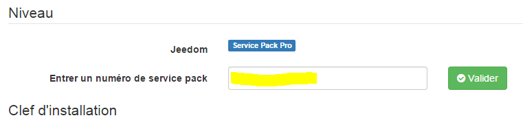
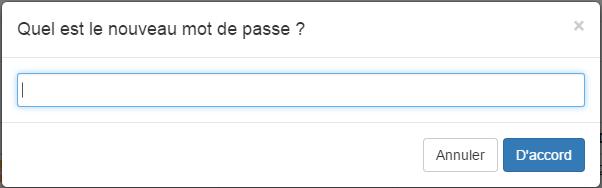
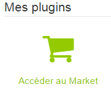

Willkommen zu dieser Dokumentation der ersten Schritte, diese wird
Hilf mit, dein Jeedom einzurichten.

> **Spitze**
>
> Dieses Handbuch ersetzt nicht die vollständige Dokumentation
> verfügbar auf der Jeedom-Website [hier](https:// jeedom.fr/doc).

Registrierung am Markt 
=========================

Als erstes müssen Sie ein Konto auf dem Markt für erstellen
Klicken Sie hier, um Ihr Jeedom zu registrieren
[ici](https://www.jeedom.com/market) pour commencer

Klicken Sie oben rechts auf die Schaltfläche "Registrieren":

Füllen Sie die verschiedenen Felder aus und validieren Sie. Sie werden dann rüberkommen
diese Seite:

Hier wird Ihr Marktkonto erstellt, um weitere Informationen zum Markt zu erhalten
Klicken Sie auf
[ici](https://www.jeedom.fr/doc/documentation/core/de_DE/doc-core-market.html)

Hinzufügen Ihres Service Pack-Codes 
================================

Wenn Sie eine Jeedom-Box gekauft haben, sollten Sie eine E-Mail erhalten haben
mit einem Code für Ihr Service Pack.

> **Wichtig**
>
> Es ist wichtig, es auszufüllen, da Sie mit diesem Code Zugriff haben
> bestimmte Plugins kostenlos sowie exklusive Dienste.

> **Wichtig**
>
> Wenn Sie ein Service Pack auf dem Jeedom Markt kaufen, haben Sie es nicht
> nichts zu tun, es wird Ihnen automatisch zugewiesen.

Sobald der Code in der Mail abgerufen wurde, müssen Sie nur noch zu gehen
[market Jeedom](https://market.jeedom.fr) et de vous identifier.

Dann gehen Sie zu Ihrer Profilseite:

Klicken Sie dann auf die Registerkarte "Meine Jeedoms""

Geben Sie Ihre Service Pack-Nummer ein und bestätigen Sie:

Hier ist Ihr Service Pack registriert. Weitere Details zum
Marktklick
[ici](https://github.com/jeedom/core/blob/stable/doc/de_DE/market.asciidoc)

> **Spitze**
>
> Wenn Sie eine offizielle Jeedom-Box gekauft haben, die Servicenummer
> Pack sollte per E-Mail an Sie gesendet worden sein. Wenn Sie nichts erhalten haben, danke
> um das Geschäft zu kontaktieren, in dem Sie Ihre Box gekauft haben.

Finden Sie Ihr Jeedom im Netzwerk 
==================================

Sobald Jeedom elektrisch verbunden und mit Ihrem lokalen Netzwerk verbunden ist,
Hier erfahren Sie, wie Sie eine Verbindung herstellen.

Finde Jeedom 
--------------

### Durch den Markt 

Einfachste Lösung (funktioniert aber in 100% der Fälle nicht in
Abhängig von der Konfiguration Ihres Internetzugangs müssen Sie starten
Warten Sie in der Box etwa 10 Minuten (seien Sie vorsichtig, wenn Sie eine verwenden
Bild vom Typ Netzinstallation, es wird eher 30 Minuten dauern) und los geht's
[ici](https://www.jeedom.com/market/index.php?v=d&p=find)

> **Spitze**
>
> Achtung, Sie müssen sich im selben Netzwerk befinden wie die Jeedom-Box für
> Diese Methode funktioniert.

> **Wichtig**
>
> Abhängig von Ihrer ADSL-Box funktioniert diese Funktionalität möglicherweise nicht.
> Wenn ja, nichts Ernstes, melden Sie sich einfach bei an
> Ihre ADSL-Box und finden Sie die jeedom IP darin. Dieser Schritt
> tut nichts anderes, als Ihnen die lokale IP Ihres Jeedom zu geben.
> Es ist dann nicht so, dass Sie Ihr Jeedom Ihrem Konto hinzufügen
> Markt ist fertig.

### Durch Ihre Internetbox 

-   Gehen Sie zur Administrationsoberfläche Ihrer Internetbox und
    Suchen Sie Jeedom in Ihren Netzwerkgeräten.

-   Holen Sie sich seine IP.

-   Geben Sie diese IP in Ihren Internetbrowser ein. Du solltest sein
    auf der Jeedom-Schnittstelle.

Erste Verbindung 
------------------

Welche Methode auch immer verwendet wird, Sie gelangen dann auf die Seite von
Login. Standardmäßig lauten Login und Passwort "admin"".

Verknüpfe mein Jeedom mit meinem Marktkonto 
===================================

Wir werden hier sehen, wie Sie Ihr Jeedom mit Ihrem Marktkonto verknüpfen können.

-   Sobald Sie mit Ihrer Freiheit verbunden sind, müssen Sie zu gehen
    Administration → Konfiguration

-   Klicken Sie auf die Registerkarte **Updates**

-   Klicken Sie unten auf die Registerkarte **Markt**

-   Aktivieren Sie das Kontrollkästchen **Aktivieren**

-   Geben Sie die Adresse ein : `https://www.jeedom.com/market`

-   Füllen Sie auch die Felder "Benutzername" und "Passwort" aus."
    basierend auf Ihren Kennungen (Marktkennungen und nicht
    Jeedom)

-   Sie können testen, um die Verbindung zu überprüfen
    ist richtig gemacht.

-   Vergiss nicht zu sparen !

Für weitere Details auf der Konfigurationsseite klicken Sie auf
[ici](https://github.com/jeedom/core/blob/stable/doc/de_DE/administration.asciidoc)
.

Holen Sie sich meine direkte Zugriffs-URL 
==============================

Wenn Sie ein Service Pack haben, erhalten Sie von Jeedom eine URL
Direkter Zugriff auf Ihr Jeedom, ohne die Ports öffnen zu müssen
deine Box oder andere.

Um es zu konfigurieren, gehen Sie einfach zu
Allgemein → Administration → Konfiguration

Gehen Sie dann zum Abschnitt "Netzwerkkonfiguration""

Sobald Sie hier sind, müssen Sie nur noch "Use Jeedom DNS" aktivieren
Klicken Sie in der Zeile "Verwaltung" auf "Neustart", und Ihre URL wird unter angezeigt
Auf HTTP-Statusebene können Sie diese natürlich anpassen
die Marktprofilseite

> **Wichtig**
>
> Wenn Sie gerade Ihr Jeedom mit Ihrem Marktkonto verknüpft haben, müssen Sie dies tun
> Warten Sie 24 bis 48 Stunden, bevor Sie den DNS-Dienst verwenden können

Ändern Sie das Standardkennwort von Jeedom 
============================================

Einer der wichtigen Schritte ist das Ändern des Standardkennworts von
Klicken Sie in Ihrem Jeedom-Konto auf Administration → Benutzer
(oben rechts):

Sobald Sie darauf sind, müssen Sie nur noch die Leitung mit dem Benutzer auswählen
**admin** und klicken Sie auf **Passwort ändern** :

In einem Fenster werden Sie nach dem Passwort gefragt. Achten Sie auf die
Denken Sie daran, sonst können Sie nicht mehr auf Ihr Jeedom zugreifen :

Hier haben Sie das Passwort für das Administratorkonto geändert, um mehr zu erfahren
Informationen auf dieser Seite klicken
[ici](https://github.com/jeedom/core/blob/stable/doc/de_DE/user.asciidoc).

Erstelle mein erstes Objekt 
=======================

Sie werden Ihr erstes Objekt erstellen, aber zuerst müssen Sie wissen, was
Was ist ein Objekt?.

In Jeedom kann es alles und jedes sein, aber es ist
empfohlen, es entsprechend Ihren Teilen zu tun.

> **Spitze**
>
> Es ist beispielsweise möglich, Beziehungen zwischen Objekten zu definieren:
> Das Wohnzimmer gehört zum Objekt im Erdgeschoss, das selbst gehört
> zum Hausobjekt.

Nichts könnte einfacher sein, ein Objekt zu erstellen :

-   Gehen Sie zu Extras → Objekte

-   Klicken Sie auf die Schaltfläche Hinzufügen:

-   Jeedom wird dich nach dem Namen fragen:

-   Validieren. Dies ist Ihr erstes erstelltes Objekt :

Für weitere Informationen zu diesem Teil klicken Sie auf
[ici](https://github.com/jeedom/core/blob/stable/doc/de_DE/object.asciidoc)

Installiere mein erstes Plugin 
============================

Ein Plugin ermöglicht das Hinzufügen von Funktionen zu Jeedom. Es gibt einige
Hunderte. Viele sind kostenlos, andere können kostenpflichtig sein.
Um auf die Plugins-Seite zuzugreifen, gehen Sie zu Plugins → Verwalten
Plugins.

Dann klicken Sie einfach auf Markt:

Sie haben dann die Liste aller möglichen Plugins
zu installieren.

> **Wichtig**
>
> Bitte beachten Sie, dass einige offiziell sind und andere nicht. Im Falle einer Besorgnis
> Mit einem inoffiziellen Plugin kann das Jeedom-Team nicht festgehalten werden
> verantwortlich.

Durch Klicken auf ein Plugin erhalten Sie dessen Datei:

Sie finden dann : 

- Schaltflächen zum Installieren des Plugins : Die stabile Version wird dringend empfohlen, 
- eine Schaltfläche zum Entfernen des Plugins, 
- eine kurze Beschreibung, 
- ein Link zur Plugin-Dokumentation, 
- ein Link zum Changelog (die letzten vorgenommenen Änderungen), 
- Kompatibilität mit verschiedenen Plattformen, 
- Nutzerbewertungen, 
- wie man das Plugin benutzt, 
- zusätzliche Informationen wie der Autor, der Link zur Forumsdiskussion zu diesem Plugin, das Datum des letzten Updates usw..

Für weitere Informationen zu Plugins klicken Sie auf [hier](https:// jeedom.github.io/core/de_DE/plugin).

Unterstützung 
=======

Jeedom befasst sich mit sehr weiten Feldern und entwickelt sich von Tag zu Tag weiter.
Es gibt jedoch viele Möglichkeiten, die Sie finden können
Hilfe und stellen Sie Ihre Fragen.

Jeedom Dokumentation 
--------------------------

Eine vollständige Dokumentation finden Sie [hier](https:// jeedom.fr / doc):

Dies besteht aus mehreren Kategorien:

-   Kern : ein Teil für das "Herz" von Jeedom,

-   Erste Schritte : Ein Abschnitt (wo Sie gerade sind) für
    erste Dinge zu wissen,

-   Installation : Alles über die Installation von Jeedom,

-   Howto : Tutorials zum Fortschritt in verschiedenen Bereichen,

-   Plugins : Die Dokumentation der verschiedenen offiziellen Plugins aus
    Jeedom,

-   die anderen : verschiedene Seiten zu den verschiedenen verwendeten Protokollen
    in Jeedom, die Darstellung von Jeedom, Listen von
    Kompatibilität usw..

Nachfolgend finden Sie auch die Liste der Dokumentationen für
Plugins von Drittanbietern.

Fühlen Sie sich frei, die Funktion zu nutzen **Suchen nach** oben rechts von
Seite, um Seiten zu finden, die auf einem bestimmten Wort basieren.

Das Forum 
--------

Sie finden es [hier](https:// jeedom.com / forum) .

Das Forum ist sehr aktiv und enthält viele Informationen. Wenn du
Haben Sie eine Frage, zögern Sie nicht, sie zu stellen. Sie werden eine Antwort in haben
weniger als eine Stunde (im Durchschnitt). Bitte beachten Sie, dass das Forum ist
unterhalten von der Jeedom-Gemeinschaft, bestehend aus Freiwilligen, und nicht von der
Jeedom Firma.

Unterstützunganfragen (oder Tickets) 
------------------------------------

> **Wichtig**
>
> Bitte beachten Sie, dass jede Unterstützunganfrage vorliegen muss
> ein Konto auf dem Markt.

Wenn Sie keine Lösung für Ihr Problem gefunden haben, zuletzt
Rückgriff können Sie Unterstützung vom Jeedom-Team anfordern.
Diese Anfrage geht durch ein Ticket. Es ist möglich, eine von zu öffnen
viele Möglichkeiten:

-   Direkt von Jeedom (empfohlene Methode): wo immer du bist
    In Jeedom befindet sich oben rechts ein Ausrufezeichen
    Hier können Sie Unterstützung anfordern :

-   Wenn Sie aus irgendeinem Grund keinen Zugriff auf Ihre haben
    Jeedom, Sie können jederzeit ein Ticket vom Markt öffnen :

    -   entweder mit dem Ausrufezeichen oben rechts,

    -   Gehen Sie entweder zu Ihrem Profil (und klicken Sie dann auf die Schaltfläche
        "Unterstützunganfrage öffnen ").

Alle weiteren Austausche erfolgen per E-Mail.

> **Spitze**
>
> Wenn beim Öffnen eines Tickets eine Fehlermeldung angezeigt wird
> Wenn Sie Ihr Kontingent erreicht haben, sind Sie auf eines beschränkt
> Anzahl der Unterstützunganfragen pro Monat, abhängig von Ihrer
> Service Pack.

Die verschiedenen Service Packs sind : \ * Community (kostenlos): 2
Tickets / Monat (nur für kostenpflichtige Plugins) \ * Power: 10 Tickets / Monat
\ * Pro: 100 Tickets / Monat

Sie finden die Details der Service Packs
[ici](https://www.jeedom.com/site/fr/soft.html#obtenir)
