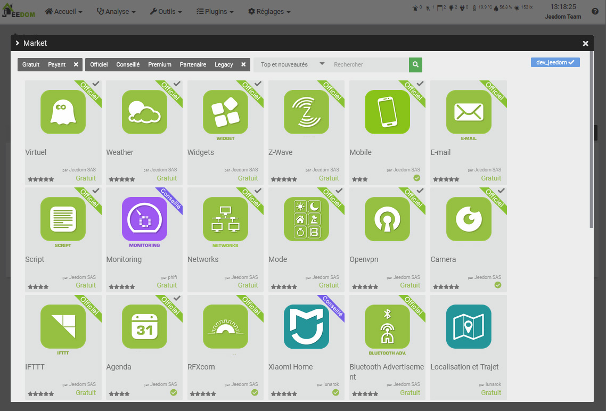
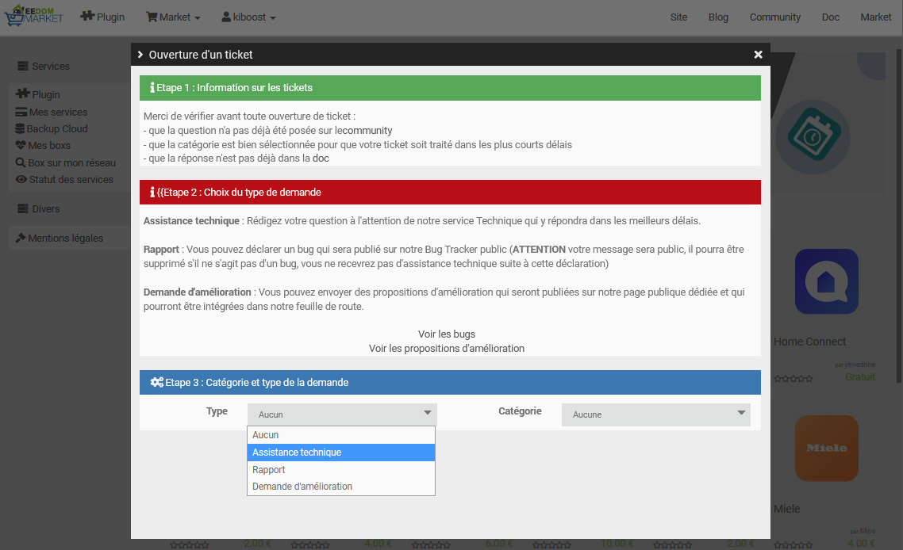

# 

.

## Interface

.

### 

.  :

#### 

 [****](https://www.jeedom.com/market/index.php?v=d&p=find){:"}.

>****
>
>
>.

#### Routeur

.

La plupart propose une liste des appareils/périphériques connectés, avec leur nom d'hôte, adresse MAC et adresse IP. Recherchez un périphérique nommé “Jeedom” ou identifiez-le via son adresse MAC.

>****
>
>.

#### 

.

-    :

  |             |    |
  |--------------------|--------------------|
  | **** | [http://jeedomluna.local](http://jeedomluna.local){:"} |
  | **** | [http://jeedomatlas.local](http://jeedomatlas.local){:"} |
  | **** | [http://jeedomsmart.local](http://jeedomsmart.local){:"} |
  | **** *()* | [http://jeedom.local](http://jeedom.local){:"} |
  | **** | [http://jeedomfreebox.local](http://jeedomfreebox.local){:"} |

- ). .

  L'adresse de l'interface Jeedom doit normalement correspondre à : `http://MACHINE.DOMAIN`.

#### 

 ,  :



 :
sh
 |  ' | 

### 

,  :

{% include lightbox.html src="images/FirstStep_box_connect.jpg" data="FirstStep_box_connect" title="Connexion Jeedom" imgstyle="width:75%;display:block;margin:0 auto;" %}

>****
>
> : .

. ****.

 ****  ****)* :

{% include lightbox.html src="images/FirstStep_boxPassword.jpg" data="FirstStep_boxPassword" title=" admin" imgstyle="width:75%;display:block;margin:0 auto;" %}

>****
>
>.

## Market

.

### Inscription

 [****](https://www.jeedom.com/market/index.php?v=d&p=register){:"} :

{% include lightbox.html src="images/FirstStep_market1.jpg" data="FirstStep_market1" title="  Jeedom" imgstyle="width:75%;display:block;margin:0 auto;" %}

 :

{% include lightbox.html src="images/FirstStep_market2.jpg" data="FirstStep_market2" title="Accueil  Jeedom" imgstyle="width:75%;display:block;margin:0 auto;" %}

### 

 ****, .

 ****  [****](https://www.jeedom.com/market/index.php?v=d&p=profils#services){:"}.

>****
>
>.

### 

 ****.

 ****,  ** : **  :

-  : 
- Adresse : `https://market.jeedom.com`
-  : 
-  : 

>****
>
> **** .

### 

 **** *()*, .

 ****,  **** :

{% include lightbox.html src="images/FirstStep_dns.jpg" data="FirstStep_dns" title=" Jeedom" imgstyle="width:75%;display:block;margin:0 auto;" %}

 ****,  **(**. .

>****
>
>.

 ****  [****](https://www.jeedom.com/market/index.php?v=d&p=profils#services){:"}.

 .

## 

.

.

> ****
>
> . Exemple : .

 :

-   .
-   .
-   .  :

 **.

## 

. . . .

:

.

> ****
>
> . .

:

 :

-  : ,
- ,
- ,
- ,
- ),
- ,
- ,
- ,
- .

, **.

# Support

.
.

## 

 .

. . ). .

## )

> ****
>
> .

. . :

-   : .
-    :
    -    **,
    -    ****, ".

.

> ****
>
> .

 :
- : )
- Power : 
- Pro : 

 .

>****
>
>. . .
