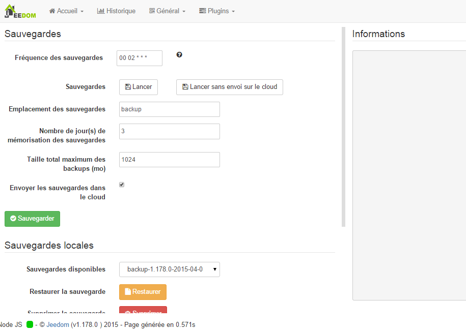

Präsentation
===

.

-   *Szenario,*

-   *,*

-   *Anzeigen,*

-   *Interaktion,*

-   *.*

 :

-   ,

-   ,

-   ,

-   ,

-   ,

-   ,

-   .

.

. 

Prinzip
=== 

. 
.

.

Links
===

.

. 
.

 :

-   [Tuto Jeedom \#1 : Zuerst
    :?

-   [Tuto Jeedom \#2 : 
    , :?

-   [Tuto Jeedom \#3 : 
    :?

-   [Tuto Jeedom \#4 : 
    :?

-   [Tuto Jeedom \#5 : 
    :?

-   [Tuto Jeedom \#6 : 
    :?

-   [Tuto Jeedom \#7 : 
    :?

-   [Tuto Jeedom \#8 : 
    :?

-   [Tuto Jeedom \#9 : 
    :?

-   [Tuto Jeedom \#10 : 
    :?

-   [Tuto Jeedom \#11 : 
    :?

-   [Tuto Jeedom \#12 : 
    :?

-   [Tuto Jeedom \#13 : 
    :?

-   [Tuto Jeedom \#14 : 
    :? 