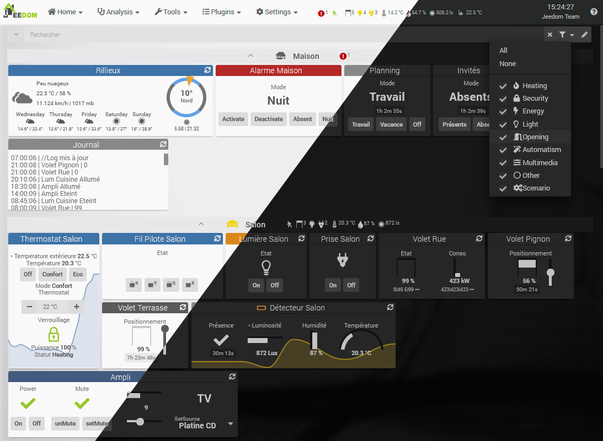

Präsentation
===

Jeedom ist eine Open Source und * Cloudless * Hausautomationslösung (ohne Server in der Cloud). Es funktioniert ohne Abonnement, was das Funktionieren Ihrer Hausautomation ohne Internet sowie die Sicherheit Ihrer Daten garantiert.. Es ist außerdem extrem offen, multiprotokollierbar, anpassbar und hoch skalierbar.

Jeedom bietet einen Kern, den Kern, der die Struktur und die zentralen Funktionen einbettet.

Différents (plugins)[https://market.jeedom.com] kann dann neue Funktionen vorschlagen.

Der Kern enthält:

- Zugriff auf das Dashboard oder die Synthese.

*Geräte, einschließlich Aktuatoren oder Sensoren, sind nach Objekten organisiert. Objekte können beispielsweise physische Teile darstellen*.

- Eine besonders vollständige Szenario-Engine.

- Die Historisierung von Informationen.

- Eine Interaktionsmaschine.

- Verwaltung von Updates (Core und Plugins) und Backups.

Market
===

Um diesen Kern herum befinden sich Plugins, die aller Art sein können :

-   Hausautomationsprotokoll (Z-Wave, RFXcom, EnOcean…),
-   IP-Protokoll (KNX, xPL…),
-   Kommunizierendes Objekt (Nest, Netatmo…),
-   Hoher Pegel (Alarm, Thermostat ...),
-   Schnittstelle (Widget),
-   Organisation (Kalender, Google Kalender),
-   Entwicklung (Skript).

Diese Plugins können vom Markt installiert werden und ermöglichen es Ihnen, die Möglichkeiten von Jeedom zu erweitern.

Jeedom ermöglicht es jedem Plugin, standardisiert mit einem anderen zu chatten. Dies ermöglicht zum Beispiel die Verwendung des Thermostats oder der Alarm-Plugins mit einem beliebigen Hausautomationsprotokoll oder sogar einem IP-Plugin oder einem kommunizierenden Objekt ...

Liens
===

Es wurden mehrere Video-Tutorials erstellt, um die wichtigen Funktionen von Jeedom zu zeigen, seine Verwendung zu erleichtern und den Benutzer mit der Software vertraut zu machen..

Seit der Realisierung dieser Tutorials konnte sich die Jeedom-Oberfläche jedoch weiterentwickeln und Funktionen hinzufügen. Die Dokumentation bleibt daher die Referenz, die bei Bedarf, Fragen usw. konsultiert werden muss..

Hier ist die Liste der verfügbaren Tutorials :

-   [Jeedom Tutorial 1 : Erster Start](https://www.youtube.com/watch?v=UTECRBGEUtI)
-   [Jeedom 2 Tutorial : Erste Schritte mit Jeedom (Objekt, Markt, Plugin, Modul)](https://www.youtube.com/watch?v=2LU1neNvbus)
-   [Jeedom 3 Tutorial : Jeedom, Widgets, Mails und Szenarien](https://www.youtube.com/watch?v=OJn33XbpiH8)
-   [Jeedom 4 Tutorial : Jeedom, Verwenden des Agenda-Plugins](https://www.youtube.com/watch?v=EBuvIabg3Cc)
-   [Jeedom 5 Tutorial : Skripte in Jeedom mit dem Skript-Plugin](https://www.youtube.com/watch?v=FRbQILAogX0)
-   [Jeedom 6 Tutorial : Szenarien in Jeedom mit dem Wetter-Plugin](https://www.youtube.com/watch?v=w0ErP3wyEoA)
-   [Jeedom 7 Tutorial : Präsentation des Energy Plugins](https://www.youtube.com/watch?v=DZfA_DxqbNs)
-   [Jeedom 8 Tutorial : Entdeckung des Planmodus](https://www.youtube.com/watch?v=2IkXF6CBCAE)
-   [Jeedom 9 Tutorial : DataTransfert Plugin, Auto Backups und Dropbox](https://www.youtube.com/watch?v=wLOfJygFc8k)
-   [Jeedom 10 Tutorial : Lass Jeedom sprechen (Android)](https://www.youtube.com/watch?v=3Pc3VJFWHo4)
-   [Jeedom 11 Tutorial : Erkennungsfenster einer Standardinstallation](https://www.youtube.com/watch?v=hW1d1FvkmSs)
-   [Jeedom 12 Tutorial : Entdeckung des Thermostat-Plugins](https://www.youtube.com/watch?v=T21gqp1SQK0)
-   [Jeedom 13 Tutorial : Entdeckung des Alarm-Plugins](https://www.youtube.com/watch?v=JjnWeU614gc)
-   [Jeedom Tutorial 14 : Entdeckung von Interaktionen](https://www.youtube.com/watch?v=Z8SHo_Xwk0Q)
