# Kompatibilität von ZigBee-Modulen

# 3A Smart Home DE

|Image|Marque|Nom|Type|Remarque|Lien|
|---|---|---|---|---|---|
|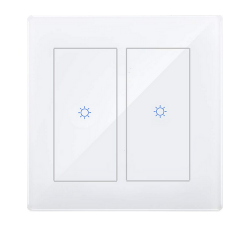|3A Smart Home DE|SFLS-PP LP drahtloses Vorschaltgerät||||
||3A Smart Home DE|Smart Plug + 2 USB-Anschlüsse||||
|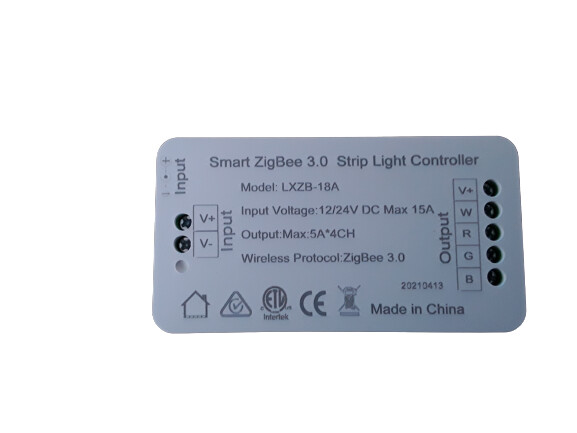|3A Smart Home DE|ZigBee 3.0 ZLL RGB Licht||||
|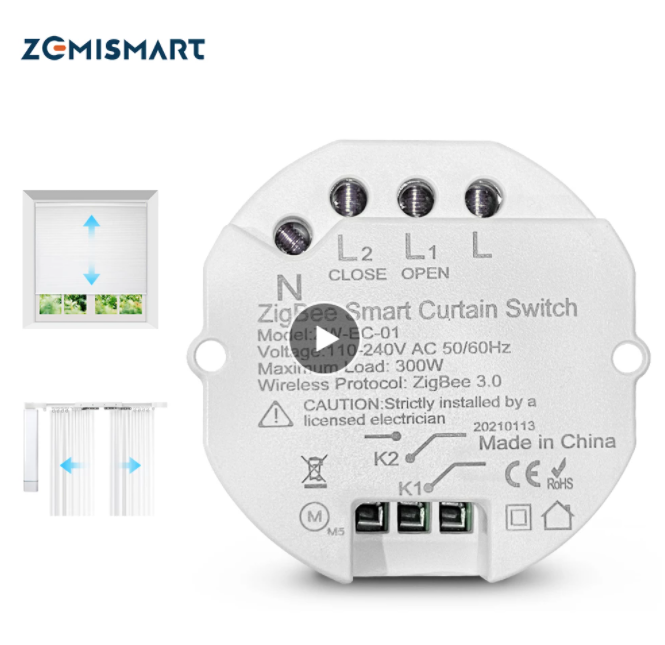|3A Smart Home DE|ZW-EC-01 Speichern Sie Zemismart||||

# Bitron Video

|Image|Marque|Nom|Type|Remarque|Lien|
|---|---|---|---|---|---|
|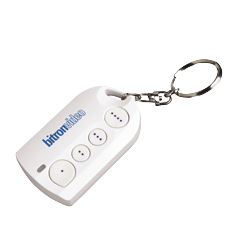|Bitron Video|SMABIT - 4-Tasten-Fernbedienung|||[Kaufen](https://www.domadoo.fr/fr/peripheriques/5551-smabit-telecommande-zigbee-4-boutons-8023874395814.html)|
||Bitron Video|SMABIT - Smart Socket EIN / AUS 16A|||[Kaufen](https://www.domadoo.fr/fr/peripheriques/5563-smabit-prise-intelligente-zigbee-onoff-16a-8023874395852.html)|
|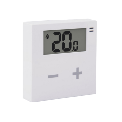|Bitron Video|SMABIT - Smart Thermostat mit integriertem Relais|||[Kaufen](https://www.domadoo.fr/fr/peripheriques/5565-smabit-thermostat-intelligent-zigbee-avec-relais-8023874395883.html)|
||Bitron Video|Meerjungfrau||||
||Bitron Video|SMABIT - Öffnungsdetektor + Verdrahteter Sensoreingang|||[Kaufen](https://www.domadoo.fr/fr/peripheriques/5546-smabit-detecteur-d-ouverture-zigbee-entree-capteurs-filaires-8023874396651.html)|
||Bitron Video|SMABIT - Design-Bewegungsmelder|||[Kaufen](https://www.domadoo.fr/fr/peripheriques/5549-smabit-detecteur-de-mouvement-design-zigbee-8021156061013.html)|
||Bitron Video|SMABIT - Rauchmelder|||[Kaufen](https://www.domadoo.fr/fr/peripheriques/5555-smabit-detecteur-de-fumee-optique-zigbee-avec-fonction-sirene-8023874396644.html)|
||Bitron Video|SMABIT - Smart Socket EIN / AUS 16A||||
||Bitron Video|SMABIT - 2,5-A-Dimmer-Smart-Buchse|||[Kaufen](https://www.domadoo.fr/fr/peripheriques/5561-smabit-prise-intelligente-zigbee-variateur-25a-8023874395845.html)|
|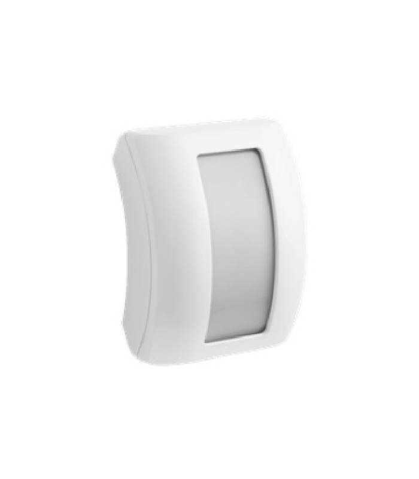|Bitron Video|SMABIT - Bewegungsmelder für Vorhang|||[Kaufen](https://www.domadoo.fr/fr/peripheriques/5540-smabit-detecteur-de-mouvement-de-rideau-zigbee-8021156062300.html)|
||Bitron Video|SMABIT - 2,5-A-Dimmerwandrelais|||[Kaufen](https://www.domadoo.fr/fr/peripheriques/5543-smabit-relais-mural-variateur-25a-zigbee-8023874397122.html)|
|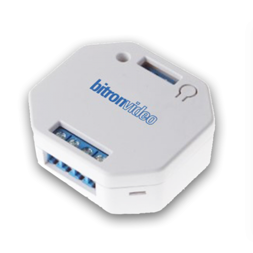|Bitron Video|SMABIT - Wandrelais 10A schalten|||[Kaufen](https://www.domadoo.fr/fr/peripheriques/5544-smabit-relais-mural-commutateur-10a-zigbee-8023874397139.html)|
||Bitron Video|SMABIT - Extra flacher Öffnungsmelder|||[Kaufen](https://www.domadoo.fr/fr/peripheriques/5547-smabit-detecteur-d-ouverture-de-porte-ou-fenetre-ultra-plat-zigbee-8023874397658.html)|
|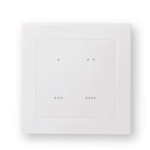|Bitron Video|SMABIT - Wandschalter mit Batterien|||[Kaufen](https://www.domadoo.fr/fr/peripheriques/5568-smabit-interrupteur-mural-zigbee-avec-piles-8021156061037.html)|
||Bitron Video|SMABIT - Hochwassermelder + Sirene|||[Kaufen](https://www.domadoo.fr/fr/peripheriques/5569-smabit-detecteur-de-fuite-d-eau-avec-sirene-zigbee-8021156063291.html)|
||Bitron Video|SMABIT - Bewegungsmelder für den Außenbereich|||[Kaufen](https://www.domadoo.fr/fr/peripheriques/5550-smabit-detecteur-de-mouvement-exterieur-zigbee-8023874397665.html)|

# Eurotronic

|Image|Marque|Nom|Type|Remarque|Lien|
|---|---|---|---|---|---|
||Eurotronic|Thermosatic Kopf||Ventil, das dazu neigt, Bestellungen nicht mehr anzunehmen (Änderung des Sollwerts), es sei denn, die Batterien werden entfernt und zurückgesetzt. Andererseits gibt dies immer die Temperaturinformationen und die manuelle Sollwertänderung zurück|[Kaufen](https://www.domadoo.fr/fr/peripheriques/5188-eurotronic-tete-thermostatique-zigbee-4260012711233.html)|

# Frient

|Image|Marque|Nom|Type|Remarque|Lien|
|---|---|---|---|---|---|
|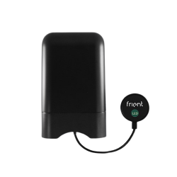|Frient|Optischer Stromverbrauchsmesser|||[Kaufen](https://www.domadoo.fr/fr/peripheriques/5424-frient-compteur-optique-de-consommation-d-electricite-zigbee-ha-5713594002583.html)|
||Frient|Luftqualitätssensor|||[Kaufen](https://www.domadoo.fr/fr/peripheriques/5408-frient-capteur-de-qualite-d-air-zigbee-ha-5713594002392.html)|
|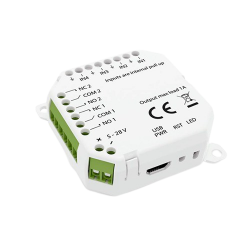|Frient|E / A-Modul||||
|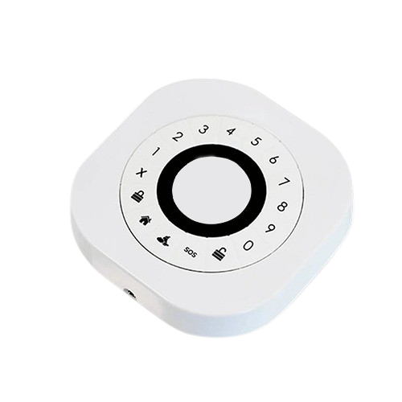|Develco|Intelligente Tastatur||||
||Develco|Panikknopf||Es scheint ein Problem mit der Firmware zu geben, nur die Deaktivierung des Alarms (drücken Sie die Taste für 5 Sekunden nach Aktivierung des Panikmodus) wird an die ZigBee-Netzwerke gesendet||
|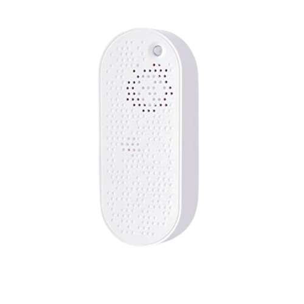|Frient|Intelligente Sirene||||
||Frient|Smart Plug|||[Kaufen](https://www.domadoo.fr/fr/peripheriques/5412-frient-prise-intelligente-mini-avec-mesure-de-consommation-zigbee-ha-version-fr-5713594002514.html)|
||Frient|Luftqualitätssensor|||[Kaufen](https://www.domadoo.fr/fr/peripheriques/5408-frient-capteur-de-qualite-d-air-zigbee-ha-5713594002392.html)|
|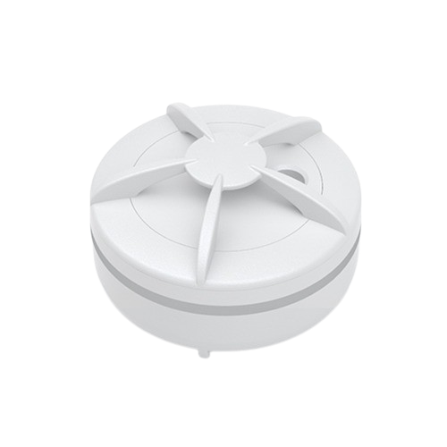|Frient|Intelligenter Hochwassermelder|||[Kaufen](https://www.domadoo.fr/fr/peripheriques/5427-frient-detecteur-d-inondation-zigbee-30-5713594002453.html)|
||Frient|Wärmemelder|||[Kaufen](https://www.domadoo.fr/fr/peripheriques/5411-frient-detecteur-de-chaleur-intelligent-zigbee-30-din-en-14604-et-din-14676-5713594002446.html)|
|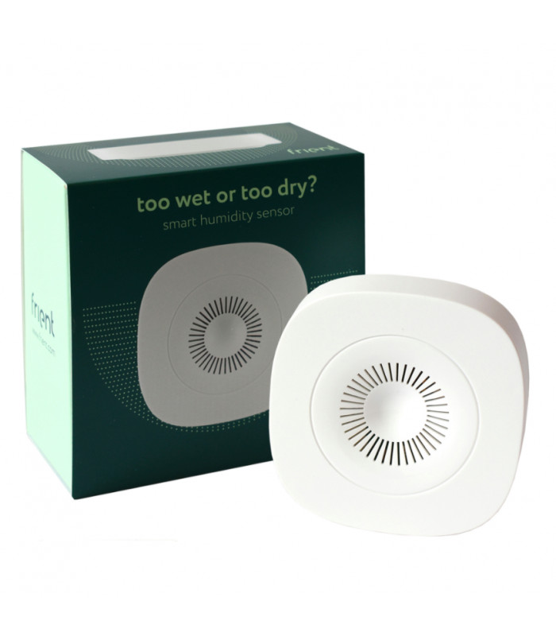|Frient|Temperatur- und Feuchtigkeitssensor|||[Kaufen](https://www.domadoo.fr/fr/peripheriques/5407-frient-capteur-de-temperature-et-humidite-intelligent-zigbee-30-5713594002385.html)|
|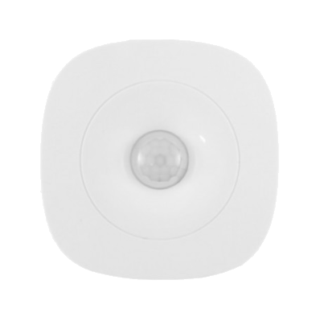|Frient|Bewegungsmelder und Temperatur- und Lichtsensor|||[Kaufen](https://www.domadoo.fr/fr/peripheriques/5404-frient-detecteur-de-mouvement-zigbee-30-capteur-de-temperature-et-luminosite-5713594002361.html)|
||Frient|Bewegungsmelder|||[Kaufen](https://www.domadoo.fr/fr/peripheriques/5403-frient-detecteur-de-mouvement-zigbee-30-5713594002835.html)|
||Frient|Smart Kabelschalter|||[Kaufen](https://www.domadoo.fr/fr/peripheriques/5421-frient-interrupteur-sur-cordon-zigbee-30-5713594002408.html)|
|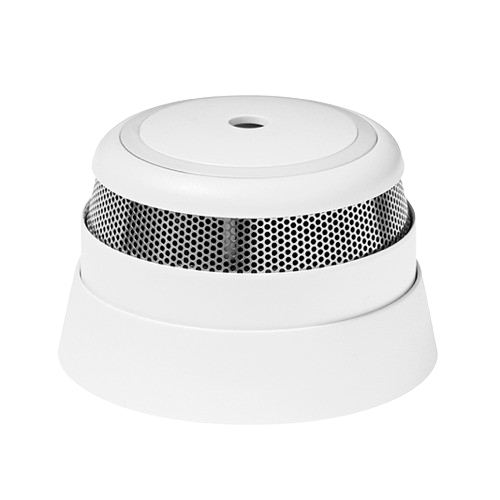|Frient|Intelligenter Rauchmelder DIN EN 14604 UND DIN 14676|||[Kaufen](https://www.domadoo.fr/fr/peripheriques/5409-frient-detecteur-de-fumee-intelligent-zigbee-30-5713594002330.html)|
|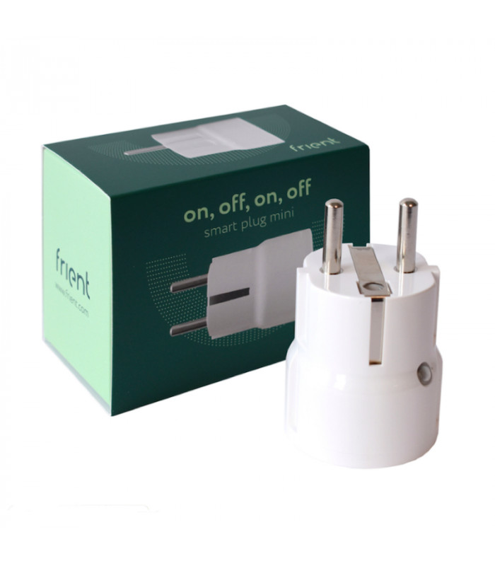|Frient|Smart Plug im Schuko-Format|||[Kaufen](https://www.domadoo.fr/fr/peripheriques/5420-frient-prise-intelligente-mini-avec-mesure-de-consommation-zigbee-ha-version-schuko-5713594002347.html)|
||Frient|Smart Socket im FR-Format|||[Kaufen](https://www.domadoo.fr/fr/peripheriques/5412-frient-prise-intelligente-mini-avec-mesure-de-consommation-zigbee-ha-version-fr-5713594002514.html)|
|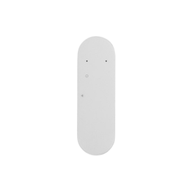|Frient|Tür- oder Fensteröffnungsdetektor und Temperatursensor|||[Kaufen](https://www.domadoo.fr/fr/peripheriques/5402-frient-detecteur-d-ouverture-de-porte-ou-fenetre-zigbee-30-capteur-de-temperature-5713594002354.html)|
||Frient|Intelligenter Bewegungsmelder|||[Kaufen](https://www.domadoo.fr/fr/peripheriques/5401-frient-detecteur-d-ouverture-de-porte-ou-fenetre-zigbee-30-5713594002545.html)|

# GR-SMARTHOME

|Image|Marque|Nom|Type|Remarque|Lien|
|---|---|---|---|---|---|
||GR-SMARTHOME|Motorisierung für 1/4 Umdrehungsventil|Vanne||[Kaufen](https://www.domadoo.fr/fr/peripheriques/5264-gr-smarthome-motorisation-zigbee-30-pour-vanne-14-de-tour.html)|
||GR-SMARTHOME|Motorisierung für 1/4 Umdrehungsventil|Vanne||[Kaufen](https://www.domadoo.fr/fr/peripheriques/5264-gr-smarthome-motorisation-zigbee-30-pour-vanne-14-de-tour.html)|

# GreenPower

|Image|Marque|Nom|Type|Remarque|Lien|
|---|---|---|---|---|---|
||GreenPower|Generische GreenPower-Ausrüstung||||
||GreenPower|GreenPower Ein / Aus-Geräte||||
||GreenPower|GreenPower-Ausrüstung Fenstergriff||||

# Groupes

|Image|Marque|Nom|Type|Remarque|Lien|
|---|---|---|---|---|---|
||Groupes|Weiß - Helligkeit - Ein - Aus||||
||Groupes|Farbe - Weiß - Helligkeit - Ein - Aus||||
|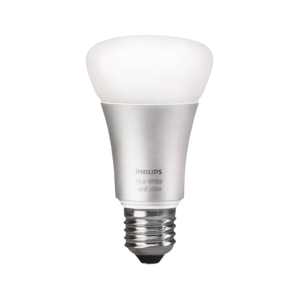|Groupes|Helligkeit - Ein - Aus||||
||Groupes|An aus||||
||Groupes|Volet||||

# Insta

|Image|Marque|Nom|Type|Remarque|Lien|
|---|---|---|---|---|---|
||Insta|Fernbedienung||||

# JunYu

|Image|Marque|Nom|Type|Remarque|Lien|
|---|---|---|---|---|---|
|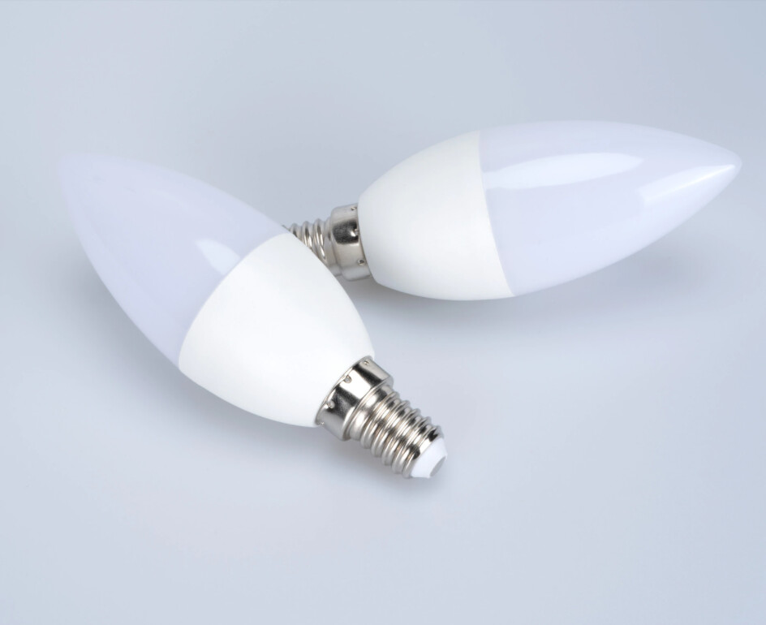|JunYu|RGBW LED||Bitte beachten Sie, dass die Statusrückmeldung für dieses Modell nicht in Echtzeit erfolgt (entweder nach einem Befehl oder indem Sie explizit eine Aktualisierung anfordern)||

# LIVOLO

|Image|Marque|Nom|Type|Remarque|Lien|
|---|---|---|---|---|---|
|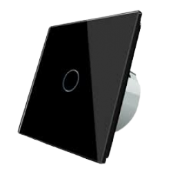|LIVOLO|Interrupteur||||

# LS Deutschland GmbH

|Image|Marque|Nom|Type|Remarque|Lien|
|---|---|---|---|---|---|
||LS Deutschland GmbH|||||

# Legrand

|Image|Marque|Nom|Type|Remarque|Lien|
|---|---|---|---|---|---|
|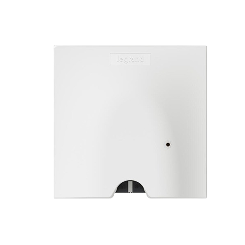|Legrand|Kabelanschluss angeschlossen||Kann nur auf Kanal 11 gekoppelt werden||
|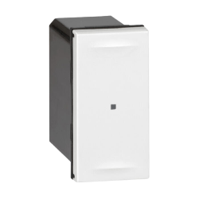|Legrand|Micro VMC-Modul||Kann nur auf Kanal 11 gekoppelt werden||
||Legrand|Angeschlossene Steckdose||Kann nur auf Kanal 11 gekoppelt werden||
|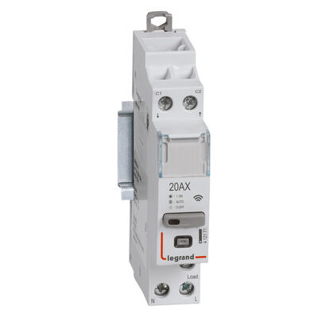|Legrand|DRIVIA angeschlossenes Schütz||Kann nur auf Kanal 11 gekoppelt werden||
||Legrand|DIN-Stromverbrauchsmodul||Kann nur auf Kanal 11 gekoppelt werden||
||Legrand|Kabelschalter mit Dimmeroption ohne Neutralleiter verbunden||Kann nur auf Kanal 11, 13 oder 15 gekoppelt werden||
||Legrand|Schalter mit Neutralleiter mit Dimmeroption verbunden||Kann nur auf Kanal 11, 13 oder 15 gekoppelt werden||
||Legrand|Drahtlose Doppelsteuerung||Kann nur auf Kanal 11 gekoppelt werden||
||Legrand|GreenPower Heim / Auswärts||||
||Legrand|GreenPower Tag / Nacht||||
||Legrand|GreenPower Ein / Aus||||
||Legrand|GreenPower-Verschluss||||
|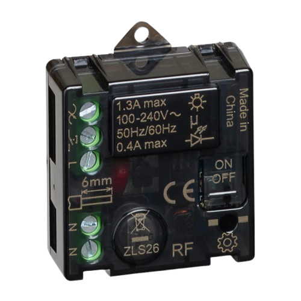|Legrand|Modul für angeschlossene Beleuchtung||Kann nur auf Kanal 11 oder 15 gekoppelt werden||
|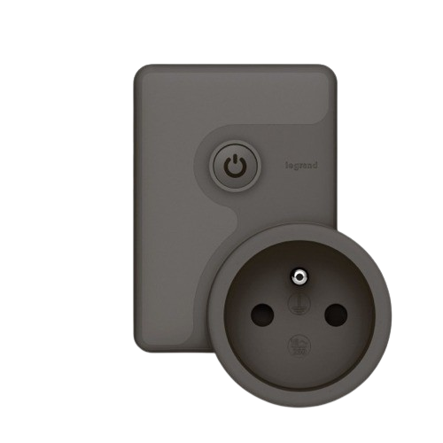|Legrand|Céliane Mobilsteckdose||Kann nur auf Kanal 11 gekoppelt werden||
||Legrand|Lüfterschalter||Kann nur auf Kanal 11 gekoppelt werden||
||Legrand|Bewegungsmelder||Kann nur auf Kanal 11 gekoppelt werden||
|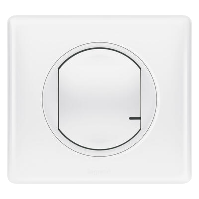|Legrand|Einfache drahtlose Steuerung||Kann nur auf Kanal 11 gekoppelt werden||
||Legrand|Drahtlose Steuerung Sunrise Sunset||Kann nur auf Kanal 11 gekoppelt werden||
||Legrand|Befehl umschalten||Kann nur auf Kanal 11 gekoppelt werden||
|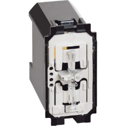|Legrand|BTICINO - Kabelschalter für Rollläden mit Positionierung||Kann nur auf Kanal 11 gekoppelt werden||
|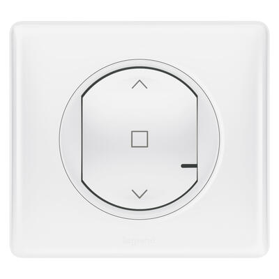|Legrand|Kabelschalter für Rollladen angeschlossen||Kann nur auf Kanal 11 gekoppelt werden||
||Legrand|Drahtlose Steuerung für Rollladen||Kann nur auf Kanal 11 gekoppelt werden||
||Legrand|Fernschalter||Kann nur auf Kanal 11 gekoppelt werden||
|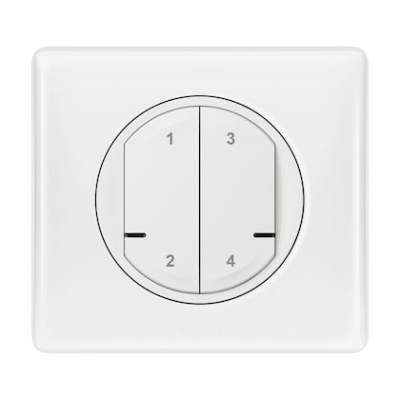|Legrand|Szenenbefehl||Kann nur auf Kanal 11 gekoppelt werden||

# MLI

|Image|Marque|Nom|Type|Remarque|Lien|
|---|---|---|---|---|---|
||MLI|MLI - ZBT fern alle RGBW||||

# NIKO NV

|Image|Marque|Nom|Type|Remarque|Lien|
|---|---|---|---|---|---|
||NIKO NV|Smart Plug||||

# Oeeone

|Image|Marque|Nom|Type|Remarque|Lien|
|---|---|---|---|---|---|
||Oeeone|Oeeone E27 Smart LED Glühbirne||||

# Paul Neuhaus

|Image|Marque|Nom|Type|Remarque|Lien|
|---|---|---|---|---|---|
||Paul Neuhaus|Q-Orbit||||
|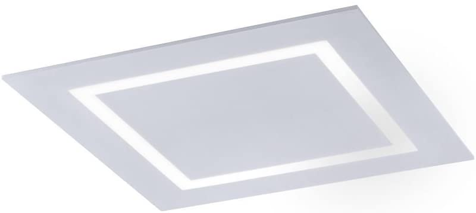|Paul Neuhaus|Q-Miran||||
||Paul Neuhaus|NLG-remote||||

# Philio

|Image|Marque|Nom|Type|Remarque|Lien|
|---|---|---|---|---|---|
||Philio|4 in 1 Multisensor||||

# SZ

|Image|Marque|Nom|Type|Remarque|Lien|
|---|---|---|---|---|---|
|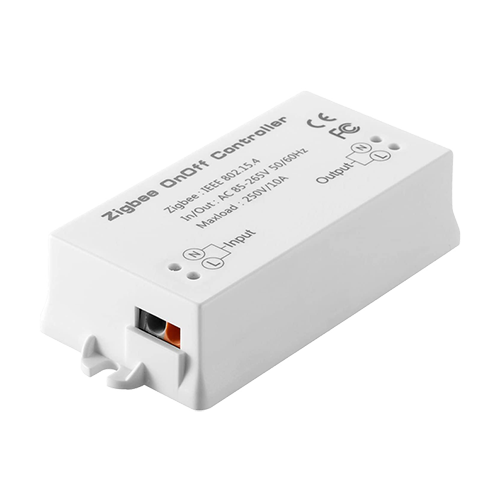|SZ|ZigBee On / Off-Controller||||

# Samjin

|Image|Marque|Nom|Type|Remarque|Lien|
|---|---|---|---|---|---|
||Samjin|Bouton||||

# Terncy

|Image|Marque|Nom|Type|Remarque|Lien|
|---|---|---|---|---|---|
|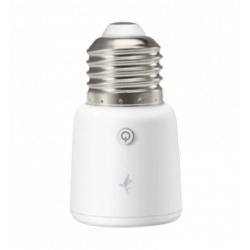|Terncy|SFLS-PP LP drahtloses Vorschaltgerät||||

# Ysrai

|Image|Marque|Nom|Type|Remarque|Lien|
|---|---|---|---|---|---|
||Ysrai|YSRSAI - ZB-CL01||||

# Zemismart

|Image|Marque|Nom|Type|Remarque|Lien|
|---|---|---|---|---|---|
||Zemismart|Smart Load mit einer Last ohne Neutralleiter||||
|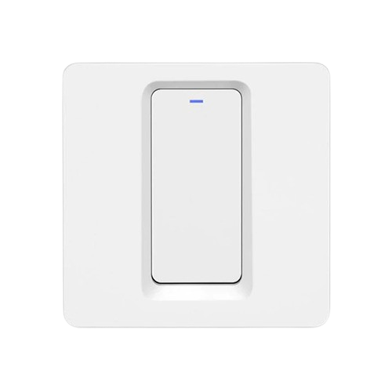|Zemismart|Smart Load mit einer Last ohne Neutralleiter||||
|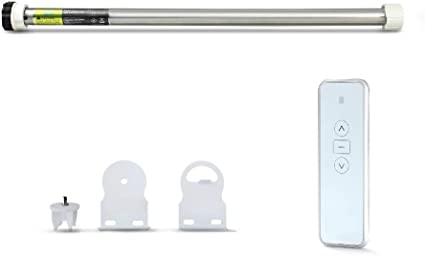|Zemismart|Store|Volets|||

# Adeo

|Image|Marque|Nom|Type|Remarque|Lien|
|---|---|---|---|---|---|
|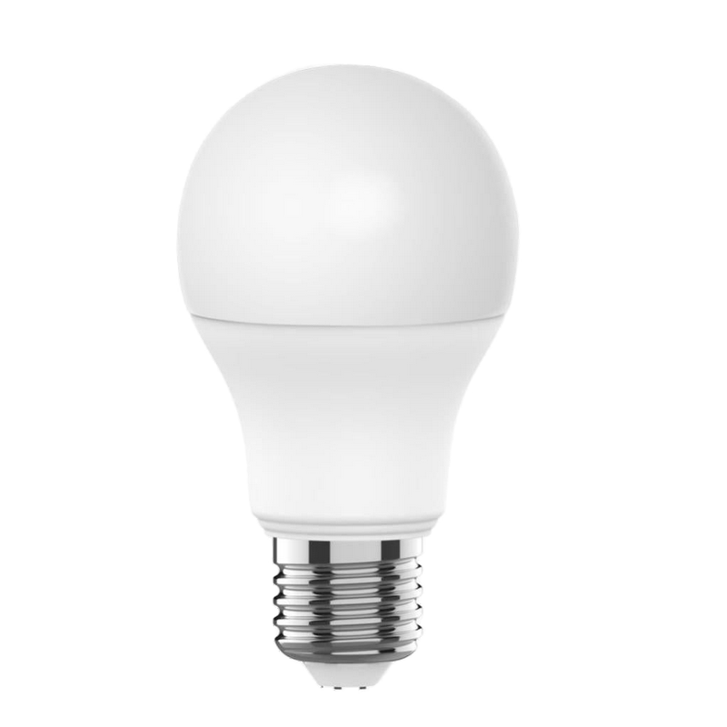|Adeo|LEXMAN ENKI - Glühbirne||||
||Adeo|LEXMAN ENKI - Glühbirne||||
||Adeo|LEXMAN ENKI - Glühbirne||||
|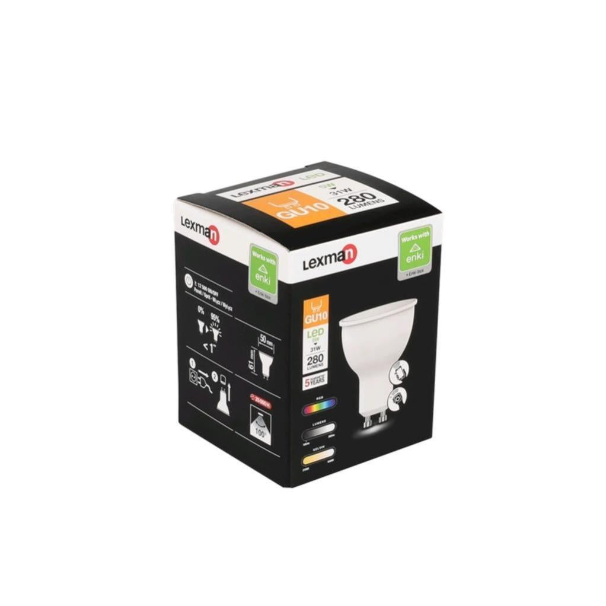|Adeo|LEXMAN ENKI - Glühbirne||||
||Adeo|LEXMAN ENKI - Fernbedienung für angeschlossene RGB-Lampen||||
||Adeo|LEXMAN ENKI - Glühbirne||||

# Alfawise

|Image|Marque|Nom|Type|Remarque|Lien|
|---|---|---|---|---|---|
||Alfawise|Alfawise Temperatur / Luftfeuchtigkeit||||
|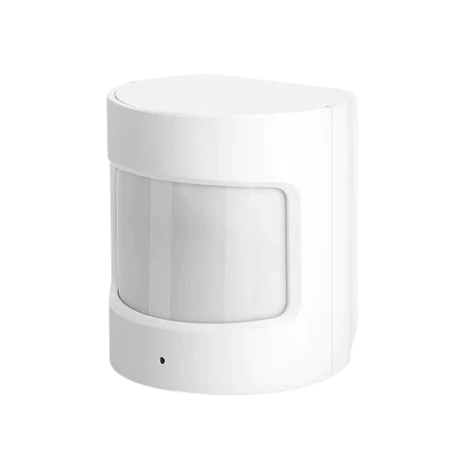|Alfawise|Alfawise trägt||||
||Alfawise|Alfawise trägt||||

# Awox

|Image|Marque|Nom|Type|Remarque|Lien|
|---|---|---|---|---|---|
||Awox|EGLO Crosslink-Z / Awox TLSR82||||

# Casaia

|Image|Marque|Nom|Type|Remarque|Lien|
|---|---|---|---|---|---|
||Casaia|Intelligenter Türdetektor|Ouverture|WICHTIG : enthalten, meldet aber keine Informationen||
||Casaia|4-Tasten-Fernbedienung||Nur die Tasten + und Minus - funktionieren|[Kaufen](https://www.domadoo.fr/fr/peripheriques/5580-casaia-telecommande-keyfob-4-boutons-zigbee-3770021021205.html)|
||Casaia|Multisensorbewegungen / Vibrationen / Temperatur / Luftfeuchtigkeit|||[Kaufen](https://www.domadoo.fr/fr/peripheriques/5571-casaia-multi-sensor-zigbee-mouvements-vibrations-temperature-humidite-3770021021045.html)|
||Casaia|SOS-Taste||||
||Casaia|Ferntemperaturfühler am Kabel|||[Kaufen](https://www.domadoo.fr/fr/peripheriques/5572-casaia-sonde-de-temperature-deportee-sur-cable-zigbee-3770021021052.html)|

# Danalock

|Image|Marque|Nom|Type|Remarque|Lien|
|---|---|---|---|---|---|
|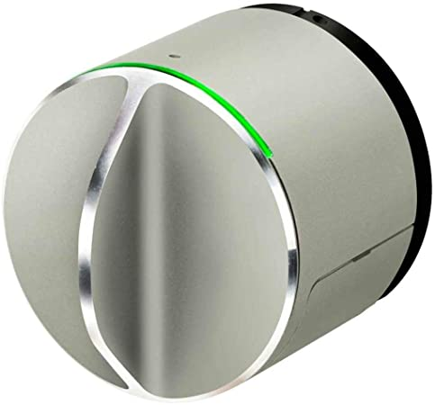|Danalock|Smart Lock V3|||[Kaufen](https://www.domadoo.fr/fr/controle-acces/4540-danalock-serrure-connectee-bluetooth-et-zigbee-danalock-v3-5712560000493.html)|

# Danfoss

|Image|Marque|Nom|Type|Remarque|Lien|
|---|---|---|---|---|---|
||Danfoss|Danfoss Icon Floor Controller|Beheizter Bodenregler|||
||Danfoss|Danfoss Verbündeter|Thermostatkopf||[Dokumentation](https://assets.danfoss.com/documents/DOC353849556547/DOC353849556547.pdf) [Kaufen](https://www.domadoo.fr/fr/peripheriques/5156-danfoss-tete-electronique-ally-zigbee-30-5702425245008.html)|

# Dresden elektronik

|Image|Marque|Nom|Type|Remarque|Lien|
|---|---|---|---|---|---|
||Dresden elektronik|Drahtloses Vorschaltgerät FLS-PP lp||||

# EWeLink

|Image|Marque|Nom|Type|Remarque|Lien|
|---|---|---|---|---|---|
||EWeLink|OnOff-Controller||||
||EWeLink|RGBCW MR16 Smart LED-Lampe||||
||EWeLink|OnOff-Controller||||

# Ecodim

|Image|Marque|Nom|Type|Remarque|Lien|
|---|---|---|---|---|---|
||Ecodim|Drehdimmerschalter|Schalter, Dimmer||[Kaufen](https://www.domadoo.fr/fr/eclairage/5369-ecodim-interrupteur-variateur-rotatif-zigbee-30-200w-8719322371263.html)|

# Feller

|Image|Marque|Nom|Type|Remarque|Lien|
|---|---|---|---|---|---|
||Feller|Freunde von boo 4 Knöpfe||||

# Gledopto

|Image|Marque|Nom|Type|Remarque|Lien|
|---|---|---|---|---|---|
||Gledopto|GL-B-007Z||||
|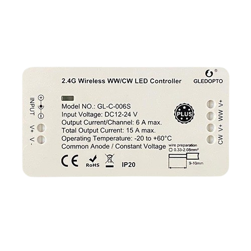|Gledopto|Warm und kalt weißer LED-Streifen Smart Controller||||
||Gledopto|GL-C-008P||||
|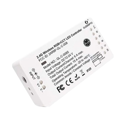|Gledopto|GL-C-008S||||
|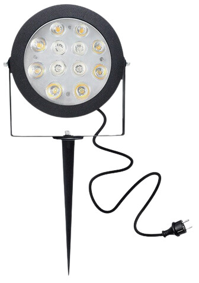|Gledopto|GL-G-001ZS||||
||Gledopto|GL-S-004Z||||

# Heiman

|Image|Marque|Nom|Type|Remarque|Lien|
|---|---|---|---|---|---|
|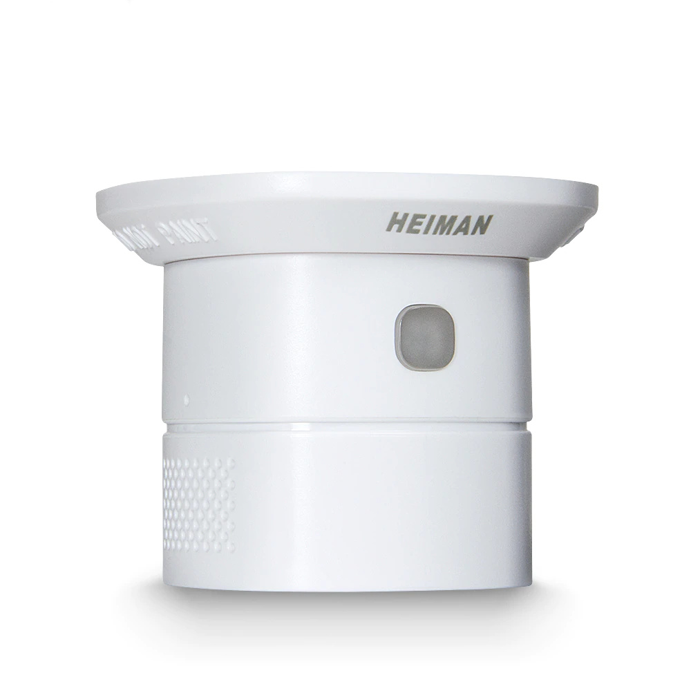|Heiman|Kohlenmonoxiddetektor||||
|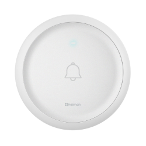|Heiman|Verbundene Türklingel||||
||Heiman|Gasmelder||||
|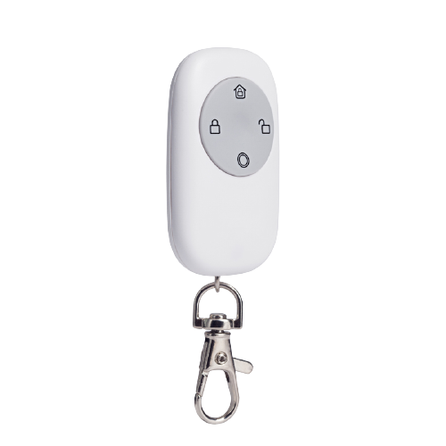|Heiman|4-Tasten-Fernbedienung||||
|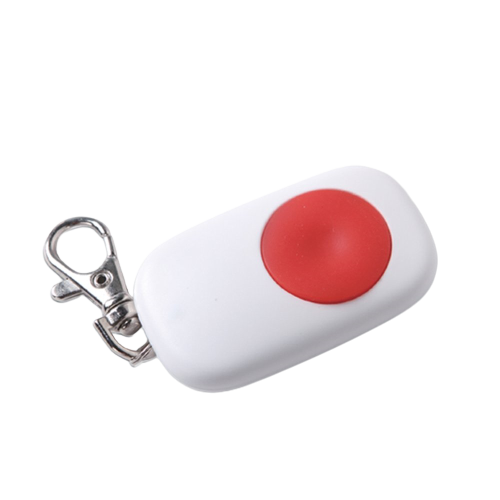|Heiman|SOS-Taste||||
|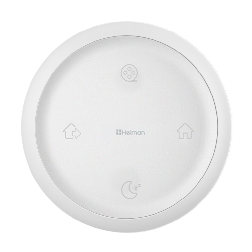|Heiman|4-Tasten-Fernbedienung||||
|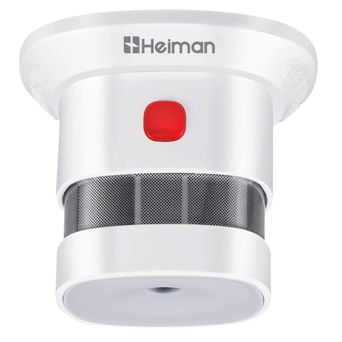|Heiman|Rauchmelder||||
||Heiman|Rauchmelder||||
||Heiman|Rauchmelder||||
||Develco|Intelligente Sirene||||
|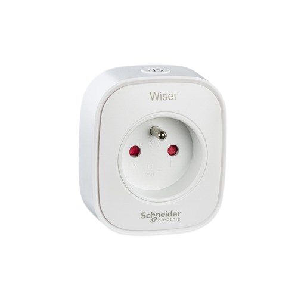|Schneider|Verbundene Buchse und Repeater Wiser|Buchse, Messgerät, Leistung, Repeater||[Kaufen](https://www.domadoo.fr/fr/eclairage/5499-schneider-electric-prise-connectee-et-repeteur-zigbee-30-wiser-3606489917883.html)|
|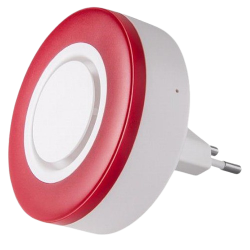|Heiman|Außensirene|||[Kaufen](https://www.domadoo.fr/fr/peripheriques/5564-smabit-sirene-exterieure-zigbee-104-db-8023874397641.html)|

# Icasa

|Image|Marque|Nom|Type|Remarque|Lien|
|---|---|---|---|---|---|
|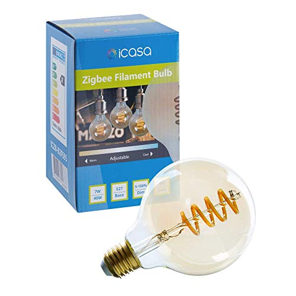|Icasa|Filamant Bulb||||
||Icasa|AC-Dimmer||||
|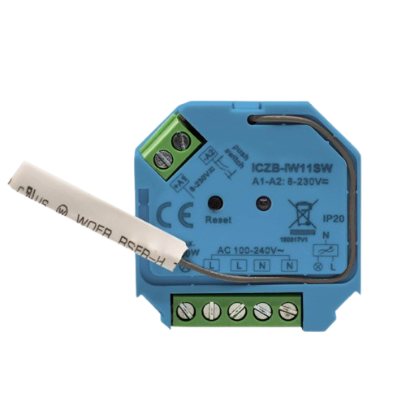|Icasa|Wechselstromschalter||||
||Icasa|Pulse 4S Wandregler||||
|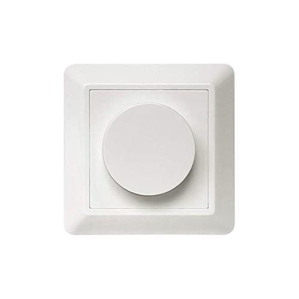|Icasa|Rotationsdimmer||||
||Icasa|Icasa RGB||||

# Idinio

|Image|Marque|Nom|Type|Remarque|Lien|
|---|---|---|---|---|---|
||Idinio|Dimmschalter am Fuß|Schalter, Dimmer|||

# Ikea

|Image|Marque|Nom|Type|Remarque|Lien|
|---|---|---|---|---|---|
|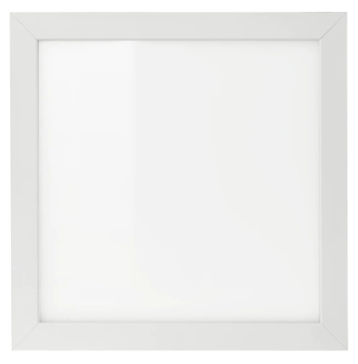|Ikea|FLOALT Panel WS 30x30||||
||Ikea|Fyrtur - Rollo||||
||Ikea|Kadrilj - Rollo||||
||Ikea|Symfonisk Sound Controller|Fernbedienung|||
|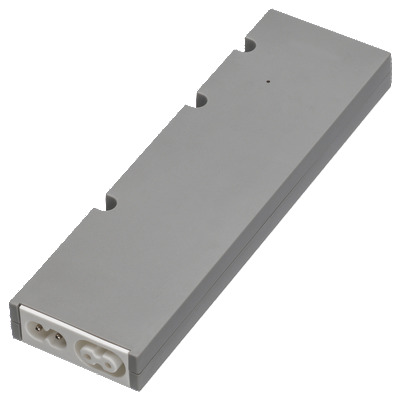|Ikea|10W Treiber||||
|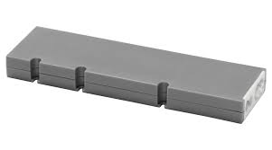|Ikea|Treiber 30W||||
||Ikea|SHORTCUT-Taste|Fernbedienung|||
||Ikea|Birne E14 CWS Opal 600lm||||
||Ikea|Glühlampe E14 WS 470lm||||
|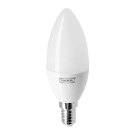|Ikea|Birne E14 WS Opal 600lm||||
||Ikea|Glühlampe E14 W opch 400lm||||
||Ikea|Birne E27 CWS Opal 600lm||||
||Ikea|Birne E27 WS Opal 1000lm||||
||Ikea|Birne E27 WS Opal 980lm||Bitte beachten Sie, dass die Statusrückmeldung für dieses Modell nicht in Echtzeit erfolgt (entweder nach einem Befehl oder indem Sie explizit eine Aktualisierung anfordern)||
|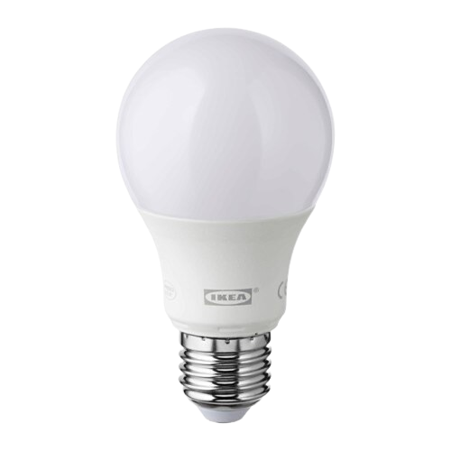|Ikea|Birne E27 WW 806lm||||
|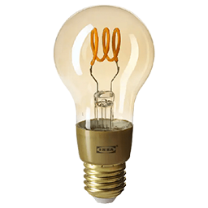|Ikea|TRADFRI Glühbirne E27 WW klar 250lm||||
||Ikea|Birne E27 W opal 1000lm||||
|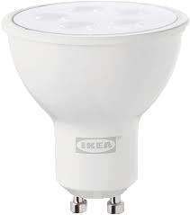|Ikea|Birne GU10 WS 400lm||||
|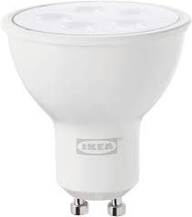|Ikea|Birne GU10 WW 400lm||||
||Ikea|Glühlampe GU10 W 400lm||||
|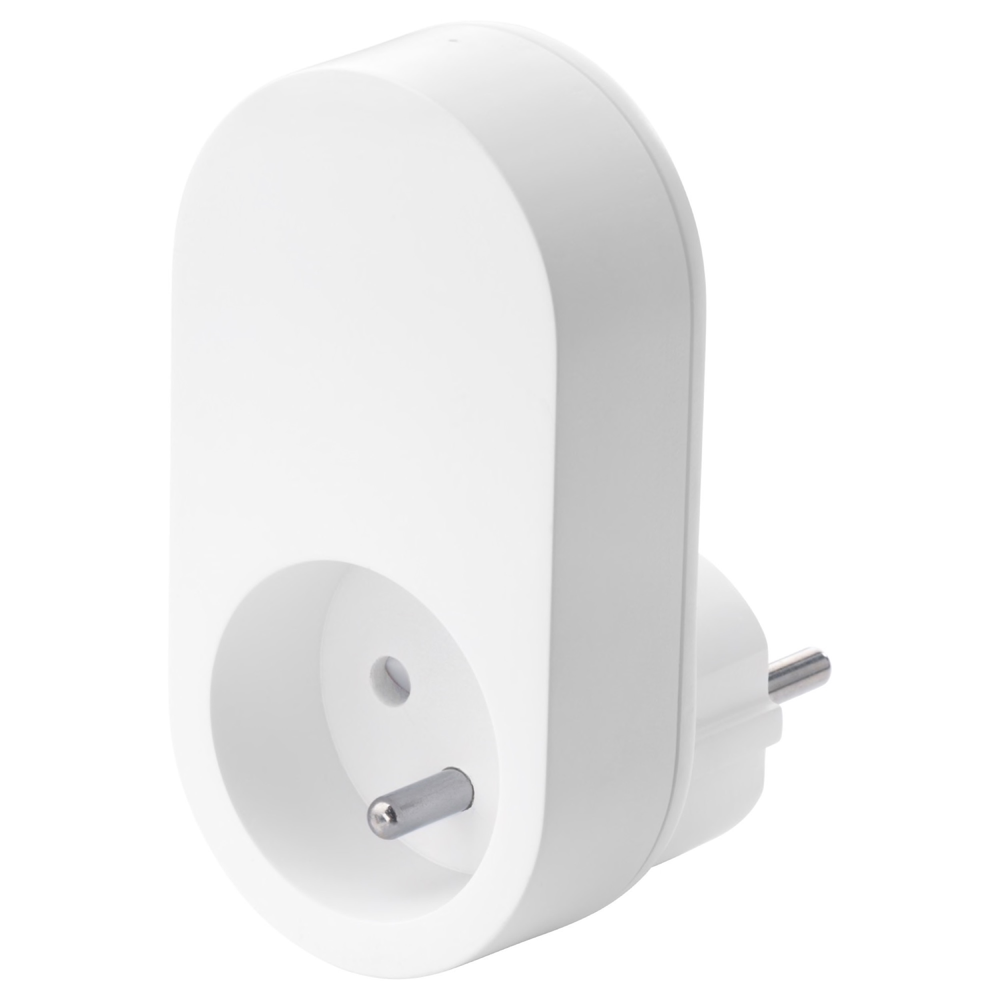|Ikea|Angeschlossene Steckdose|||[Dokumentation](https://www.ikea.com/fr/fr/manuals/tradfri-wireless-control-outlet__AA-2106602-1_pub.pdf) |
|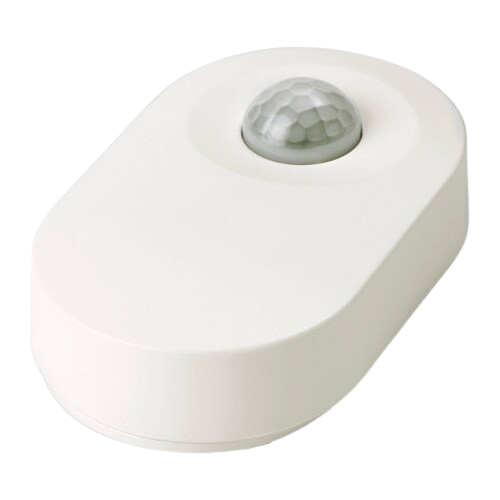|Ikea|Bewegungsmelder|||[Dokumentation](https://www.ikea.com/fr/fr/manuals/tradfri-wireless-motion-sensor__AA-2145280-2_pub.pdf) |
|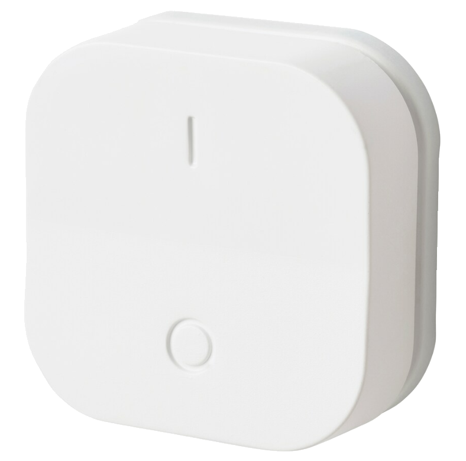|Ikea|2-Tasten-Fernbedienung|Fernbedienung||[Dokumentation](https://www.ikea.com/fr/fr/assembly_instructions/tradfri-wireless-dimmer-white__AA-2175106-3_pub.pdf) |
|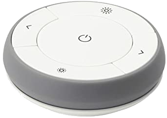|Ikea|5-Tasten-Fernbedienung|Fernbedienung||[Dokumentation](https://www.ikea.com/fr/fr/manuals/tradfri-remote-control__AA-2144014-1_pub.pdf) |
||Ikea|Ikea repeateur||||
|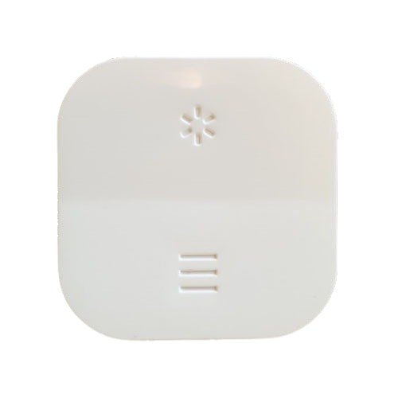|Ikea|2-Tasten-Blindfernbedienung||||

# Innr

|Image|Marque|Nom|Type|Remarque|Lien|
|---|---|---|---|---|---|
||Innr|INNR FLEXIBLE TAPE INNEN RGBW|||[Kaufen](https://www.domadoo.fr/fr/peripheriques/5455-innr-ruban-flexible-indoor-couleur-4m-couleur-et-blanc-variable-2000k-a-6500k-8718781552725.html)|
||Innr|INNR Outdoor Flex Lichtfarbe||||
||Innr|OSL 130 C||||
||Innr|INNR RB 165||||
||Innr|INNR E14 RGBW|||[Kaufen](https://www.domadoo.fr/fr/peripheriques/5349-innr-ampoule-connectee-type-e14-zigbee-30-multicolor-rgbw-blanc-reglable-2200k-a-6500k-8718781552060.html)|
||Innr|RB278T||||
||Innr|INNR E27 Multicolor RGBW + Weiß||||
||Innr|INNR RF 263||||
||Innr|INNR GU10 RGBW||||
||Innr|INNR GENOMMEN||||
||Innr|Prise|||[Kaufen](https://www.domadoo.fr/fr/peripheriques/5362-innr-prise-connectee-super-slim-zigbee-30-8718781552657.html)|

# Konke

|Image|Marque|Nom|Type|Remarque|Lien|
|---|---|---|---|---|---|
|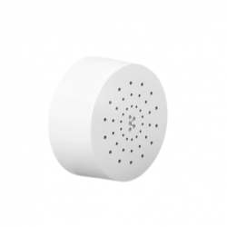|Konke|Temperatur- und Feuchtigkeitssonde||||
||Konke|Konke Bewegungssensor||||

# Ledvance

|Image|Marque|Nom|Type|Remarque|Lien|
|---|---|---|---|---|---|
||Ledvance|Classic E27 Multicolor||||
||Ledvance|Klassisches E27 Abstimmbares Weiß||||
||Ledvance|FLEX RGBW Z3||||
||Ledvance|Outdoor FLEX RGBW Z3||||
||Ledvance|Smart Socket + Stecker Z3||||

# Lellki

|Image|Marque|Nom|Type|Remarque|Lien|
|---|---|---|---|---|---|
|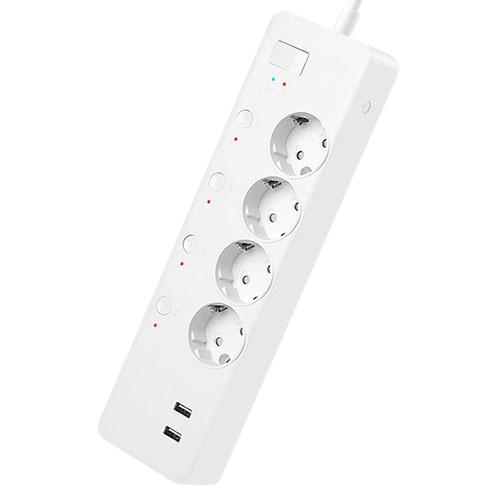|Lellki|Intelligente Steckdosenleiste||||

# Lidl

|Image|Marque|Nom|Type|Remarque|Lien|
|---|---|---|---|---|---|
|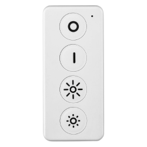|Lidl|Intelligente Dimmerfernbedienung||||
||Lidl|Intelligenter Bewegungsmelder||||
|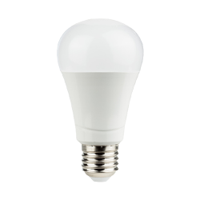|Lidl|E27 Smart Glühbirne||||
||Lidl|Angeschlossene LED-Außenwandleuchte||||
|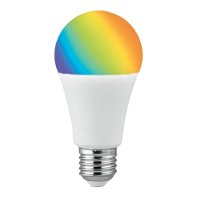|Lidl|Angeschlossene Glühlampe E27 RGB||||
|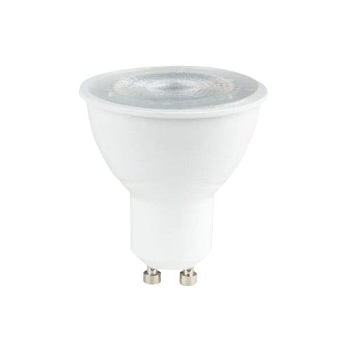|Lidl|GU10 angeschlossene LED-Lampe||||
||Lidl|Angeschlossener LED-Streifen||||
|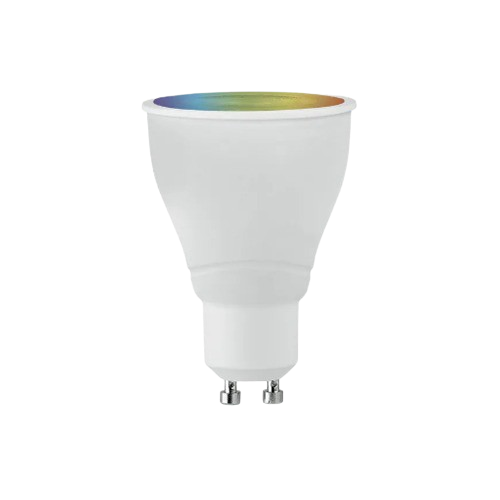|Lidl|GU10 RGB Smart Glühbirne||||
|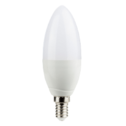|Lidl|Angeschlossene LED-Lampe E14||||
|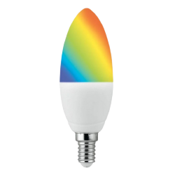|Lidl|Angeschlossene Glühlampe E14 RGB||||
||Lidl|Smart LED-Streifen||||
|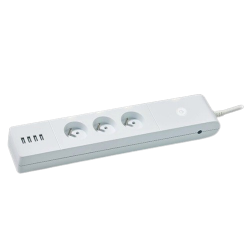|Lidl|Angeschlossene Steckdosenleiste 4 Buchsen und 2 USB-Anschlüsse||||
||Lidl|EIN / AUS-Steckdose||||

# Loratap

|Image|Marque|Nom|Type|Remarque|Lien|
|---|---|---|---|---|---|
||Loratap|LORATAP - 3-Tasten-Fernbedienung||||

# Nodon

|Image|Marque|Nom|Type|Remarque|Lien|
|---|---|---|---|---|---|
||Nodon|SIN-4-1-01||||
|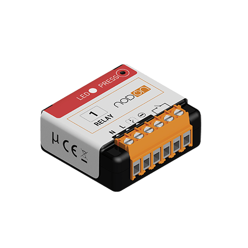|Nodon|Einzellade-EIN / AUS-Schalter 16A||||
||Nodon|SIN-4-2-01||||
||Nodon|Doppellast-EIN / AUS-Schaltermodul 2x3A||||
||Nodon|Rollladenmodul||||
||Nodon|Rollladenmodul||||
|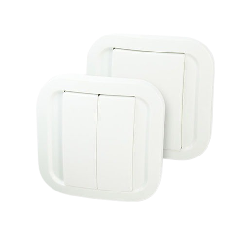|Nodon|PTM 216 Z||||

# Orvibo

|Image|Marque|Nom|Type|Remarque|Lien|
|---|---|---|---|---|---|
|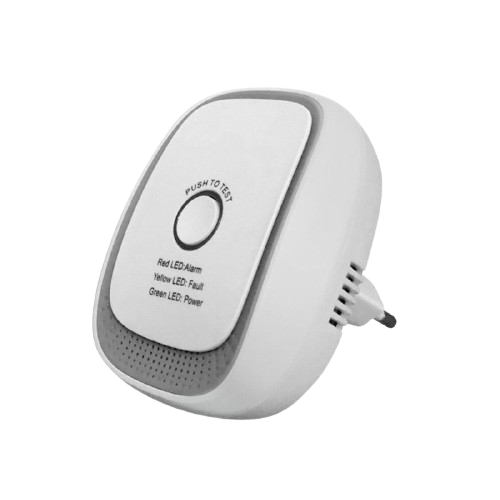|Orvibo|Gassensor|Sensor, Gas||[Dokumentation](https://www.domadoo.fr/fr/index.php?controller=attachment&id_attachment=2475) [Kaufen](https://www.domadoo.fr/fr/peripheriques/5337-orvibo-detecteur-de-gaz-zigbee.html)|
||Orvibo|RGB-Controller||||
||Orvibo|Multifunktionales Relais|Contacteur|Kehren Sie ab dem 15.12.2020 in den nicht funktionsfähigen Status zurück|[Dokumentation](https://www.domadoo.fr/fr/index.php?controller=attachment&id_attachment=2461) [Kaufen](https://www.domadoo.fr/fr/peripheriques/5340-orvibo-module-commutateur-contact-sec-zigbee.html)|
||Orvibo|Sensoranschluss|Capteur|||
||Orvibo|Notfall Knopf|Taste, Fernbedienung||[Kaufen](https://www.domadoo.fr/fr/peripheriques/5335-orvibo-bouton-d-urgence-sos-zigbee.html)|
||Orvibo|Gassensor|Sensor, Gas|||
|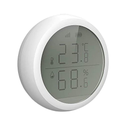|Orvibo|Temperatur- / Feuchtigkeitssensor|Sensor, Temperatur, Luftfeuchtigkeit||[Dokumentation](https://www.domadoo.fr/fr/index.php?controller=attachment&id_attachment=2455) [Kaufen](https://www.domadoo.fr/fr/peripheriques/5334-orvibo-capteur-de-temperature-et-humidite-zigbee.html)|
||Orvibo|Wasserleck|Sensor, Leck, Überschwemmung||[Dokumentation](https://www.domadoo.fr/fr/index.php?controller=attachment&id_attachment=2458) [Kaufen](https://www.domadoo.fr/fr/peripheriques/5338-orvibo-detecteur-d-inondation-zigbee.html)|
||Orvibo|Rauchmelder||||

# Osram

|Image|Marque|Nom|Type|Remarque|Lien|
|---|---|---|---|---|---|
|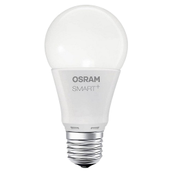|Osram|OSRAM Smart + Connected LED-Lampe - E27-Sockel||||
|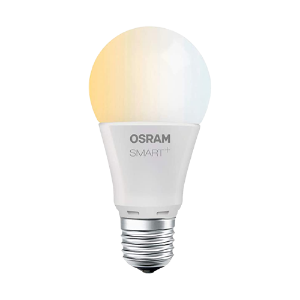|Osram|Osram Smart + Tunable weiße E27 Basis||Bitte beachten Sie, dass die Statusrückmeldung für dieses Modell nicht in Echtzeit erfolgt (entweder nach einem Befehl oder indem Sie explizit eine Aktualisierung anfordern)||
||Osram|OSRAM Decke TW OSRAM||Bitte beachten Sie, dass die Statusrückmeldung für dieses Modell nicht in Echtzeit erfolgt (entweder nach einem Befehl oder indem Sie explizit eine Aktualisierung anfordern)||
||Osram|OSRAM Smart + E14 LED-Lampe||Bitte beachten Sie, dass die Statusrückmeldung für dieses Modell nicht in Echtzeit erfolgt (entweder nach einem Befehl oder indem Sie explizit eine Aktualisierung anfordern)||
|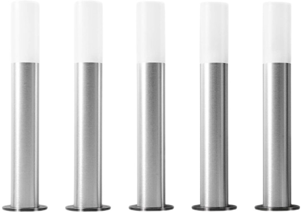|Osram|LEDVANCE SMART + GARDEN POLE||Bitte beachten Sie, dass die Statusrückmeldung für dieses Modell nicht in Echtzeit erfolgt (entweder nach einem Befehl oder indem Sie explizit eine Aktualisierung anfordern)||
|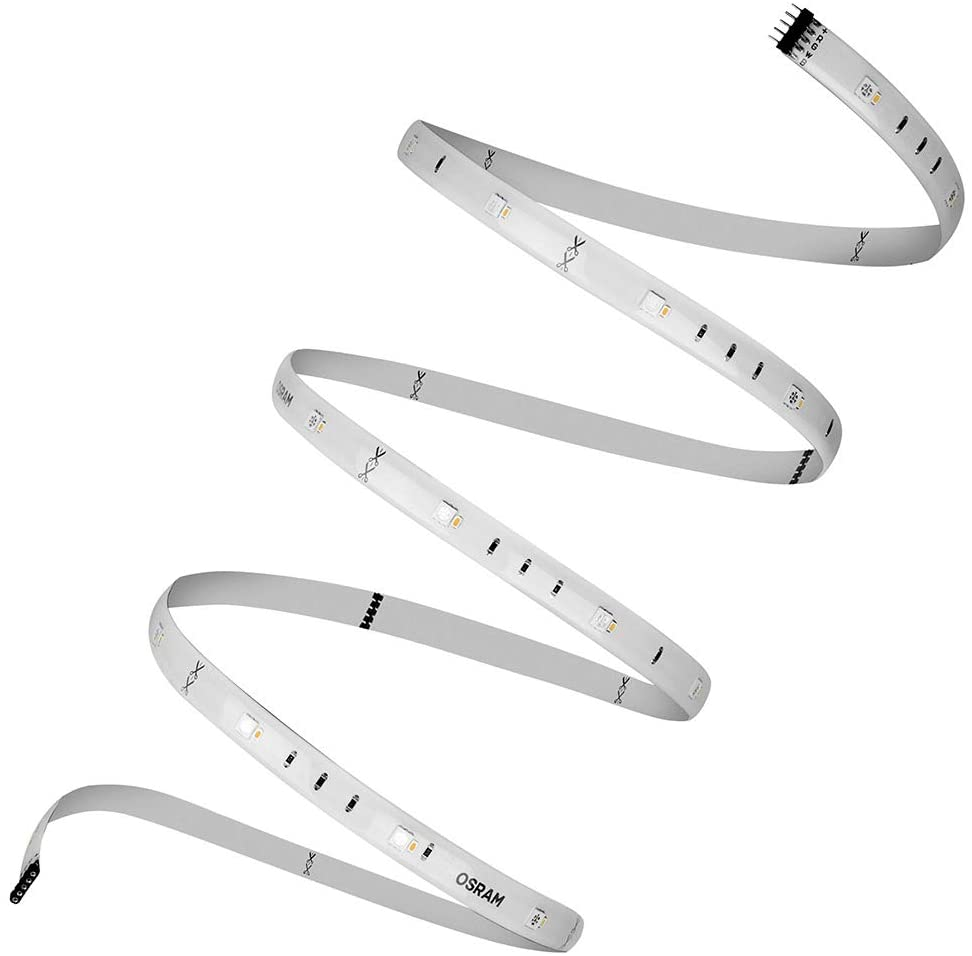|Osram|OSRAM LIGHTIFY Indoor Flex RGBW||Bitte beachten Sie, dass die Statusrückmeldung für dieses Modell nicht in Echtzeit erfolgt (entweder nach einem Befehl oder indem Sie explizit eine Aktualisierung anfordern)||
|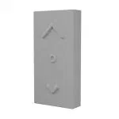|Osram|Lightify Switch Mini||||
||Osram|OSRAM SMART + Spot GU5.3 Abstimmbares Weiß||||
||Osram|OSRAM Smart + Plug||||

# Philips

|Image|Marque|Nom|Type|Remarque|Lien|
|---|---|---|---|---|---|
|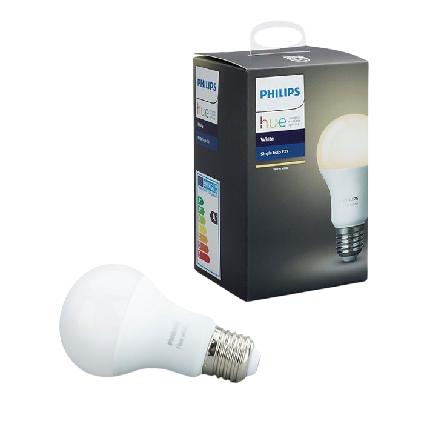|Philips|Farbton Weiß A60 E27||||
|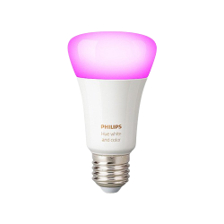|Philips|Farbton Weiß und Farbambiente A60 E27||||
|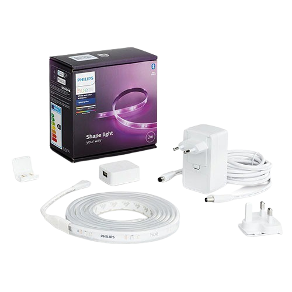|Philips|Farbton LightStrip Plus||||
|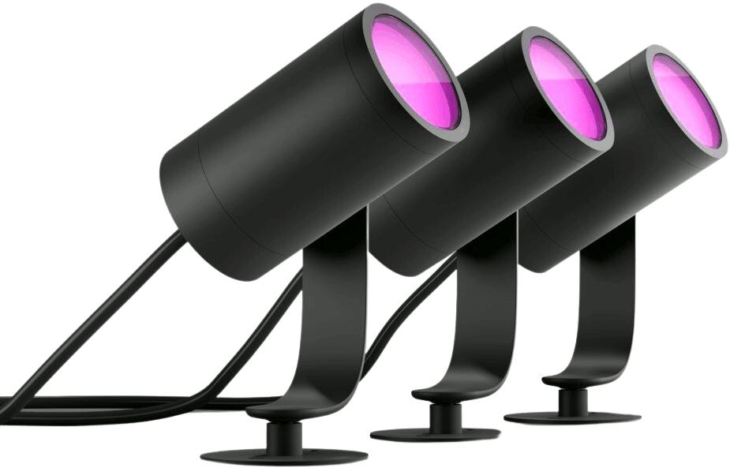|Philips|Farbton Outdoor Lily XL||||
||Philips|Farbton Birne weiß und Farbe||||
|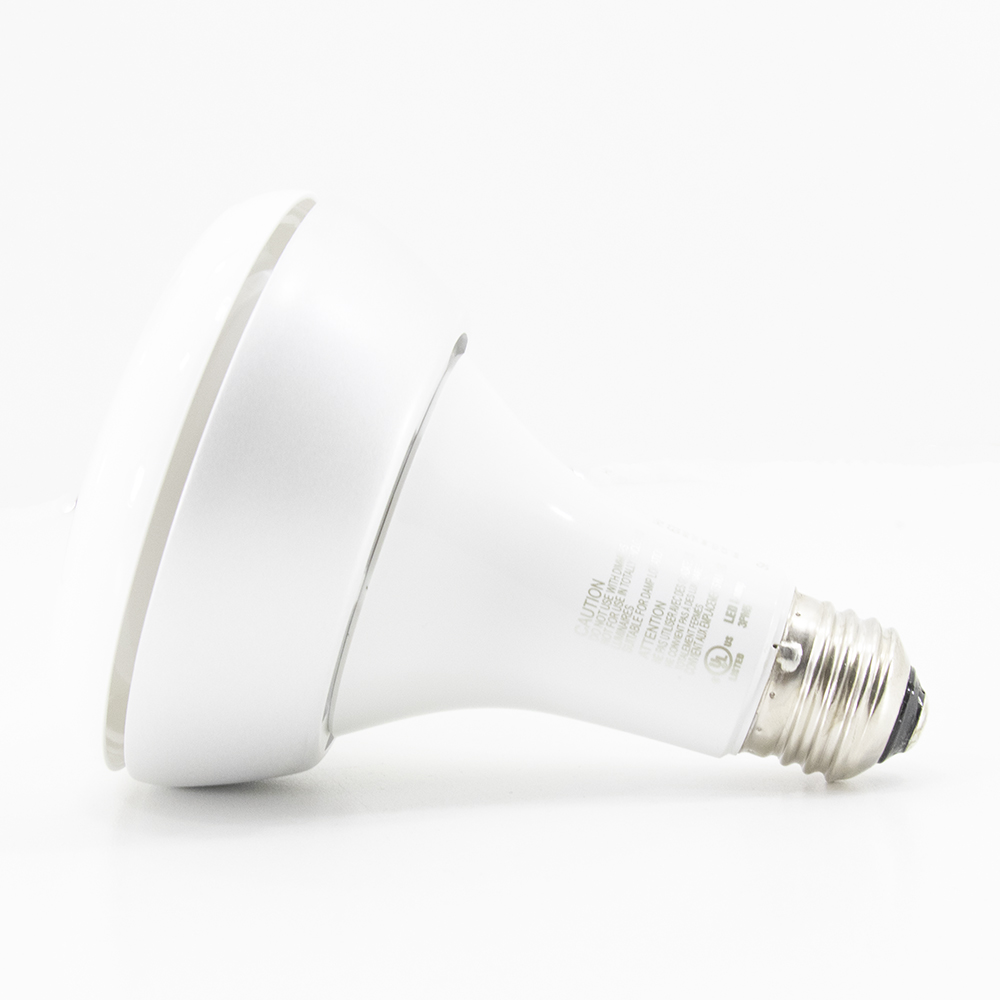|Philips|Farbton Weiß und Farbe BR30 (1. Gen)||||
|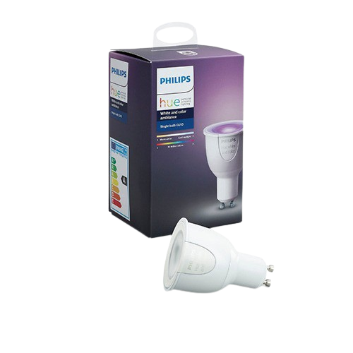|Philips|Farbton Weiß und Farbambiente Spot GU10||Bitte beachten Sie, dass die Statusrückmeldung für dieses Modell nicht in Echtzeit erfolgt (entweder nach einem Befehl oder indem Sie explizit eine Aktualisierung anfordern)||
||Philips|Farbton Weiß und Farbambiente A19 E26 (Gen 2)||||
||Philips|Farbton Weiß und Farbambiente A19 E26 (Gen 3)||||
||Philips|Farbton Weiß und Farbambiente BR30 Reichere Farben||||
|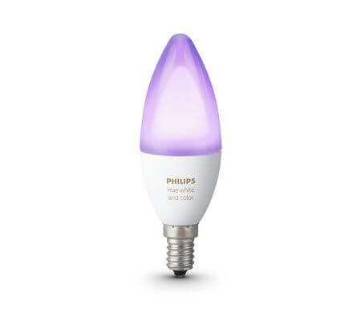|Philips|Farbton Weiß und Farbe Ambiance Candle E12||||
||Philips|Farbton Weiß und Farbambiente A19 E26||||
|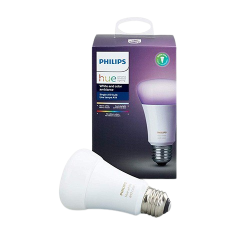|Philips|Farbton Weiß und Farbambiente A19 E26||Bitte beachten Sie, dass es für dieses Modell keine Statusrückmeldung gibt, nur ein Auftragsversand möglich ist||
|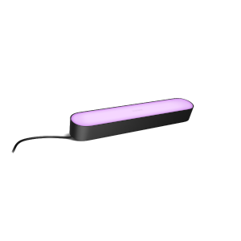|Philips|Farbton Weiß und Farbambiente spielen Lichtleiste||||
||Philips|Farbton LivingColors||||
||Philips|Farbton LivingColors||||
||Philips|Hue LivingColors Iris Tischlampe Gen3||||
||Philips|Farbton LivingColors||||
||Philips|Hue Iris Tischleuchte||||
||Philips|Hue Bloom Living Colors Starterpaket||Bitte beachten Sie, dass die Statusrückmeldung für dieses Modell nicht in Echtzeit erfolgt (entweder nach einem Befehl oder indem Sie explizit eine Aktualisierung anfordern)||
|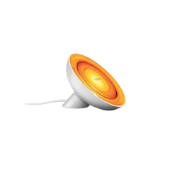|Philips|Hue Bloom Tischlampe||||
|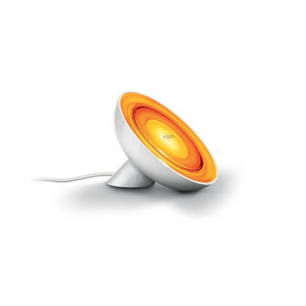|Philips|Farbton LivingColors||||
|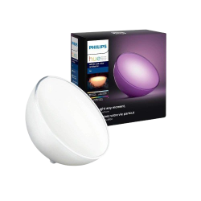|Philips|Hue Go tragbares Licht||||
|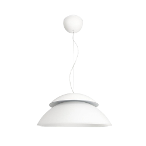|Philips|Farbton jenseits des Aufhängungslichts||||
||Philips|Farbton Weiß und Farbe||||
||Philips|Farbton Weiß und Farbe||||
||Philips|Farbton Weiß und Farbe||||
||Philips|Farbton Smart Plug||||
||Philips|Farbton Smart Plug||||
||Philips|Farbton LightStrip||||
||Philips|Farbton LightStrip Plus||||
||Philips|Farbton LightStrip Outdoor||||
||Philips|Farbton Weiß E27 mit Bluetooth||||
||Philips|Hue White Ambiance E14 w / BT||||
||Philips|Farbton Weiß und Farbe||Bitte beachten Sie, dass es für dieses Modell keine Statusrückmeldung gibt, nur ein Auftragsversand möglich ist||
|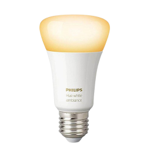|Philips|Farbton Weiß Ambiente A19 E26 / E27||Bitte beachten Sie, dass die Statusrückmeldung für dieses Modell nicht in Echtzeit erfolgt (entweder nach einem Befehl oder indem Sie explizit eine Aktualisierung anfordern)||
|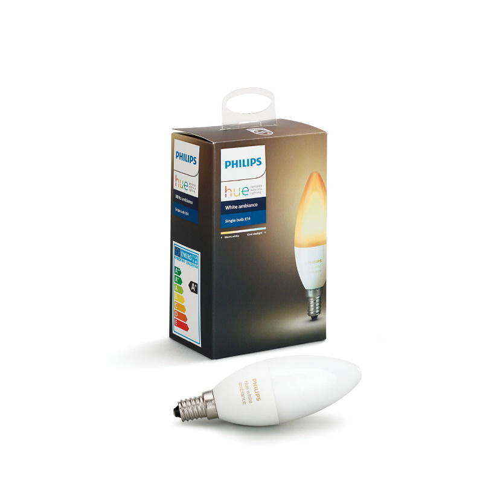|Philips|LTW012||Bitte beachten Sie, dass die Statusrückmeldung für dieses Modell nicht in Echtzeit erfolgt (entweder nach einem Befehl oder indem Sie explizit eine Aktualisierung anfordern)||
||Philips|Weiße GU10 Smart Glühbirne||Bitte beachten Sie, dass die Statusrückmeldung für dieses Modell nicht in Echtzeit erfolgt (entweder nach einem Befehl oder indem Sie explizit eine Aktualisierung anfordern)||
||Philips|Farbton Weiß Ambiente E27||Bitte beachten Sie, dass es für dieses Modell keine Statusrückmeldung gibt, nur ein Auftragsversand möglich ist||
||Philips|Farbton Weiß E27||Bitte beachten Sie, dass es für dieses Modell keine Statusrückmeldung gibt, nur ein Auftragsversand möglich ist||
||Philips|E27 Philps Hue 9W 806 lm Dimmbare weiße Glühbirne||||
||Philips|E27 Philps Hue 9W||||
|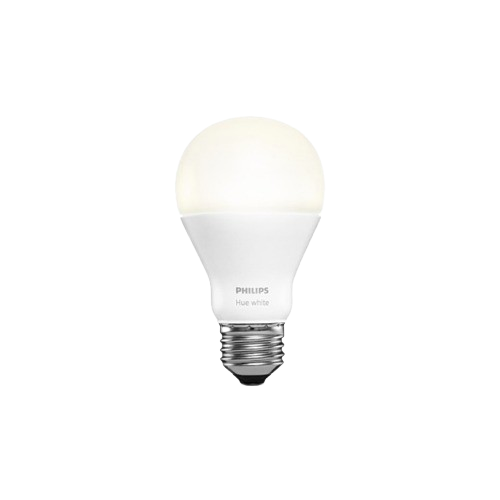|Philips|Farbton Weiß B22||Bitte beachten Sie, dass es für dieses Modell keine Statusrückmeldung gibt, nur ein Auftragsversand möglich ist||
|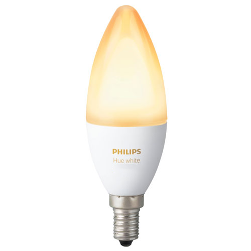|Philips|Farbton weiße Kerze E14||Bitte beachten Sie, dass es für dieses Modell keine Statusrückmeldung gibt, nur ein Auftragsversand möglich ist||
||Philips|Farbton Weiß GU10||||
|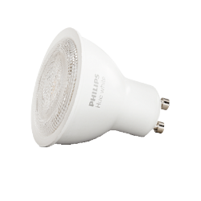|Philips|GU10 Philips HUE||||
|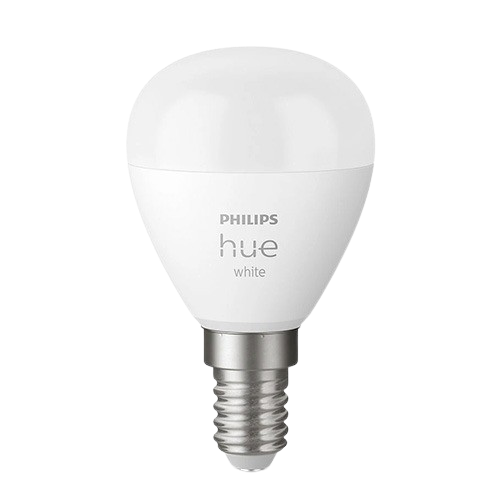|Philips|Farbton E14 P45||||
|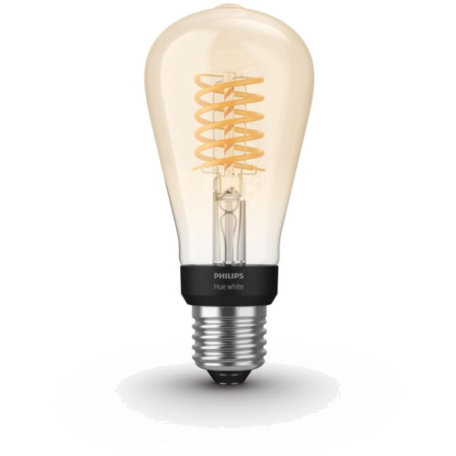|Philips|Farbton Weiß Glühbirne ST64 E27||||
|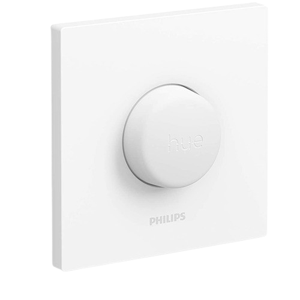|Philips|Variateur||||
||Philips|4-Tasten-Fernbedienung||||
||Philips|Farbton Innenbewegungsdetektor|Bewegung, Helligkeit, Temperatur|||
|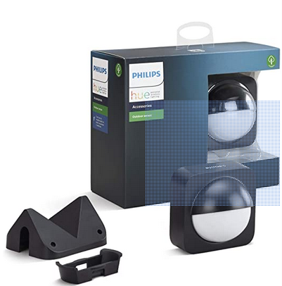|Philips|Farbton Außenbewegungsdetektor|Bewegung, Helligkeit, Temperatur|||
||Philips|Hue Go||||
||Philips|4-Tasten-Fernbedienung||||

# Profalux

|Image|Marque|Nom|Type|Remarque|Lien|
|---|---|---|---|---|---|
||Profalux|Profalux MOE||||

# Schneider

|Image|Marque|Nom|Type|Remarque|Lien|
|---|---|---|---|---|---|
||Schneider|SCHNEIDER WISER S520567W ODACE|Volets|||
||Schneider|PlusLink Verschlusseinsatz|Volets||[Dokumentation](https://download.schneider-electric.com/files?p_enDocType=System+user+guide&p_File_Name=Merten_PL_Wiser_TIs_DE.pdf&p_Doc_Ref=Merten_PL_Wiser_TIs_DE) |
|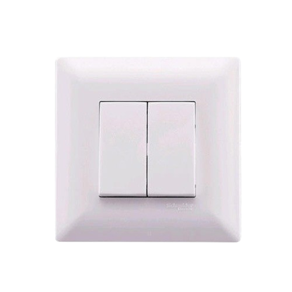|Schneider|Doppelschalter||||
|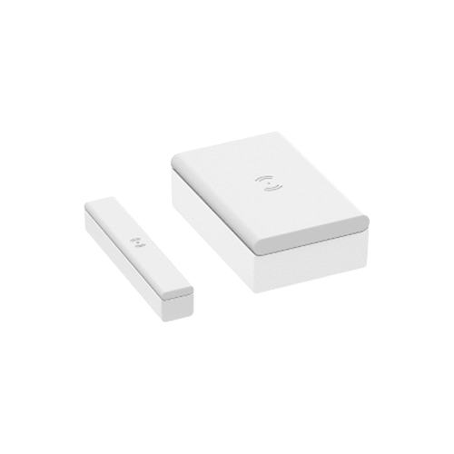|Schneider|Klügerer Fenster- / Türsensor|Ouverture||[Dokumentation](https://download.schneider-electric.com/files?p_enDocType=User+guide&p_File_Name=MFR1569800.pdf&p_Doc_Ref=MFR1569800) |
||Schneider|Klügerer Wasserlecksensor|Fuite|||
||Schneider|Klügerer elektrischer Heizungsaktuator|||[Kaufen](https://www.domadoo.fr/fr/chauffage-clim/5498-schneider-electric-actionneur-pour-radiateur-electrique-fil-pilote-zigbee-30-wiser-3606481914705.html)|
||Schneider|Klügerer Dimmer|Variateur|||
||Schneider|ZIGBEE 3 ANGESCHLOSSENER SCHALTER.0 WEISER ODACE|||[Kaufen](https://www.domadoo.fr/fr/peripheriques/5719-schneider-electric-interrupteur-connecte-zigbee-30-wiser-odace-blanc-3606481019578.html)|
||Schneider|Wiser Exxact Dimmer rotierend|Variateur|||
|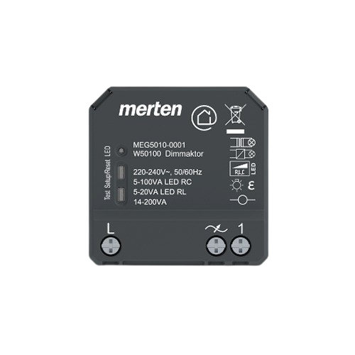|Schneider|Klügeres Mikrodimmermodul|Variateur|||
|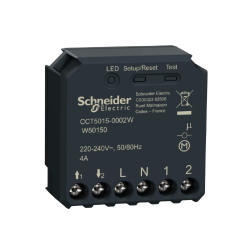|Schneider|Angeschlossenes Modul für Rollläden|Volets||[Dokumentation](https://download.schneider-electric.com/files?p_enDocType=System+user+guide&p_File_Name=Merten_PL_Wiser_TIs_DE.pdf&p_Doc_Ref=Merten_PL_Wiser_TIs_DE) |
|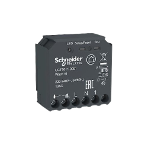|Schneider|Klügeres EIN / AUS-Schaltermodul|Interrupteur|||
||Schneider|Klüger angeschlossener Raumthermostat|Thermostat, Heizung||[Kaufen](https://www.domadoo.fr/fr/thermostats/5496-schneider-electric-thermostat-d-ambiance-connecte-zigbee-30-wiser-3606489710194.html)|
|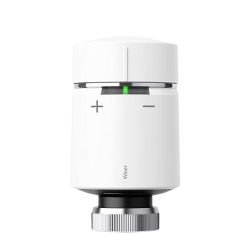|Schneider|Klüger angeschlossener Thermostatventilkopf|Thermostatkopf, Heizung||[Kaufen](https://www.domadoo.fr/fr/tetes-thermostatiques/5497-schneider-electric-tete-de-vanne-thermostatique-connectee-zigbee-30-wiser-3606489582821.html)|

# Sonoff

|Image|Marque|Nom|Type|Remarque|Lien|
|---|---|---|---|---|---|
||Sonoff|Mikromodulschalter angeschlossen|Schütz, Licht||[Kaufen](https://www.domadoo.fr/fr/peripheriques/5375-sonoff-micromodule-commutateur-connecte-zigbee.html)|
||Sonoff|Mikromodulschalter 10A|Contacteur||[Dokumentation](http://dl.itead.cc/basiczbr3/BASICZBR3-user-manual-V-1-1.pdf) [Kaufen](https://www.domadoo.fr/fr/peripheriques/5258-sonoff-module-commutateur-10a-zigbee-30.html)|
|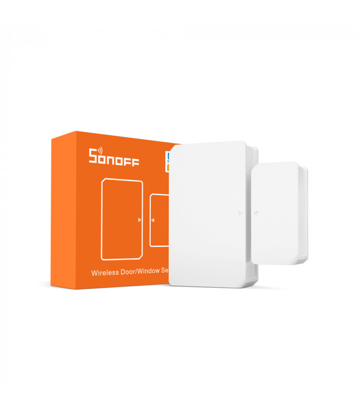|Sonoff|Tür- / Fensteröffnungssensor|Sensor, Blende|Achtung, es gibt einen Fehler in der Firmware, der dazu führt, dass sie als Temperatur- und Feuchtigkeitsmodul aufsteigt. Daher ist es nach der Aufnahme erforderlich, das richtige Modell zurückzusetzen und die Temperatur- und Feuchtigkeitsregler zu entfernen|[Dokumentation](http://dl.itead.cc/SNZB-04/Instructions/SNZB-04_V1.0_User_manual_20201116.pdf) [Kaufen](https://www.domadoo.fr/fr/peripheriques/5320-sonoff-capteur-d-ouverture-de-portefenetre-zigbee.html)|
||Sonoff|Tür- / Fensteröffnungssensor|Sensor, Blende||[Dokumentation](http://dl.itead.cc/SNZB-04/Instructions/SNZB-04_V1.0_User_manual_20201116.pdf) [Kaufen](https://www.domadoo.fr/fr/peripheriques/5320-sonoff-capteur-d-ouverture-de-portefenetre-zigbee.html)|
|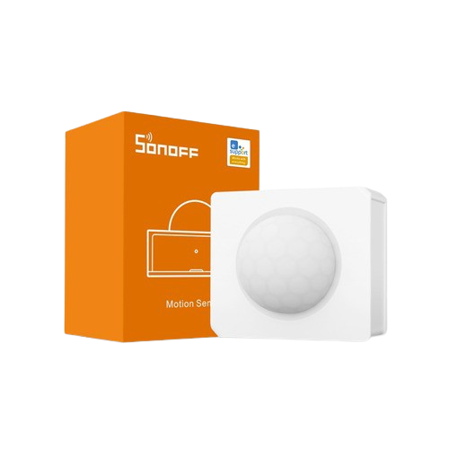|Sonoff|Intelligenter Bewegungsmelder|Sensor, Bewegung||[Dokumentation](http://dl.itead.cc/SNZB-03/Instructions/SNZB-03_V1.0_User_manual_20201116.pdf) [Kaufen](https://www.domadoo.fr/fr/peripheriques/5261-sonoff-detecteur-de-mouvement-zigbee-30.html)|
|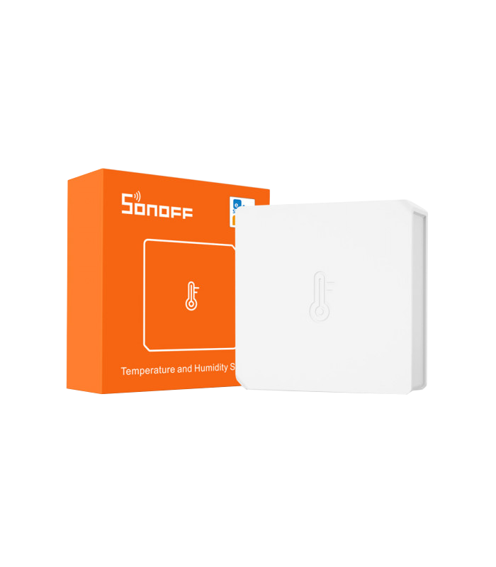|Sonoff|Temperatur- und Feuchtigkeitssensor|Sensor, Luftfeuchtigkeit, Temperatur||[Dokumentation](http://dl.itead.cc/SNZB-02/Instructions/SNZB-02_V1.0_User_manual_20201116.pdf) [Kaufen](https://www.domadoo.fr/fr/peripheriques/5260-sonoff-capteur-de-temperature-et-d-humidite-zigbee-30.html)|
|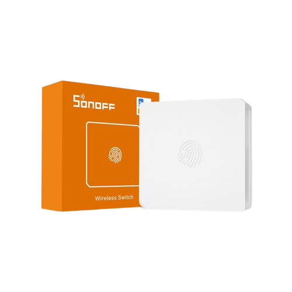|Sonoff|Drahtlos verbundener Schalter|Schalter, Fernbedienung||[Dokumentation](http://dl.itead.cc/SNZB-01/Instructions/SNZB-01_V1.0_User_manual_20201116.pdf) [Kaufen](https://www.domadoo.fr/fr/peripheriques/5259-sonoff-interrupteur-sans-fil-zigbee-30.html)|

# Sunricher

|Image|Marque|Nom|Type|Remarque|Lien|
|---|---|---|---|---|---|
||Sunricher|Sunricher CCT-Beleuchtung||||
||Sunricher|2-Draht-Dimmermodul|Dimmer, Licht, Leistung, Messung||[Kaufen](https://www.domadoo.fr/fr/peripheriques/5244-sunricher-module-variateur-2-fils-zigbee-30.html)|
||Sunricher|EIN / AUS-Modul|Schütz, Licht||[Kaufen](https://www.domadoo.fr/fr/peripheriques/5242-sunricher-module-onoff-zigbee-30.html)|
|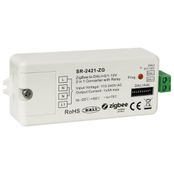|Sunricher|Sunricher Dali||||
||Sunricher|Rollladenmodul|Shutter, Store||[Kaufen](https://www.domadoo.fr/fr/peripheriques/5245-sunricher-module-volet-roulant-zigbee-30.html)|
||Sunricher|4 in 1 RGBW LED Controller|Licht, RGBW, Dimmer||[Kaufen](https://www.domadoo.fr/fr/peripheriques/5248-sunricher-controleur-led-rgbw-4-en-1-zigbee-30.html)|
|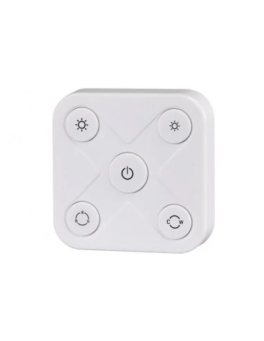|Sunricher|Sunricher RGB CCT Sun 3 in 1||||
|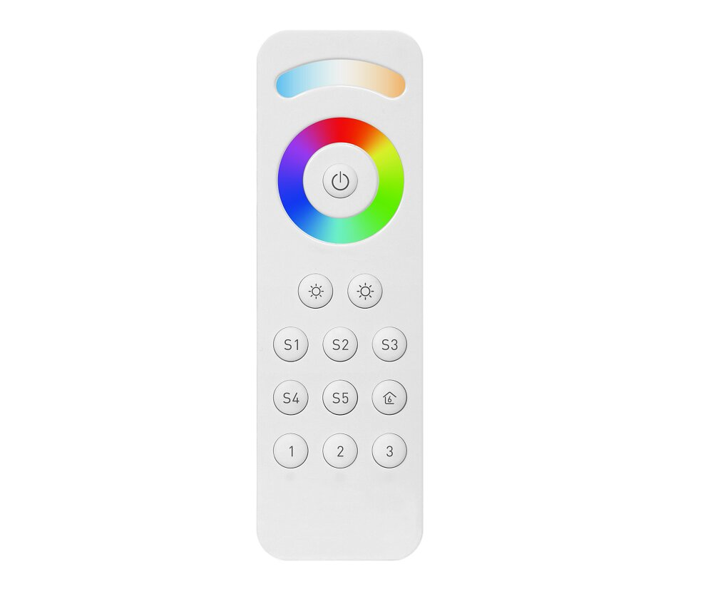|Sunricher|3 in 1 Fernbedienung|Fernbedienung||[Kaufen](https://www.domadoo.fr/fr/peripheriques/5247-sunricher-telecommande-3-en-1-zigbee-30.html)|
|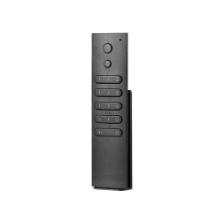|Sunricher|4-Zonen-Fernbedienung|Fernbedienung||[Kaufen](https://www.domadoo.fr/fr/peripheriques/5246-sunricher-telecommande-4-zones-zigbee-30.html)|

# Tryo2sys

|Image|Marque|Nom|Type|Remarque|Lien|
|---|---|---|---|---|---|
|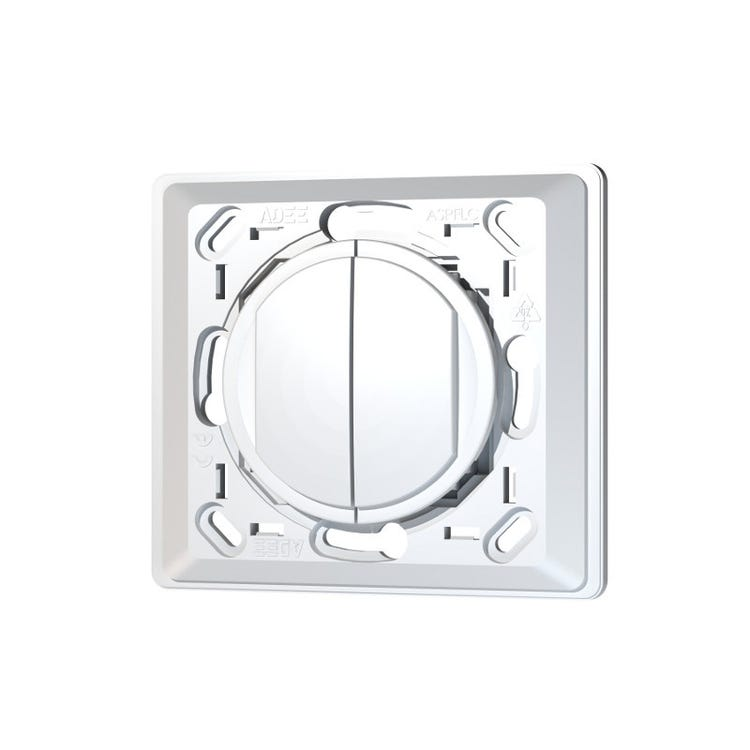|Tryo2sys|PTM 215 ZE||||

# Tuya

|Image|Marque|Nom|Type|Remarque|Lien|
|---|---|---|---|---|---|
||Tuya|Temperatur- und Feuchtigkeitssensor||||
|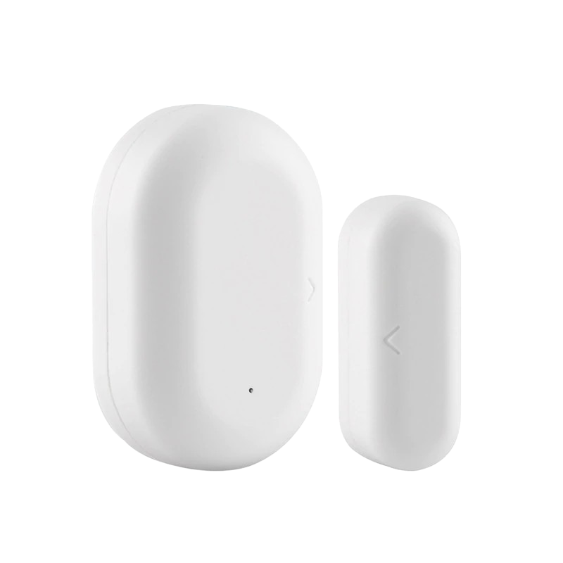|Tuya|Intelligenter Sensor zum Öffnen von Türen oder Fenstern||||
|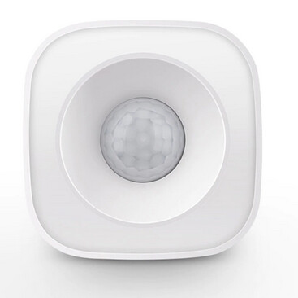|Tuya|Intelligenter Bewegungsmelder||||
||Tuya|Schwingungssensor||||
||Tuya|EIN / AUS-Schalter 2300W 1 Kanal||||
||Tuya|Smart ON / OFF-Stecker und 2 USB-Anschlüsse||||
||Tuya|Angeschlossener Schalter für Rollladen||||
||Tuya|Intelligenter EIN / AUS-Schalter||||
|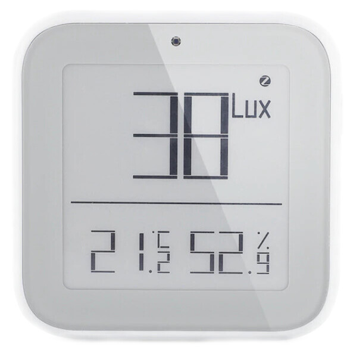|Tuya|Temperatur, Helligkeit, Luftfeuchtigkeit mit Display||||
|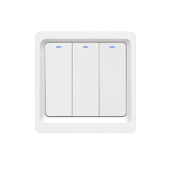|Tuya|Dreifachschalter||||
|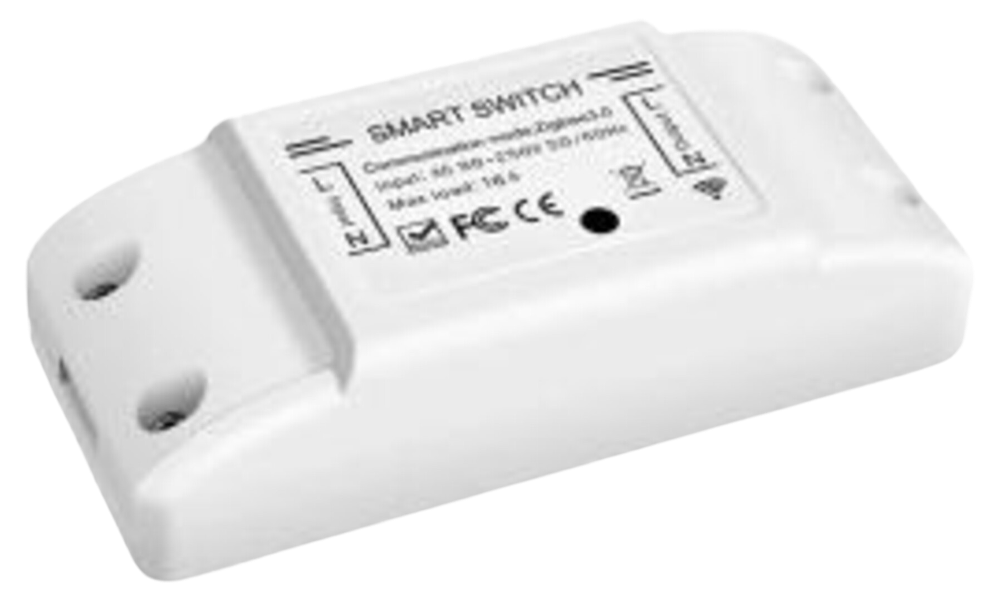|Tuya|Tuya Zigbee - Schalter 16A||||
||Tuya|Smart Charge mit einer Ladung||||
|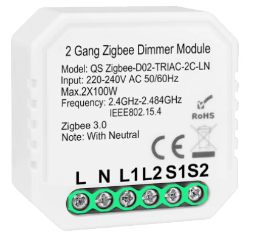|Tuya|Tuya ZigBee 3 leichtes Mikromodul.0 doppelter Dimmer||||
||Tuya|USEELINK - Verbundener Streifen 4 Buchsen und 2 USB-Anschlüsse|||[Kaufen](https://www.domadoo.fr/fr/peripheriques/5489-useelink-multiprise-connectee-16a-zigbee-ha-4-prises-2-ports-usb.html)|
|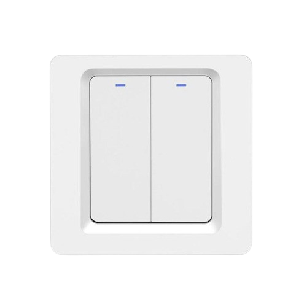|Tuya|Doppelschalter||||
|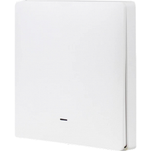|Tuya|Smart Charge mit einer Ladung||||
||Tuya|Wasser / Gas-Ventil||||
|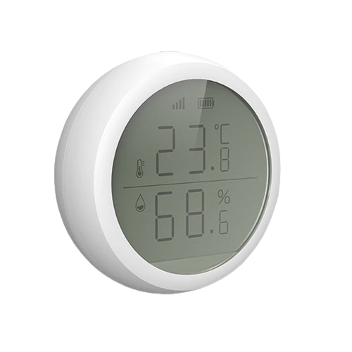|Tuya|Temperatur- und Feuchtigkeitssensor mit Display||||
||Tuya|LED-Controller||||
||Tuya|Doppelmikromodul ohne Neutralleiter||||
||Tuya|LED-Controller||||
||Tuya|Angeschlossener Schalter für angeschlossenen Vorhang||||
||Tuya|2 Stimmen dimmen||||
||Tuya|Schalter mit 3 Tasten||||
||Tuya|Szenen-Fernbedienung 4 Tasten||||
|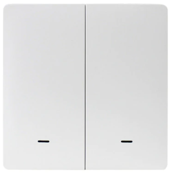|Tuya|Intelligenter Doppelschalter||||
||Tuya|Angeschlossene Steckdose|Buchse, Messgerät, Leistung, Repeater|||
||Tuya|Sensor öffnen|Ouverture|||
||Tuya|Doppelschalter||||
|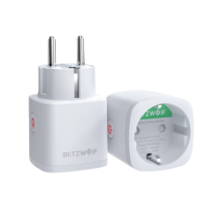|Tuya|BLITZWOLF - EU 16A Smart Plug||||
|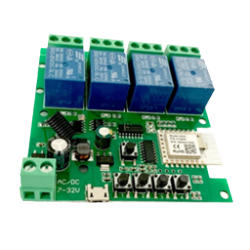|Tuya|Dreifachschalter||||
||Tuya|Gigier JR-ZDS01||||
||Tuya|Mini-RGB-LED-Strip-Controller||||
|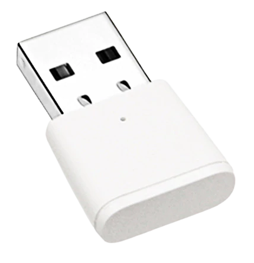|Tuya|Reichweitenverstärker||||
||Tuya|Angeschlossene Steckdosenleiste 4 Buchsen und 2 USB-Anschlüsse||||
|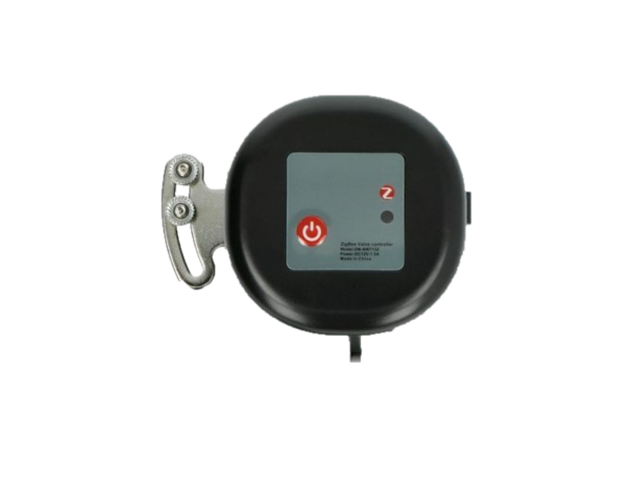|Tuya|Tuya Zigbee - Ventilsteuerung||||
|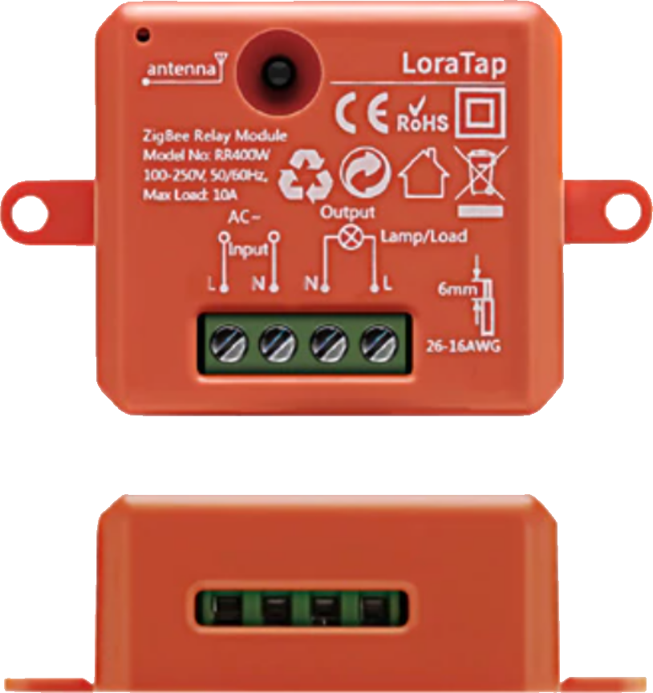|Tuya|Dual ON / OFF angeschlossenes Modul||||
|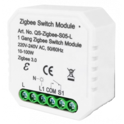|Tuya|Einfaches EIN / AUS-Modul ohne Neutralleiter||||
||Tuya|MOES - Dual ON / OFF angeschlossenes Modul||||
||Tuya|Temperatur-, Feuchtigkeits- und Lichtsensor mit Display||||
|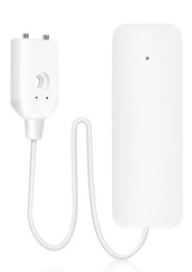|Tuya|Hochwassermelder|Fuite|||
|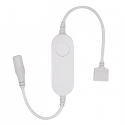|Tuya|RGBCCT-LED-Streifen-Controller||||
|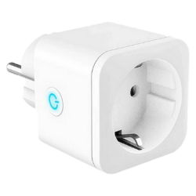|Tuya|Smart Charge mit einer Ladung||||
||Tuya|Steckdose mit 2 USB-Anschlüssen||||
||Tuya|Intelligenter Einzelschalter||||
||Tuya|RGBW LED Strip Controller||||
|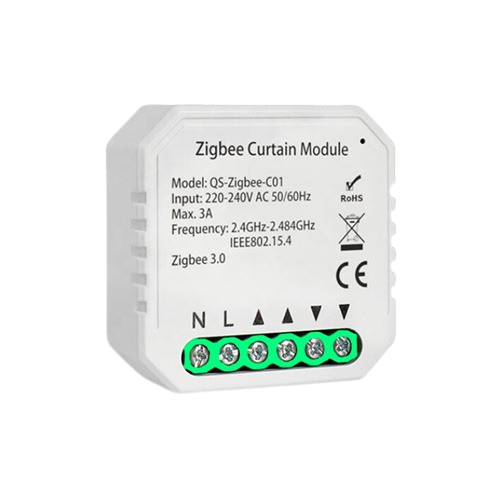|Tuya|Intelligentes Rollladenmodul||||
|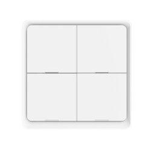|Tuya|4-Tasten-Smart-Schalter mit Batterien||||
||Tuya|Dreifachschalter||||
||Tuya|Hochwassermelder (2)|Fuite|||
||Tuya|4-Tasten-Smart-Schalter mit Batterien||||
||Tuya|MOES - Einzelne EIN / AUS-Module||||
|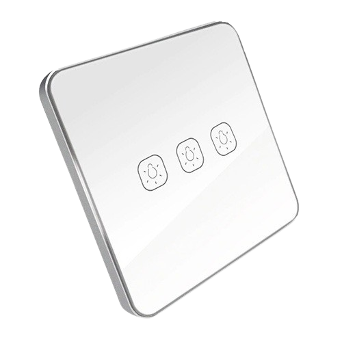|Tuya|Schalter mit 3 Tasten||||
||Tuya|Verbundene Schalter 2 Tasten||||
|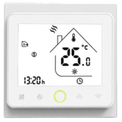|Tuya|Intelligenter Thermostat||||
|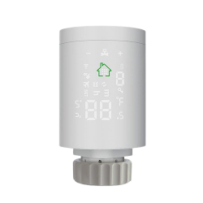|Moes|MOES - Intelligenter Thermostatkopf||||
|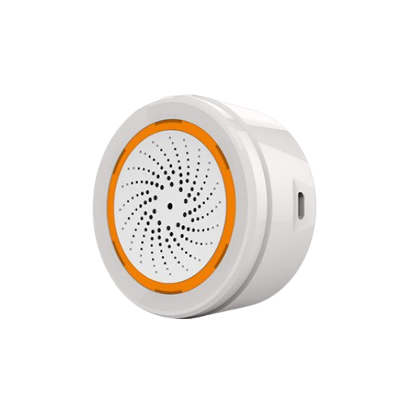|Tuya|Intelligente Sirene mit Temperatur- und Feuchtigkeitssensor||||
||Tuya|MOES - Intelligenter Thermostat||||
|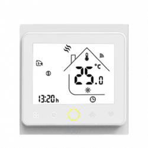|Tuya|MOES - Intelligenter Thermostat||||
||Tuya|Gassensor||||
||Moes|MOES - Intelligenter Thermostatkopf (2)||||

# Woox

|Image|Marque|Nom|Type|Remarque|Lien|
|---|---|---|---|---|---|
|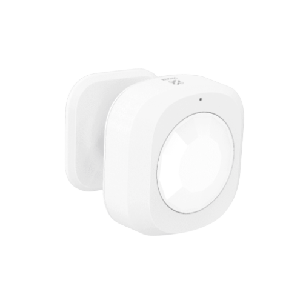|Woox|Intelligenter Bewegungsmelder||||
||Woox|Intelligente Sirene mit LED|||[Kaufen](https://www.domadoo.fr/fr/peripheriques/5682-woox-sirene-interieure-intelligente-zigbee-30-8435606701105.html)|
||Woox|Intelligenter Tür- oder Fensteröffnungsdetektor||||
||Woox|Angeschlossene E27 LED-Lampe - RGB + CCT|||[Kaufen](https://www.domadoo.fr/fr/peripheriques/5680-woox-ampoule-connectee-zigbee-e27-rgb-cct-compatible-amazon-alexa-et-google-assistant-8435606703581.html)|
||Woox|Intelligenter Hochwassermelder||||
|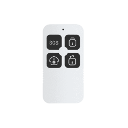|Woox|4-Tasten-SOS / Arm / Disarm / Home-Fernbedienung|||[Kaufen](https://www.domadoo.fr/fr/peripheriques/5684-woox-telecommande-intelligente-4-boutons-zigbee-30-8435606701136.html)|
|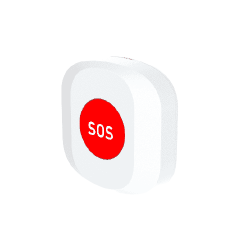|Woox|SOS-Taste|||[Kaufen](https://www.domadoo.fr/fr/peripheriques/5683-woox-bouton-d-urgence-sos-zigbee-30-8435606701112.html)|
|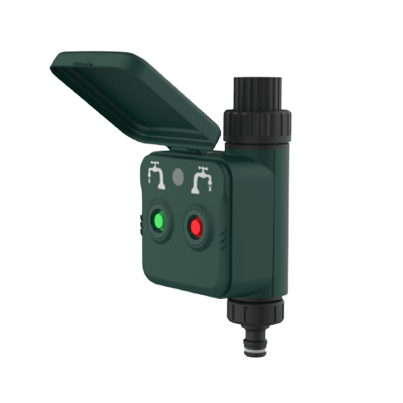|Woox|EIN / AUS intelligente Sprinklersteuerung für den Außenbereich |||[Kaufen](https://www.domadoo.fr/fr/peripheriques/5685-woox-controleur-d-arrosage-intelligent-onoff-zigbee-30-8435606701198.html)|
||Woox|Intelligenter Rauchmelder||||
||Woox|Intelligenter Thermostatkopf mit Display||||

# Xiaomi

|Image|Marque|Nom|Type|Remarque|Lien|
|---|---|---|---|---|---|
|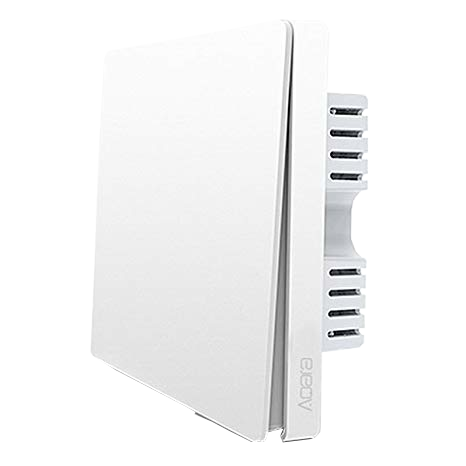|Xiaomi|AQARA - Einzelschalter mit Neutralleiter||||
||Xiaomi|AQARA - Doppelschalter mit Neutralleiter||||
||Xiaomi|AQARA - Einzelschalter ohne Neutralleiter||||
||Xiaomi|AQARA - Doppelschalter ohne Neutralleiter||||
|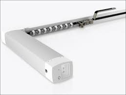|Xiaomi|Vorhangmotor||||
|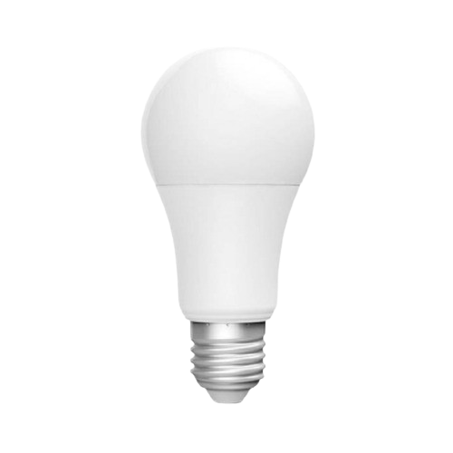|Xiaomi|AQARA - Angeschlossene LED-Lampe|||[Kaufen](https://www.domadoo.fr/fr/peripheriques/5257-aqara-ampoule-led-zigbee-aqara-blanc-variable-0192784000144.html)|
||Xiaomi|MIJIA - Verbundenes Schloss|Serrure|||
|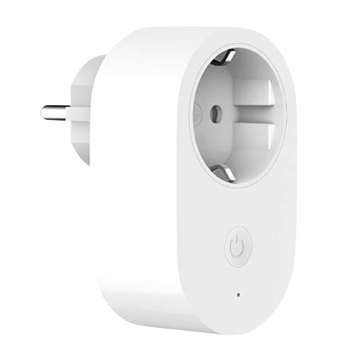|Xiaomi|MI - Smart Plug EIN / AUS||||
|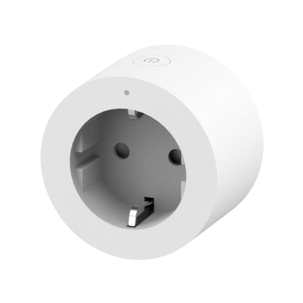|Xiaomi|AQARA - Angeschlossene Steckdose|||[Kaufen](https://www.domadoo.fr/fr/peripheriques/5385-aqara-prise-connectee-zigbee-30-smart-plug-6970504210646.html)|
|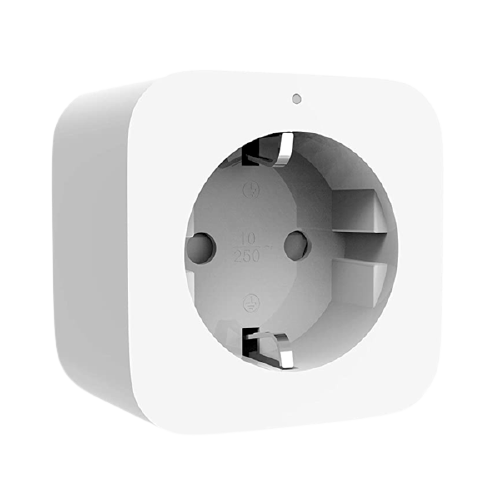|Xiaomi|MI - ON / OFF-Steckdose + Verbrauchsmessung|||[Kaufen](https://www.domadoo.fr/fr/peripheriques/5305-xiaomi-prise-connectee-zigbee-mi-smart-plug-6934177706493.html)|
|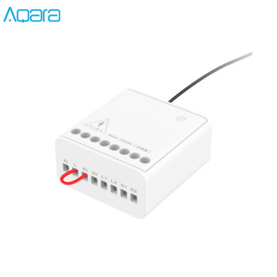|Xiaomi|AQARA - Intelligentes bidirektionales Modul||||
||Xiaomi|AQARA - Smart Wireless Single Switch|||[Kaufen](https://www.domadoo.fr/fr/peripheriques/4516-xiaomi-interrupteur-mural-simple-sans-fil-zigbee-aqara-6970504210)|
||Xiaomi|AQARA - Smart Wireless Single Switch|||[Kaufen](https://www.domadoo.fr/fr/peripheriques/4516-xiaomi-interrupteur-mural-simple-sans-fil-zigbee-aqara-6970504210)|
||Xiaomi|AQARA - Smart Wireless Switch (REV1)|Fernbedienung, Schalter||[Kaufen](https://www.domadoo.fr/fr/peripheriques/4669-aqara-interrupteur-sans-fil-intelligent-zigbee-192784000052.html)|
|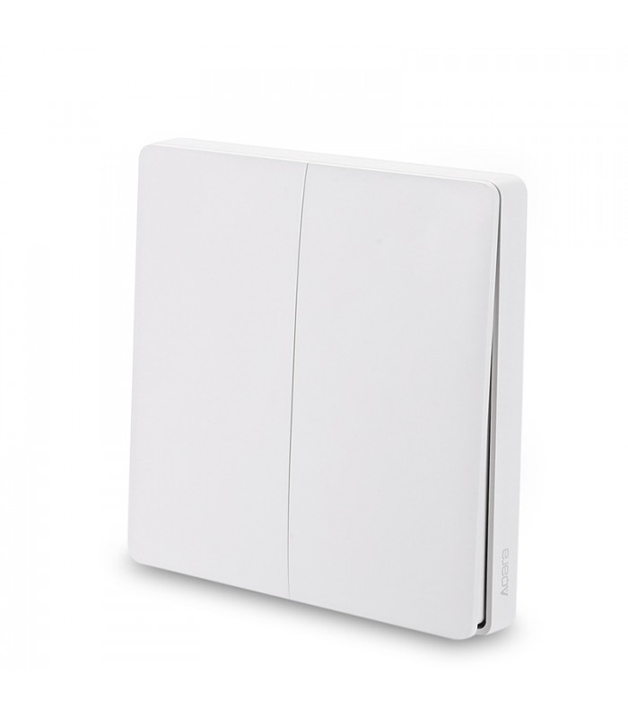|Xiaomi|AQARA - Drahtloser Doppelschalter|||[Kaufen](https://www.domadoo.fr/fr/peripheriques/4517-xiaomi-interrupteur-mural-double-sans-fil-zigbee-aqara-6970504210042.html)|
||Xiaomi|AQARA - Drahtloser Doppelschalter|||[Kaufen](https://www.domadoo.fr/fr/peripheriques/4517-xiaomi-interrupteur-mural-double-sans-fil-zigbee-aqara-6970504210042.html)|
||Xiaomi|AQARA - Funkschalter 4||||
||Xiaomi|AQARA - OPPLE 6-Tasten-Smart-Wireless-Schalter||||
|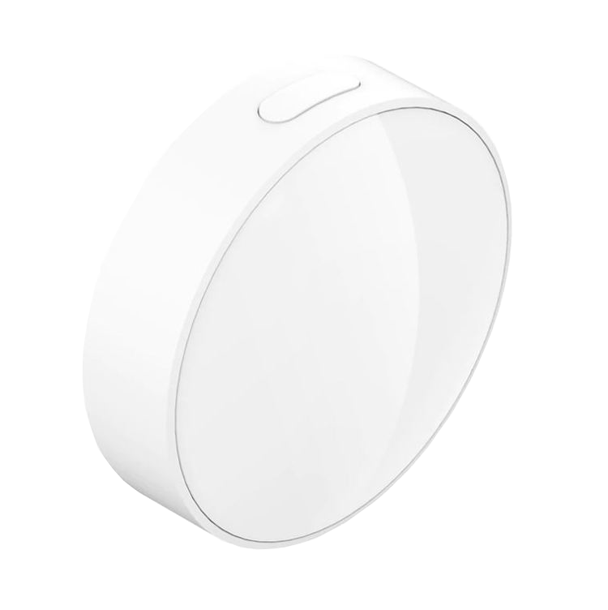|Xiaomi|MI - Lichtsensor|||[Kaufen](https://www.domadoo.fr/fr/peripheriques/5486-xiaomi-mi-capteur-de-luminosite-zigbee-30-6934177710865.html)|
|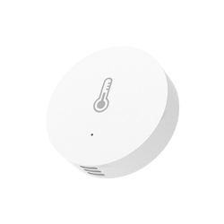|Xiaomi|MIJIA - Temperatur- / Feuchtigkeitssensor||||
||Xiaomi|AQARA - Smart Wireless Single Switch|||[Kaufen](https://www.domadoo.fr/fr/peripheriques/4516-aqara-interrupteur-mural-simple-sans-fil-zigbee-6970504210035.html)|
|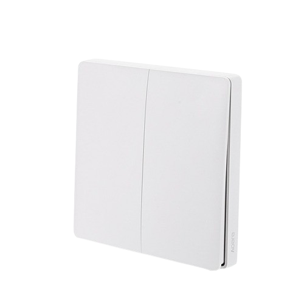|Xiaomi|AQARA - Intelligenter drahtloser Doppelschalter|||[Kaufen](https://www.domadoo.fr/fr/peripheriques/4517-xiaomi-interrupteur-mural-double-sans-fil-zigbee-aqara-6970504210042.html)|
|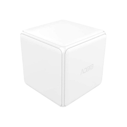|Xiaomi|AQARA - Intelligente Steuerung von Magic Cube|Fernbedienung, Steuerung||[Kaufen](https://www.domadoo.fr/fr/peripheriques/4668-aqara-controleur-intelligent-magic-cube-zigbee-0192784000045.html)|
|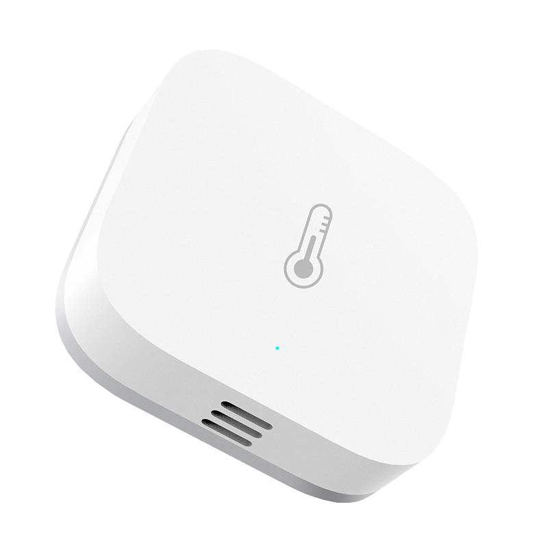|Xiaomi|AQARA - Intelligenter Temperatur- und Feuchtigkeitssensor|||[Kaufen](https://www.domadoo.fr/fr/peripheriques/4515-aqara-capteur-de-temperature-et-d-humidite-zigbee-6970504212510.html)|
|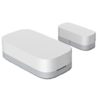|Xiaomi|AQARA - Intelligenter Öffnungssensor|||[Kaufen](https://www.domadoo.fr/fr/peripheriques/4514-xiaomi-detecteur-d-ouverture-portefenetre-zigbee-aqara.html)|
||Xiaomi|MI - Intelligenter Öffnungssensor||||
|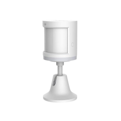|Xiaomi|AQARA - Intelligenter Bewegungssensor|||[Kaufen](https://www.domadoo.fr/fr/peripheriques/4518-xiaomi-detecteur-de-mouvement-zigbee-aqara-192784000090.html)|
||Xiaomi|AQARA - Intelligenter Bewegungssensor|||[Kaufen](https://www.domadoo.fr/fr/peripheriques/4518-aqara-detecteur-de-mouvement-zigbee-192784000090.html)|
|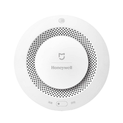|Xiaomi|MIJIA - Intelligenter Rauchmelder||||
||Xiaomi|AQARA - Intelligenter Funkschalter|Fernbedienung, Schalter|||
||Xiaomi|AQARA - Smart Wireless Switch (REV2)|Fernbedienung, Schalter||[Kaufen](https://www.domadoo.fr/fr/peripheriques/4669-aqara-interrupteur-sans-fil-intelligent-zigbee-192784000052.html)|
||Xiaomi|AQARA - Smart Wireless Switch (REV3)|Fernbedienung, Schalter|||
||Xiaomi|MIJIA - Smart Wireless Switch||||
|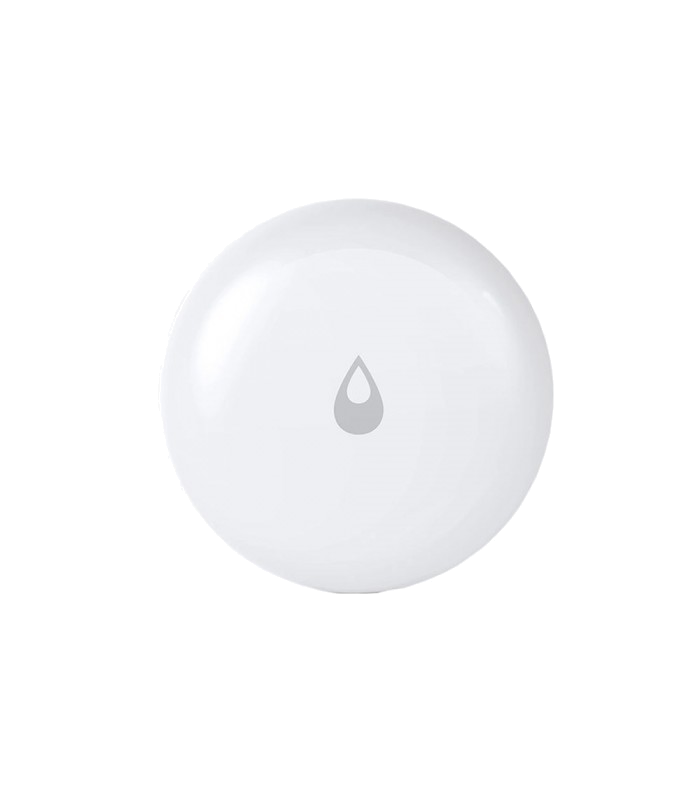|Xiaomi|AQARA - Intelligenter Hochwassermelder|||[Kaufen](https://www.domadoo.fr/fr/peripheriques/4519-xiaomi-capteur-d-eau-zigbee-aqara-6970504210257.html)|
|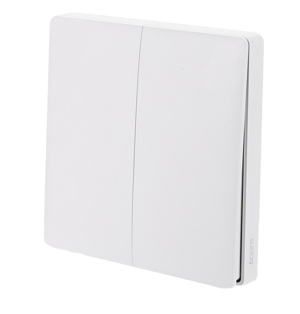|Xiaomi|AQARA - Doppelschalter ohne Neutralleiter||||
|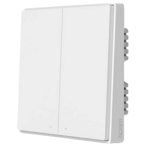|Xiaomi|AQARA - Smart Wandschalter D1||||
||Xiaomi|AQARA - Mikromodul ein / aus ohne Neutralleiter|Schütz, Messgerät, Leistung||[Kaufen](https://www.domadoo.fr/fr/peripheriques/5387-aqara-micromodule-onoff-zigbee-30-1250w-sans-neutre-6970504213302.html)|
|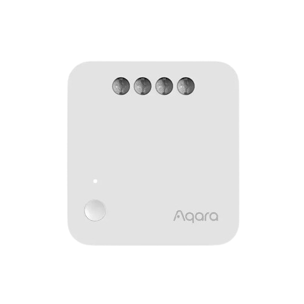|Xiaomi|AQARA - Mikromodul ein / aus mit Neutralleiter|Schütz, Messgerät, Leistung||[Kaufen](https://www.domadoo.fr/fr/peripheriques/5386-aqara-micromodule-onoff-zigbee-30-2500w-avec-neutre-6970504213296.html)|
|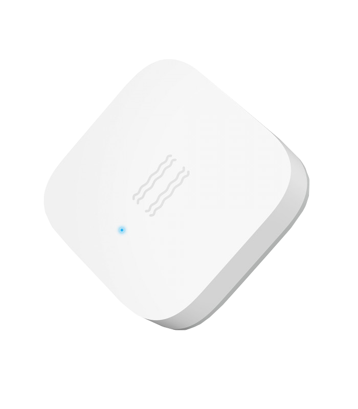|Xiaomi|||||
||Xiaomi|AQARA - Temperatur- / Druck- / Feuchtigkeitssensor|||[Kaufen](https://www.domadoo.fr/fr/peripheriques/4515-aqara-capteur-de-temperature-et-d-humidite-zigbee-6970504212510.html)|
||Xiaomi|AQARA - Lichtsensor||||
||Xiaomi|MI - Lichtsensor|||[Kaufen](https://www.domadoo.fr/fr/peripheriques/5486-xiaomi-mi-capteur-de-luminosite-zigbee-30-6934177710865.html)|
|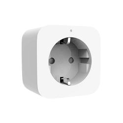|Xiaomi|MI - ON / OFF-Steckdose + Verbrauchsmessung|||[Kaufen](https://www.domadoo.fr/fr/peripheriques/5305-xiaomi-prise-connectee-zigbee-mi-smart-plug-6934177706493.html)|
|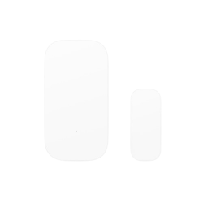|Xiaomi|AQARA - Intelligenter Öffnungsdetektor|||[Kaufen](https://www.domadoo.fr/fr/peripheriques/4514-xiaomi-detecteur-d-ouverture-portefenetre-zigbee-aqara.html)|
|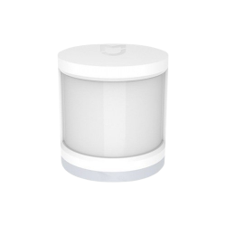|Xiaomi|AQARA - Intelligenter Bewegungsmelder|||[Kaufen](https://www.domadoo.fr/fr/peripheriques/4518-xiaomi-detecteur-de-mouvement-zigbee-aqara-192784000090.html)|
|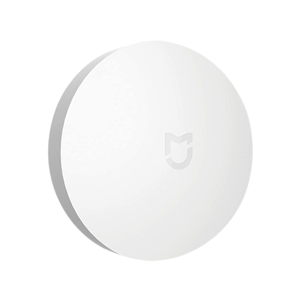|Xiaomi|MIJIA - Smart Wireless Switch|Schalter, Fernbedienung|||
||Xiaomi|AQARA - Intelligenter Hochwassermelder|||[Kaufen](https://www.domadoo.fr/fr/peripheriques/4519-xiaomi-capteur-d-eau-zigbee-aqara-6970504210257.html)|
||Xiaomi|AQARA - Vibrationssensor|Detektor, Tür, Vibration||[Kaufen](https://www.domadoo.fr/fr/peripheriques/4667-xiaomi-capteur-de-vibration-zigbee-aqara-192784000113.html)|

Diese Liste basiert auf Benutzer-Feedback. Das Jeedom-Team kann daher nicht garantieren, dass alle Module in dieser Liste zu 100% funktionsfähig sind

2021-06-30 02:32:12
