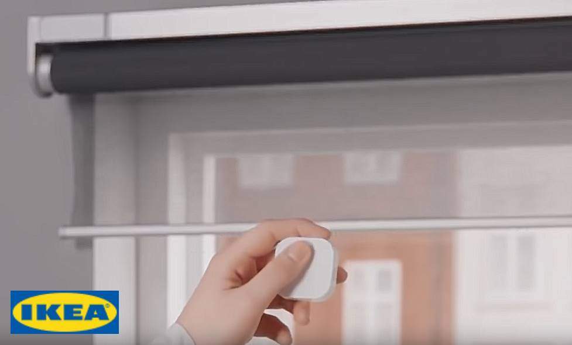

# Kompatibilität von ZigBee-Modulen

# Eurotronic

|Image|Marque|Nom|Type|Remarque|Lien|
|---|---|---|---|---|---|
||Eurotronic|Spiritusventil||Das Ventil sendet keine Informationen, um es zu identifizieren. Daher ist es unbedingt erforderlich, den Modultyp in Jeedom nach der Aufnahme manuell einzustellen||

# GR-SMARTHOME

|Image|Marque|Nom|Type|Remarque|Lien|
|---|---|---|---|---|---|
||GR-SMARTHOME|[TYZB01] GR-SMARTHOME 1/4 DREHVENTIL|||[Kaufen](https://www.domadoo.fr/fr/peripheriques/5264-gr-smarthome-motorisation-zigbee-30-pour-vanne-14-de-tour.html)|

# Legrand

|Image|Marque|Nom|Type|Remarque|Lien|
|---|---|---|---|---|---|
||Legrand|Legrand Kabelausgang||||
||Legrand|Legrand Mikromodul||||
||Legrand|Legrand Mobilsteckdose Céliane||||

# Danalock

|Image|Marque|Nom|Type|Remarque|Lien|
|---|---|---|---|---|---|
||Danalock|[DANA_277755] Danalock V3||Jeedom empfiehlt dieses Modul nicht, da es einen Fehler in der Firmware zu haben scheint, der zwingt, das Modul alle X Stunden oder Tage neu einzuschließen|[Kaufen](https://www.domadoo.fr/fr/controle-acces/4540-danalock-serrure-connectee-bluetooth-et-zigbee-danalock-v3-5712560000493.html)|

# Danfoss

|Image|Marque|Nom|Type|Remarque|Lien|
|---|---|---|---|---|---|
||Danfoss|[eTRV0100] Danfoss Ally||Um das Ventil zurückzusetzen, entfernen Sie die Batterien und legen Sie sie durch Drücken der Taste zurück, bis der Bildschirm wieder aufleuchtet.|[Kaufen](https://www.domadoo.fr/fr/peripheriques/5156-danfoss-tete-electronique-ally-zigbee-30-5702425245008.html)|

# Generic

|Image|Marque|Nom|Type|Remarque|Lien|
|---|---|---|---|---|---|
||Generic|Leichtes RGB||Generische Ausstattung für ein RGB-Licht||
||Generic|Ein / Aus||Generische Ausrüstung für eine Steckdose oder ein Ein / Aus-Modul||
||Generic|Öffnung / Bewegung||Generisches Gerät zum Öffnen oder Bewegungssensor||

# Ikea

|Image|Marque|Nom|Type|Remarque|Lien|
|---|---|---|---|---|---|
||Ikea|Ikea repeateur||||
||Ikea|[e1743] Ikea 2-Tasten-Fernbedienung||||
||Ikea|[e1766] Ikea Fernbedienung 2 Tasten speichern||||
||Ikea|[e1810] Ikea 5-Tasten-Fernbedienung||||
||Ikea|Ikea fyrtur||Für die Aufnahme ist es ratsam, die Jalousie zurückzusetzen (durch Drücken der 2 Tasten, bis die Diode aufleuchtet), dann Jeedom in den Einschlussmodus zu versetzen, die Betarie zu entfernen und die Batterie der Jalousie auszutauschen||
||Ikea|Ikea Kadrilj||Für die Aufnahme ist es ratsam, die Jalousie zurückzusetzen (durch Drücken der 2 Tasten, bis die Diode aufleuchtet), dann Jeedom in den Einschlussmodus zu versetzen, die Betarie zu entfernen und die Batterie der Jalousie auszutauschen||
||Ikea|Ikea Bewegungssensor||||

# Philips

|Image|Marque|Nom|Type|Remarque|Lien|
|---|---|---|---|---|---|
||Philips|[SML001] Philips Uhrwerk||||

# Sonoff

|Image|Marque|Nom|Type|Remarque|Lien|
|---|---|---|---|---|---|
||Sonoff|[BASICZBR3] Sonoff Basic ZBR3|||[Kaufen](https://www.domadoo.fr/fr/peripheriques/5258-sonoff-module-commutateur-10a-zigbee-30.html)|
||Sonoff|[DO01] Sonoff trägt||Es gibt einen Fehler in der Firmware, der dazu führt, dass sie als Temperatur- und Feuchtigkeitsmodul angezeigt wird. Setzen Sie daher nach der Aufnahme das richtige Modell zurück und entfernen Sie die Temperatur- und Feuchtigkeitsregler|[Kaufen](https://www.domadoo.fr/fr/peripheriques/5261-sonoff-detecteur-de-mouvement-zigbee-30.htm)|
||Sonoff|[MS01] Sonoff-Bewegung|||[Kaufen](https://www.domadoo.fr/fr/peripheriques/5261-sonoff-detecteur-de-mouvement-zigbee-30.html)|
||Sonoff|[TH01] Sonoff Temperatur / Luftfeuchtigkeit|||[Kaufen](https://www.domadoo.fr/fr/peripheriques/5260-sonoff-capteur-de-temperature-et-d-humidite-zigbee-30.html)|
||Sonoff|[WB01] Sonoff-Taste|||[Kaufen](https://www.domadoo.fr/fr/peripheriques/5259-sonoff-interrupteur-sans-fil-zigbee-30.html)|

# Sunricher

|Image|Marque|Nom|Type|Remarque|Lien|
|---|---|---|---|---|---|
||Sunricher|[SR-ZG9080A] Sunricher Motorsteuerung||||
||Sunricher|[RGBCTT] Sunricher RGB||||
||Sunricher|[ZG2858A] Sunricher ||||

# Xiaomi

|Image|Marque|Nom|Type|Remarque|Lien|
|---|---|---|---|---|---|
||Xiaomi|[b286acn01] Xioami-Doppelschalter|||[Kaufen](https://www.domadoo.fr/fr/peripheriques/4517-xiaomi-interrupteur-mural-double-sans-fil-zigbee-aqara-6970504210042.html)|
||Xiaomi|[Q8KG03LM] Xioami-Doppelschalter mit Neutralleiter||||
||Xiaomi|[vibration.aq1] Xioami Aquara Vibration|||[Kaufen](https://www.domadoo.fr/fr/peripheriques/4667-xiaomi-capteur-de-vibration-zigbee-aqara-192784000113.html)|
||Xiaomi|[magnet.aq2] Xiaomi Aquara Tür|||[Kaufen](https://www.domadoo.fr/fr/peripheriques/4514-xiaomi-detecteur-d-ouverture-portefenetre-zigbee-aqara.html)|
||Xiaomi|[motion.aq2] Xiaomi Aquara Bewegung|||[Kaufen](https://www.domadoo.fr/fr/peripheriques/4518-xiaomi-detecteur-de-mouvement-zigbee-aqara-192784000090.html)|
||Xiaomi|[wleak.aq1] Xiaomi Aquara Flut|||[Kaufen](https://www.domadoo.fr/fr/peripheriques/4519-xiaomi-capteur-d-eau-zigbee-aqara-6970504210257.html)|

Diese Liste basiert auf Benutzer-Feedback. Das Jeedom-Team kann daher nicht garantieren, dass alle Module in dieser Liste zu 100% funktionsfähig sind

2020-09-29 00:32:09
