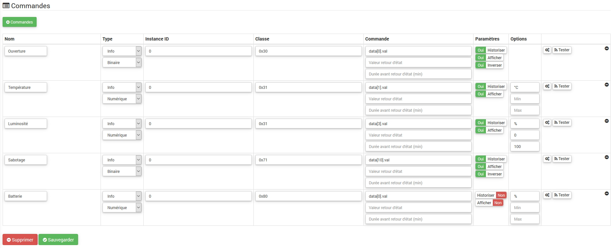

# D-Link DCH-Z110 - "3 en 1 Ouverture"

**Das Modul**

**Das Jeedom Visual**

## Zusammenfassung

Der Detektor DCH-Z110 bietet 3 verschiedene Funktionen : Öffnungserkennung, Temperatursensor und Lichtdetektor. Es besteht aus zwei Teilen : ein Detektor und ein Magnet. Sie können an einer Tür oder einem Fenster angebracht werden, wobei der Magnet am Öffnungsteil und der Detektor am Festteil befestigt sind.

Durch Öffnen der Tür oder des Fensters wird der Magnet vom Detektor wegbewegt, wodurch der Detektor ausgelöst wird, der ein Z-Wave-Alarmsignal sendet, wenn das System scharfgeschaltet ist (dieses Signal kann von einer Sirene oder von einem gesteuert werden) Hausautomationsbox zum Beispiel). Der Sensor kann je nach Helligkeitsstufe auch zur automatischen Lichtsteuerung verwendet werden. Beispielsweise sendet der Sensor ein Signal an den Z-Wave-Schalter, um das Licht einzuschalten, wenn sich die Tür öffnet und der Raum dunkel ist.

Der Detektor erhöht auch die Helligkeit und die Temperatur, d. H. Im Falle einer signifikanten Änderung, und jedes Mal, wenn das Öffnen / Schließen erfasst wird. Ein Z-Wave-Controller (Fernbedienung, Dongle…?) Ist erforderlich, um diesen Detektor in Ihr Netzwerk zu integrieren, wenn Sie bereits ein Netzwerk haben.

## Funktionen

-   3 in 1 Detektor: Blende, Temperatur, Licht
-   Optimierte Antennenreichweite
-   Verwendung für Hausautomations- oder Sicherheitsanwendungen
-   Taste zum Ein- / Ausschließen des Detektors
-   Autoprotection
-   Anzeige für niedrigen Batteriestand
-   Klein, diskret und ästhetisch
-   Benutzerfreundlichkeit und Installation

## Technische Daten

Standort [Beamte](http://www.dlink.com/-/media/Consumer_Products/DCH/DCH%20Z110/Datasheet/DCH_Z110_Datasheet_FR.pdf)

Anderer Link [technisch](http://www.kafkas.gr/uploads/Pdf/182732/DCH-Z120_183010381_01_Z02.PDF)

## Moduldaten

-   Machen Sie : D-Link
-   Modell : DCH-Z110 mydlink ™ Sensor zum Öffnen von Türen und Fenstern
-   Hersteller : FIBARO-System
-   Hersteller ID : 264 \ [0x0108 \]
-   Produkttyp : 2 \ [0x0002 \]
-   Produkt-ID : 14 \ [0x000e \]

## Konfiguration

Informationen zum Konfigurieren des OpenZwave-Plugins und zum Einfügen von Jeedom finden Sie hier [Dokumentation](https://doc.jeedom.com/de_DE/plugins/automation%20protocol/openzwave/).

> **Wichtig**
>
> Installieren Sie das Modul nicht am Fenster / an der Tür, bevor Sie es richtig konfiguriert haben, und achten Sie beim Testen auf einer ebenen Fläche und bei der Installation sorgfältig auf die Ausrichtung des Magneten. (Verwenden Sie ggf. Unterlegscheiben.) Um dieses Modul in den Einschlussmodus zu versetzen, drücken Sie die Zuordnungstaste dreimal 3.5 Sekunden laut Dokumentation. (konstantes rotes Blinken im Assoziationsmodus)

Einmal enthalten, sollten Sie dies erhalten :

### Befehle

Sobald das Modul erkannt wurde, sind die dem Modul zugeordneten Befehle verfügbar.

Hier ist die Liste der Befehle :

-   Öffnung : Es ist der Befehl, der eine Öffnungserkennung auslöst
-   Temperatur : Es ist der Befehl, der es ermöglicht, die Temperatur zu erhöhen
-   Helligkeit : Es ist der Befehl, der es ermöglicht, die Helligkeit zu erhöhen
-   Sabotage : Dies ist der Sabotagebefehl (er wird im Falle eines Reißens ausgelöst)
-   Batterie : Es ist der Batteriebefehl

### Konfiguration du module

> **Wichtig**
>
> Speichern Sie das Modul während einer ersten Aufnahme oder Änderung und aktivieren Sie es immer durch Drücken der Zuordnungstaste. Es sollte rot blinken und den Status ändern.

Dann ist es notwendig, das Modul entsprechend Ihrer Installation zu konfigurieren. Gehen Sie dazu auf die Schaltfläche "Konfiguration" des OpenZwave-Plugins von Jeedom.

Sie gelangen auf diese Seite (nachdem Sie auf die Registerkarte Einstellungen geklickt haben)

Parameterdetails :

-   2: Legt das an die Module in Zuordnungsgruppe 2 gesendete Signal fest
-   4: Stellt die Helligkeitsstufe ein, ab der das in Parameter 2 definierte Signal an die der Gruppe 2 zugeordneten Module gesendet wird
-   5: Betriebsart (siehe Herstellerdokumentation)
-   6: Multisensor-Betriebsart (siehe Herstellerdokumentation). Empfohlener Wert : 7
-   7: Benutzerdefinierte Betriebsart des Multisensors (siehe Herstellerdokumentation). Empfohlener Wert : 20 (um die funktionale Öffnung zu haben)
-   9: Hiermit können Sie festlegen, nach welcher Zeit das AUS-Signal an die der Gruppe 2 zugeordneten Module gesendet werden soll
-   10: wird verwendet, um die Dauer zwischen zwei Batterieberichten zu definieren (eine Einheit = Parameter 20)
-   11: Mit dieser Option können Sie die Dauer zwischen zwei automatischen Eröffnungsberichten definieren (eine Einheit = Parameter 20)
-   12: Mit dieser Option können Sie die Dauer zwischen zwei automatischen Helligkeitsberichten definieren (eine Einheit = Parameter 20). Empfohlener Wert : 6
-   13: ermöglicht die Definition der Dauer zwischen zwei automatischen Temperaturberichten (eine Einheit = Parameter 20). Empfohlener Wert : 2
-   20: Dauer eines Intervalls für die Parameter 10 bis 13. Empfohlener Wert : 10
-   21: Temperaturänderungswert in ° F, um einen Bericht auszulösen
-   22: Wert in% der Helligkeitsschwankung, um einen Bericht auszulösen. Empfohlener Wert : 10

### Gruppen

Dieses Modul hat zwei Zuordnungsgruppen, nur die erste ist wesentlich.

## Gut zu wissen

Zuordnung / Benachrichtigung mit anderen Modulen möglich (Beispiel: Benachrichtigung über das Sirenenglockenspiel DCH-Z510 bei Tür- / Fensteröffnung)

## Aufwachen

Um dieses Modul aufzuwecken, gibt es nur einen Weg :

-   Lassen Sie die Zuordnungstaste los und drücken Sie sie erneut
-   Verringern Sie das Aufweckintervall in der Modulkonfiguration / im Modulsystem (in Sekunden)

## Faq.

Dieses Modul wird durch Drücken der Zuordnungstaste aktiviert.

Dieses Modul ist ein Batteriemodul, die neue Konfiguration wird beim nächsten Aufwecken berücksichtigt. (Zuordnungstaste, um es zu erzwingen, daher der Vorteil, dass das Modul nicht installiert wird, bevor es ordnungsgemäß konfiguriert wurde)

## Wichtiger Hinweis

> **Wichtig**
>
> Sie müssen das Modul aufwecken : nach seiner Aufnahme, nach einer Änderung der Konfiguration, nach einer Änderung des Aufweckens, nach einer Änderung der Assoziationsgruppen
