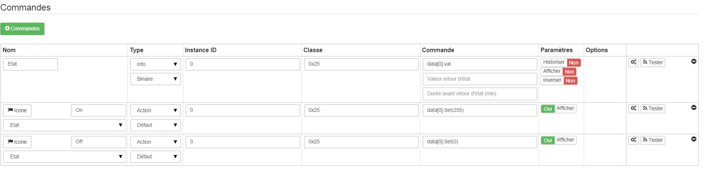

# Everspring Ministecker ein / aus - AN180-6

**Das Modul**

**Das Jeedom Visual**

## Zusammenfassung

Der Mini-Ein / Aus-Stecker dient zum Steuern des Ein- und Ausschaltens von Lichtern und elektrischen Geräten in Ihrem Haus. Mit einer Spannung von 220 - 240 V kann dieser Stecker eine Last von bis zu 1500 W (Widerstand), 800 W (Glühlampe), 200 W (Motor, Leuchtstoff, LED) aufnehmen.

Der Mini-Ein / Aus-Stecker ist ein Z-Wave ™ -kompatibles Gerät, das für alle Z-Wave ™ -kompatiblen Netzwerke geeignet ist. Es kann von einer Fernbedienung, einer PC-Software oder einem beliebigen Z-Wave-Controller in Ihrem Netzwerk gesteuert werden.

## Funktionen

-   Steuern Sie eine Lampe oder ein Gerät fern
-   Steckermodul, das direkt zwischen einer Steckdose und der zu steuernden Last integriert ist
-   EIN / AUS-Funktion zur Steuerung von Lampen oder Geräten (keine Variation)
-   Lokale Ladesteuerung über integrierte Taste
-   Z-Wave Plus-Technologie
-   Reduzierte Abmessungen bleiben fast unbemerkt
-   Status-LED an der integrierten Taste
-   Z-Wave-Repeater-Funktion

## Technische Daten

-   Modultyp : Z-Wave Empfänger
-   Versorgung : 230 V, 50 Hz
-   Verbrauch : 0,6 W.
-   Maximale Leistung : Widerstandslast : 1500W, Glühlampe : 800W, Kompaktleuchtstofflampe : 200W, LED-Lampe (nicht dimmbar) 200W
-   Frequenz : 868,42 MHz
-   Geltungsbereich : bis zu 70 m im Freien, bis zu 30 m in Gebäuden
-   Affichage: LED auf der Taste
-   Abmessungen : Länge (Stecker enthalten) : 74mm Durchmesser : 52mm

## Moduldaten

-   Machen Sie : Everspring
-   Name : Ministecker ein / aus
-   Hersteller ID : 96
-   Produkttyp : 4
-   Produkt-ID : 7

## Konfiguration

Informationen zum Konfigurieren des OpenZwave-Plugins und zum Einfügen von Jeedom finden Sie hier [Dokumentation](https://doc.jeedom.com/de_DE/plugins/automation%20protocol/openzwave/).

> **Wichtig**
>
> Um dieses Modul in den Einschlussmodus zu versetzen, drücken Sie die Taste gemäß der Papierdokumentation dreimal. Es ist wichtig zu beachten, dass dieses Modul direkt aufgenommen wird, wenn es zu keinem Netzwerk gehört und mit Strom versorgt wird

Einmal enthalten, sollten Sie dies erhalten :

### Befehle

Sobald das Modul erkannt wurde, sind die den Modulen zugeordneten Befehle verfügbar.

Hier ist die Liste der Befehle :

-   Zustand : Es ist der Befehl, der es ermöglicht, den Status der Buchse zu kennen (Ein / Aus)
-   Ein : Dies ist der Befehl, der die Steckdose einschaltet
-   Aus : Es ist der Befehl, der es ermöglicht, den Fang zu löschen

Beachten Sie, dass sich im Dashboard die Informationen zu Status, EIN / AUS auf demselben Symbol befinden.

### Konfiguration du module

Sie können das Modul entsprechend Ihrer Installation konfigurieren. Gehen Sie dazu auf die Schaltfläche "Konfiguration" des OpenZwave-Plugins von Jeedom.

Sie gelangen auf diese Seite (nachdem Sie auf die Registerkarte Einstellungen geklickt haben)

Parameterdetails :

-   1 : Dieser Parameter definiert den Statuswertbefehl. Es ist nicht ratsam, diesen Wert zu ändern.
-   2 : Dieser Parameter definiert die Verzögerung für das Senden der Statusänderung an Gruppe 1 (Wert zwischen 3 und 25 Sekunden)
-   3 : Mit diesem Parameter wird festgelegt, ob die Steckdose nach einer Wiederherstellung der Stromversorgung ihren Status (EIN oder AUS) wieder einnimmt.

### Gruppen

Dieses Modul hat 2 Zuordnungsgruppen.

> **Wichtig**
>
> Zumindest sollte Jeedom in Gruppe 1 landen

## Gut zu wissen

### Besonderheiten

-   Die Statusrückmeldung kann nicht innerhalb von 3 Sekunden konfiguriert werden.

## Aufwachen

Keine Vorstellung von Aufwecken auf diesem Modul.
