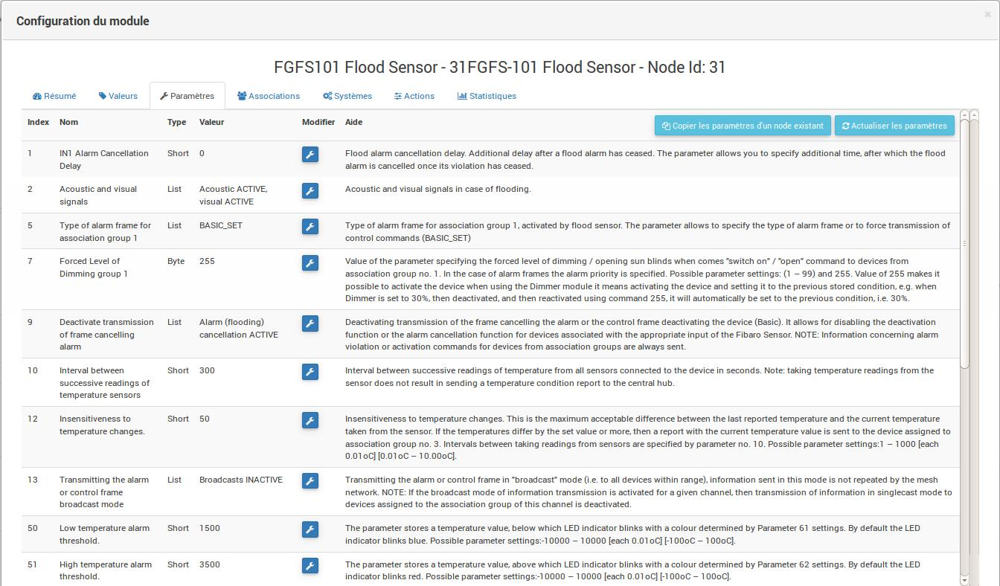

# Fibaro FGFS-101 "Hochwassersensor"

**Das Modul**

**Das Jeedom Visual**

## Zusammenfassung

Der FGFS-101-Sensor ist kompakt und verfügt über eine Vielzahl von Funktionen. Mit seiner fortschrittlichen und präzisen Technologie warnt Sie der Fibaro-Hochwassersensor vor einer drohenden Überschwemmung oder einem schnellen Temperaturanstieg oder -abfall.

Es ist mit einem Neigungssensor ausgestattet, der sofort eine Warnung an das Z-Wave-Netzwerk sendet, wenn der Detektor bewegt oder gestohlen wird (meldet Neigungs- oder Bewegungsinformationen an den Z-Wave-Controller).

Dieser universelle Hochwasser- und Temperaturdetektor kann mit einer Batterie oder einem externen 12- oder 24-VDC-Netzteil betrieben werden. Bei Anschluss an eine externe Stromquelle fungiert der Akku als Notstromquelle.

Dank seines Temperatursensors können Sie die Temperatur Ihres Bodens steuern. Es ist wasserdicht, im Hochwasser schwimmt es auf der Wasseroberfläche.

Es hat auch einen Sirenenalarm, der im Falle eines Problems ertönen kann. Sie können den Trockenkontaktausgang an ein vorhandenes Alarmsystem anschließen. Eine vordere LED zur Überprüfung des Status des FGFS-101.

Dieser Sensor enthält einen Z-Wave-Netzwerk-Entfernungsmesser, der Ihnen die korrekte Funktion des Sensors während seiner Installation sicherstellt.

## Funktionen

-   Hochwassermelder (Vorhandensein von Wasser über Kontakte)
-   Temperaturdetektor
-   Neigungsdetektor
-   Akustischer und visueller Alarm
-   Z-Wave-Entfernungsmesser
-   Z-Wave Repeater ?? (siehe Abschnitt "Gut zu wissen")

## Technische Daten

-   Modultyp : Z-Wave Sender
-   Das Modul kann extern mit Strom versorgt werden : 12 - 24 VDC
-   Batterietyp : CR123A
-   Akkulaufzeit : 2 Jahre
-   Verbrauch an externer Stromversorgung : 0,4W
-   Maximal am Ausgang unterstützter Strom (ALARM NC, TAMP NC) :25mA
-   Maximale am Ausgang unterstützte Spannung : 40 V (AC oder DC)
-   Frequenz : 868,42 MHz
-   Übertragungsentfernung : 50 m freies Feld, 30 m drinnen
-   Abmessungen : 72 x 28 mm (Durchmesser x Höhe)
-   Betriebstemperatur : 0-40 ° C (-20 ° C bis 70 ° C bei externer Stromversorgung)
-   Temperaturmessbereich : -20 bis 100 ° C.
-   Messgenauigkeit : 0,5 ° C (in einem Bereich von 0 bis 40 ° C)
-   Standards : EMC 2004/108 / EC und R & TTE 199/5 / WE

## Moduldaten

-   Machen Sie : Fibar Group
-   Modell : Hochwassersensor FGFS101
-   Hersteller : FIBARO-System
-   Hersteller ID : 271
-   Produkttyp : 2816
-   Produkt-ID : 4097

## Konfiguration

Informationen zum Konfigurieren des OpenZwave-Plugins und zum Einfügen von Jeedom finden Sie hier [Dokumentation](https://doc.jeedom.com/de_DE/plugins/automation%20protocol/openzwave/).

> **Wichtig**
>
> Um dieses Modul in den Einschlussmodus zu versetzen, drücken Sie dreimal die zentrale Einschlusstaste mit der Bezeichnung TMP gemäß der Papierdokumentation (schwarzer Tab).

Einmal enthalten, sollten Sie dies erhalten :

### Befehle

Sobald das Modul erkannt wurde, sind die dem Modul zugeordneten Befehle verfügbar.

Hier ist die Liste der Befehle :

-   Leck : Dies ist der Modulalarmbefehl (für das Vorhandensein von Wasser, Überschwemmungen usw.)
-   Temperatur : Es ist der Temperaturmessbefehl
-   Sabotage : Dies ist der Sabotagebefehl. Es signalisiert das Öffnen des Gehäuses
-   Batterie : Es ist der Batteriebefehl

### Konfiguration du module

> **Wichtig**
>
> Wecken Sie das Modul bei einer ersten Aufnahme immer unmittelbar nach der Aufnahme auf.

Dann ist es notwendig, das Modul entsprechend Ihrer Installation zu konfigurieren. Gehen Sie dazu auf die Schaltfläche "Konfiguration" des OpenZwave-Plugins von Jeedom.

Sie gelangen auf diese Seite (nachdem Sie auf die Registerkarte Einstellungen geklickt haben)

Parameterdetails :

-   Aufwachen : Dies ist das Aufweckintervall des Moduls (empfohlener Wert 21600)
-   1 \. Verzögerung der Alarmstornierung nach Erkennung einer Überschwemmung : valeur de 0 à 3600 s (0 par défaut/ dès qu‘il n'y a plus de détection il s'arrête instantanément)
-   2 \. Wahl des Alarmtyps. Wert :
  - 0 : Akustischer und optischer Alarm deaktiviert
  - 1 : Akustischer Alarm deaktiviert und visueller Alarm aktiviert
  - 2 : Akustischer Alarm ein und visueller Alarm aus
  - 3 : Akustischer und visueller Alarm aktiviert.
-   10 \. Übertragungszeit zwischen zwei Temperaturmesswerten : von 1 bis 65535 s (standardmäßig 300). Achten Sie darauf, dass Sie keinen zu engen Übertragswert unter Strafe stellen, wenn die Batterie des Moduls bei jeder Geschwindigkeit schmilzt ! (1800 wird empfohlen)
-   12 \. Temperaturunterschied zwischen zwei Berichten : von 1 bis 1000 (Standard 50 = 0,5 °). Gemäß Parameter 10 ist es auch möglich, die Temperaturübertragung in Abhängigkeit von deren Variation zu steuern.
-   50 \. Einstellen des Niedertemperaturalarms : von -10000 bis + 10000 (standardmäßig 1500 = 15 ° C) Ermöglicht das Auslösen eines Alarms, wenn die Temperatur unter einen bestimmten Schwellenwert fällt.
-   51.Hochtemperaturalarm einstellen : von -10000 bis + 10000 (standardmäßig 3500 = 35 ° C) Ermöglicht das Auslösen eines Alarms, wenn die Temperatur einen bestimmten Schwellenwert überschreitet.
-   73 \. Temperaturkompensation : von -10000 bis + 10000 (standardmäßig 0 = 0 ° C) Hier können Sie einen Versatz zwischen der Sensortemperatur und der tatsächlichen Temperatur definieren
-   75 \. Einstellen der Dauer des Alarms : von 0 bis 65535s (standardmäßig 0, Der Alarm stoppt, sobald kein Fehler mehr erkannt wird.)

### Gruppen

Für einen optimalen Betrieb Ihres Moduls. Jeedom muss mindestens den Gruppen 1, 4 und 5 zugeordnet sein:

## Gut zu wissen

Dieses von außen betriebene Modul kann als Z-Wellen-Repeater verwendet werden (Informationen derzeit nicht bestätigt)

Verkabelung für externe Stromversorgung.

## Aufwachen

Um dieses Modul zu aktivieren, drücken Sie dreimal die zentrale Taste

## Faq.

Dieses Modul wird durch dreimaliges Drücken der Einschlusstaste aktiviert.

Dieses Modul ist standardmäßig ein Batteriemodul. Die neue Konfiguration wird beim nächsten Aufwecken berücksichtigt.

## Wichtiger Hinweis

> **Wichtig**
>
> Sie müssen das Modul aufwecken : nach seiner Aufnahme, nach einer Änderung der Konfiguration, nach einer Änderung des Aufweckens, nach einer Änderung der Assoziationsgruppen

Verwendungsdetails [hier](http://blog.domadoo.fr/2014/12/18/jeedom-guide-dutilisation-du-detecteur-dinondation-fibaro-fgfs-001/)
Fibaro-Dokumentation [Englisch](http://www.fibaro.com/manuals/en/FGFS-101-Flood-Sensor/FGFS-101-Flood-Sensor-en-2.1-2.3.pdf)
