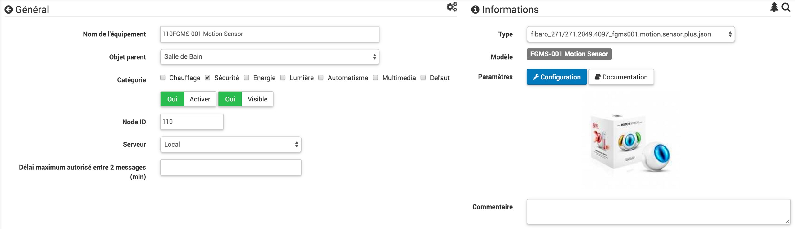

Fibaro-Bewegungssensor - FGMS-001 
===============================

\.

-   **Das Modul**

\.

\.

-   **Das Jeedom Visual**

\.

\.

Zusammenfassung 
------

\.

Der Fibaro-Bewegungsmelder ist ein Z-Wave-Multifunktionsdetektor.
Neben der Bewegungserkennung misst dieses Gerät die
Temperatur und Lichtintensität. Dieser Detektor enthält auch a
eingebauter Beschleunigungsmesser, um jeden Versuch zu erkennen, die zu ändern
Gerät.

Der Fibaro-Bewegungsmelder ist batteriebetrieben und ausgelegt
schnell und einfach auf jedem zu installieren
Oberfläche. LED-Anzeige signalisiert Bewegung, Temperaturniveau,
die Betriebsart und kann verwendet werden, um zu sehen, ob das Gerät
befindet sich im Z-Wave-Netzwerk.

Der Bewegungsmelder kann zum Beleuchten von Szenen verwendet werden
und Überwachungs- und / oder Sicherheitssysteme.

\.

Funktionen 
---------

\.

-   Drahtloser Bewegungsmelder

-   Erkennt Bewegungen mithilfe eines passiven Infrarotsensors

-   Temperaturmessung

-   Lichtintensitätsmessung

-   Seismische Intensitätsmessung

-   Einbruch- und Diebstahlschutz

-   Bewegungs- und Temperaturalarme werden durch Blinken signalisiert
    LED-Diode

-   Taste zum Ein- / Ausschließen des Detektors

-   Erkennung schwacher Batterie

-   Sehr kleine, reduzierte Abmessungen

-   Einfache Installation an einer Wand oder einer anderen Oberfläche

\.

Technische Daten 
---------------------------

\.

-   Modultyp : Z-Wave + Sender

-   Versorgung : CR123A 3,6VDC Batterie

-   Empfohlene Höhe für die Installation : 2,4 m

-   Gemessener Temperaturbereich : -20 ° C bis 100 ° C.

-   Messgenauigkeit : 0,5 ° C.

-   Helligkeitsmessbereich : 0-32000 LUX

-   Frequenz : 868,42 MHz

-   Übertragungsentfernung : 50 m freies Feld, 30 m drinnen

-   Abmessungen: 4,4 cm Durchmesser

-   Betriebstemperatur : 0-40 ° C.

-   Zertifizierungen : LVD 2006/95 / WE EMC 2004/108 / WE R & TTE 1999/5 / WE RoHS
    II

\.

Moduldaten 
-----------------

\.

-   Machen Sie : Fibar Group

-   Name : Fibaro FGMS-001-ZW5 \ [Bewegungssensor \]

-   Hersteller ID : 271

-   Produkttyp : 2048

-   Produkt-ID : 4097

\.

Konfiguration 
-------------

\.

So konfigurieren Sie das OpenZwave-Plugin und wissen, wie Sie Jeedom einsetzen
Aufnahme beziehen sich darauf
[Dokumentation](https://jeedom.fr/doc/Dokumentation/plugins/openzwave/de_DE/openzwave.html).

\.

> **Wichtig**
>
> Um dieses Modul in den Einschlussmodus zu versetzen, drücken Sie die Taste dreimal
> Einschlussknopf gemäß seiner Papierdokumentation.

\.

\.

Nach dem Einfügen müssen Sie die zwave + -Konfiguration über das anwenden
Dropdown-Liste sollten Sie diese bekommen :

\.

\.

### Befehle 

\.

Sie müssen einmal auf die Lupe klicken, um die Bestellungen von der abzurufen
Modul. Sobald das Modul erkannt wurde, werden die dem Modul zugeordneten Befehle angezeigt
wird verfügbar sein.

\.

\.

Hier ist die Liste der Befehle :

\.

-   Präsenz : Es ist der Befehl, der eine Anwesenheitserkennung erkennt

-   Temperatur : es ist der Befehl, der es erlaubt, die
    Temperatur

-   Helligkeit : Es ist der Befehl, der es ermöglicht, die Helligkeit zu erhöhen

-   Seismisch : Es ist der Befehl, mit dem die Intensität erhöht werden kann
    Seismisch

-   Sabotage : Dies ist der Sabotagebefehl (er wird für den Fall ausgelöst
    Vibration)

-   Batterie : Es ist der Batteriebefehl

\.

### Konfiguration des Moduls 

\.

> **Wichtig**
>
> Wecken Sie das Modul bei einer ersten Aufnahme immer gleich danach auf
> Einbeziehung.

\.

Dann, wenn Sie das Modul entsprechend konfigurieren möchten
Ihrer Installation müssen Sie durch die Schaltfläche gehen
"Konfiguration "des OpenZwave-Plugins von Jeedom.

\.

\.

Sie gelangen auf diese Seite (nachdem Sie auf die Registerkarte geklickt haben
Einstellungen)

\.

\.

Parameterdetails :

\.

-   Aufwachen : Dies ist das Modul-Aufweckintervall (Wert
    7200 empfohlen)

-   1: Stellt die Empfindlichkeit des Anwesenheitssensors ein

-   2: Stellt die Trägheit des Anwesenheitssensors ein

-   3: Es wird nicht empfohlen, diese Einstellung zu ändern

-   4: Es wird nicht empfohlen, diese Einstellung zu ändern

-   6: Zeit, nach der der Sensor das Signal "mehr als
    Bewegung "(empfohlener Wert 30)

-   8: Aktiviert den Nacht- / Tag-Modus oder beides (Wert
    empfohlen : immer aktiv)

-   9: Mit dieser Option können Sie den Schwellenwert für das Umschalten in den Nachtmodus anpassen (nützlich, wenn Sie dies tun
    Parameter 8 geändert haben)

-   12: nur zu ändern, wenn Sie wissen, warum Sie es tun
    (Zuordnung zum Beispiel zu einem Modul)

-   14: idem

-   16: idem

-   20: Empfindlichkeit des Kreiselsensors (empfohlener Wert 15)

-   22: Zeit, nach der der Sensor das Signal "mehr als
    Sabotage "(empfohlener Wert 30)

-   24: Hier erfahren Sie, wie die Sabotage gemeldet wird (WICHTIG :
    empfohlener Wert : Manipulationssensor an SensorAlarm benachrichtigt
    Befehlsklasse / Stornierung wird nach der in definierten Zeit benachrichtigt
    Parameter 22)

-   26: nur zu ändern, wenn Sie wissen, warum Sie es tun

-   40: Sagen wir, wie viel der Wert von
    zu sendende Helligkeit (empfohlener Wert 50)

-   42: Ermöglicht die Angabe einer Mindestdauer zwischen zwei aufeinander folgenden Sendungen
    auch wenn sich die Helligkeit nicht geändert hat (empfohlener Wert 3600)

-   60: Sagen wir, wie viel der Wert von
    zu sendende Temperatur (empfohlener Wert 2 oder 0.2 Grad)

-   62: ermöglicht die Angabe der Häufigkeit von Temperaturmessungen
    (empfohlener Wert 900)

-   64: Ermöglicht die Angabe einer Mindestdauer zwischen zwei aufeinander folgenden Sendungen
    auch wenn sich die Temperatur nicht geändert hat (empfohlener Wert 2700)

-   66: ermöglicht die Einstellung der Temperatur

-   80: Ermöglicht die Auswahl der Farbe der LED bei Erkennung
    der Bewegung (siehe, um es zu deaktivieren)

-   81: ermöglicht die Einstellung der Helligkeit der LED

-   82: Passt die minimale Helligkeitsschwelle an, um die einzustellen
    1% LED (verknüpft mit Parameter 81)

-   83: Passt die maximale Helligkeitsschwelle an, um die einzustellen
    100% LED (verknüpft mit Parameter 81)

-   86: Temperatur, unter der die LED blau leuchtet
    (verknüpft mit Parameter 81)

-   87: Temperatur, oberhalb derer die LED rot leuchtet
    (verknüpft mit Parameter 81)

-   89: Ermöglicht es der LED, bei blau / weiß / rot zu blinken
    Sabotage

\.

### Gruppen 

\.

\.

> **Spitze**
>
> Dieses Modul hat fünf Zuordnungsgruppen
> Controller auf 1, 4 und 5 und entfernen Sie die 3.

Die Namen der Gruppen in der Z-Wave + -Version lauten wie folgt:

-   1 : Lifeline, Modulstatus-Feedback. Der Hauptcontroller
    sollte dieser Gruppe hinzugefügt werden.

-   2 : Bewegung, Bewegungssensor.

-   3 : Manipulation, Sabotagealarm.

-   4 : Bewegung BC, Bewegungssensor. Diese Gruppe möchte sicherstellen
    Abwärtskompatibilität mit Controllern, die nicht unterstützen
    das Z-Wave + -Protokoll.

-   5 : Tamper BC, Sabotagealarm. Der Zweck dieser Gruppe ist es
    Abwärtskompatibilität mit Controllern, die nicht unterstützen
    Z-Wave + -Protokoll.

\.

Gut zu wissen 
------------

\.

### Besonderheiten 

\.

> **Spitze**
>
> Dieses Modul ist beim Aufwecken sehr pingelig und sehr schlecht konfiguriert
> Fabrik. Es ist wichtig, es nach der Aufnahme gut aufzuwecken
> (mehrmals sind besser als eins), um es nach Ihren Wünschen zu konfigurieren
> wünscht, und es gut aufzuwecken, damit die Konfiguration berücksichtigt wird
> Konto.

\.

### Alternative visuelle 

\.

\.

Aufwachen 
------

\.

Um dieses Modul aufzuwecken, gibt es nur einen Weg :

-   Drücken Sie dreimal die Einschlusstaste (das Licht geht an
    in blau). Selbst wenn das Licht aufleuchtet, kann dies erforderlich sein
    mach es mehrmals hintereinander (2 oder 3)

\.

Faq. 
------

\.

Dieses Modul wird durch dreimaliges Drücken der Einschlusstaste aktiviert.

\.

Dieses Modul ist sehr pingelig. Es ist ratsam, aufzunehmen
näher an Ihrer Box und mehrmals wiederholen.

\.

Dieses Modul ist ein Batteriemodul, die neue Konfiguration wird sein
beim nächsten Aufwachen berücksichtigt.

\.

Wichtiger Hinweis 
---------------

\.

> **Wichtig**
>
> Sie müssen das Modul aufwecken : nach seiner Aufnahme, nach einer Änderung
> der Konfiguration, nach einer Änderung des Aufweckens, nach a
> Änderung der Assoziationsgruppen

\.

**@nechry**
