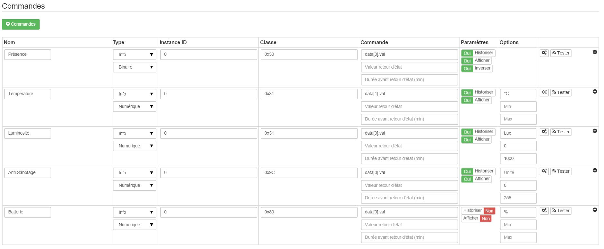

# Fibaro Bewegungssensor - FGMS-001

**Das Modul**

**Das Jeedom-Visual**

## Zusammenfassung

Der Fibaro Bewegungsmelder ist ein Z-Wave Multifunktionsmelder. Neben der Bewegungserkennung misst dieses Gerät Temperatur und Lichtintensität. Dieser Detektor enthält auch einen integrierten Beschleunigungsmesser, um jeden Versuch zu erkennen, das Gerät zu manipulieren.

Der Fibaro-Bewegungssensor ist batteriebetrieben und so konzipiert, dass er schnell und einfach auf jeder Oberfläche installiert werden kann. LED-Anzeige signalisiert Bewegung, Temperaturniveau, Betriebsmodus und kann verwendet werden, um zu sehen, ob sich das Gerät im Z-Wave-Netzwerk befindet.

Der Bewegungssensor kann für Beleuchtungsszenen und Überwachungs- und/oder Sicherheitssysteme verwendet werden.

## Fonctions

-   Drahtloser Bewegungsmelder
-   Erkennt Bewegung mithilfe eines passiven Infrarotsensors
-   Temperatur messung
-   Lichtintensitätsmessung
-   Einbruch- und Diebstahlschutz
-   Bewegungs- und Temperaturwarnungen werden durch blinkende LED angezeigt
-   Erdbebenerkennungsmodus
-   Schaltfläche zum Einschließen/Ausschließen des Detektors
-   Erkennung schwacher Batterie
-   Sehr kleine, reduzierte Abmessungen
-   Einfach an einer Wand oder einer anderen Oberfläche zu installieren

## Technische Eigenschaften

-   Mod-Typ : Z-Wave-Sender
-   Einspeisung : Batterie CR123A 3,6 VDC
-   Empfohlene Höhe für die Installation : 2,4m
-   Gemessener Temperaturbereich : -20 °C bis 100 °C
-   Meßgenauigkeit : 0,5°C
-   Helligkeitsmessbereich : 0-32000 LEX
-   Frequenz : 868,42 MHz
-   Übertragungsdistanz : 50m Freifeld, 30m drinnen
-   Dimensions: 4,4 cm im Durchmesser
-   Betriebstemperatur : 0-40 °C
-   Zertifikate : LVD 2006/95/WE EMC 2004/108/WE R&TTE 1999/5/WE RoHS II

## Moduldaten

-   Markieren : Fibar-Gruppe
-   Nachname : Fibaro FGMS-001 \[Bewegungssensor\]
-   Hersteller-ID : 271
-   Geben Sie Produkt ein : 2048
-   Produkt ID : 4097

## Configuration

Um das OpenZwave-Plugin zu konfigurieren und zu wissen, wie man Jeedom einbindet, beziehen Sie sich auf diese [Dokumentation](https://doc.jeedom.com/de_DE/plugins/automation%20protocol/openzwave/).

> **Wichtig**
>
> Um dieses Modul in den Inklusionsmodus zu versetzen, müssen Sie die Inklusionstaste gemäß der Papierdokumentation dreimal drücken.

Einmal enthalten, sollten Sie dies erhalten :

### Commandes

Sobald das Modul erkannt wird, sind die dem Modul zugeordneten Befehle verfügbar.

Hier ist die Liste der Befehle :

-   Gegenwart : Dies ist der Befehl, der eine Anwesenheitserkennung meldet
-   Temperatur : Dies ist der Befehl, mit dem Sie die Temperatur erhöhen können
-   Helligkeit : Dies ist der Befehl, mit dem Sie die Helligkeit erhöhen können
-   Sabotage : das ist der Sabotagebefehl (wird bei Vibration ausgelöst)
-   Batterie : Dies ist der Batteriebefehl

### Modulkonfiguration

> **Wichtig**
>
> Bei einer erstmaligen Aufnahme wecken Sie das Modul immer direkt nach der Aufnahme auf.

Wenn Sie das Modul dann gemäß Ihrer Installation konfigurieren möchten, müssen Sie über die Schaltfläche "Konfiguration" des Jeedom OpenZwave-Plugins gehen.

Sie gelangen auf diese Seite (nachdem Sie auf die Registerkarte Einstellungen geklickt haben)

Parameterdetails :

-   Wach auf : das ist das Weckintervall des Moduls (empfohlener Wert 7200)
-   1: stellt die Empfindlichkeit des Anwesenheitssensors ein
-   2: ermöglicht Ihnen, die Trägheit des Anwesenheitssensors einzustellen
-   3: Es wird nicht empfohlen, diesen Parameter zu ändern
-   4: Es wird nicht empfohlen, diesen Parameter zu ändern
-   6: Zeit, nach der der Sensor das Signal „keine Bewegung mehr“ sendet (Empfehlungswert 30)
-   8: ermöglicht es Ihnen, den Nacht- / Tagmodus oder beides zu aktivieren (empfohlener Wert : immer noch aktiv)
-   9: ermöglicht die Einstellung der Schwelle für das Umschalten in den Nachtmodus (nützlich, wenn Sie Parameter 8 geändert haben)
-   12: nur zu ändern, wenn Sie wissen, warum Sie es tun (z. B. Zuordnung zu einem Modul)
-   14: idem
-   16: idem
-   20: Empfindlichkeit des Kreiselsensors (empfohlener Wert 15)
-   22: Zeit, nach der der Sensor das Signal "keine Sabotage mehr" sendet (empfohlener Wert 30)
-   24: erlaubt anzugeben, wie die Sabotage gemeldet wird (WICHTIG : empfohlener Wert : Sensorsabotage bei SensorAlarm-Befehlsklasse gemeldet/ Abbruch wird nach der in Parameter 22 definierten Zeit gemeldet )
-   26: Bearbeiten Sie nur, wenn Sie wissen, warum Sie es tun
-   40: können Sie angeben, wie stark der Helligkeitswert geändert werden muss, damit er gesendet wird (empfohlener Wert 50)
-   42: ermöglicht es Ihnen, eine Mindestdauer zwischen zwei aufeinanderfolgenden Übertragungen anzugeben, auch wenn sich die Helligkeit nicht geändert hat (empfohlener Wert 3600)
-   60: können Sie angeben, um wie viel der Temperaturwert geändert werden muss, damit er gesendet wird (empfohlener Wert 2, d. h. 0.2 Grad)
-   62: verwendet, um die Häufigkeit der Temperaturmessungen anzugeben (empfohlener Wert 900)
-   64: ermöglicht es Ihnen, eine Mindestdauer zwischen zwei aufeinanderfolgenden Übertragungen anzugeben, auch wenn sich die Temperatur nicht geändert hat (empfohlener Wert 2700)
-   66: ermöglicht Ihnen, die Temperatur einzustellen
-   80: können Sie die Farbe der LED bei Bewegungserkennung auswählen (siehe Deaktivieren))
-   81: erlaubt Ihnen, die Helligkeit der LED einzustellen
-   82: ermöglicht die Einstellung der minimalen Helligkeitsschwelle, um die LED auf 1 % einzustellen (verknüpft mit Parameter 81)
-   83: ermöglicht die Einstellung der maximalen Helligkeitsschwelle, um die LED auf 100 % einzustellen (verknüpft mit Parameter 81)
-   86: Temperatur, unter der die LED blau aufleuchtet (verknüpft mit Parameter 81)
-   87: Temperatur, über der die LED rot aufleuchtet (verknüpft mit Parameter 81)
-   89: lässt die LED im Sabotagefall blau/weiß/rot blinken

### Groupes

Dieses Modul hat drei Assoziationsgruppen, nur die dritte ist wesentlich.

## Gut zu wissen

### Besonderheiten

> **Tipp**
>
> Dieses Modul ist beim Aufwachen sehr launisch und ab Werk sehr schlecht konfiguriert. Es ist wichtig, es nach der Aufnahme gut aufzuwecken (mehrmals ist besser als einmal), es nach Ihren Wünschen gut zu konfigurieren und gut aufzuwecken, damit die Konfiguration berücksichtigt wird.

### Alternative Optik

## Wakeup

Um dieses Modul aufzuwecken, gibt es nur eine Vorgehensweise :

-   Drücken Sie die Einschlusstaste dreimal (das Licht wird blau). Auch wenn sich das Licht einschaltet, kann es notwendig sein, dies mehrmals hintereinander zu tun (2 oder 3)

## Häufig gestellte Fragen.

Dieses Modul wird durch dreimaliges Drücken seiner Include-Taste aktiviert.

Dieses Modul ist sehr launisch. Es ist ratsam, die Aufnahme so nah wie möglich an Ihrer Box vorzunehmen und mehrmals zu wiederholen.

Dieses Modul ist ein batteriebetriebenes Modul, die neue Konfiguration wird beim nächsten Wakeup berücksichtigt.

## Wichtiger Hinweis

> **Wichtig**
>
> Sie müssen das Modul aufwecken : nach seiner Aufnahme, nach einer Änderung der Konfiguration, nach einer Änderung des Aufweckens, nach einer Änderung der Assoziationsgruppen
