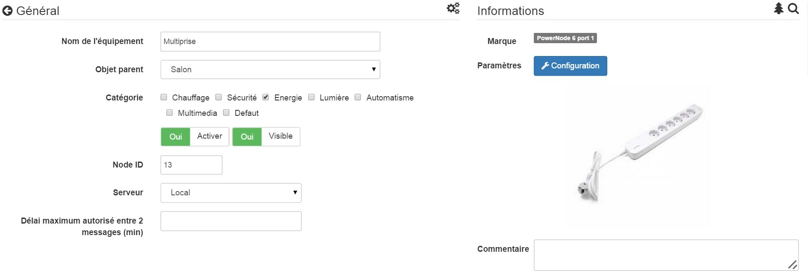
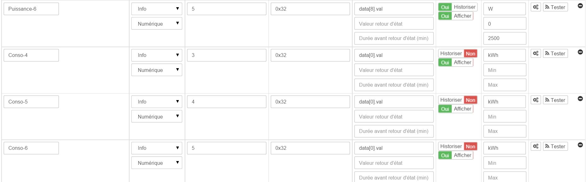
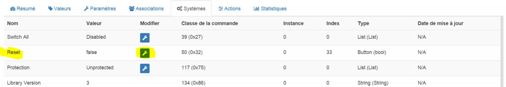

# Greenwave PowerNode - 6 Sockel

**Das Modul**

**Das Jeedom Visual**

## Zusammenfassung

Der GreenWave PowerNode Power Strip ist ein intelligentes Gerät, das mit Ihren Geräten und Ihrer Elektronik verbunden wird, damit Sie den Stromverbrauch Ihrer Geräte über einen Webbrowser oder ein Smartphone fernüberwachen und steuern können. Mithilfe der Z-Wave-Technologie ist die PowerNode-Steckdosenleiste mit den meisten auf dem Markt erhältlichen Hausautomationsboxen wie Fibaro Home Center 2, eedomus oder Zipabox kompatibel. Ausgestattet mit 6 Anschlüssen kann es 6 verschiedene elektrische Geräte mit einer Gesamtleistung von 10A unabhängig voneinander steuern.

Die PowerNode-Steckdosenleiste sammelt Daten zum Energieverbrauch angeschlossener Geräte und überträgt diese an die Hausautomationsbox. Sie können dann den Energieverbrauch jedes angeschlossenen Geräts steuern. Mit dieser Steckdosenleiste können Sie Geräte auch remote über einen Webbrowser oder ein Smartphone aktivieren oder deaktivieren oder einen Kalender definieren, um Ihre Geräte zu vordefinierten Zeiten automatisch zu aktivieren oder zu deaktivieren. Mit einem kleinen Rad an der Seite der Steckdosenleiste können Sie eine Farbe auswählen, die den Raum darstellt, dem die Steckdosenleiste zugeordnet ist. Zum Beispiel "blau für das Schlafzimmer ". Mit diesem Tipp können Sie Ihre verschiedenen PowerNode-Mehrfachsteckdosen unterscheiden. Sie können dieses Einstellrad auch auf ein Vorhängeschloss einstellen. Mit dieser Funktion können Sie die Steckdosenleiste verriegeln, um ein versehentliches Ausschalten zu vermeiden. Eine Steuerung über die Hausautomationsbox ist jedoch nicht mehr möglich.

Die PowerNode-Steckdosenleiste verfügt außerdem über eine Lichtstatusanzeige, die je nach Farbe unterschiedliche Informationen liefert : Steckdosen ein oder aus, begrenzte Funkreichweite, Einschluss- und Ausschlussmodus.

Die PowerNode-Steckdosenleiste ist mit einem Überstromschutz ausgestattet, um angeschlossene Geräte zu schützen. PowerNode deaktiviert Ports bei einem fehlerhaften Gerät oder einem Kurzschluss. Zusätzlichen Schutz bietet die interne Sicherung in der Steckdosenleiste.

Diese Steckdosenleiste ist ideal für die Steuerung von Multimedia-Geräten in einem Fernsehschrank oder für die Steuerung von Computergeräten in einem Büro, um die Verwendung von 6 einzelnen Z-Wave-Buchsen zu vermeiden.

## Funktionen

-   6-Port Z-Wave Steckdosenleiste
-   Ermöglicht die Überwachung des Verbrauchs angeschlossener Geräte
-   EIN / AUS-Funktion
-   Möglichkeit, ihm eine Nummer und eine Farbe zuzuweisen, um die verschiedenen PowerNodes derselben Installation zu unterscheiden.
-   Ein / Aus-Taste direkt auf der Steckdosenleiste
-   Überstromschutz
-   Lichtstatusanzeige

## Technische Daten

-   Versorgung : 250 V AC, 50 Hz
-   Maximaler Ladestrom : 10A
-   Maximale Lastleistung : )
-   Standby-Verbrauch : 0,4 W.
-   Messgenauigkeit : ± 0,1 W.
-   Überstromschutz : 10A interne Sicherung
-   Steckertyp : )
-   Z-Wave-Radiofrequenz : 868,42 MHz
-   Maximale Reichweite Z-Wave : 30m
-   Betriebstemperatur : 0 ° C bis + 25 ° C
-   Lagertemperatur : -20 ° C bis + 60 ° C
-   Maximale Luftfeuchtigkeit : 5% bis 90%
-   ) : IP20

## Moduldaten

-   Machen Sie : GreenWave
-   Name : GreenWave \ [6 x Sockets \]
-   Hersteller ID : 153
-   Produkttyp : 3
-   Produkt-ID : 4

## Konfiguration

Informationen zum Konfigurieren des OpenZwave-Plugins und zum Einfügen von Jeedom finden Sie hier [Dokumentation](https://doc.jeedom.com/de_DE/plugins/automation%20protocol/openzwave/).

> **Wichtig**
>
> Um dieses Modul in den Einschlussmodus zu versetzen, drücken Sie die Einschluss-Taste am Sockel.

Einmal enthalten, sollten Sie dies erhalten :

### Befehle

Sobald das Modul erkannt wurde, sind die dem Modul zugeordneten Befehle verfügbar.

Hier ist die Liste der Befehle :

-   Zustand-1 : Es ist der Befehl, mit dem der Status des Sockets 1 ermittelt werden kann
-   On-1 : Dies ist der Befehl, der Socket 1 einschaltet
-   Aus-1 : Es ist der Befehl, der Socket 1 ausschaltet
-   Power-1 : Es ist der Befehl, der die momentane Stromaufnahme von Buchse 1 aufruft
-   Conso-1 : Es ist der Befehl, der den Gesamtverbrauch von Steckdose 1 meldet
-   Zustand-2 : Es ist der Befehl, mit dem der Status von Socket 2 ermittelt werden kann
-   On-2 : Es ist der Befehl, der Socket 2 einschaltet
-   Aus-2 : Es ist der Befehl, der Sockel 2 ausschaltet
-   Power-2 : Es ist der Befehl, der den momentanen Stromverbrauch von Buchse 2 aufruft
-   Conso-2 : Es ist der Befehl, der den Gesamtverbrauch von Steckdose 2 meldet
-   Zustand-3 : Es ist der Befehl, mit dem der Status des Sockets 3 ermittelt werden kann
-   On-3 : Dies ist der Befehl, der Socket 3 einschaltet
-   Aus-3 : Es ist der Befehl, der Socket 3 ausschaltet
-   Power-3 : Es ist der Befehl, der den momentanen Stromverbrauch von Buchse 3 aufruft
-   Conso-3 : Es ist der Befehl, der den Gesamtverbrauch von Steckdose 3 meldet
-   Zustand-4 : Es ist der Befehl, mit dem der Status des Sockets 4 ermittelt werden kann
-   On-4 : Es ist der Befehl, der Socket 4 einschaltet
-   Aus-4 : Es ist der Befehl, der Socket 4 ausschaltet
-   Power-4 : Es ist der Befehl, der die momentane Stromaufnahme von Buchse 4 aufruft
-   Conso-4 : Es ist der Befehl, der den Gesamtverbrauch von Steckdose 4 meldet
-   Zustand-5 : Es ist der Befehl, mit dem der Status des Sockets 5 ermittelt werden kann
-   On-5 : Es ist der Befehl, der Socket 5 einschaltet
-   Aus-5 : Es ist der Befehl, der Socket 5 ausschaltet
-   Power-5 : Es ist der Befehl, der die momentane Stromaufnahme von Buchse 5 aufruft
-   Conso-5 : Es ist der Befehl, der den Gesamtverbrauch von Steckdose 5 meldet
-   Zustand-6 : Es ist der Befehl, mit dem der Status des Sockets 6 ermittelt werden kann
-   On-6 : Es ist der Befehl, der Socket 6 einschaltet
-   Aus-6 : Es ist der Befehl, der Socket 6 ausschaltet
-   Power-6 : Es ist der Befehl, der die momentane Stromaufnahme von Buchse 6 aufruft
-   Conso-6 : Es ist der Befehl, der den Gesamtverbrauch von Steckdose 6 meldet

Beachten Sie, dass die Befehle ON / OFF / STATUS im Dashboard in einer einzigen Schaltfläche zusammengefasst sind.

### Konfiguration du module

Sie können das Modul entsprechend Ihrer Installation konfigurieren. Gehen Sie dazu auf die Schaltfläche "Konfiguration" des OpenZwave-Plugins von Jeedom.

Sie gelangen auf diese Seite (nachdem Sie auf die Registerkarte Einstellungen geklickt haben)

Wie Sie sehen, gibt es für dieses Modul nicht viel Konfiguration.

Parameterdetails :

-   1 : Verzögerungen, bevor die Taste blinkt : )
-   2 : )

### Gruppen

Dieses Modul hat vier Assoziationsgruppen, nur die 1. Gruppe ist wichtig.

## Gut zu wissen

### Besonderheiten / Polling

Im Gegensatz zu seiner kleinen Schwester "Une Prize" muss diese Steckdosenleiste abgefragt werden, um den Verbrauch zu steigern.

Es ist nur erforderlich, es für den Power-Befehl jeder Buchse zu aktivieren. )

### Gesamtverbrauch

Sie können eine virtuelle verwenden, um einen kumulativen Verbrauch der 6 Sockets zu erstellen.

### Zurücksetzen

Sie können Ihren Verbrauchszähler zurücksetzen, indem Sie auf diese Schaltfläche auf der Registerkarte System klicken. (). Wählen Sie PressButton.

## Aufwachen

Keine Vorstellung von Aufwecken auf diesem Modul.
